# Airbnb System Design

An end-to-end, production-grade design for Airbnb-style "Stays" (homes/rooms). It emphasizes scalability, resilience, correctness (no double-bookings), global reach, and cost control.

## Table of Contents

- [Discovery Conversation](#discovery-conversation)
  - [Personas and a Day in Their Life](#personas-and-a-day-in-their-life)
  - [Who Pays and How Big](#who-pays-and-how-big)
  - [Three Forking Questions](#three-forking-questions)
  - [Use-Case Probes](#use-case-probes)
  - [Out of Scope](#out-of-scope)
  - [Decisions Locked in This Conversation](#decisions-locked-in-this-conversation)
- [Part I: Core Architecture](#part-i-core-architecture)
  - [Assumptions and Scope](#assumptions-and-scope)
  - [High-Level Architecture](#high-level-architecture)
  - [Core Domain Model](#core-domain-model-simplified)
  - [Key Design Tenets](#key-design-tenets)
  - [Vocabulary You'll See Throughout](#vocabulary-youll-see-throughout)
- [Part II: Core Systems](#part-ii-core-systems)
  - [Search & Discovery](#search--discovery)
  - [Availability and Calendar](#availability-and-calendar-the-safety-critical-part)
  - [Booking Flow](#booking-flow-end-to-end)
  - [Payments and Payouts](#payments-and-payouts)
  - [Pricing & Rules](#pricing--rules)
  - [Messaging and Notifications](#messaging-and-notifications)
  - [Reviews and Reputation](#reviews-and-reputation)
  - [Trust, Safety, and Risk](#trust-safety-and-risk)
  - [Media and Content](#media-and-content)
- [Part III: Infrastructure & Operations](#part-iii-infrastructure--operations)
  - [Multi-Region and Resilience](#multi-region-and-resilience)
  - [Caching Strategy](#caching-strategy)
  - [Data Platform and Analytics](#data-platform-and-analytics)
  - [Security and Privacy](#security-and-privacy)
  - [APIs](#apis-illustrative)
  - [Indexing and Availability Acceleration](#indexing-and-availability-acceleration)
  - [Cost and Performance Considerations](#cost-and-performance-considerations)
  - [Operations and SRE](#operations-and-sre)
  - [Content and Policy Edge Cases](#content-and-policy-edge-cases)
- [Part IV: Capacity Planning & Rollout](#part-iv-capacity-planning--rollout)
  - [Minimal Back-of-the-Envelope](#minimal-back-of-the-envelope-order-of-magnitude)
  - [Phased Rollout](#phased-rollout)
  - [Trade-offs and Rationale](#trade-offs-and-rationale)
- [Part V: Architectural Diagrams](#part-v-architectural-diagrams)
  - [High-Level Component Architecture](#high-level-component-architecture)
  - [Core Booking Flow](#core-booking-flow)
  - [Availability Hold Algorithm](#availability-hold-algorithm)
  - [Search Query Path](#search-query-path)
  - [Eventing, Outbox, and Indexing Pipeline](#eventing-outbox-and-indexing-pipeline-cqrs)
  - [Multi-Region Topology (Option A)](#multi-region-topology-option-a-global-strongly-consistent-db)
  - [Multi-Region Topology (Option B)](#multi-region-topology-option-b-cell-based-booking)
  - [Core Data Model](#core-data-model-entity-relationship-diagram)
  - [Cancellation and Refund Saga](#cancellation-and-refund-saga)
- [Part VI: Search & Discovery Deep-Dive](#part-vi-search--discovery-deep-dive)
  - [Search System: Detailed Design](#search-system-detailed-design)
    - [Objectives and SLOs](#objectives-and-slos)
    - [Indexing: Document Design, Pipeline, and Shards](#indexing-document-design-pipeline-and-shards)
    - [Geolookup and Spatial Model](#geolookup-and-spatial-model)
    - [Query Path](#query-path-end-to-end)
    - [Availability Bitset Check Details](#availability-bitset-check-details)
    - [Ranking and Personalization](#ranking-and-personalization)
    - [Caching Strategy](#caching-strategy-1)
    - [API Design](#api-design-key-endpoints)
    - [Operational and Failure Modes](#operational-and-failure-modes)
- [Appendix: Open Questions](#appendix-open-questions)

---

## Discovery Conversation

> The following is a transcript of the working session that produced this document. It is preserved verbatim because every downstream design choice traces back to a decision made here. Read this first; the rest of the document is the implementation of these decisions.
>
> **Participants:**
> - **Client** — VP of Product & Engineering at the customer ("Lodgewise"), a marketplace operator launching a stays product across EMEA, North America, and APAC.
> - **Architect** — Distinguished Engineer engaged to design the platform.

### Personas and a Day in Their Life

**Architect:** Before we touch a whiteboard, I want to ground the design in three concrete people. Who are we actually building for?

**Client:** Three groups. Travelers — we call them Guests. Property owners — Hosts. And our internal Trust & Safety operators, because the marketplace lives or dies on whether people show up to a real, safe home.

**Architect:** Walk me through a Guest's day. Don't summarize. Tell me what happens hour by hour.

**Client:** Okay. Priya in Mumbai is planning a long weekend in Lisbon. Tuesday evening she opens the app on her phone. She types "Lisbon" — she expects it to autocomplete to the city. She drags a date picker for a Friday-to-Monday weekend with two adults. She sees a map full of pins and a list. She wants the map to update as she pans — she's looking at the Alfama neighborhood specifically. She tweaks filters: pool, two bedrooms, "self check-in" because she lands at midnight. She saves four homes to a wishlist over the next two days. Friday morning, on the metro, signal is patchy, she opens the app one more time, picks one, and books. The booking flow has to *not* lose her if her connection drops between hitting "Reserve" and the payment going through. After booking, she messages the host to coordinate keys.

**Architect:** Two things from that walk-through bite me immediately. First, the map pan must be sub-200ms or she'll feel it. That's a hard constraint on the search path — geo tiling, edge caching, candidate pre-pruning. Second, the moment between "Reserve" and "payment captured" is the most dangerous moment in the entire system. If the network drops, she must not end up with no booking *and* a charge, or worse, a booking *and* a duplicate charge if she retries. That forces idempotency keys on every write and a hold-then-confirm flow with explicit TTLs. We're also going to need offline-tolerant message drafts, but real-time delivery isn't critical until both parties are online.

**Client:** Now the Host. Marco runs four apartments in Lisbon. He uses our app on web mostly. He logs in Monday morning, looks at the next 60 days of bookings on a calendar grid, blocks two weeks for personal use, adjusts pricing for the Web Summit conference week — he wants to charge 3x. He responds to two inquiries. He gets a notification that a guest checked out and reviews them. Crucially, two of his apartments are also listed on a competitor — he uses a channel manager that syncs availability via iCal. So when a competitor books one of his units, our calendar must reflect that within minutes or we'll double-book him.

**Architect:** That iCal channel-sync detail is the kind of thing that breaks naive designs. It means our calendar isn't just modified by our own booking flow — there's a *second* source of truth pushing in updates we don't control, and they're eventually-consistent at best. We'll need to treat external calendar sync as a first-class write path with its own conflict resolution, and we have to accept that the merge window can produce overlapping bookings that we resolve via "first to confirm wins, second is auto-cancelled with full refund and host penalty." That's a product decision as much as a technical one.

**Client:** Finally, the T&S operator. Aisha works in our Dublin operations center. Her queue is a stream of flagged events: ID verification mismatches, a booking with a high-risk score, a host listing flagged by image moderation, a chargeback dispute. She needs to see, for any reservation, the full timeline — every state transition, every payment event, every message — within two seconds of clicking. She needs to issue refunds, suspend listings, and pause payouts, sometimes mid-stay.

**Architect:** That's a hard observability requirement. It tells me every domain event in the system needs to land in a durable, queryable timeline, not just metrics. We're going to lean on an event log (Kafka with compaction and long retention on critical topics) plus a denormalized "case view" projection. It also means our payout pipeline needs a "freeze" primitive that's atomic with respect to scheduled captures — a payout can be in flight when Aisha clicks the button, and we have to handle that race correctly.

### Who Pays and How Big

**Client:** Money. We take a service fee from the Guest at booking and a commission from the Host at payout. Hosts are the supply side — without them, no marketplace — but Guests are the volume.

**Architect:** Give me a scale anchor. I don't need exact numbers, I need the order of magnitude so I can size storage, QPS, and the cost envelope.

**Client:** Plan for 10 million active listings and 100 million monthly active users at maturity. Year-one launch is 500K listings and 10M MAU. Booking conversion is roughly 1 booking per 200 search sessions. Peak season — late June, late December — is 3x average traffic, concentrated in specific city pairs.

**Architect:** That gives me what I need. 10M listings × 365 days of availability rows ≈ 3.65 billion rows in the calendar — that has to be sharded by `listing_id` from day one, no exceptions. Search at 100k peak RPS with 3x seasonal headroom means the search tier needs to comfortably hold 300k RPS, which rules out putting availability checks against the OLTP calendar in the hot path. We'll need a side-channel — Roaring bitmaps in Redis — that the search tier consults instead. Booking at 2–5k peak RPS is small in absolute terms but each one is a multi-row strongly-consistent transaction, so the per-shard hot key risk is real for popular listings during a flash sale.

**Client:** What about the cost envelope?

**Architect:** Object storage and CDN egress for photos will dominate — easily half the infrastructure bill. The search cluster is second. The OLTP calendar database, despite being safety-critical, is small in cost terms because the working set fits in memory and the row size is tiny. I'll flag concrete numbers in the [Cost and Performance Considerations](#cost-and-performance-considerations) section, but the headline is: spend on photos and search; don't over-provision the booking DB.

### Three Forking Questions

**Architect:** I have three questions whose answers will fork the entire design. Plain language. I'll explain why each matters.

#### Question 1: How strict is "no double-booking"?

**Architect:** If two guests, in different countries, on different devices, click "Reserve" on the same apartment for the same nights within the same millisecond, what's the acceptable outcome?

**Client:** Exactly one wins. The other gets a clean "no longer available" message. Never two winners. We'd rather lose a booking than have an angry host call us because two strangers showed up at his door.

**Architect:** That's a strong consistency requirement on the booking write path. It rules out async eventual-consistency designs and pushes us toward one of two architectures:
> - **Option A:** A globally strongly-consistent database (Spanner, CockroachDB, FoundationDB) with `listing_id` as the partition key. Multi-region active-active for writes. External consistency. Expensive, simpler correctness.
> - **Option B:** A cell-based architecture where each `listing_id` is deterministically pinned to a home region. Writes are single-region; reads can fan out. Cheaper, but cross-region failover is a runbook with a real RTO.
>
> Read traffic — search, listing pages, profiles — can run eventually consistent and active-active everywhere. The fork is *only* about the booking write path.

**Client:** What's your honest recommendation?

**Architect:** Start with Option B and a single home region per listing. The operational simplicity of "this listing's calendar lives in `eu-west-1`, full stop" is enormous, and the failover case is rare. Migrate to Option A only when we have evidence — specifically, when cross-region booking latency for guests on the wrong side of the planet becomes a measurable conversion problem. Both topologies are documented in [Multi-Region Topology (Option A)](#multi-region-topology-option-a-global-strongly-consistent-db) and [Multi-Region Topology (Option B)](#multi-region-topology-option-b-cell-based-booking) so the migration path is visible.

**Client:** Agreed. Option B for launch, Option A as a documented evolution.

#### Question 2: Instant Book by default, or Request-to-Book by default?

**Architect:** When a guest hits "Reserve," do we charge them and confirm immediately, or do we put the reservation into a "pending host approval" state for up to 24 hours?

**Client:** Both, honestly. Hosts choose per listing. Maybe 70% Instant Book, 30% Request-to-Book at maturity, but in some markets — Japan, parts of Europe — Request-to-Book is the cultural default.

**Architect:** That changes the calendar state machine and the payments state machine. For Instant Book, the hold is 10 minutes (just enough to clear 3DS), payment authorizes and the calendar moves `FREE → HELD → RESERVED` quickly. For Request-to-Book, the hold is 24 hours with a soft TTL, payment is *authorized but not captured*, and the calendar uses a distinct `PENDING_HOST_APPROVAL` state that blocks competing holds but doesn't yet count as a confirmed booking. If the host doesn't act in 24 hours, the auth is voided and the calendar reverts.

**Client:** What's the trade-off?

**Architect:** Authorization holds on a card don't last forever — most networks allow 7 days, some less. If a Request-to-Book sits past that, we have to re-authorize, and re-auth can fail (insufficient funds, card expired, fraud signal flipped). We need a re-auth scheduler, and we need a clear UX for "your card was declined when the host accepted, please retry." The calendar logic also gets more complex because `PENDING_HOST_APPROVAL` can race with another guest's Instant Book attempt on a listing that flipped settings — we resolve by listing setting at the *moment* the request arrives, snapshotted on the hold record. Details are in [Availability and Calendar](#availability-and-calendar-the-safety-critical-part) and [Booking Flow](#booking-flow-end-to-end).

**Client:** Confirmed. Both flows, per-listing setting, snapshotted at hold creation.

#### Question 3: How fresh does search availability need to be?

**Architect:** A guest searches "Lisbon, this weekend, 2 guests." Behind the scenes, a host just confirmed a booking on one of those listings 800 milliseconds ago. Should that listing still appear in the search results?

**Client:** Ideally no. But realistically, what does each option cost?

**Architect:** Three points on the curve:
> - **Real-time consistency** (search reads the OLTP calendar): correct, but search QPS would crush the booking database. Not viable.
> - **Sub-2-second freshness** via a Redis bitset side-channel updated from a Kafka stream of calendar deltas: requires extra infrastructure, but search latency stays under 300ms p95 and the false-positive rate on availability is essentially zero. The booking confirmation step re-checks the OLTP calendar, so even if a stale result slips through, the worst case is a guest who clicks "Reserve" and sees "just got booked, sorry." Acceptable UX.
> - **Index-only freshness** (5–10 minute lag, availability stored as compressed ranges in OpenSearch): cheap, simple, but the false-positive window is large enough that during peak season a noticeable fraction of guests hit the "no longer available" wall after clicking. Hurts conversion.

**Client:** Sub-2-second. We can absorb the infra cost; we can't absorb the conversion hit.

**Architect:** Then the side-channel is in. We will run the index *and* the bitset, with the bitset as the source of truth at search time and the OLTP calendar as the source of truth at confirm time. The architecture is in [Indexing and Availability Acceleration](#indexing-and-availability-acceleration) and the deep dive is in [Availability Bitset Check Details](#availability-bitset-check-details). The trade-off: if Redis is impaired, search degrades to index-only and we ship results with a "availability may have changed" badge — a graceful degradation, not an outage.

### Use-Case Probes

**Architect:** A few edge cases. Each one tends to surface a constraint that doesn't show up in happy-path design.

**Client:** Go.

**Architect:** **Offline guest.** Priya on the Mumbai metro. Her connection drops mid-booking. What's the contract?

**Client:** She must not be charged without a booking, and she must not be booked without a charge. If she retries, she gets the same outcome, not a duplicate.

**Architect:** Idempotency keys generated client-side, attached to every booking and payment write. Server treats a repeat as a lookup, not a new operation. The guest's app retries with the same key for up to N minutes. After that, the hold expires server-side and she starts over. This is non-negotiable and shows up in every API in [APIs (Illustrative)](#apis-illustrative).

**Architect:** **Multi-tenant boundaries.** A property management company manages 200 listings across 40 hosts. Their staff need access to all 200 calendars but not to each other's payouts.

**Client:** Yes, that's real. We call them "co-hosts."

**Architect:** Then `host_id` isn't a single-owner foreign key on a listing — it's a role-based access list. Authorization isn't "owner of the listing"; it's "principal has role X on listing Y." We need an authorization service with relationship-based access control (think Google Zanzibar / SpiceDB) sitting in front of every listing-scoped action. This is hinted at in [Identity & Access](#high-level-architecture) but worth flagging early because retrofitting it is brutal.

**Architect:** **Cross-entity invariant.** A reservation is for nights [Aug 1, Aug 4). The host edits the listing's check-in time from 3pm to 4pm. Existing reservations' arrival instructions are now stale. What's correct?

**Client:** The reservation should keep the rules that were in force when it was booked. Future bookings get the new rules.

**Architect:** Snapshot pattern. The `Reservation` table stores a denormalized copy of the relevant policy fields, captured at confirm time, alongside the foreign key to the live listing. Display reads from the snapshot; future quotes read from the live listing. Same principle applies to cancellation policies and pricing rules — never reach through a foreign key for anything that affects money or commitment.

**Architect:** **Geography and regulation.** New York City has a 30-day minimum stay rule for some listings. Barcelona requires a tourism license number on the listing. EU GDPR. California CCPA. Marketplace-facilitator tax laws differ per US state.

**Client:** All of those are real and active.

**Architect:** Three implications: (a) the listing schema needs a per-jurisdiction policy block validated at publish time, (b) the search tier must enforce some of these as *server-side* hard filters that can't be bypassed by a malicious client (e.g., NYC listings with no license number become un-bookable), and (c) the tax engine in [Payments and Payouts](#payments-and-payouts) is not a feature, it's a separately-owned service with its own deploy cadence because tax rules change frequently and shouldn't require a booking deploy.

**Architect:** **Integrations.** Channel managers, PMS systems, payment service providers, fraud signal providers, identity verification vendors. How many?

**Client:** Dozens. iCal sync at minimum, plus Stripe and Adyen for payments depending on region, plus Onfido for ID, plus a handful of regional payment methods (iDEAL, Alipay, Pix).

**Architect:** Then the payments layer is a *router*, not a single integration, and we treat each PSP's webhook as an unreliable, possibly-out-of-order, possibly-replayed event source. Every webhook handler is idempotent on the PSP's event ID, and the payments service maintains its own state machine that doesn't trust any single PSP event in isolation. Same pattern for iCal: pull on a schedule, diff against last snapshot, emit calendar deltas.

### Out of Scope

**Architect:** Let me read back what we are *not* designing today, so it's explicit.

**Client:** Go ahead.

**Architect:**
> - **Experiences** (tours, classes, activities). Different inventory model — time slots, not nights — and different supply dynamics. Will reuse identity, payments, messaging, reviews.
> - **Long-term rentals** (28+ nights with rent agreements). Different legal regime (tenancy law in many jurisdictions), different payments (monthly recurring, security deposits as separate ledger), different cancellation. Out.
> - **Airbnb Plus / Luxe tier** curation workflows. The data model accommodates a `tier` flag, but the curation pipeline is its own product.
> - **Hotels and traditional hospitality inventory.** Different booking semantics (room types vs. unique units, overbooking strategies). Out.
> - **Native loyalty/points program.** Out for v1.
> - **Co-traveler split payments and group booking.** Acknowledged as a future feature; the payments schema reserves room for it but the flow isn't designed.
> - **Host-side accounting integrations** (QuickBooks, Xero exports). Belongs in a downstream finance product, not the marketplace core.

**Client:** Agreed. Anything we add later, we add as a service that consumes the same event streams; we don't reopen the booking core.

**Architect:** Exactly. That's the whole point of putting Kafka at the spine and CQRS read models on the side.

### Decisions Locked in This Conversation

| # | Decision | Rationale | Manifests In |
|---|---|---|---|
| 1 | Strong consistency on the booking write path; eventual consistency everywhere else | Double-booking is unacceptable; search/listing reads tolerate staleness | [Key Design Tenets](#key-design-tenets), [Availability and Calendar](#availability-and-calendar-the-safety-critical-part) |
| 2 | Cell-based regional booking (Option B) for launch; global strong DB (Option A) as documented evolution | Operational simplicity now, migration path preserved | [Multi-Region Topology (Option B)](#multi-region-topology-option-b-cell-based-booking), [Multi-Region Topology (Option A)](#multi-region-topology-option-a-global-strongly-consistent-db) |
| 3 | Both Instant Book and Request-to-Book, per-listing setting snapshotted at hold time | Cultural and host preferences vary by market | [Availability and Calendar](#availability-and-calendar-the-safety-critical-part), [Booking Flow](#booking-flow-end-to-end) |
| 4 | Sub-2-second search availability via Redis bitset side-channel; OLTP calendar is source of truth at confirm | Conversion-critical freshness without crushing the booking DB | [Indexing and Availability Acceleration](#indexing-and-availability-acceleration), [Availability Bitset Check Details](#availability-bitset-check-details) |
| 5 | Idempotency keys mandatory on every booking and payment write | Network-flaky mobile users must not be double-charged or double-booked | [APIs (Illustrative)](#apis-illustrative), [Booking Flow](#booking-flow-end-to-end) |
| 6 | iCal/channel-manager sync is a first-class write path with conflict resolution | Hosts list on competitors; we don't control the second source of truth | [Availability and Calendar](#availability-and-calendar-the-safety-critical-part) |
| 7 | Relationship-based access control (Zanzibar-style) for listings and reservations | Co-hosts and property managers need scoped access without being the legal host | [High-Level Architecture](#high-level-architecture), [Security and Privacy](#security-and-privacy) |
| 8 | Snapshot policy and pricing onto the Reservation row at confirm time | Rule changes must not retroactively alter committed bookings | [Core Domain Model](#core-domain-model-simplified), [Pricing & Rules](#pricing--rules) |
| 9 | Per-jurisdiction policy validation enforced server-side; tax engine is a separately-deployed service | Regulatory rules change faster than the booking core can deploy | [Content and Policy Edge Cases](#content-and-policy-edge-cases), [Payments and Payouts](#payments-and-payouts) |
| 10 | Payments layer is a multi-PSP router with idempotent webhook handling | Multiple regional PSPs, unreliable webhooks, replay tolerance required | [Payments and Payouts](#payments-and-payouts) |
| 11 | Kafka event log with compaction is the spine; CQRS read models hang off it | Future products (Experiences, analytics, ops case view) consume without reopening core | [Eventing, Outbox, and Indexing Pipeline](#eventing-outbox-and-indexing-pipeline-cqrs), [Data Platform and Analytics](#data-platform-and-analytics) |
| 12 | Object storage + CDN is the dominant cost; booking DB is small | Drives where to optimize and where not to over-engineer | [Cost and Performance Considerations](#cost-and-performance-considerations) |
| 13 | Out of scope for v1: Experiences, long-term rentals, hotels, loyalty, group booking, host accounting | Maintain focus on stays marketplace core | [Assumptions and Scope](#assumptions-and-scope) |

[Back to Top](#table-of-contents)

---

## Part I: Core Architecture

## Assumptions and Scope

* Scope: Stays marketplace (guests, hosts, listings, search, booking, reviews, messaging, payments/payouts, trust & safety, support). Experiences can be added later with similar primitives.
* Scale (design targets):
  + 10M+ listings, 100M+ monthly active users
  + Search peak: 100k RPS; Booking: 2–5k RPS; Messaging: 10–20k RPS
  + Global multi-region active-active for reads; strongly-consistent writes for booking
* Latency SLOs:
  + Search p95 < 300ms; Listing page p95 < 250ms; Booking hold p95 < 250ms; Payment confirmation < 5s (async-friendly)
* Availability SLOs: 99.95% (user-facing); Booking availability 99.99% to minimize lost revenue

## High-Level Architecture

* Clients: Web, iOS, Android
* Edge/CDN: Static assets, images, map tiles, API edge termination; WAF, bot protection
* API Gateway: AuthN/Z, rate limits, request shaping, A/B routing, mTLS to services
* Microservices (domain-aligned):
  + Identity & Access, Profiles
  + Listing Service (metadata, photos)
  + Availability/Calendar Service (per-date inventory state)
  + Pricing & Rules Service (base, seasonal, fees, constraints)
  + Search & Discovery (geo, filters, ranking, personalization)
  + Booking Service (holds, reservations, cancellations)
  + Payments Service (charges, escrow, fx, refunds)
  + Payouts Service (host payouts, tax forms)
  + Reviews & Reputation
  + Messaging Service (chat, notifications)
  + Trust & Safety (risk, KYC, content moderation)
  + Notifications (push, email, SMS), Templates
  + Support (tickets, workflows)
* Data layer (polyglot):
  + Strongly-consistent OLTP for bookings/calendars: Spanner/CockroachDB/FoundationDB (global, partitioned) or region-pinned single-writer with cross-region read replicas
  + Relational for listing/user metadata: Postgres/MySQL (sharded, read replicas)
  + Search index: Elasticsearch/OpenSearch (geo + facets) or Vespa
  + Cache: Redis/Memcached (hot data, session, rate limits); CDN edge caches
  + Object storage: S3/GCS for media with on-demand image transforms
  + Analytics: Data lake/warehouse (S3/BigQuery/Snowflake), streaming bus (Kafka/PubSub), feature store
* Eventing:
  + Kafka (multi-region), schema registry, outbox pattern for reliable change capture
  + CQRS where read models diverge (e.g., search index, availability bitmaps)

## Core Domain Model (Simplified)

* User(user\_id, type: guest|host, KYC\_state, risk\_score)
* Listing(listing\_id, host\_id, location(H3/S2 index), attributes, photos, policies, min/max stays, check-in/out times)
* PriceRule(listing\_id, date\_range, nightly\_price, fees, currency)
* Availability(listing\_id, date, state: FREE|HELD|RESERVED, version, prep\_time)
* Reservation(reservation\_id, listing\_id, guest\_id, start\_date, end\_date, status: PENDING|CONFIRMED|CANCELLED, total\_amount, currency, created\_at)
* Payment(payment\_id, reservation\_id, intent\_id, status, amount, currency, fx\_rate, method, idempotency\_key)
* Review(review\_id, listing\_id, guest\_id, host\_id, rating, text, blind\_until)
* Message(thread\_id, message\_id, sender\_id, text, attachments, redaction\_flags)

## Key Design Tenets

Five tenets drive every downstream decision. Each is followed by *why* — because the same words mean different things in different shops, and the reasoning matters more than the label.

* **Separate read-optimized discovery (eventually consistent) from write-critical booking (strongly consistent).**
  > *Why:* Search runs at ~100k requests/sec. Booking runs at ~2k/sec. If we used the same database for both, search traffic would either crush the booking DB or force us to over-provision it 50x. By splitting the two — search reads from a derived, slightly-stale index; booking writes to a small, strict OLTP store — we let each side scale on its own curve. "Eventually consistent" here means search results may be a few seconds stale; that's fine because the booking confirm step re-checks the authoritative calendar.

* **Partition by `listing_id` (or geo cell) everywhere possible to localize contention and scale horizontally.**
  > *Why:* A *partition* (a.k.a. shard) is a slice of the data that lives on one machine and is operated on independently. If we picked a bad partition key — say, `country_code` — then every booking in the US would land on the same shard and that shard would melt during peak. Picking `listing_id` means the load spreads evenly across shards (because there are millions of listings), and all the rows that need to be updated together for a single booking (the calendar nights for one listing) live on the *same* shard, which is what makes a fast multi-row transaction possible. The pattern: choose a key with high cardinality and where related operations target the same key.

* **Double-booking prevention via per-date inventory rows + atomic compare-and-set + short TTL holds.**
  > *Why:* "Compare-and-set" (CAS) is the database equivalent of "only update this row if it still looks the way I last saw it." When two guests race for the same night, both read `state=FREE`, both try `UPDATE ... WHERE state='FREE'`, but the database serializes the writes — exactly one wins, the other's update affects zero rows and that's how we detect the loser. The "per-date row" part means we have one row per listing per night, so the contention is scoped to the *specific* nights being booked, not the listing as a whole. "Short TTL holds" means the winning row gets stamped `state=HELD, expires_at=now+10min`; if the guest abandons checkout, a sweeper (or the next reader) reverts it, so we don't permanently strand inventory because someone closed their laptop.

* **Idempotency and outbox patterns everywhere that matters (payments, booking).**
  > *Why idempotency:* Mobile networks drop. The client retries. Without idempotency, a retry can charge the card twice. With idempotency, the client generates a unique key per logical operation and sends it on every retry; the server records the result against that key and replays the same response on duplicates. Cost: a small lookup table; benefit: zero double-charges.
  > *Why the outbox pattern:* When the booking service writes a reservation row AND publishes a `reservation.created` event to Kafka, those are two systems and either can fail. The outbox pattern makes them one transaction: the event is written to an `outbox` table in the *same* DB transaction as the reservation row. A separate process tails the outbox table and publishes to Kafka. This guarantees that if the reservation exists, the event will eventually be published — no "silently lost" events, no "phantom" events without a real row.

* **Graceful degradation for non-critical paths (e.g., fallback ranking, reduced images).**
  > *Why:* When the personalized ranker is down, we'd rather show a guest results ranked by simple popularity than show an error page. When the image transform service is overloaded, we serve lower-resolution photos. The principle: every dependency on the critical path needs a documented "what we do if it's broken" answer. The booking path itself has the *fewest* such fallbacks because correctness is non-negotiable; the search path has the most because a slightly-worse search is infinitely better than no search.

### Vocabulary You'll See Throughout

A few terms recur in every section. Plain-language definitions, so the rest of the document reads cleanly:

| Term | Plain meaning | Why it shows up here |
|---|---|---|
| **OLTP** | "Online Transactional Processing" — a database optimized for many small reads/writes with strict correctness (think: every booking is a transaction). Opposed to OLAP (analytics warehouses, big scans, eventual). | The booking/calendar DB is OLTP. The data warehouse is OLAP. |
| **CAS (Compare-And-Set)** | An atomic "update X to Y *only if* X is currently Z" operation. The DB guarantees no other write sneaks between the check and the set. | Core primitive of the no-double-booking guarantee. |
| **CQRS** | "Command Query Responsibility Segregation" — fancy phrase for "separate the database you write to from the database you read from." | The booking DB is the write store; the search index and Redis bitsets are read stores derived from it. |
| **Outbox pattern** | Write events to an `outbox` table in the same transaction as the business row, then publish to Kafka asynchronously. | Guarantees the event log is consistent with the source of truth. |
| **Saga** | A long-running workflow split into steps, each with a compensating undo step, so partial failures can be rolled back without distributed transactions. | Cancellation + refund + payout-clawback is a saga. |
| **Idempotency key** | A unique ID supplied by the client so the server can recognize and dedupe retries of the same logical request. | Every booking and payment write requires one. |
| **Active-active** | Multiple regions can serve traffic simultaneously (vs. active-passive, where one is hot and the other is a cold standby). | Search and listings are active-active; booking writes are active-passive per cell in our design. |
| **RPO / RTO** | RPO = "how much data are we willing to lose in a disaster" (measured in time). RTO = "how long are we willing to be down." | We aim for RPO≈0 (sync replication) and RTO<30min on the booking path. |
| **H3** | Uber's open-source hexagonal geo-indexing system. The world is tiled into hexagons at multiple resolutions; each location belongs to one hex per resolution level. | Used for geo sharding, viewport tiling, and cell-level facet caching. Hexagons are preferred over squares because every neighbor is equidistant — better for radius queries. |
| **Roaring bitmap** | A compressed bitmap data structure that's fast at AND/OR/contains operations on sparse-or-dense bitsets. | Per-listing availability: 1 bit per night, ~400 nights ahead = 50 bytes per listing, AND-able with date masks in microseconds. |
| **BM25** | A classic text-relevance scoring algorithm (think: better TF-IDF). | The first-pass relevance score in the search index. |
| **LTR (Learning to Rank)** | A machine-learned model that re-ranks the top-K candidates from BM25/structured filters using rich features. | Final ranking. Usually a gradient-boosted decision tree (GBDT) like LightGBM/XGBoost — fast to score per candidate, easy to interpret. |
| **Feature store** | A service that serves precomputed features (numerical signals about users, listings, context) to ML models at low latency. | Ranking and risk scoring need ~50–200 features per request; computing them on the fly would blow the latency budget. |
| **Circuit breaker** | A wrapper around a downstream call that, after N consecutive failures, "opens" and short-circuits subsequent calls (returns a fallback or error fast) for a cooldown period — instead of piling up timeouts. | Prevents one slow service from cascading into a full-system outage. |
| **Backpressure** | When a system is overloaded, it tells upstream callers to slow down (queue depth, rate-limit response, 503) instead of silently buffering until it OOMs. | Applied at API gateway, message consumers, and the indexing pipeline. |

[Back to Top](#table-of-contents)

---

## Part II: Core Systems

## Search & Discovery

Search is the highest-traffic surface in the system (100k peak RPS). It must be fast, geographically aware, and tolerate slightly stale data — because the booking confirm step is what actually reserves inventory.

* **Indexing (write path → search index):**
  + Listing/price updates flow through the outbox → Kafka → a Search Indexer service that enriches the document with current pricing and a coarse availability summary, then upserts into OpenSearch (or Vespa).
  + **Availability side-channel:** for each listing we maintain a per-day bitmap ("can be booked or not") for the next ~13 months in Redis, encoded as a Roaring bitmap.
  > *Why a side-channel and not just a field in the search index?* Calendar state changes constantly (every booking flips bits). Reindexing the whole document on every flip would saturate the indexer and the search cluster's merge throughput. Bitmaps in Redis can be updated in <1ms and read at memory speed, while the search index gets a coarse "available range summary" updated every few minutes for fallback use.
  > *Why Roaring bitmaps specifically?* Plain bitmaps are dense (always N bits regardless of content). Roaring bitmaps split the key space into chunks and pick the most efficient encoding per chunk — sparse chunks become sorted arrays of integers, dense chunks stay as bitmaps. For listings with mostly-available calendars, this is far smaller. They also support fast bitwise AND/OR/XOR, which is the operation we need to ask "is this listing free for these specific nights?"

* **Query path:**
  + **Geo:** the user's viewport (a bounding box on the map) is converted to a set of H3 hex cells at a resolution chosen by zoom level. Listings are pre-tagged with the H3 cell IDs they fall into at each resolution; the index query becomes a cheap term filter on those cell IDs.
    > *Why H3 (or S2) instead of just `lat BETWEEN ... AND lon BETWEEN ...`?* Geo bounding-box queries on a B-tree index don't scale — the index can prune on one dimension efficiently, not both. Pre-bucketing every listing into hex cells turns geo queries into integer-set membership, which is what search engines are blazingly fast at. H3's hexagonal tiling also has the property that every cell has 6 equidistant neighbors, which makes radius-style queries ("within X km") cleaner than with squares.
  + **Filters:** price range, capacity, amenities, policies. Standard structured filters in the search index.
  + **Date filter:** post-process — take the candidates returned by the index, fetch their bitmaps from Redis, AND with the requested date mask, and keep only those that show a contiguous run of free nights covering the stay.
  + **Ranking:** two stages. First a cheap recall pass (BM25 text score + static quality priors + price prior) returns ~3000 candidates. Then a learned ranker (LTR — Learning to Rank) re-scores the top candidates using a richer feature set per request.
    > *Why two stages?* Running the expensive ML model on every listing in a city would blow the latency budget. The first stage cuts the field from millions to thousands cheaply; the second stage spends per-candidate compute only on plausible results.
  + **Personalization:** the LTR features include user-specific signals (previous trips, price band, party size profile) fetched from a feature store at request time.

* **Latency budget (p95 < 300ms total):**
  + Redis bitmap fetch + AND: <5ms.
  + Search index query: <100ms.
  + LTR scoring: <50ms.
  + Network and serialization: ~50–80ms.
  + Cache hits at the edge make popular queries an order of magnitude faster.

* **Caching:**
  + Edge caches popular tile-level queries with short TTLs (10–30s) for anonymous traffic.
  + Redis caches similar-listings results, hot embeddings, per-cell facet aggregations.
  + The page-level cache key includes the full set of filters and dates; it's deliberately conservative because stale results during a flash sale would hurt conversion more than a cache miss.

## Availability and Calendar (The Safety-Critical Part)

This is the part of the system where being wrong costs the company directly — angry hosts, double-booked guests, refunds, brand damage. Every choice here is biased toward correctness over performance.

* **Data model:**
  + One row per `(listing_id, date)`. One row = one night. Fields: `state` (FREE | HELD | RESERVED), `hold_token`, `hold_expiry`, `version`.
  + Stored in a strongly-consistent, partitioned database keyed by `(listing_id, date)`. Secondary index by date if needed for range queries.
  > *Why one row per night and not, say, a single row per booking with a date range?* Because the unit of contention is the night. Two overlapping bookings for the same listing collide on the *specific* nights they share. With a row-per-night model, the database's row-level locking does the conflict detection for free — no application-level range-overlap math, no edge cases around inclusive/exclusive endpoints, no ambiguity about what to lock. The cost is more rows (~3.65B at 10M listings × 365 nights) but rows are cheap and the schema compresses well.

* **Constraints enforced before we ever touch the calendar:**
  + Min/max stay, prep time (block N nights before/after a booking for cleaning), booking window (how far in advance), instant-book eligibility, gap rules (e.g., "don't leave a 1-night orphan").
  > *Why pre-validate?* Cheap rule checks against cached listing config catch 99% of bad requests in microseconds, before we spend the more expensive write transaction. The calendar transaction is reserved for the case where rules pass and we genuinely need to take inventory.

* **Algorithm for "is bookable?" and hold:**
  1. Validate rules (above).
  2. Open a transaction in the listing's shard.
  3. For each night in `[checkin, checkout)`:
     + Atomic CAS: `UPDATE ... SET state='HELD', hold_token=?, hold_expiry=now()+10min, version=version+1 WHERE listing_id=? AND date=? AND state='FREE'`.
     + If any CAS affects zero rows, abort.
  4. If any CAS failed: rollback the transaction. Return `NOT_AVAILABLE`. The DB undoes the prior HELDs in this transaction automatically; no manual cleanup.
  5. If all succeeded: commit. Return `hold_token` and `expires_at` to the client.
  > *Why all-or-nothing?* A 4-night booking that succeeds on nights 1, 2, 3 and fails on night 4 is worse than failing the whole booking — it would strand 3 nights of inventory in HELD state with no corresponding reservation, and the guest can't actually use a 3-night chunk. Wrapping all the CAS calls in one transaction makes the database give us atomicity for free.

* **Hold expiry:**
  + Holds carry a `hold_expiry` timestamp. A background sweeper polls for expired HELD rows and reverts them to FREE, releasing the inventory. The next reader can also lazily revert an expired HELD it encounters.
  > *Why two mechanisms?* The sweeper handles the bulk case (most abandoned holds get cleaned up within a minute). Lazy revert at read time handles the edge case where a sweeper is delayed and a fresh booking attempt would otherwise see stale HELD state. Belt and suspenders.

* **Confirm:**
  + On successful payment authorization, the booking service atomically transitions all rows with the matching `hold_token` from HELD → RESERVED, and inserts a `Reservation` row in the same transaction.
  > *Why match by `hold_token`?* It's the only safe way to confirm exactly the rows this guest holds, even if some have been released and re-acquired by an unrelated booking attempt in between (which shouldn't happen, but defense in depth).

* **Release on failure:**
  + If payment fails or the user abandons, all HELD rows for the token go back to FREE. Idempotent — running it twice is harmless.

* **Idempotency:**
  + Reservation creation requires an `idempotency_key`. The booking service stores `(idempotency_key → reservation_id)` mappings with TTL. A repeated call returns the same reservation; it does not create a second one or take inventory twice.

* **Partitioning:**
  + Partition by `hash(listing_id) mod N`. All 365 calendar rows for a given listing live on the same shard.
  > *Why this matters:* The hold algorithm needs to update multiple nights atomically. If those nights were spread across shards, we'd need a distributed transaction (slow, fragile, often unavailable in production-grade NoSQL). Co-locating them on one shard turns the operation into a fast, local transaction. This is also why we don't partition by `date` — that would scatter a single booking across as many shards as it has nights.

* **Instant Book vs Request-to-Book:**
  + **Instant Book:** the path described above. 10-minute hold TTL.
  + **Request-to-Book:** introduces a `PENDING_HOST_APPROVAL` state with a 24-hour TTL. The payment is *authorized* (funds reserved on the card) but *not captured* (not actually moved). If the host accepts, we capture and transition to RESERVED. If the host declines or the TTL expires, we void the auth and release the rows.
  > *Why a separate state and not just a longer HELD?* Two reasons. First, the calendar UI for hosts must distinguish "someone is currently checking out" (HELD, ephemeral) from "a guest is waiting for your decision" (PENDING_HOST_APPROVAL, action required). Second, payment authorizations don't last forever (~7 days on most card networks); a request that sits past auth lifetime needs a re-authorization scheduler, which only applies to this state.

## Booking Flow (End-to-End)

1. Client fetches Listing details (price, rules) + Availability bitset.
2. Client requests “CreateHold(listing\_id, start, end, guests, payment\_method\_hint, idempotency\_key)”.
3. Booking Service validates with Pricing & Rules, calls Calendar (atomic hold). Returns hold\_token & price quote.
4. Client enters payment; Payments Service creates PaymentIntent (3DS/SCA as needed), risk signals evaluated.
5. On auth success, Booking Service calls Calendar to confirm reservation (HELD -> RESERVED) and persists Reservation.
6. Payments capture; Payout scheduled; Notifications dispatched; Search index updated via Kafka.
7. If any failure after hold: release calendar; if payment capture fails post-confirmation, follow compensating logic (rare; risk-managed).

## Payments and Payouts

* Integrations: PSPs (Adyen/Stripe/Braintree), optional local methods; vault sensitive data with PCI-DSS compliance.
* Flows:
  + Authorize at booking; capture according to policy (immediate or check-in minus X days); split fees (guest service fee, taxes).
  + Multi-currency: show local currency; settlement in host currency; FX via PSP or treasury.
  + Escrow: funds held until check-in; trigger payout post check-in with possible holdback for disputes.
  + Refunds: handle flexible/strict cancellation policies; pro-rata refunds; travel credits.
* Idempotency: Idempotency key per PaymentIntent and per Capture/Refund.
* Disputes/Chargebacks: ingest webhooks; freeze payouts if needed; notify support; evidence automation.
* Tax:
  + VAT/GST, occupancy taxes; marketplace facilitator rules; per-jurisdiction engines; invoice generation; W-9/W-8BEN/1099/EC Sales lists for hosts.

## Pricing & Rules

* Inputs: base price, seasonal/holiday adjustments, demand signals, competitor sets, host preferences.
* Dynamic pricing service provides suggestions and real-time quotes; never blocks booking if service is down—fallback to cache or last known.
* Rules engine enforces min/max nights, lead time, gaps, check-in days, prep time, and group size constraints.
* Precompute per listing per month rule masks to accelerate “fast feasibility” checks.

## Messaging and Notifications

* Messaging: chat threads per reservation/listing inquiry; push + email fallbacks.
* Moderation: PII redaction (before booking), unsafe content detection (NLP), link obfuscation.
* Real-time infra: WebSockets/HTTP2 SSE via edge; store messages in durable store with read replicas.
* Notifications: template service + locale; rate limits; user preferences; retries with exponential backoff; multi-channel.

## Reviews and Reputation

* Double-blind reviews: each side has X days to submit; publish only after both or deadline.
* Fraud/spam detection; ML for review helpfulness.
* Seller quality: cancellation rate, response time, acceptance rate feed into ranking and trust surfaces.

## Trust, Safety, and Risk

* Identity: KYC for hosts; optional guest verification; document + selfie liveness; device fingerprinting; IP/fraud signals.
* Risk scoring: real-time features (velocity, card risk, mismatch, graph connections), offline models; high-risk bookings require additional verification or manual review.
* Content moderation: images and text scanning; adult/illegal content detection; auto takedown workflows.
* Property damage protection: deposits or waiver products; claims flow integrated with payouts.

## Media and Content

* Photo upload to object storage; virus scan; EXIF scrub; deduplicate; on-demand resizing via CDN edge workers; WebP/AVIF optimization.
* Video support via transcode pipeline.
* SEO: static prerendered listing pages with edge caching; sitemap generation; hreflang; canonical URLs.

[Back to Top](#table-of-contents)

---

## Part III: Infrastructure & Operations

## Multi-Region and Resilience

* **Global topology:**
  + **Active-active for read services** (search, listings, profiles): every region serves traffic; a global load balancer routes users to the nearest healthy region.
    > *Why active-active?* The alternative — active-passive — means one region sits idle as a hot standby. That's wasted capacity, and the failover muscle gets weak because it's exercised only during incidents. Active-active means we're always running on the failover path; if a region dies, traffic just shifts.
  + **Booking/Calendar:**
    - **Option A (ideal):** a global, strongly-consistent database (Spanner-class) partitioned by `listing_id`. Multi-region writes with external consistency — the database itself coordinates the writes across regions and gives us a single, globally-consistent view.
      > *Why this is hard:* Achieving strong consistency across regions requires either a consensus protocol (Paxos/Raft) on every write, which adds inter-region round-trip latency (~50–100ms across continents), or specialized hardware (Spanner uses GPS-disciplined atomic clocks via TrueTime). Either way, you're paying real latency and real money for the simplicity.
    - **Option B (pragmatic):** cell-based architecture. Each `listing_id` is deterministically pinned to a home region (e.g., a hash maps it to `eu-west-1` or `us-east-1`). All writes for that listing go to its home region. Reads can fan out anywhere. Cross-region failover is a documented runbook with RTO < 15 minutes.
      > *Why this is the launch choice:* Per-region single-writer means each region can use a boring, well-understood RDBMS. The cost is that a guest in Tokyo booking a Lisbon listing pays the cross-region RTT (round-trip time) on the booking call — acceptable because booking is rare relative to search.
* **Failure domains:**
  + **AZ-level (Availability Zone):** within a region, run N+1 capacity across 3 AZs so any single AZ failure is transparent. The data layer replicates synchronously across AZs.
    > *Why 3 AZs and not 2?* Quorum-based consensus protocols (Raft, Paxos) need a majority. With 2 AZs, losing one means losing quorum. With 3 AZs, you can lose any one and still have a 2-of-3 majority that can keep accepting writes.
  + **Region-level:** if a whole region goes down, the global load balancer steers traffic to surviving regions. Some features (e.g., bookings for listings whose home region is the dead one) may degrade to read-only until cells are failed over.
* **Resilience patterns:**
  + **Timeouts, retries with jitter, circuit breakers, bulkheads, backpressure.**
    > *Why these specifically:* A *timeout* says "don't wait forever for a slow dependency." A *retry* recovers from transient failures — but only with **jitter** (random delay) so that 1000 clients don't all retry at the same instant and create a thundering herd. A *circuit breaker* notices when a dependency is consistently failing and stops trying for a cooldown period (returning a cached fallback or a fast error), preventing the calling service from being dragged down. *Bulkheads* are separate connection pools per dependency, so one slow dependency can't starve threads from another. *Backpressure* is the upstream-facing equivalent: when overloaded, tell callers to slow down (via 503s, queue depth, or reduced rate limits) instead of silently buffering until you OOM.
  + **Sagas for long-running workflows** (booking + payment + payout).
    > *Why sagas instead of distributed transactions?* A booking spans the calendar DB, the payments DB, and an external PSP. There is no transaction manager that can atomically commit or roll back across all three. A saga decomposes the workflow into steps, each with a compensating undo ("refund the payment," "release the calendar nights"), and runs them in order. If step 4 fails, we run the compensations for steps 1–3 in reverse. It's not as clean as a real transaction, but it's the only correct approach for cross-system workflows.
  + **Dead letter queues** for events that fail processing repeatedly; replayable Kafka topics with compaction so we can rebuild downstream state from scratch.
* **Disaster recovery:**
  + **RPO ~ 0** for booking writes (synchronous cross-AZ replication — we won't acknowledge a write until it's durable on multiple machines). **RTO < 30min** in the worst case (full region loss). Validated quarterly with game days.
    > *RPO vs RTO refresher:* RPO = "how much data loss is acceptable" (here, none). RTO = "how long can we be down" (here, half an hour, max). Tighter RPO costs replication latency; tighter RTO costs standby capacity.

## Caching Strategy

Caching is layered — each layer catches a different class of repeated work — and the rules for what's cacheable vary by layer. The principle: cache as close to the user as possible, with a TTL short enough that staleness doesn't cause user-visible bugs.

* **CDN (edge):** static assets (CSS, JS, fonts), images served via on-demand transforms, server-rendered HTML for landing pages, map tiles. These are cacheable for hours or days because they rarely change per-user.
* **API response caches at the edge:** anonymous search responses with short TTLs (10–30s).
  > *Why short TTL on search?* Availability changes second-by-second during peak hours. A 30s cache can serve hundreds of duplicate requests for "Lisbon this weekend" — saving the search cluster real load — while keeping the staleness window small enough that the booking confirm step catches any conflicts.
* **Redis (mid-tier):**
  + **Hot listing metadata** (rendered listing pages for popular listings).
  + **Availability bitsets** (the source of truth at search time).
  + **Pricing snapshots** (today's quote for a listing+date range; expensive to compute, cheap to cache).
  + **Idempotency tokens, sessions, rate limit counters.**
* **Local in-process caches with TTL** for ultra-hot config like feature flags and currency exchange rates.
  > *Why an in-process cache when we already have Redis?* A Redis call is ~1ms even on a fast network. For data fetched on every request (like "is feature X enabled for this region"), 1ms per fetch × 100k RPS = 100 seconds of CPU time per second of wall clock. An in-process cache with a 30s TTL eliminates that round-trip entirely.
* **Cache invalidation via pub/sub on entity change events.**
  > *Why pub/sub instead of just waiting for TTL?* For some changes — a host suspends a listing, a price update for a booking already in flight — waiting 30 seconds for TTL is unacceptable. The change service publishes an invalidation event, all caching layers subscribe, and they evict the affected keys immediately. TTL becomes the *worst-case* freshness floor, not the typical one.

## Data Platform and Analytics

* **Event collection:** clickstream from web/mobile SDKs (page views, clicks, scrolls), business events (bookings, cancellations, payments) from services, and operational metrics. All flow into the same event bus (Kafka).
* **Stream processing:** Kafka + Flink (or Spark Structured Streaming) for near-real-time aggregates — things like "current conversion rate by city," supply-demand heatmaps, fraud feature computation.
  > *Why streaming and not batch?* For dashboards and alerts that fire on "the conversion rate just dropped 30% in Tokyo," waiting for the next hourly batch is too slow. Streaming gives sub-minute latency at the cost of more complex code and exactly-once semantics being harder.
* **Warehouse:** partitioned tables (S3+Iceberg, BigQuery, or Snowflake) for downstream analytics, experimentation reporting, and finance reconciliation. The streaming layer also lands events here for historical analysis.
* **Experimentation platform:**
  + **Assignment service:** when a user lands on the site, the assignment service decides (deterministically, based on user ID) which experiment buckets they're in. Determinism matters because the same user must see the same variant on every visit.
  + **Exposure logging:** record *which* variants the user actually saw, not just which they were assigned. (A user assigned to a treatment but who never hit the relevant code path shouldn't be counted.)
  + **CUPED variance reduction:** a statistical technique that uses a user's pre-experiment behavior as a covariate to reduce noise in the metric. In plain terms: if we already know user X is a heavy spender from before the experiment started, we adjust for that baseline rather than letting their spending randomly inflate or deflate the variant they happen to be in. The practical effect is needing 30–70% smaller sample sizes to detect the same effect.
  + **Guardrails:** every experiment must declare guardrail metrics (revenue, cancellations, customer-service contact rate). If any guardrail metric degrades significantly, the experiment is auto-paused even if the primary metric looks great.
* **Feature store:** an online + offline service that serves precomputed features to ML models.
  > *Why have one?* Without a feature store, every ML team rewrites "compute user's average booking price over last 90 days" — once for training (over historical data) and again for serving (against live data). Subtle differences between the two implementations cause silent model degradation called *training-serving skew*. A feature store guarantees the same definition is used in both places. Online store: Redis/KeyDB for low-latency reads. Offline store: the warehouse for training data generation.
* **Privacy:** differential privacy applied to product analytics where individual users could otherwise be re-identified from aggregate dashboards.
  > *What that means concretely:* before a metric like "average bookings per user in zip code 94110" is published, calibrated noise is added so that adding or removing any single user from the dataset doesn't measurably change the reported value. The mathematical guarantee bounds how much information about any individual leaks through aggregates.

## Security and Privacy

* Auth: OAuth/OIDC for clients; JWT access tokens; mTLS service-to-service; short-lived creds via SPIRE or IAM roles.
* Secrets: HSM/KMS; envelope encryption; rotated on schedule.
* Data protection: PII encryption at rest; field-level encryption for sensitive IDs; tokenization of payment data (never store PAN).
* Compliance: GDPR/CCPA (consent, DSR tooling), PCI-DSS SAQ A-EP, ISO27001/SOC2.
* Audit logging, tamper-evident logs for financial flows.

## APIs (Illustrative)

* GET /search?bbox=...&dates=...&guests=...&filters=...
* GET /listings/{id}
* POST /bookings/holds
  + body: listing\_id, start\_date, end\_date, guests, idempotency\_key
  + returns: hold\_token, price\_quote, expires\_at
* POST /payments/intents
  + body: reservation\_draft\_id or hold\_token, amount, currency, idempotency\_key
* POST /bookings/confirm
  + body: hold\_token, payment\_intent\_id, idempotency\_key
* DELETE /bookings/holds/{hold\_token}
* GET /reservations/{id}
* POST /messages/{thread\_id}
* POST /reviews
* Webhooks: payments.status\_changed, reservation.created, reservation.cancelled, payout.paid

## Indexing and Availability Acceleration

* **Availability bitsets:**
  + For each listing, maintain a ~400-bit rolling window of upcoming nights (Roaring bitmap), where bit `i` = 1 means night `i` is bookable. Compose with rule masks (min stay, prep time, allowed check-in days) using bitwise ops.
  + Query step: build a date mask `M` representing the requested nights, AND it with the listing's bitset, and check whether the result contains a contiguous run of length `nights`. With native machine-word operations and precomputed run-length indices, this is sub-microsecond per listing.
  > *Why this works:* The fundamental search question is "is this listing free for these specific nights?" Encoding availability as a bitmap lets us answer that question with a single AND and a popcount, instead of a range query against a transactional database. The trade-off: bitsets must be kept in sync with the authoritative calendar via the event stream, and they're slightly stale (sub-second to ~2s under normal load). The booking *confirm* step still goes to the OLTP calendar, so the staleness can never cause a real double-booking — just an occasional "oops, just got booked" message after a click.

* **Geo sharding:**
  + Listings are sharded across the search cluster by `hash(listing_id) mod N` for even load distribution. We do *not* shard by geography directly, even though that would seem natural for a geo product.
  > *Why not shard by H3 cell?* Shards keyed by location create permanent hot spots: New York, Paris, and Tokyo would each pin a single shard at 100% while shards covering rural areas idle. Hash-sharding by `listing_id` gives every shard roughly the same load. We get the geo benefits at *query time* via H3 cell tagging on each document, which lets the index prune by location efficiently regardless of how shards are partitioned.

* **Precomputed facets:**
  + For popular geo cells, precompute aggregated facet counts ("how many entire homes," "how many with pools," price histograms) and cache them in Redis with short TTLs.
  > *Why:* Facet counts are expensive at query time — the index has to scan all matching documents to count them per facet value. For high-traffic cells (Paris center, Manhattan), the same facet aggregation is recomputed thousands of times per second. Precomputing once per minute and serving from cache eliminates the redundant work.

## Cost and Performance Considerations

* Object storage and CDN dominate costs; use aggressive image compression and responsive images.
* Search cluster rightsized with autoscaling; reserve capacity for peak seasons.
* Redis sized for bitsets and hot keys; eviction policies carefully tuned; multi-AZ replication with disk-backed snapshots.
* Use spot/preemptible instances for stateless workers; bin pack with K8s.

## Operations and SRE

* **Observability:** distributed tracing (OpenTelemetry), metrics following the RED (Rate, Errors, Duration) and USE (Utilization, Saturation, Errors) frameworks, structured logs with PII automatically scrubbed before persistence.
  > *Why RED and USE specifically?* RED metrics describe how a service is performing from a *request* perspective — the user's perspective. USE metrics describe a *resource's* health — CPU, memory, disk, queue depths. Together they let you answer both "are users seeing problems" and "why" without reaching for ad hoc dashboards.
* **SLOs and error budgets per service; automated rollback on SLO burn.**
  > *What "error budget" means:* if your SLO is 99.9% availability, you have a 0.1% "budget" for failures over the measurement window. If a deploy starts burning budget faster than expected, automation rolls it back — you don't wait for a human to wake up. This forces honest conversations about reliability vs feature velocity: if you blow your budget, no risky changes ship until you've earned it back.
* **Incident response:** runbooks, on-call rotations, regular chaos drills and game days (deliberately breaking things in production to validate that the system handles it).
* **Deployments:** canary + progressive delivery (deploy to 1% of traffic, then 10%, then 50%, with automatic rollback if metrics degrade); feature flags for kill switches independent of deploys.
* **Backfills and reindexing:** dual-write the new schema/index alongside the old, run a backfill job to populate historical data, verify with sampling, then cut readers over. Shadow traffic (replay live requests against the new system without serving the response) for migrations where verification is critical.
* **Schema evolution:** forward/backward compatible Protobuf or Avro; schema registry enforces compatibility at compile time; contract tests in CI prevent a producer from shipping a breaking change before consumers can handle it.
  > *Why this matters in a Kafka-spined system:* events outlive deploys. A consumer service running last week's code may be reading events written by today's producer. If the schema isn't backward-compatible, you'll see consumers crash on poison messages in production. The schema registry forces you to deal with this at PR-review time instead of at 3am.

## Content and Policy Edge Cases

* Time zones: store in UTC; compute nights with listing’s local time; display in user’s locale.
* Daylight savings transitions handled via local calendar service.
* Prep time and buffer nights automatically block adjacent dates.
* Partial approvals: allow “date shift” suggestions; handle extra guest fees, pet fees.
* Accessibility filters validated with human review.

[Back to Top](#table-of-contents)

---

## Part IV: Capacity Planning & Rollout

## Minimal Back-of-the-Envelope (Order-of-Magnitude)

* Listings: 10M; availability rows: ~10M \* 365 ≈ 3.65B (partitioned, compressed)
* Bitmap memory: 10M listings \* 400 bits ≈ 500 MB raw; with metadata/overhead, ~3–5 GB in Redis across shards
* Search QPS 100k: requires ~100–200 search nodes depending on doc size and query complexity; add 2–3x for headroom
* Booking QPS 2k: with partitions, each shard handles ~50–100 RPS; comfortably managed with a few dozen shards and replicas

## Phased Rollout

* Phase 1 (MVP): Single region; strong DB (Postgres) with row locks for calendar; monolith + a few critical services (Payments, Search).
* Phase 2: Kafka eventing, search indexer, Redis availability bitsets, image service/CDN; introduce Booking service with outbox.
* Phase 3: Multi-region reads, cell-based booking or global DB; ML ranking and risk; advanced pricing; experimentation platform.
* Phase 4: Full trust & safety stack, global payouts optimization, disaster recovery automation, continuous chaos.

## Trade-offs and Rationale

Every non-trivial system design choice has a downside. The honest version is to name both sides.

* **Strong consistency for booking; eventual consistency for read paths.**
  > *Upside:* No double-bookings; search scales independently. *Downside:* search results can be a few seconds stale, occasionally producing a "just got booked, sorry" message after a click. We accept this because the alternative (real-time consistent search) doesn't scale.

* **Bitset availability side-channel.**
  > *Upside:* Sub-millisecond date checks; no load on the booking DB. *Downside:* a second source of state to keep in sync, with its own failure modes (Redis impairment, replication lag). Mitigated by treating the index's `availability_ranges_compact` field as a degraded-mode fallback and by having confirm always re-check the OLTP calendar.

* **Global strong DB (Option A) vs cell-based (Option B).**
  > *Option A upside:* Correctness is automatic; no failover runbook. *Downside:* Cost (Spanner is expensive), vendor lock-in, and synchronous cross-region writes add latency. *Option B upside:* Cheap, boring, regional databases. *Downside:* Cross-region failover is a documented procedure with measurable RTO; guests booking listings far from their home region eat the inter-region RTT. We chose B for launch with a documented migration path because operational simplicity at launch matters more than handling the tail case of trans-Pacific bookings.

* **Microservices where domain boundaries are clear, otherwise modular monolith.**
  > *Upside:* Independent scaling and deployment for high-traffic domains (search, booking, payments). *Downside:* If you split too aggressively before the boundaries are stable, you get a "distributed monolith" — services that must deploy in lockstep, with all the coordination cost of microservices and none of the independence. Our rule: split a service only when (a) it has a distinct scaling profile, (b) the data it owns is genuinely separable, and (c) it has a stable contract. Otherwise, keep it as a module within a larger service.

* **Two-stage ranking (cheap recall → expensive rank).**
  > *Upside:* p95 stays under 300ms even with a complex ML model. *Downside:* a great listing that the recall stage misses will never reach the rank stage. Mitigated by exploration (ε-greedy / Thompson sampling) and by tuning recall to favor high recall over high precision.

* **Idempotency keys everywhere.**
  > *Upside:* Network retries are safe by construction. *Downside:* every write API has an extra parameter clients must manage correctly; the server must persist `(idempotency_key → result)` mappings (storage cost, GC complexity). Worth it because the alternative — reasoning about "is this a retry or a new request" at every layer — is a guaranteed source of bugs.

[Back to Top](#table-of-contents)

---

## Part V: Architectural Diagrams

Here are concise, production-grade Mermaid diagrams covering components, request lifecycles, dataflow/eventing, multi-region topology, and the core schema.

### High-Level Component Architecture

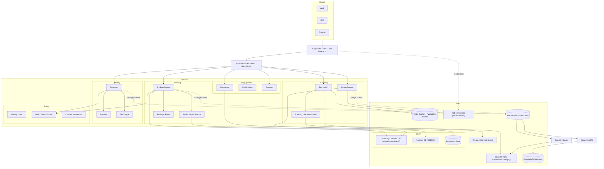

### Core Booking Flow

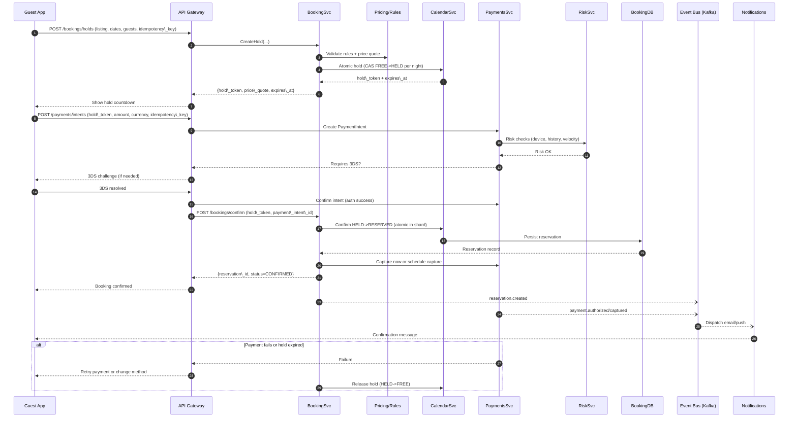

### Availability Hold Algorithm

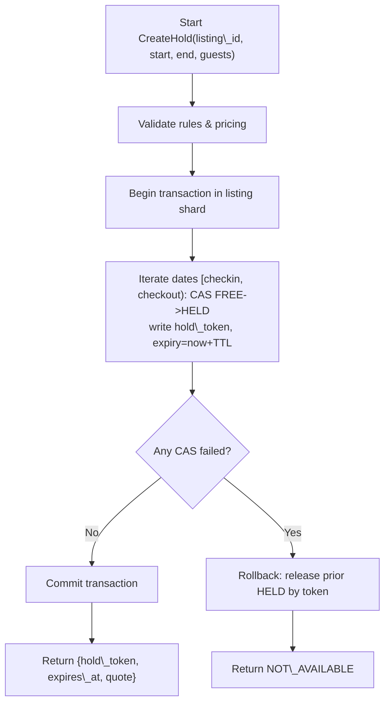

### Search Query Path

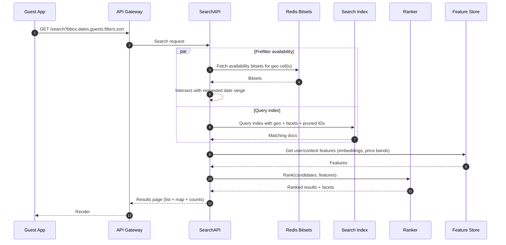

### Eventing, Outbox, and Indexing Pipeline (CQRS)

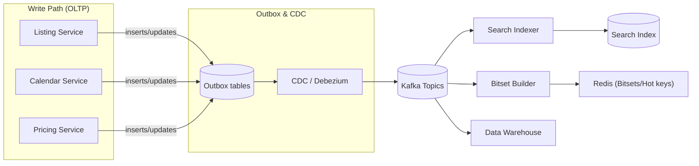

### Multi-Region Topology (Option A: Global Strongly-Consistent DB)

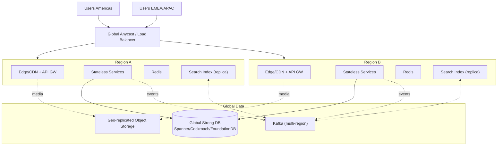

### Multi-Region Topology (Option B: Cell-Based Booking)

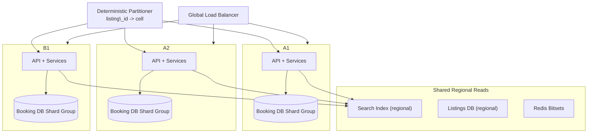

### Core Data Model (Entity-Relationship Diagram)

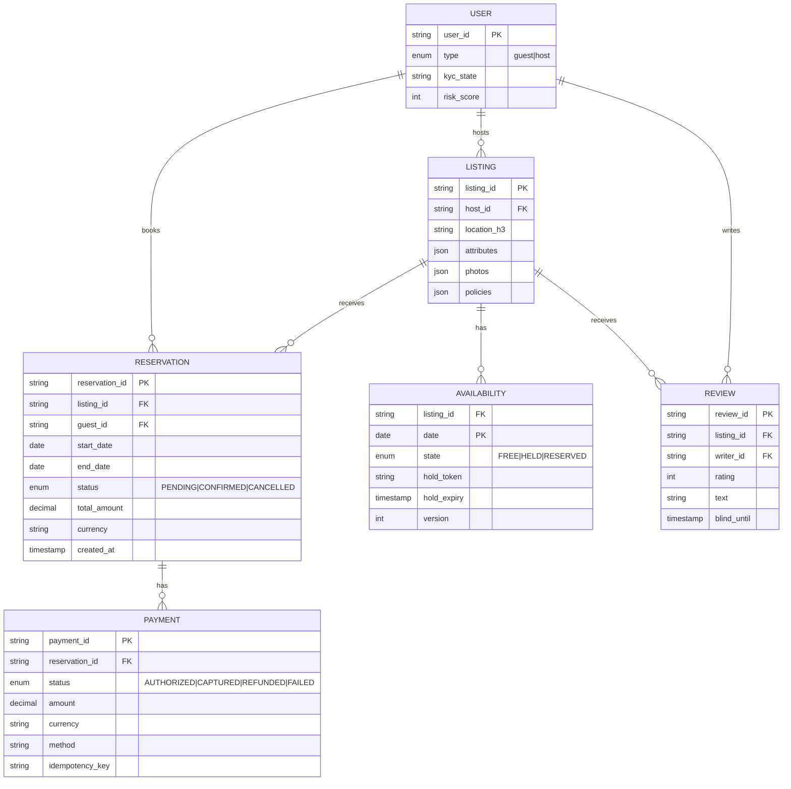

### Cancellation and Refund Saga

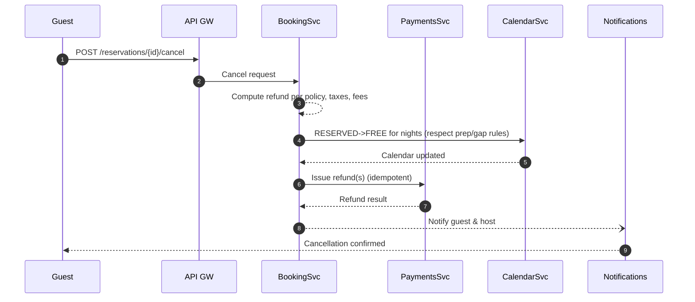

[Back to Top](#table-of-contents)

---

## Part VI: Search & Discovery Deep-Dive

## Search System: Detailed Design

Here's a deep-dive into Airbnb's Search & Discovery system with concrete data models, geo lookup design, availability filtering, ranking/personalization, caching, and operational choices. I’ve included Mermaid diagrams for dataflow and request lifecycles.

### Objectives and SLOs

* Relevance: High-precision recall of truly bookable listings for the user’s context.
* Latency: p95 < 300 ms end-to-end for typical searches; sub-150 ms map-pan updates.
* Freshness: Availability and price updates reflected in minutes (index) and seconds (bitsets).
* Scale: 100k RPS read path with burst tolerance; geo coverage global.

### Indexing: Document Design, Pipeline, and Shards

#### Search Document (Index Mapping Essentials)

* Keys
  + listing\_id (keyword), host\_id (keyword)
  + location: lat, lon (geo\_point)
  + h3\_cells\_r{7..10} (keyword multi-valued) for tiling and facets
* Text/browse fields
  + title\_{locale}, description\_{locale} (text with analyzers)
  + property\_type, room\_type, amenities[], policies[]
  + safety flags (instant\_book, superhost), cancellation\_policy
* Numeric/facets
  + nightly\_price\_base, cleaning\_fee\_base, fees\_base, currency
  + avg\_rating, rating\_count, quality\_score, conversion\_uplift
  + capacity fields: guests, bedrooms, beds, bathrooms
* Availability summary features for coarse prefiltering
  + next\_available\_date, availability\_ranges\_compact (compressed ranges, e.g., [start,end] pairs for the next 6 months up to a cap), availability\_density\_30/60/90
* Rank features
  + click\_ctr, save\_rate, cancellation\_rate, host\_response\_time, newness\_score, distance\_to\_center, price\_zscore\_in\_cell
* Denormalized city/region/place\_ids for filters and SEO

#### Indexing Pipeline

* Write path
  + Listing/price/calendar updates -> Outbox -> Kafka (topics: listing\_updated, price\_updated, calendar\_delta)
  + Search Indexer service consumes, fetches latest enriched state (Pricing snapshot, coarse availability ranges), transforms and upserts into OpenSearch/Vespa.
  + Calendar deltas: small and frequent. We don’t reindex full doc each hold; instead:
    - Update bitsets (Redis) in seconds.
    - Periodically (e.g., every 5–10 minutes or on material changes), update availability\_ranges\_compact in the index.
* Sharding
  + Primary shard key: listing\_id hash modulus (uniform).
  + Routing preference for geo: optionally co-route listings by H3 super-cell for locality, but ensure even shard sizes.
  + Replication: 2–3 replicas; cross-AZ. For multi-region, regional clusters fed from Kafka.

#### Availability Side-Channel (Fast, Exact Date Checks)

* For each listing: a 400-bit rolling window (next ~13 months), Roaring bitmap or bitset; 1=available night.
* Key: avail:{listing\_id} => bitmap + version + updated\_at
* Updates:
  + On reservation/hold/expiry: Booking/Calendar emits calendar\_delta -> Availability Updater updates Redis in ~1–2 s.
  + Nightly maintenance extends the rolling window.
* Rule masks
  + Precompute masks for min/max stay, allowed check-in weekdays, prep/buffer nights; compose via bitwise ops during query.
* Why this split
  + Index availability gives coarse pruning; Redis bitsets enforce correctness without hammering OLTP.

#### Indexing and Availability Side-Channel Diagram
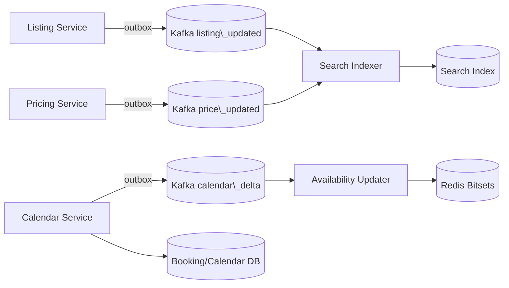

### Geolookup and Spatial Model

#### Place Resolution (Text to Place)

* Place DB: curated from OSM/Who’s On First/Geonames + provider (Mapbox/Google), with:
  + place\_id, type (country/region/city/neighborhood/POI), polygon (GeoJSON), bbox, centroid, aliases/transliterations, popularity.
* Geocoder service
  + /geo/resolve?q=“barcelona”&locale=es returns place\_id, polygon, bbox, display\_name, rank.
  + Fuzzy matching, typo tolerance, multi-lingual analyzers, popularity boosting.
* Reverse geocoding: map coordinate to enclosing places via polygon index.

#### Viewport and Tiling

* Use H3 grid for server-side tiling, typically res 7–9 depending on zoom.
* Map search
  + Client sends viewport polygon + zoom.
  + Server polyfills polygon into H3 cells at target resolution (adjust for area to cap cell count).
  + Use cells for:
    - fast doc routing (filter on h3\_cells\_rX terms)
    - server-side clustering and heatmaps
    - facet pre-aggregation caches keyed by cell

#### Geolookup and Viewport to Cells Diagram

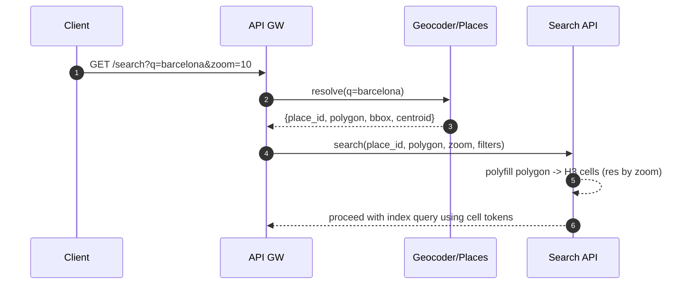

### Query Path (End-to-End)

#### Step-by-Step (Map or Place Search)

1. **Normalize request**
   * Resolve q to polygon (optional).
   * Compute H3 cells; clamp requested area to max cells; degrade resolution if necessary.
   * Normalize price filter to base or user currency; handle taxes display policy.
2. **Candidate retrieval (index)**
   * Query OpenSearch/Vespa with filters:
     + geo filter: h3\_cells\_rX terms or geo\_shape within polygon for precise boundary.
     + structural filters: capacity >= guests, amenities subset, property\_type, instant\_book, policies, rating >= X.
     + price filter in user currency using per-listing pre-indexed normalized\_price\_user\_ccy (updated daily or with FX trigger).
     + keyword text (optional) with BM25 or ANN for semantic search if needed.
   * Return top K’ candidates (e.g., 3000) by a fast recall rank (BM25 + static quality + distance + price prior), plus aggregations (facets, histograms).
6. Availability pruning (Redis bitsets)
   * Compute date mask M for requested [checkin, checkout). Include rule masks (min stay, day-of-week, prep).
   * Fetch bitsets for candidates in parallel (pipelined across Redis shards).
   * Keep those where (bitset AND M) contains a contiguous run covering (nights).
   * Adaptive widening: If < page\_size after prune, increase K’ and repeat one time.
7. Scoring and ranking
   * Fetch personalization features (Feature Store).
   * Compute score = p(book|user, listing, context) via LTR model; calibrate per geo and device.
   * Apply diversity constraints (price bands, neighborhoods, property types) via greedy MMR/submodular optimization.
5. **Pagination and caching**
   * Build stable cursor using top-N candidate IDs + index sort key; store in short-lived cache to ensure consistent paging.
   * Cache result for anonymous queries by (cells, dates, guests, filters, sort) with 10–30s TTL; signed-in queries are partially cacheable (strip personalized effects for shared cache).
6. **Response**
   * Return list results + map clusters + facet counts + price histogram.

#### Query Pipeline Diagram

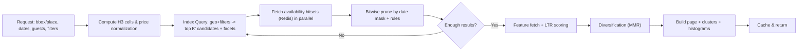

### Availability Bitset Check Details

* Mask building
  + Nights = days between checkin and checkout in listing’s local timezone.
  + M = contiguous bits for those nights.
  + Apply:
    - min\_stay: require nights >= min
    - max\_stay: nights <= max
    - allowed\_checkin\_days: zero out bits if start day invalid
    - prep\_time: additionally require adjacent buffer nights be free (check extra bits).
* Efficient contiguous-run check
  + Precompute also a prefix-sum/next-zero index per bitset chunk or do O(1) with bit tricks on machine words in Lua script running inside Redis (optional).
* Consistency vs holds
  + Bitsets updated on hold/confirm/release; TTL sweeper ensures expired holds clear. Index might lag but Redis is source of truth for availability at search time.

### Ranking and Personalization

The single most-loaded technical phrase in any search system is \"learning to rank.\" Below is what it actually means in plain mechanics, why we split ranking into two stages, and what each component is doing.

#### Why Two Stages: Recall vs Rank

* **Recall model** (runs inside the search index, returns ~3000 candidates): a cheap combination of `BM25` (text-relevance score), `ANN` (Approximate Nearest Neighbor on listing/user embeddings, for semantic match), and static *priors* (quality score, proximity, normalized price).
  > *What is a \"prior\"?* A precomputed score attached to each listing that captures its general quality \u2014 things that don't depend on the specific query. A 4.9-star listing with 500 reviews has a higher prior than a brand-new listing. We bake these into the index so the recall stage doesn't have to recompute them per query.\n  > *What is ANN?* For semantic search (\"loft with industrial vibes\"), we represent listings and queries as high-dimensional vectors (embeddings). Finding the *exact* nearest vectors among 10 million is too slow; ANN algorithms (HNSW, IVF-PQ) trade a tiny accuracy loss for a 100\u20131000x speedup.\n\n* **LTR ranker** (runs after recall, scores the top candidates): a Gradient-Boosted Decision Tree (GBDT) like LightGBM, or a small neural net (DNN). Inputs are ~50\u2013200 features per `(query, listing)` pair; output is a calibrated `p(book)` \u2014 the predicted probability the user books this listing.\n  > *Why GBDT and not deep learning?* For ranking, GBDTs are usually faster, easier to interpret (you can ask \"which features mattered for this user?\"), and don't require a GPU at serving time. DNNs win when features are raw text/images; GBDTs win when features are pre-engineered numerical signals, which is our case.\n\n  + **Features fed into the ranker:**\n    - **Listing-side:** `price_normalized` (in user's currency), `rating_count`, `avg_rating`, `cancellation_rate`, `superhost` flag, `instant_book` flag, `novelty_age` (penalize listings that just appeared, with no track record), `photo_quality` (an ML score on the cover photo), `distance_to_interest` (e.g., distance to city center).\n    - **User-side:** collaborative-filtering embeddings (\"users who booked similar listings to you also liked these\"), `price_sensitivity`, `party_size`, device locale, `recency_of_travel`, typical length-of-stay, an \"adventurous vs mainstream\" cluster.\n    - **Context:** seasonality index, market demand, lead time (booking 2 days out vs 6 months out implies different intent), weekday/weekend, stay length, special events (Web Summit week in Lisbon).\n    - **Interaction:** observed during the session \u2014 dwell time on cards, saves/wishlists, similar-listings clicks.\n  + **Training data:**\n    - Labels primarily come from bookings (the strongest signal). Clicks and saves are weaker labels with lower weight.\n    - **Counterfactual corrections / propensity scoring:** because we only observe outcomes for listings we *showed* the user, naive training learns the bias of the previous ranker. Propensity weighting downweights listings the previous ranker over-represented, so we don't get stuck in a self-reinforcing loop.\n    - Time decay: a booking from 2 years ago counts less than one from last week.\n  + **Objective:** maximize calibrated `p(book)` (so the score is a real probability, not just an arbitrary ranking score), subject to fairness and exploration constraints.\n\n#### Diversification and Fairness\n\n* **MMR (Maximal Marginal Relevance) and submodular optimization:** after the ranker scores candidates, we don't just take the top 20 by score \u2014 we apply a diversification pass.\n  > *Why diversify?* If we ranked purely by `p(book)`, the top 10 results for \"Paris this weekend\" might be 10 nearly-identical 1-bedrooms in the 7th arrondissement at the same price point from the same property manager. The user clicks through, doesn't see anything different, bounces. MMR re-selects the top-K with a penalty for similarity to already-selected results: \"score = relevance \u2212 \u03bb \u00d7 (max similarity to anything already picked).\" The result is a top-10 that spans different neighborhoods, price bands, and property types \u2014 better for the user, better for conversion.\n  + Constraints we enforce during diversification: avoid near-duplicates, ensure price/neighborhood spread, cap how much of the top-N comes from a single host (so one superhost can't dominate a market).\n* **Exploration: \u03b5-greedy or Thompson sampling.**\n  > *Why explore at all?* New listings have no booking history, so the ranker is uncertain about them and tends to bury them \u2014 which means they never get clicks, which means they never get a track record, which means they stay buried. *\u03b5-greedy* says \"X% of the time, randomly promote a high-uncertainty listing into the top-K.\" *Thompson sampling* is a smarter version that promotes proportionally to the listing's uncertainty. The cost is a small short-term hit to conversion; the benefit is a healthy supply side over time.\n* **Guardrails:** penalize high cancellation rate, slow host response, policy violations. These are hard caps in the score, not soft signals.

### Caching Strategy

* Edge caching
  + Anonymous browse pages and map tiles with short TTL (10–30s) keyed by tile+filters (excluding dates for extreme variability unless very common ranges, e.g., next weekend).
* Mid-tier caches (Redis)
  + Availability bitsets (primary)
  + Popular H3 cell facet snapshots: counts, price histogram buckets for common filters; refreshed via background worker using Kafka change signals.
  + Search page results cache for hot queries; shard-aware to avoid thundering herds.
* Client caching
  + Debounce map move; send requests at most every 150–250 ms when dragging.
  + Reuse last candidate set for small viewport changes.

### API Design (Key Endpoints)

* GET /search
  + Params: q, place\_id, bbox, zoom, start\_date, end\_date, guests, infants, pets, filters (amenities[], room\_type, property\_type, instant\_book, cancellation), price\_min/max (user currency), sort, page\_cursor, page\_size
  + Response: listings[], clusters[], facets, price\_histogram, cursor, diagnostics (timings)
* GET /search/tiles
  + Params: bbox or tile\_ids[], zoom, filters, dates (optional)
  + Response: per-tile counts, top-N exemplars
* GET /suggest
  + Typeahead for places and neighborhoods
* GET /similar/{listing\_id}
  + Uses embedding KNN and market constraints

### Pricing and Currency Handling

* Normalize price filters into user currency:
  + price\_normalized = price\_host\_currency \* fx\_rate[host->user]
  + fx\_rate updated multiple times per day; index stores price\_normalized for top 20 currencies; fallback convert at query-time for rare currencies.
* Ranking uses price\_zscore within cell to avoid absolute price bias.

### Facets and Aggregations at Scale

* Index aggregations:
  + amenity counts, property\_type counts, instant\_book counts
  + price histogram: precomputed bucket edges per market to reduce error
* Cell-level caches:
  + For hot markets, maintain Redis entries: cell:{res}:{cell\_id}:{filter\_signature} -> {counts, price\_hist} with 30–120s TTL.
  + Update via change events (listing on/offline) and periodic refresh.

### Multi-Region and Freshness

* Each region runs a search cluster with local replicas; Kafka topics are mirrored.
* Availability Redis is regional; cross-region replication optional since search is routed to nearest region; booking correctness relies on calendar DB not search.
* SLA
  + Calendar delta -> Redis: p95 < 2s.
  + Listing change -> Index: p95 < 5m; urgent flags (suspend listing) trigger fast-lane reindex (< 30s).

### Observability and Quality

* Per-query diagnostics: timings for resolve, index, bitsets, rank, cache status
* Quality dashboards: nDCG@k, book-through-rate, coverage, diversity metrics, bad-click rate
* Online experiments: assignment service; guardrails for conversion, cancellations, CS contacts

### Pseudocode: Server-Side Search

```
function search(req):
  ctx = normalize(req)  // resolve place, currency, H3 cells, dates
  sig = cacheKey(ctx, exclude_personalization=true)
  if cache.exists(sig): return cache.get(sig)

  candidates, aggs = index.query(
      geo = ctx.cells or ctx.polygon,
      filters = ctx.filters,
      price = ctx.price_range_normalized,
      size = K_PRIME)

  mask = build_date_mask(ctx.start, ctx.end, ctx.listing_timezone_hint)
  avail_ok = []
  for batch in batchByShard(candidates.ids):
      bitsets = redis.mget(batch.ids)
      for id in batch.ids:
          if contiguous_run(bitsets[id] & mask) >= ctx.nights: avail_ok.add(id)

  if len(avail_ok) < ctx.page_size:
      candidates2 = index.query(..., size = K_PRIME * 2)
      // repeat prune for additional candidates

  feats = featureStore.fetch(user=ctx.user, listings=avail_ok.top(N_FEATURES))
  scored = ranker.score(avail_ok, feats, ctx)
  ranked = diversify(scored, constraints=ctx.diversity)
  page = paginate(ranked, ctx.cursor)

  result = buildResponse(page, aggs, clusters(ctx.cells, ranked), diagnostics)
  cache.set(sig, result, ttl=20s)  // anonymous-safe
  return result
```

### End-to-End Search Flow with Caching and Adaptive Widening

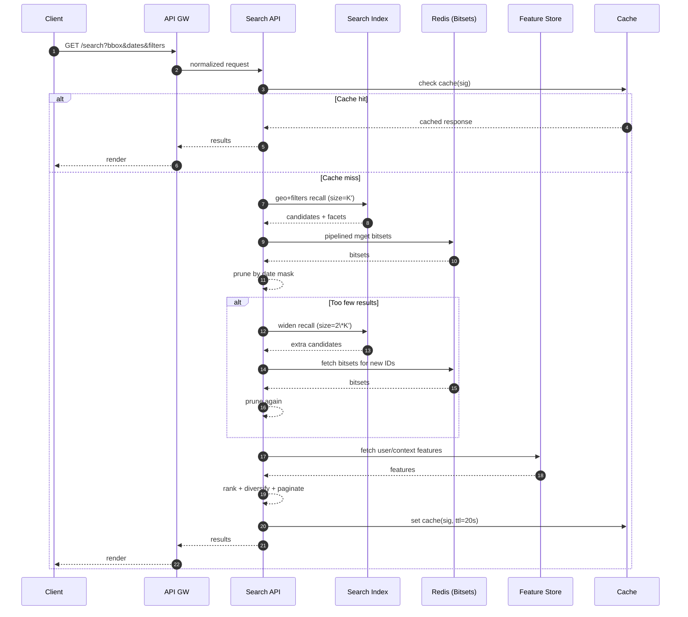

### Operational and Failure Modes

* Degraded mode: If Redis bitset service is impaired, fallback to index-only availability\_ranges\_compact with a small false-positive rate; label results with “availability may have changed”.
* Backpressure: If index latency > SLO, reduce K’ and prefer cached cell results; increase result TTLs temporarily.
* Hotspots: Popular markets → pre-warm caches, shard pinning for high-density cells, autoscale search nodes with headroom.

### Key Trade-offs

* Doing precise date validation in Redis keeps index lean and avoids heavy nested ranges, while index still carries coarse range summaries for degraded mode and early pruning.
* H3-based tiling yields stable, cacheable partitions and cheap aggregation, while still allowing precise geo\_shape when necessary.
* Adaptive widening balances result quality with query latency.

[Back to Top](#table-of-contents)

---

## Appendix: Open Questions

### Open Questions to Tailor Further

* Do you want Experiences integrated in v1 or later?
* Preference for a global strongly-consistent DB vs cell-based regional booking?
* Target cloud(s) and existing PSP preferences?
* Adapt for specially the booking/DB choices and sketch a reference deployment topology with concrete tech picks?
* Elaborate more on concrete OpenSearch mappings, example H3 resolutions per zoom level, or the LTR feature dictionary and training cadence for your markets?

[Back to Top](#table-of-contents)
