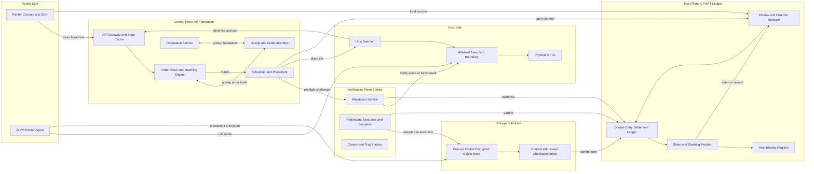
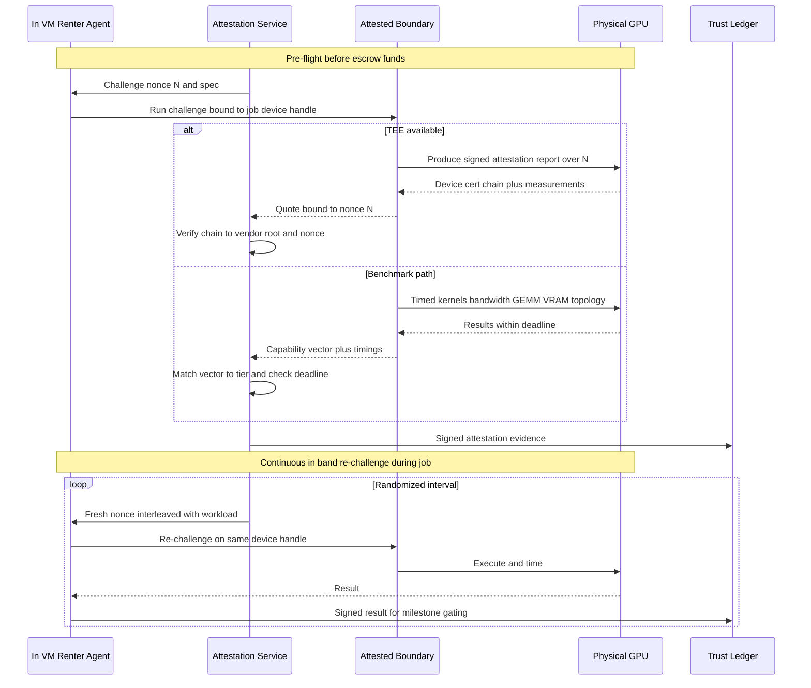
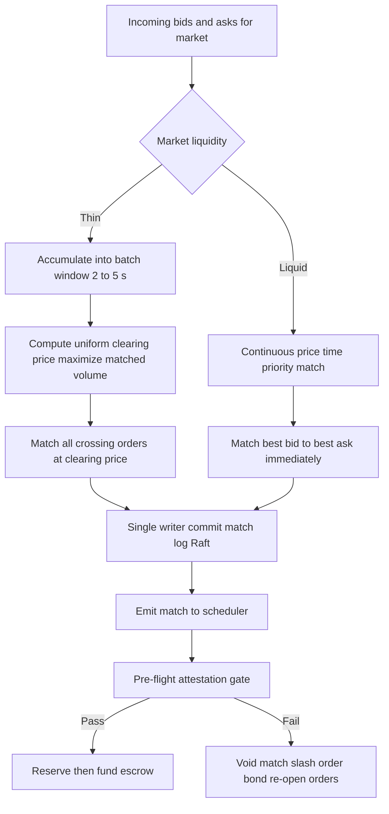
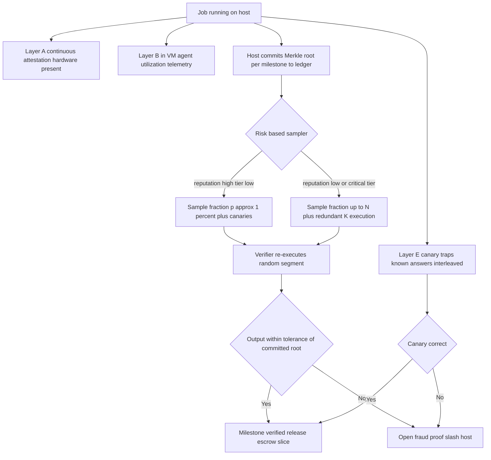
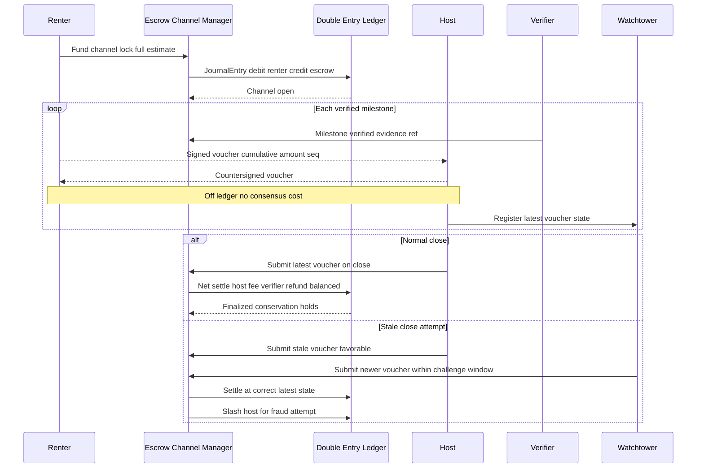
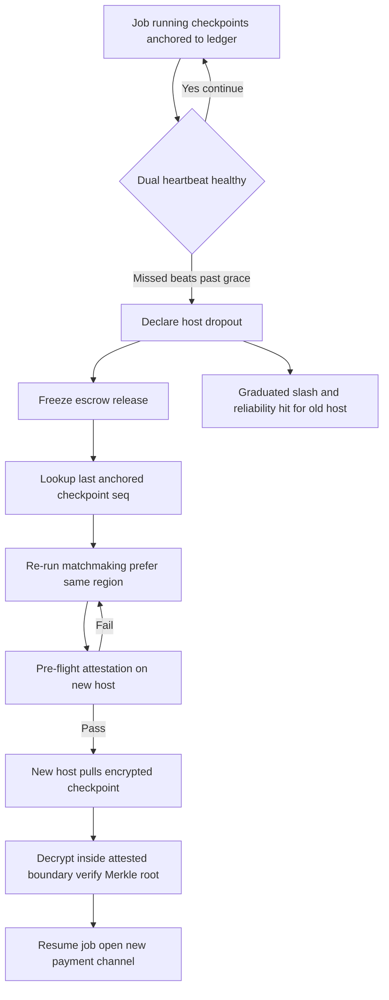
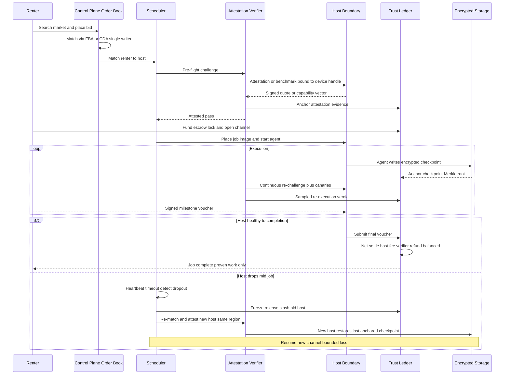
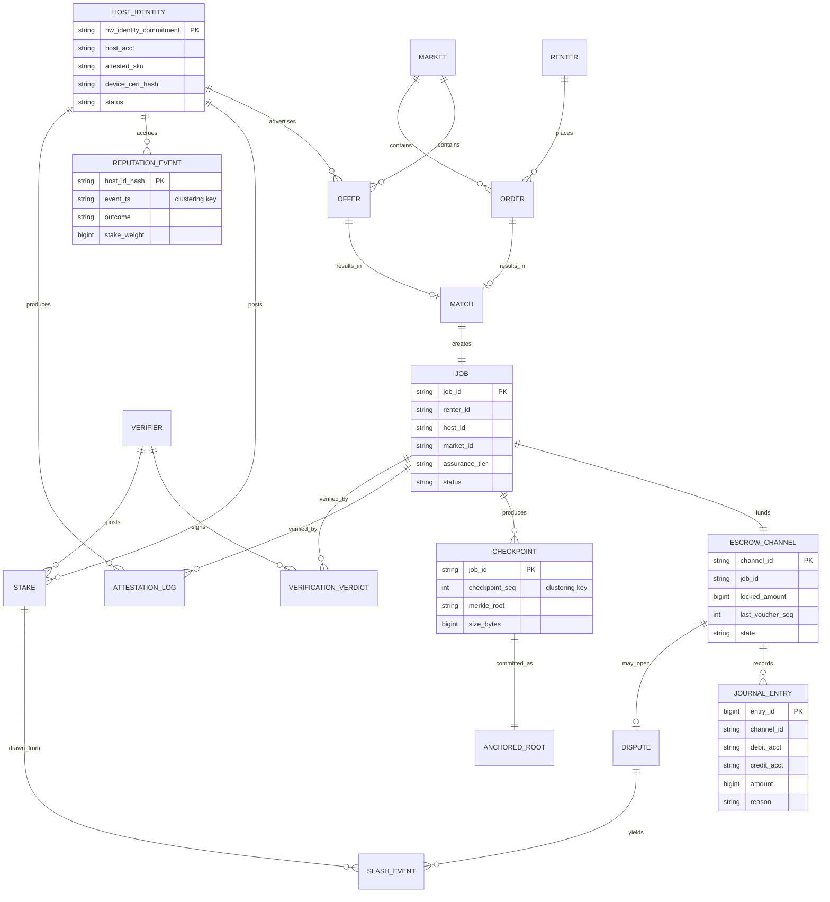
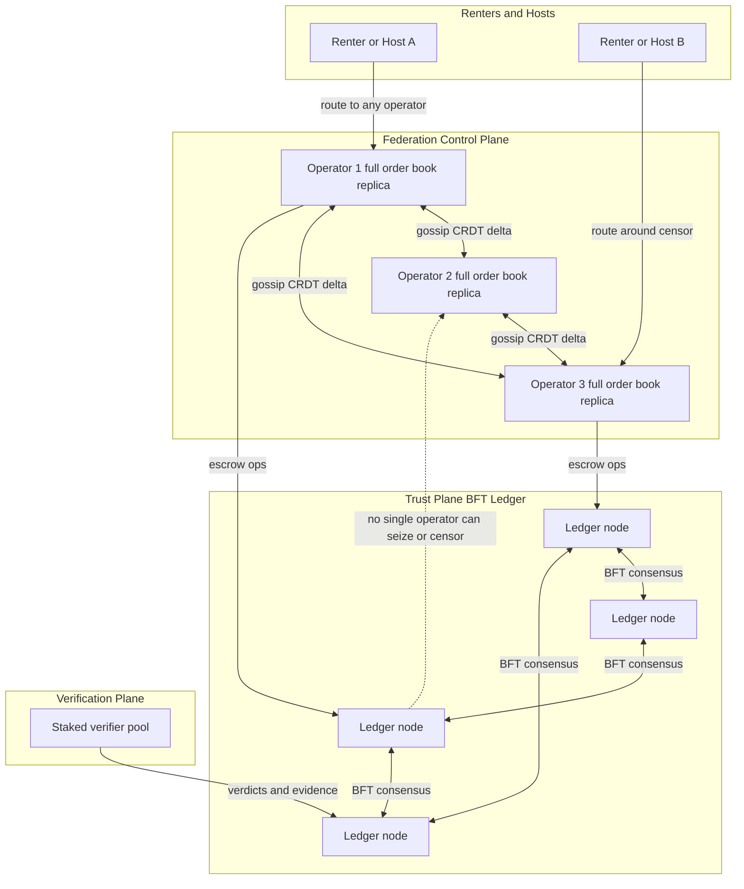
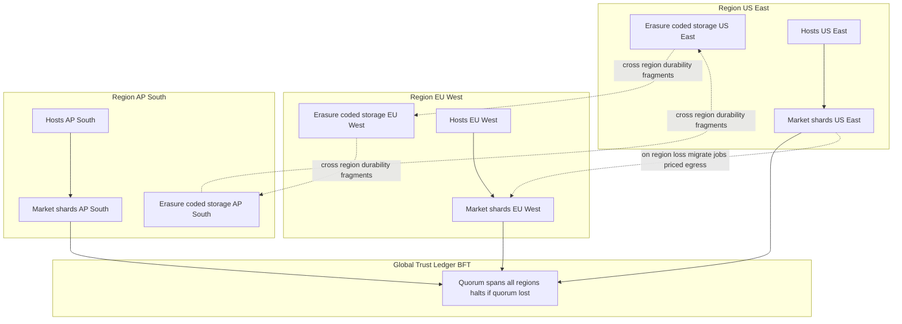

# Decentralized GPU Spot Marketplace (Proof-of-Compute) — System Design

A production-grade design for a decentralized spot marketplace for **heterogeneous GPU compute** (Vast.ai / io.net / Akash class). The marketplace performs trustless matchmaking between price-sensitive **renters** and **anonymous, untrusted hosts**, gives renters cryptographic-grade assurance that they actually received the advertised hardware, and keeps long-running jobs alive when a host vanishes mid-run. The central unsolved problem — and the reason this document exists — is **proof-of-compute and proof-of-hardware without trusting the host**. Everything else (order book, escrow, reputation, checkpointing) is engineering in service of that one adversarial guarantee.

This is not a thin-client thought experiment. Hosts are economically rational adversaries who will lie about GPU model, VRAM, bandwidth, and uptime if it pays. Renters are semi-trusted and will also lie ("I never got the hardware") to avoid paying. Verifiers can collude. Supply is thin and bursty. The design treats every actor as Byzantine and leans on a layered defense — hardware attestation, timed-kernel fingerprinting, sampled redundant execution, escrow with slashing, and Sybil-resistant reputation — so that **cheating is provably negative expected value** even though no single mechanism is perfect.

## Discovery Conversation

The transcript below is a working session between **Client** (the founder/VP of Product & Engineering at "Meridian", the company building and operating the marketplace) and **Architect** (the distinguished engineer driving the system design). It is preserved because every downstream choice — the three-plane split, the verification economics, the escrow ledger, the federation model — traces back to a decision made here. Read this first; the rest of the document implements these decisions.

---

**Architect:** Before we draw a single box, tell me who actually touches this on a normal day. Not "users." Real people.

**Client:** Three, maybe four. First, the **renter** — Dr. Lena Ortiz, an ML engineer at a 30-person AI startup. She needs eight H100s for six hours to fine-tune a 13B model, and she needs it tonight, cheap. Her alternative is a hyperscaler at four to five dollars per GPU-hour on-demand, or a reserved commitment she can't justify. She wants spot capacity at a third of that price. Second, the **host** — "Viktor", pseudonymous, runs a dozen RTX 4090s and four A100s in a converted unit somewhere with cheap power. He wants to monetize idle GPUs and he is not necessarily honest. Third, **us, the marketplace operator** — we run the protocol, take a few percent on settled compute, and we live or die on whether renters trust that they got what they paid for. There's a fourth group I keep going back and forth on: independent **verifiers** who run attestation challenges and re-execution.

**Architect:** Keep the verifiers. The moment hosts are anonymous and adversarial, "who checks the work" cannot be us alone — that's a central point of trust and a censorship lever. We'll make verification a permissionless, staked role. Now walk me through Lena's night, hour by hour. Don't summarize.

**Client:** 9 PM. She has a training script in a Docker image and a 40 GB dataset already in object storage. She opens our console, searches "8x H100, NVLink, EU or US-East, under 2 dollars an hour, at least 6 hours." She sees a handful of offers — supply is thin for eight-way H100 boxes. She picks one with decent reputation, clicks rent. We make her fund escrow. Within about a minute her container is scheduled on Viktor's box, and — this is the part I care about — before she pays a cent of *released* money, she gets proof it's really eight H100s with NVLink, not eight 4090s with a spoofed `nvidia-smi`. The job runs. Around 1 AM Viktor's power flickers and his box drops. Lena should not lose the whole run. The job resumes on another host from a recent checkpoint, she pays only for work actually done, and Viktor eats a penalty for vanishing.

**Architect:** That walk-through bites me in four places, and each one forks the design. One: "before she pays a cent of released money, she gets proof it's really H100s" — that is the proof-of-hardware problem, and a spoofed `nvidia-smi` string is the trivial attack we must defeat on day one. `nvidia-smi` is software the host controls; it can print anything. We cannot trust any self-report. Two: "pays only for work actually done" means escrow must release **incrementally against verified milestones**, never in one lump at the end and never in one lump at the start. Three: "resumes from a recent checkpoint" means checkpoints must exist, must be **written by code we trust inside the rental, not by Viktor**, and must land in storage Viktor can't tamper with. Four: "Viktor eats a penalty" means Viktor must have posted a **bond we can slash**, which means hosts stake capital. Hold those; they become four of our six deep dives.

**Client:** That's the product in one breath. The pitch to Lena is "a third of the price with cloud-grade trust." If we can't deliver the trust, the price doesn't matter — nobody runs a six-hour training job on hardware they can't verify.

**Architect:** Agreed, and that sentence is the whole thesis: **trust is the product; price is the wrapper.** Now — who pays, and how big is this?

### Who pays, and the scale anchor

**Client:** Renters pay per GPU-hour into escrow. We take a take-rate — call it 3 to 8 percent of settled compute — and a slice goes to verifiers. Hosts are the supply; without them there's no market, but renters are the money. Plan for **200,000 registered hosts**, of which maybe **60,000 are online at any instant** — spot supply is intermittent by nature, people pull GPUs the moment a better-paying job or a gaming session shows up. That's roughly **500,000 advertised GPUs**, maybe **300,000 actually rentable** at peak. Target **50,000 concurrent active rentals** at peak and around **250,000 jobs started per day**.

**Architect:** Good, that's enough to size everything. Order of magnitude: 300,000 rentable GPUs at, say, 60% utilization and a blended $1.50 per GPU-hour is on the order of **$2 billion a year of gross merchandise value**; at a 5% take that's roughly **$100 million a year of revenue** — a real business, which means it's a real target for fraud. The scale also tells me the *interesting* load is not request volume. Matchmaking is only a few thousand queries a second even with programmatic price-watchers. The brutal numbers are **checkpoint bandwidth** and **verification compute**. A single 13B training job's optimizer state is over 100 GB; checkpoint a few thousand of those every half hour and you're moving hundreds of terabytes. And every dollar you spend re-executing work to verify it eats the price advantage that is our entire reason to exist. So the two scarcity-shaped problems are: **price discovery under thin supply**, and **verification cheap enough not to erase the discount.** I'll come back to both.

**Client:** That matches my fear. My CFO's question is always "if you verify everything twice, aren't you just a 2x-cost cloud?"

**Architect:** Exactly right, and the honest answer is: we do *not* verify everything twice. We verify *hardware presence* continuously and cheaply, and we verify *work correctness* probabilistically and selectively, scaled by how much the renter is willing to pay for assurance and how trusted the host is. That's a deep dive on its own. Let me ask the three questions whose answers fork the entire architecture.

### Question 1 — How decentralized must the marketplace itself be?

**Architect:** Plain language: is this a normal company that happens to rent GPUs — where we run the matchmaker, hold the funds, and can shut off a host we don't like — or is the whole selling point that **no single party, including us, can censor a participant or seize the money in escrow**?

**Client:** The pitch against the hyperscalers is censorship-resistance and neutrality. Hosts in regions the big clouds won't serve, renters who don't want a corporation deciding their workload is "abusive." If we're just another company with a kill switch, we've lost the differentiation. But — and this is real — I'm not going to put a slow, clunky blockchain in front of Lena's search box. It has to feel like a normal product.

**Architect:** Then the answer is a **hybrid split**, and it's the most important decision in this document. We separate the system into planes by their trust requirement. The **trust plane** — escrow, staking, slashing, settlement finality, host-identity commitments — goes on a decentralized, Byzantine-fault-tolerant ledger that no single operator controls, so we *cannot* seize funds or rewrite history even if subpoenaed or hacked. The **control plane** — order book, matchmaking, reputation scoring, scheduling — runs off-chain for speed, but is operated by a **federation** of independent operators who gossip a replicated order book, so no single operator (including Meridian) can unilaterally censor an order. The **verification plane** — attestation and re-execution — is a permissionless staked role. The trade-off, stated plainly: a hybrid is more complex than either a pure centralized SaaS or a pure on-chain protocol, and the federation has governance questions a single company doesn't. But it's the only way to get **both** sub-second search and credible neutrality. This forks all of [Part II](#21-architecture-overview).

**Client:** Hybrid it is. I'd rather explain a federation than explain why we froze someone's funds.

### Question 2 — How adversarial are the hosts?

**Architect:** Plain language: do we model a host as merely *unreliable* — honest but flaky, drops sometimes — or as *actively malicious and possibly colluding*? For instance, a host who owns one real H100, rents you "an H100," but actually runs your job on a 4090 and routes only the verification benchmark to the real card. Or a host who spins up a fake renter to wash-trade his own reputation up.

**Client:** Assume the worst. Assume hosts are adversarial, assume some of them collude — host plus fake renter, or two hosts vouching for each other — and assume a few will try to corrupt verifiers. If we're robust against that, the honest-but-flaky case is free.

**Architect:** That's the right call and it's expensive, so I want you to feel the cost. A Byzantine threat model means: we can never trust a host's self-report of anything — not `nvidia-smi`, not utilization counters, not "I checkpointed, I promise." Every claim must be either **cryptographically attested by hardware the host can't forge**, or **independently re-derived by a party the host can't predict or bribe.** It means attestation challenges must be **randomized and unpredictable** so they can't be precomputed, and **bound to the same execution context as the real job** so the host can't run the benchmark on good hardware and the job on bad. It means verifier assignments must be random and verifiers must stake, so corrupting them is costly and detectable. This is [Deep Dive 3.1](#31-hardware-attestation-and-anti-spoofing) and [Deep Dive 3.3](#33-proof-of-compute-and-verification-economics). The single most important design principle falls straight out of this answer: **make cheating require actually delivering the advertised resource.** If the only way for Viktor to pass continuous, in-band, interleaved verification is to run Lena's real workload on the real H100, then "cheating" and "honest service" converge — and the attack evaporates.

**Client:** Say that line again, because that's the one I'll repeat to investors.

**Architect:** *The strongest anti-fraud mechanism is an architecture where the cheapest way to pass verification is to stop cheating.* We won't reach it perfectly — there's always residual risk, and I'll quantify it — but it's the north star.

### Question 3 — When money is moving, do we optimize for consistency or availability?

**Architect:** Plain language: while a job runs and escrow is releasing money minute by minute, which do you never want to violate — **correctness of the money** (never pay for work not done, never release the same escrow twice, never let the books fail to balance), or **availability** (the system keeps taking actions even during a network partition)? You can't have both perfectly; CAP and PACELC force a choice per data path.

**Client:** Money correctness is sacred. I will tolerate "matchmaking is briefly stale" or "you can't place a new order for thirty seconds during an incident." I will not tolerate "we paid a host twice" or "the escrow ledger doesn't balance." A double-spend or a lost escrow deposit is a company-ending event.

**Architect:** Then we split the consistency model by plane, and this is the cleanest application of PACELC I'll make in the whole document. The **trust plane is CP**: the escrow/settlement ledger chooses consistency over availability under partition, and even when there's no partition it pays latency for strong consistency — every settlement is a BFT-ordered, double-entry transaction with a conservation invariant the ledger refuses to violate. If the ledger can't reach quorum, it **stops settling** rather than risk a double-release. The **control plane is AP**: the order book and reputation store choose availability and low latency, tolerate eventual consistency, and reconcile via gossip — a stale quote is annoying, not fatal. The dangerous boundary is the **match-to-escrow handoff**, where an AP match becomes a CP commitment; we make that boundary explicit with a two-phase "reserve then fund" flow and idempotency keys so a retry during a partition can't create two jobs or two charges. This forks the [data model](#24-data-model-and-schema) and all of [Part IV](#41-where-it-breaks-at-10x-and-100x).

**Client:** Split it. Slow-but-correct money, fast-but-eventual search. That's the right shape.

### Use-case probes

**Architect:** Now let me push on the edges, because the edges are where this design earns its keep. **Host vanishes mid-job.** Viktor's power dies at 1 AM. What's the contract?

**Client:** Lena's job must survive. She pays for proven work up to the last checkpoint and not a cent more. Viktor loses any unreleased escrow for the unproven segment and takes a reputation and possibly a stake hit for dropping without a graceful handoff.

**Architect:** Then three mechanisms are mandatory and they interlock. **One:** checkpoints are written *by Lena's agent running inside the rented VM*, not by Viktor's host daemon — because Viktor is untrusted and a host who's about to vanish has zero incentive to checkpoint honestly. **Two:** checkpoints land in **renter-controlled, erasure-coded object storage, encrypted with Lena's key and content-addressed by a Merkle root** committed to the ledger, so Viktor can neither read the data nor forge a checkpoint nor withhold it. **Three:** a **dual heartbeat** — host and in-VM agent — drives dropout detection; missed beats past a grace window declare the host dead, freeze escrow release, and trigger migration. The scheduler re-runs matchmaking for a replacement host and restores from the last good checkpoint. Lena's only real loss is the work since the last checkpoint, which is why checkpoint *frequency* is an optimization, not an afterthought — there's a classic formula (Young/Daly) that balances checkpoint overhead against expected lost work given the host failure rate.

**Client:** What about jobs that genuinely can't tolerate a restart gap — a live inference endpoint?

**Architect:** Those opt into **redundant scheduling**: run N replicas on independent hosts, primary plus warm standby or active-active behind a router. It costs N times the money, so it's a renter-selected tier for critical jobs only. Most training jobs take checkpoint-and-migrate; latency-critical serving takes redundancy. That's [Deep Dive 3.5](#35-fault-tolerance-checkpoint-migration-and-redundancy).

**Architect:** **Trust boundaries and the symmetric-cheating problem.** We've talked about dishonest hosts. What about a dishonest *renter* who got perfectly good hardware, ran her job, and then claims "the hardware was misrepresented, I'm not paying"?

**Client:** I hadn't put it that bluntly, but yes — that has to be handled or hosts won't supply.

**Architect:** It's essential, and it's why verification evidence must be **mutually convincing and adjudicable**, not just renter-facing. Every attestation challenge, every sampled re-execution, every milestone receipt is **signed by both parties and anchored to the ledger** as it happens. So when a dispute opens, we don't have he-said-she-said; we have a tamper-evident evidence trail that an **optimistic fraud-proof process** can adjudicate: settlement is presumed valid after a challenge window, but anyone can post a bonded fraud proof, and if it's upheld the liable party is slashed. This protects honest hosts from lying renters exactly as much as it protects honest renters from lying hosts. The cross-entity invariant underneath it all is **escrow conservation**: money in equals money out — to host, to verifiers, to fee, or refunded to renter — never created, never destroyed. We enforce it with **double-entry bookkeeping** on the ledger, the same invariant a bank uses. [Deep Dive 3.4](#34-escrow-settlement-and-slashing).

**Architect:** **Sybil and price manipulation.** Hosts are anonymous. What stops me registering 10,000 fake hosts to inflate reputation and then rug-pull, or to fake demand and pump prices?

**Client:** That terrifies me more than the hardware spoofing, honestly. Anonymity plus reputation sounds like a Sybil farm waiting to happen.

**Architect:** The defense is to **anchor reputation to something physically scarce and costly to fake — the attested GPU itself.** Reputation attaches to a **persistent hardware identity** proven by attestation, not to a free-to-mint wallet. One real H100 is one reputation anchor; faking 10,000 means *owning* 10,000, at which point you're a legitimate large host. Layer on **staking** (Sybil cost scales with locked capital) and **proof-of-history** (reputation accrues only from verified completed jobs, each of which cost real escrow and real verification to produce, so wash-trading reputation is expensive and negative-EV). New hosts start in **probation**: small jobs only, higher relative stake, higher sampling rate, priced at a risk discount, graduating as verified history accumulates. And reputation **decays** — but we split it: a fast-decaying *reliability/uptime* score (because intermittent supply is normal and shouldn't be over-punished) and a slow-decaying *honesty* score (because a host who cheated once shouldn't buy back trust cheaply). [Deep Dive 3.6](#36-sybil-resistant-reputation).

**Architect:** **Geography and data gravity.** Does region matter to Lena?

**Client:** Yes. Her dataset is in one region; pulling 40 GB across the planet is slow and expensive, and some workloads have residency requirements. But hosts are wherever the cheap power is.

**Architect:** So region is a **first-class matching dimension and a pricing input**, not a footnote. Markets are partitioned by GPU class *and* region *and* interconnect tier. Migration prefers same-region replacement hosts to avoid re-shipping data; cross-region migration is allowed but priced in. We don't promise residency guarantees in v1 beyond best-effort region pinning — strict compliance/residency certification is a roadmap item, and I'll flag the **sanctions/export-control tension** with host anonymity as an explicit risk, because pretending it doesn't exist would be malpractice.

**Architect:** **Integrations.** What must this talk to on day one?

**Client:** Container images (OCI/Docker), SSH into the box, object storage for datasets and checkpoints, and crypto wallets for payment. Fiat on-ramp eventually. Maybe a Kubernetes-ish or SLURM-ish scheduler interface later for big customers.

**Architect:** Day-one: OCI runtime inside an attested VM/enclave boundary, an in-VM **renter agent** that owns checkpointing and in-band verification, S3-compatible object storage with client-side encryption, and wallet-based settlement on the trust ledger. The scheduler exposes a simple "place job / get status / migrate" API; richer orchestration is a later layer, not v1.

### Out of scope

**Architect:** Let me say plainly what we are *not* building, so the design stays coherent.

**Client:** Please.

**Architect:** We are not building an L1 blockchain — the trust plane is an application on a BFT ledger / L2 rollup, not a new consensus protocol. We are not a bank — no fiat custody, no KYC/AML layer in v1 (and I'll flag that as a legal risk, not a solved problem). We are not building training frameworks, model parallelism libraries, or a notebook product. We are not promising **general** zero-knowledge verifiable computation over arbitrary CUDA — that's not practical at scale in 2026, and any design that claims it is lying; we use it only for the narrow primitives where it's real (e.g., Freivalds checks on matrix products). We are not solving strict regulatory data-residency certification in v1. And we are not a hyperscaler — no managed databases, no serverless, no 99.99% single-tenant SLAs; this is spot compute with explicit, probabilistic trust guarantees.

**Client:** Agreed. Focused beats broad. Ship the trust primitive; everything else follows.

### Decisions locked in this conversation

| Decision | Rationale | Manifests in |
|---|---|---|
| Hybrid three-plane split: CP trust plane, AP control plane, staked verification plane | Censorship-resistance and neutrality without sacrificing search latency | [2.1 Architecture Overview](#21-architecture-overview), [1.4 Non-Functional Requirements](#14-non-functional-requirements) |
| Byzantine threat model for hosts, renters, and verifiers | Anonymity plus money invites active, colluding fraud | [3.1 Hardware Attestation](#31-hardware-attestation-and-anti-spoofing), [3.3 Proof-of-Compute](#33-proof-of-compute-and-verification-economics) |
| Make cheating require delivering the real resource (in-band, interleaved, context-bound verification) | The strongest fraud defense is one where passing verification means stopping cheating | [3.1 Hardware Attestation](#31-hardware-attestation-and-anti-spoofing), [3.3 Proof-of-Compute](#33-proof-of-compute-and-verification-economics) |
| Money paths are CP (BFT, double-entry, conservation); search/reputation are AP (gossip, eventual) | A double-spend is company-ending; a stale quote is not | [2.4 Data Model](#24-data-model-and-schema), [3.4 Escrow and Settlement](#34-escrow-settlement-and-slashing), [4.1 Where It Breaks](#41-where-it-breaks-at-10x-and-100x) |
| Milestone/streaming escrow with payment channels; never lump-sum | Pay only for verified work; keep on-ledger writes bounded | [3.4 Escrow and Settlement](#34-escrow-settlement-and-slashing) |
| Checkpoints written by the in-VM renter agent to encrypted, content-addressed, erasure-coded storage | Untrusted hosts cannot be trusted to checkpoint honestly or hold the data | [3.5 Fault Tolerance](#35-fault-tolerance-checkpoint-migration-and-redundancy) |
| Risk-based, tiered verification (always-on cheap fingerprint; selective expensive re-execution) | Verifying everything twice would erase the price advantage | [3.3 Proof-of-Compute](#33-proof-of-compute-and-verification-economics), [4.2 Trade-off Register](#42-trade-off-register) |
| Reputation anchored to attested hardware identity + stake + proof-of-history; split decay | Defeats Sybil farms and reputation wash-trading under anonymity | [3.6 Sybil-Resistant Reputation](#36-sybil-resistant-reputation) |
| Frequent batch auction for thin markets, continuous double auction for liquid ones | Better price discovery and anti-griefing under scarcity | [3.2 Matchmaking and Pricing](#32-matchmaking-and-pricing-under-scarcity) |
| Region/interconnect are first-class market and pricing dimensions | Data gravity and topology dominate real cost | [1.6 Scale Targets](#16-scale-targets-and-gpu-class-taxonomy), [3.2 Matchmaking and Pricing](#32-matchmaking-and-pricing-under-scarcity) |
| Out of scope: new L1, fiat custody/KYC, general zkVM over CUDA, strict residency certification | Keeps the product shippable and the claims honest | [1.5 Out of Scope](#15-out-of-scope) |

---

## Table of Contents

- [Discovery Conversation](#discovery-conversation)
- [Plain-English Glossary](#plain-english-glossary)
- [Part I: Requirements and Scope](#part-i-requirements-and-scope)
  - [1.1 Product Definition](#11-product-definition)
  - [1.2 Personas and Trust Boundaries](#12-personas-and-trust-boundaries)
  - [1.3 Functional Requirements](#13-functional-requirements)
  - [1.4 Non-Functional Requirements](#14-non-functional-requirements)
  - [1.5 Out of Scope](#15-out-of-scope)
  - [1.6 Scale Targets and GPU Class Taxonomy](#16-scale-targets-and-gpu-class-taxonomy)
  - [1.7 Back-of-the-Envelope](#17-back-of-the-envelope)
- [Part II: High-Level Architecture and Data Model](#part-ii-high-level-architecture-and-data-model)
  - [2.1 Architecture Overview](#21-architecture-overview)
  - [2.2 The Three-Plane Split](#22-the-three-plane-split)
  - [2.3 API Contract](#23-api-contract)
  - [2.4 Data Model and Schema](#24-data-model-and-schema)
  - [2.5 Sharding and Partitioning](#25-sharding-and-partitioning)
  - [2.6 Data Flow, Caching, and Event Log](#26-data-flow-caching-and-event-log)
- [Part III: Deep Dives](#part-iii-deep-dives)
  - [3.1 Hardware Attestation and Anti-Spoofing](#31-hardware-attestation-and-anti-spoofing)
  - [3.2 Matchmaking and Pricing under Scarcity](#32-matchmaking-and-pricing-under-scarcity)
  - [3.3 Proof-of-Compute and Verification Economics](#33-proof-of-compute-and-verification-economics)
  - [3.4 Escrow, Settlement, and Slashing](#34-escrow-settlement-and-slashing)
  - [3.5 Fault Tolerance: Checkpoint, Migration, and Redundancy](#35-fault-tolerance-checkpoint-migration-and-redundancy)
  - [3.6 Sybil-Resistant Reputation](#36-sybil-resistant-reputation)
- [Part IV: Bottlenecks, Trade-offs, and Reliability](#part-iv-bottlenecks-trade-offs-and-reliability)
  - [4.1 Where It Breaks at 10x and 100x](#41-where-it-breaks-at-10x-and-100x)
  - [4.2 Trade-off Register](#42-trade-off-register)
  - [4.3 Single Points of Failure](#43-single-points-of-failure)
  - [4.4 Failure Playbooks](#44-failure-playbooks)
- [Part V: Architectural Diagrams](#part-v-architectural-diagrams)
  - [5.1 End-to-End Rental Lifecycle](#51-end-to-end-rental-lifecycle)
  - [5.2 Data Model ERD](#52-data-model-erd)
  - [5.3 Federation and Censorship-Resistance Topology](#53-federation-and-censorship-resistance-topology)
  - [5.4 Multi-Region Resilience Topology](#54-multi-region-resilience-topology)
- [Closing Assessment](#closing-assessment)

---

## Plain-English Glossary

**Spot compute.** Short-term, interruptible GPU rental at a market price, cheaper than on-demand cloud because supply is idle and may be reclaimed.

**Host.** An anonymous, untrusted supplier of GPUs. Assumed economically rational and potentially adversarial.

**Renter.** A semi-trusted buyer of GPU-hours. May also cheat (e.g., deny receiving hardware to avoid payment), so verification protects both sides.

**Verifier.** A permissionless, staked role that issues attestation challenges and performs sampled re-execution. Randomly assigned and slashable, so corrupting verifiers is costly.

**GPU class / SKU.** A capability tier (e.g., frontier datacenter, datacenter, prosumer, legacy) defined by compute throughput, VRAM, memory bandwidth, and interconnect — not by the host's text label.

**Attestation.** Cryptographic proof, signed by hardware the host cannot forge, that a specific genuine GPU and platform are present and in a known state.

**TEE (Trusted Execution Environment).** A hardware-isolated, memory-encrypted execution context (e.g., AMD SEV-SNP, Intel TDX for CPU; NVIDIA Hopper/Blackwell Confidential Computing for GPU) that can produce a signed attestation report binding code/data to genuine silicon.

**Benchmark challenge-response.** A timed, nonce-seeded kernel whose runtime and output fingerprint a specific GPU's bandwidth, FLOPs, VRAM, and topology — used to prove hardware when no TEE is available.

**Proof-of-compute.** Evidence that the advertised work was actually performed on the advertised hardware. Achieved by layering attestation, fingerprinting, and selective re-execution, backed by economic slashing — not by a single cryptographic proof.

**Redundant execution quorum.** Running the same deterministic work on K independent hosts and comparing output hashes; disagreement signals fraud or fault.

**Sampled re-execution (refereed delegation).** Re-running a small random fraction of a job's segments on a trusted verifier and checking the result matches within tolerance, so cheating risks detection at a fraction of full re-execution cost.

**Freivalds' algorithm.** A probabilistic check that verifies a matrix product `A·B = C` in O(n^2) instead of recomputing it in O(n^3) — a cheap verifiable-computation primitive for specific kernels.

**Checkpoint / restore.** Saving a job's in-progress state (model weights, optimizer state, RNG, process state) so it can resume elsewhere. Uses framework-level state plus, where transparent capture is needed, CRIU and CUDA checkpointing.

**Live migration.** Moving a running job to a new host after dropout by restoring its most recent checkpoint.

**Escrow.** Renter funds locked on the trust ledger before work begins, released incrementally against verified milestones.

**Milestone / streaming settlement.** Releasing escrow in small increments (per minute of attested work or per checkpoint) rather than lump-sum, using off-ledger signed payment vouchers netted on-ledger.

**Payment channel.** A two-party construct that locks escrow once, exchanges many off-ledger signed micropayments, and settles the net result on-ledger once — bounding settlement writes.

**Watchtower.** A staked third party that watches for a counterparty trying to settle a channel at a stale, favorable state and submits the latest signed state to stop it.

**Slashing.** Confiscating part of a misbehaving party's posted stake/bond as punishment for an SLA violation or proven fraud; proceeds compensate the victim and partly burn.

**Stake / bond.** Capital a host (or verifier) locks to participate, making Sybil attacks and cheating economically costly.

**Reputation.** A score derived from verified completed jobs, anchored to attested hardware identity and weighted by stake and recency. Split into fast-decaying reliability and slow-decaying honesty.

**Sybil attack.** Creating many fake identities to inflate reputation or manipulate price; defeated by anchoring identity to scarce attested hardware plus stake.

**EigenTrust.** A transitive, stake/peer-weighted trust aggregation algorithm; referenced as the family of techniques behind reputation propagation.

**Order book.** The set of resting bids (renter offers to buy) and asks (host offers to sell) for a market, matched by price-time priority or batch auction.

**Continuous double auction (CDA).** Continuous price-time-priority matching; low latency, good for liquid markets, vulnerable to latency games and poor discovery when supply is thin.

**Frequent batch auction (FBA).** Matching all orders accumulated over a short interval at a single uniform clearing price; better discovery and anti-griefing under scarcity, at the cost of a few seconds of latency.

**Bid/ask spread.** The gap between the best buy and best sell price; widens under scarcity and risk (unattested or low-reputation hosts trade at a discount).

**Gossip protocol.** Epidemic peer-to-peer propagation used to replicate the order book and reputation deltas across federation operators without a central master.

**Federation.** A set of independent operators each running the control plane, so no single operator can censor orders; contrasted with a single-operator SaaS.

**BFT (Byzantine Fault Tolerant) consensus.** Agreement protocol tolerating malicious nodes; underpins the trust ledger's finality so no single operator can rewrite settlement.

**Optimistic fraud proof.** Settlement is presumed valid after a challenge window; anyone may post a bonded proof of fraud, and if upheld the liable party is slashed — cheap in the common honest case.

**Merkle root / content-addressed.** A hash that commits to a blob's exact contents; any tampering changes the root, so checkpoints and outputs are tamper-evident.

**Erasure coding.** Splitting data into n fragments such that any k reconstruct it, giving durable storage at lower overhead than full replication.

**PACELC.** If Partitioned, choose Availability or Consistency; Else, choose Latency or Consistency. This design is PC/EC on the trust plane and PA/EL on the control plane.

---

## Part I: Requirements and Scope

### 1.1 Product Definition

The product is a **two-sided spot marketplace for heterogeneous GPU compute** with a trust layer strong enough that a renter will run a six-hour, money-losing-if-it-fails job on hardware owned by an anonymous stranger. We sit between **renters** who want frontier GPUs at a fraction of hyperscaler on-demand pricing and **hosts** who want to monetize idle silicon. Our economic engine is a small take-rate on settled compute; our defensible moat is **verifiable trust under anonymity**, not price alone — price is a commodity that any competitor can match by subsidizing, while a credible proof-of-hardware-and-work mechanism is hard to build and compounds via reputation network effects.

The system must do four things well, in priority order:

1. **Prove the hardware.** A renter must obtain hardware-rooted or fingerprint-grade assurance that the GPU class, VRAM, bandwidth, and interconnect they paid for is what is actually executing their job — continuously, not just at provisioning time.
2. **Protect the money.** Escrow must release only against verified work, the ledger must always balance, and proven misbehavior must be punished by slashing — symmetrically protecting honest hosts from lying renters and honest renters from lying hosts.
3. **Survive disappearance.** A job must tolerate a host vanishing mid-run with bounded loss, via untrusted-host-proof checkpointing and migration, or via redundancy for critical jobs.
4. **Stay neutral and fast.** Matchmaking must feel like a normal product (sub-second search, low-latency matching) while the marketplace itself resists censorship and single-party seizure of funds.

Everything in this document is subordinate to those four goals.

### 1.2 Personas and Trust Boundaries

| Persona | Role | Trust level | Primary risk they pose | Primary risk they bear |
|---|---|---|---|---|
| **Renter** (Dr. Lena Ortiz) | Buys GPU-hours to run containerized jobs | Semi-trusted | Denies receiving valid hardware to avoid paying; abusive/illegal workloads | Pays for hardware she didn't get; loses job progress on host dropout |
| **Host** (Viktor) | Supplies anonymous GPUs | **Untrusted / adversarial** | Spoofs hardware; runs job on inferior GPU; disappears; wash-trades reputation; colludes | Non-payment; griefing orders; reputation damage from false disputes |
| **Marketplace Operator** (Meridian + federation) | Runs control plane, defines protocol, takes fee | Semi-trusted, but **must not be a single point of control** | Censors or seizes; manipulates matching; deplatforms | Fraud losses erode trust; regulatory exposure; federation governance disputes |
| **Verifier / Validator** | Runs attestation + re-execution; stakes | Semi-trusted, **assumed partially corruptible** | Colludes with host; lazily approves; censors via withholding | Slashed for provably wrong verdicts; loses stake |

The **trust boundaries** that follow from this table are the spine of the design:

- The boundary between **host hardware and the rented execution context** is the most contested. The host controls the physical machine, the hypervisor (unless a TEE removes it from the trust base), the network, and power. The renter's workload and agent run *inside* a boundary we try to make host-opaque (TEE/confidential VM where available; otherwise a hardened guest plus continuous external verification). Everything the host self-reports across this boundary is presumed false until attested.
- The boundary between **control plane and trust plane** separates "fast, eventually-consistent, operator-run" from "slow, strongly-consistent, no-single-owner." Value only crosses into the trust plane through explicit, idempotent, audited transitions.
- The boundary between **verifier and the parties it judges** must be kept at arm's length by **random assignment, staking, and N-of-M independent verification**, because a verifier the host can predict or bribe is worthless.

### 1.3 Functional Requirements

**Host lifecycle.**
- **FR-1 Onboarding & attestation:** A host registers, posts a stake/bond, and undergoes initial hardware attestation (TEE quote where available; benchmark challenge-response otherwise) that establishes a **persistent attested hardware identity** per physical GPU.
- **FR-2 Capability advertisement:** A host advertises offers — GPU class, count, VRAM, interconnect tier, region, price/ask, minimum/maximum rental duration, availability window — which are validated against attested capability, not self-report.
- **FR-3 Continuous attestation:** While renting, the host is re-challenged on a randomized schedule, in-band and bound to the job's execution context.

**Matchmaking.**
- **FR-4 Order book & search:** Renters search/quote available capacity filtered by class/region/interconnect/price/reputation, and place bids; hosts place asks.
- **FR-5 Matching:** The engine matches bids and asks per market (class × region × interconnect) using a continuous double auction in liquid markets and a frequent batch auction in thin ones, producing a deterministic, auditable match.
- **FR-6 Pre-flight attestation gate:** Before escrow funds release, the matched host must pass a fresh attestation proving the advertised hardware.

**Execution & money.**
- **FR-7 Escrow funding:** The renter funds escrow on the trust ledger; a job cannot start without funded escrow.
- **FR-8 Job placement:** The renter's container image is launched inside the attested boundary; the in-VM agent starts, establishes the checkpoint target, and begins dual heartbeats.
- **FR-9 Milestone settlement:** Escrow releases incrementally against verified milestones (attested wall-clock of real work and/or checkpoint commitments) via off-ledger signed vouchers netted on-ledger.
- **FR-10 Proof-of-compute:** The system performs risk-based verification (always-on hardware fingerprinting; selective redundant/sampled re-execution; canary traps) and records signed evidence to the ledger.
- **FR-11 Checkpoint & migration:** The in-VM agent checkpoints to renter-controlled encrypted storage; on host dropout the scheduler restores onto a new host.
- **FR-12 Redundant scheduling:** Renters may opt critical jobs into N-replica execution with quorum/standby.

**Trust & dispute.**
- **FR-13 Reputation:** Hosts (and verifiers) accrue reputation from verified outcomes; renters see it at search time.
- **FR-14 Dispute & slashing:** Either party may open a dispute; an optimistic fraud-proof process adjudicates using the on-ledger evidence trail; the liable party is slashed.
- **FR-15 Settlement finality:** Completed, undisputed jobs settle with BFT finality; funds are claimable by the host and verifiers.

### 1.4 Non-Functional Requirements

| # | Attribute | Target | Why |
|---|---|---|---|
| NFR-1 | **Attestation forgery resistance** | Cost-to-forge >> value-of-fraud; benchmark spoof detectable with P > 0.99 per in-band challenge round | The core promise; a forgeable attestation makes the whole product fraudulent |
| NFR-2 | **Matchmaking latency** | Search/quote p99 < 300 ms; match-to-provision p50 < 60 s | Must feel like a normal product to win renters |
| NFR-3 | **Settlement correctness** | Zero double-release; ledger conservation invariant never violated; settlement finality < 1 min typical | A money bug is company-ending |
| NFR-4 | **Censorship-resistance** | No single operator can censor an order or seize escrow; the BFT trust ledger tolerates f of 3f+1 Byzantine nodes, and every operator holds a full order-book replica so a renter routes around a censoring operator | The neutrality differentiator |
| NFR-5 | **Job survivability** | Bounded loss = work since last checkpoint; migration p50 < 5 min on dropout for non-redundant jobs | "Survive a host vanishing" is a headline feature |
| NFR-6 | **Verification cost** | Default verification overhead ≤ 1–5% of job cost; renter-tunable up to Nx for critical | Verification must not eat the price advantage |
| NFR-7 | **Pricing fairness under scarcity** | No single small actor can move a market's clearing price beyond a bounded band without real capital at risk | Thin supply is manipulable; FBA + stake-gating mitigate |
| NFR-8 | **Durability of checkpoints** | 11 nines via erasure coding; no single host or region loss destroys a checkpoint | Lost checkpoint = lost job |
| NFR-9 | **Scalability** | Linear scale-out of control plane to 10x supply; trust-plane throughput via channels/batching | Must not require a rebuild at 10x |

The **PACELC posture** is explicit and split by plane, restated here because it is a requirement, not just a tactic: the **trust plane is PC/EC** (under partition choose consistency; absent partition still prefer consistency over latency) and the **control plane is PA/EL** (under partition stay available; absent partition prefer latency). This is the single most consequential non-functional decision and it is enforced architecturally, not by convention.

### 1.5 Out of Scope

Explicitly **not** in scope for v1, to keep the design coherent and the claims honest:

- **A new L1 blockchain or consensus protocol.** The trust plane is an application deployed on an existing BFT ledger / L2 rollup. We design the *escrow/settlement state machine*, not a novel consensus.
- **Fiat custody, banking, KYC/AML.** Settlement is wallet-based in the protocol's unit of account. Fiat on/off-ramp is an integration, not a core service, and KYC/AML is flagged as an **open legal risk**, not a solved feature.
- **General zero-knowledge verifiable computation over arbitrary CUDA.** Impractical at scale in 2026. We use verifiable-computation primitives only where they are real (e.g., Freivalds for GEMM), and otherwise rely on attestation + sampled redundant execution + economic slashing.
- **Training frameworks, model/data parallelism libraries, notebooks.** We run the renter's container; we do not provide the ML stack.
- **Strict regulatory data-residency certification.** Best-effort region pinning only; certified residency/compliance is a roadmap item. The **export-control/sanctions tension with host anonymity** is flagged as a risk, not resolved.
- **Managed cloud services** (managed DBs, serverless, single-tenant 99.99% SLAs). This is interruptible spot compute with probabilistic, economically-backed guarantees.

### 1.6 Scale Targets and GPU Class Taxonomy

These targets are **chosen** for this design (the issue leaves them open) and every back-of-the-envelope number in §1.7 derives from them.

**Supply.**
- **Registered hosts:** 200,000.
- **Concurrently online hosts:** ~60,000 (spot supply is intermittent; ~30% online at any instant).
- **Advertised GPUs:** ~500,000.
- **Concurrently rentable GPUs:** ~300,000 at peak.

**Demand & jobs.**
- **Concurrent active rentals (peak):** 50,000.
- **Jobs started per day:** 250,000 (mean job ~4–6 GPU-hours; heavy tail of multi-day training).
- **Search/quote QPS (peak):** ~5,000 (programmatic price-watchers dominate human searches).
- **Order placements/sec (peak):** ~1,000; **per-market matching:** tens to low-hundreds/sec (thin supply per market — a key correctness lever in §3.2).

**Settlement.**
- **Design target:** 5,000 settlement operations/sec sustained (milestone voucher exchanges), with on-ledger finality batched to **hundreds/sec** via payment channels.

**Attestation/verification.**
- **Continuous challenges:** ~300–500/sec across the fleet (every active rental re-challenged on a randomized multi-minute cadence).

**GPU class taxonomy.** Matching is on *capability tiers*, never on a host's free-text label. Each advertised GPU carries: tier, exact SKU (attested), VRAM, memory bandwidth, FP8/FP16/BF16 tensor throughput, interconnect tier, and region.

| Tier | Representative SKUs | VRAM | Mem BW (approx) | Distinguishing capability | Interconnect |
|---|---|---|---|---|---|
| **S — Frontier** | GB200/B200, H200, H100 | 80–192 GB HBM3/3e | ~3.3–8 TB/s | FP8 tensor cores (FP4 on Blackwell); Transformer Engine; confidential-compute attestation | NVLink/NVSwitch |
| **A — Datacenter** | A100 80/40GB, L40S, H800 | 40–80 GB HBM2e/GDDR6 | ~1.6–2.0 TB/s | High FP16/BF16; large VRAM; no FP8 on A100 (a fingerprint signal) | NVLink (A100) / PCIe (L40S) |
| **B — Prosumer** | RTX 5090, 4090, 3090, A6000 | 24–48 GB GDDR6X/7 | ~1.0–1.8 TB/s | Strong FP16; limited VRAM; no NVLink on 4090 (topology signal) | PCIe only |
| **C — Legacy** | V100, T4, A10 | 16–32 GB | ~0.3–0.9 TB/s | Older tensor cores; modest BW | PCIe / NVLink (V100) |

The taxonomy is deliberately **capability-based** so that the attestation layer can *fingerprint a host into a tier* using physical properties (FP8 presence, memory bandwidth, VRAM capacity, NVLink topology) that a host cannot fake without owning the real silicon — see §3.1.

### 1.7 Back-of-the-Envelope

**Gross merchandise value and revenue.** 300,000 rentable GPUs × 60% utilization = 180,000 GPU-hours per hour. At a blended $1.50/GPU-hr that is **~$270,000/hour ≈ $2.3B/year** of GMV. At a 5% take-rate, **~$117M/year revenue**, of which a slice (say 1% of GMV) funds verifiers. Conclusion: the fraud surface is large enough that a sophisticated adversary will invest real money to beat us; defenses must be economically, not just technically, sound.

**Heartbeat & telemetry load.** Dual heartbeat: host every 10 s and in-VM agent every 15 s across 50,000 active rentals = 50,000/10 + 50,000/15 ≈ **5,000 + 3,333 ≈ 8,300 heartbeats/sec**. Each is tiny (~200 bytes) → ~1.7 MB/s ingest, trivially shardable by job_id. Conclusion: heartbeats are cheap; the value is in the **detection logic**, not the volume.

**Order-book update rate.** ~1,000 order placements/sec plus cancels/modifies at ~2x = **~3,000 order events/sec** gossiped across the federation. At ~300 bytes/event that's ~0.9 MB/s per fully-replicated operator — fine for gossip. Conclusion: the order book is **small data, high fan-out**; gossip + per-market single-writer matching scales without a central DB bottleneck.

**Matchmaking QPS vs matching throughput.** 5,000 search QPS is read-heavy and cache-served from each operator's local order-book replica. Actual *matching* is far lower — tens to low-hundreds/sec per market because supply is thin — which is why a **single-writer matching engine per market** (Raft-replicated) is not a bottleneck and buys us correctness (no double-allocation). Conclusion: optimize search reads with caching; keep matching writes serialized per market.

**Settlement throughput.** Naive per-minute escrow release for 50,000 jobs = 50,000/60 ≈ **833 ledger writes/sec just for releases**, plus funding/closing. A BFT ledger at hundreds–low-thousands of TPS would be saturated and we'd be paying consensus cost per minute per job. **Payment channels** collapse this: lock once at job start, exchange off-ledger signed vouchers each milestone (the 5,000/sec design target lives here, off-ledger), settle **net once** at job end → on-ledger writes drop from per-minute to **~per-job**: 250,000 jobs/day ÷ 86,400 ≈ **~3 settlements/sec average, low-hundreds/sec peak**, comfortably within BFT budget. Conclusion: **channels are mandatory**, not an optimization — without them the trust plane cannot meet NFR-3 at this scale.

**Checkpoint bandwidth — the dominant cost driver.** This is the Airbnb-photos of our system: the unsexy thing that dominates infrastructure cost. A 13B-parameter training job in mixed precision carries bf16 weights (2 bytes/param ≈ 26 GB) plus Adam optimizer state — the fp32 first and second moments (m and v) at 4 bytes each, ~8 bytes/param ≈ 104 GB — for ≈ **~130 GB per checkpoint** (frameworks that additionally persist a separate fp32 master copy of the weights run ~40% larger; we take 130 GB as the representative figure, and the bandwidth math below scales linearly if a job's per-checkpoint size is higher). Suppose 5% of 50,000 active jobs (2,500 jobs) are large training jobs checkpointing every 30 minutes: 2,500 × 130 GB / 1,800 s ≈ **~180 GB/s aggregate checkpoint write bandwidth**. That is enormous and it drives four design choices: (1) **incremental/asynchronous checkpointing** (write deltas, overlap with compute — see Young/Daly in §3.5); (2) **erasure coding** instead of 3x replication (1.5x overhead vs 3x); (3) **regional locality** (checkpoint within the host's region; migrate same-region first to avoid cross-region egress); (4) **renter-side client encryption** so storage nodes are untrusted and cheap. Conclusion: storage and intra-region bandwidth, not CPU or consensus, set the infrastructure bill.

**Verification compute — the second cost driver, and the one that can kill the business.** If we redundantly re-executed every job on a second GPU, verification would cost ~100% of compute and we'd be a 2x cloud — NFR-6 violated, thesis dead. So verification must be **probabilistic and risk-based** (§3.3): always-on cheap fingerprinting (sub-1% overhead), plus sampled re-execution at a tunable fraction p (default ~1–5%), scaled up only for low-reputation hosts and high-assurance tiers. The governing inequality is **P(detect) × stake_slashed > expected_gain_from_cheating** ⇒ rational hosts don't cheat even though we check only a sample. Conclusion: we buy deterrence with economics (slashing) so we don't have to buy it with brute-force recomputation.

---

## Part II: High-Level Architecture and Data Model

### 2.1 Architecture Overview

The system is organized into **three planes** plus a storage substrate, separated by their trust and consistency requirements. The renter and host interact with all three through thin agents; no actor has a privileged, unverifiable path to the money.



The reading of this diagram: a renter searches and bids through any federation operator's gateway (control plane); the order book matches against a host's ask and hands a match to the scheduler; the scheduler demands a **pre-flight attestation** before any money is committed; escrow is funded on the **trust plane** and a **payment channel** is opened; the renter's container and agent run inside an **attested boundary** on the host; the agent checkpoints to **encrypted, content-addressed object storage** whose Merkle roots are committed to the ledger; **verifiers** continuously fingerprint the hardware and sample-re-execute the work, writing signed evidence to the ledger; settlement streams against verified milestones; reputation updates propagate by gossip; and the stake/slashing module punishes proven misbehavior.

### 2.2 The Three-Plane Split

**Control plane (AP, federated, off-chain).** Owns the order book, matching, scheduling, reputation, and search. Optimized for low latency and high availability; tolerates eventual consistency. Operated by a **federation** of independent operators, each holding a full replica of the order book and reputation state, kept loosely in sync by a **gossip protocol** (epidemic anti-entropy with vector clocks / CRDT-style merge for commutative updates like new asks and reputation deltas). No operator is authoritative; a renter can route around a censoring operator to any other. The trade-off: gossip gives availability and neutrality but only **eventual** consistency, so two operators can momentarily show different best-asks — acceptable because the *binding* event is the trust-plane escrow commit, not the order-book view.

**Trust plane (CP, BFT, on-chain/L2).** Owns escrow accounts, the **double-entry settlement ledger**, stake/bonds, slashing, settlement finality, and the host identity registry. Strong consistency and Byzantine fault tolerance are non-negotiable here; under partition it **halts rather than fork the money**. Implemented as a state machine on a BFT ledger or L2 rollup (we design the state machine, not the consensus — see §1.5). The trade-off: BFT finality costs latency and throughput, which is exactly why payment channels move the high-frequency settlement off-ledger and net it on-ledger.

**Verification plane (staked, permissionless).** Owns attestation challenge issuance, redundant execution, sampled re-execution, and canary injection. Verifiers stake to participate, are **randomly assigned** to jobs they cannot predict, and are slashed for provably wrong verdicts. The trade-off: permissionless verification removes Meridian as a single point of trust/censorship but introduces verifier-collusion risk, mitigated by random N-of-M assignment and stake.

**Storage substrate.** Erasure-coded, client-encrypted, content-addressed object storage for checkpoints, datasets, and outputs. Untrusted by design — storage nodes see only ciphertext, and tampering is caught by Merkle-root mismatch. The trade-off: client encryption means storage nodes can't dedup across renters, costing some efficiency for a large trust win.

**Why split at all rather than one strongly-consistent system?** Because the consistency, latency, and trust requirements are *opposite* on the money path versus the search path. Forcing the order book onto a BFT ledger would make search slow and the marketplace fragile; forcing escrow onto a gossip layer would risk double-release. The split lets each path pick the right point on the CAP/PACELC spectrum. The cost is the **plane-crossing complexity** at the match→escrow boundary, which we handle explicitly with a reserve-then-fund handshake and idempotency keys (§2.3, §3.4).

### 2.3 API Contract

All endpoints are HTTPS/JSON at the federation edge; money-moving calls also carry a wallet signature and an `Idempotency-Key` so retries during a partition cannot double-act. Representative contract (not exhaustive):

**Host onboarding & attestation**

```
POST /v1/hosts/register
  body:    { wallet_pubkey, region, declared_offers[], stake_txn_ref }
  returns: { host_id, probation: true, challenge_id, challenge_spec }

POST /v1/attestation/{challenge_id}/response
  body:    { host_id, tee_quote? , benchmark_results?, signed_device_handle }
  returns: { attested: true|false, attested_skus[], hw_identity_commitment, reputation_anchor_id }
```

`hw_identity_commitment` is a hash binding the attested device certificate (or benchmark fingerprint) to the host's wallet, written to the **Host Identity Registry** on the trust plane. This is the Sybil anchor (§3.6).

**Capability advertisement & order book**

```
POST /v1/offers
  body:    { host_id, market_id, sku, vram_gb, interconnect, price_ask, min_dur, max_dur, avail_window }
  returns: { offer_id, accepted_into_market: market_id }
  note:    price_ask validated against attested capability; rejected if SKU not attested

GET  /v1/markets/{market_id}/book?depth=20
  returns: { bids[], asks[], last_clear_price, vwap_24h, spread }   # served from local replica, cacheable

POST /v1/orders
  headers: Idempotency-Key
  body:    { renter_id, market_id, side: bid, limit_price, gpu_count, duration, assurance_tier, order_bond_ref }
  returns: { order_id, status: resting|matched, match? }
```

**Match → reserve → fund (the plane-crossing handshake)**

```
POST /v1/matches/{match_id}/preflight
  returns: { challenge_id, challenge_spec }            # fresh attestation before money moves

POST /v1/matches/{match_id}/reserve
  headers: Idempotency-Key
  body:    { order_id, offer_id, preflight_attestation_ref }
  returns: { reservation_id, escrow_quote: { amount, channel_terms }, expires_at }

POST /v1/escrow/fund
  headers: Idempotency-Key
  body:    { reservation_id, renter_wallet_sig, amount }
  returns: { job_id, channel_id, escrow_state: funded }   # CP commit; idempotent on reservation_id
```

**Job execution, checkpoint, settlement**

```
POST /v1/jobs/{job_id}/start
  body:    { image_ref, env, ports, checkpoint_target, assurance_tier }
  returns: { status: running, agent_token, heartbeat_interval }

POST /v1/jobs/{job_id}/checkpoints
  body:    { checkpoint_seq, merkle_root, size_bytes, erasure_profile, agent_sig }
  returns: { committed: true, ledger_anchor_ref }         # root anchored to trust plane

POST /v1/jobs/{job_id}/milestones/{seq}/settle
  body:    { voucher: { cumulative_amount, seq, renter_sig }, host_countersig }
  returns: { channel_state_seq, host_claimable_delta }    # off-ledger voucher; netted on close

POST /v1/jobs/{job_id}/close
  headers: Idempotency-Key
  returns: { final_settlement_ref, host_paid, verifiers_paid, fee, refund_to_renter }
```

**Dispute, verification, reputation**

```
POST /v1/disputes
  body:    { job_id, claimant, claim_type, evidence_refs[], dispute_bond_ref }
  returns: { dispute_id, challenge_window_ends_at }

POST /v1/disputes/{dispute_id}/fraud-proof
  body:    { proof_payload, attestation_log_refs[], checkpoint_merkle_proofs[] }
  returns: { upheld: true|false, slash_event_ref? }

GET  /v1/hosts/{host_id}/reputation
  returns: { reliability_score, honesty_score, completed_jobs, staked_amount, hw_anchors[], probation }
```

The contract encodes three invariants worth stating: **(1)** no `escrow/fund` without a fresh `preflight` attestation reference; **(2)** every money call is idempotent on a key that survives retries; **(3)** every settlement voucher is **double-signed** so neither party can later deny it — the evidence that makes disputes adjudicable.

### 2.4 Data Model and Schema

The data model is **hybrid**: append-only, BFT-replicated state on the trust plane (money, stake, identity, anchored roots) and horizontally-partitioned operational stores on the control/verification planes (order book, reputation, attestation logs, job/checkpoint metadata). The governing principle is **the ledger is the source of truth for value; everything else is a cache or an index that can be rebuilt.**

**Trust-plane state (on-ledger, append-only, BFT).** Modeled as accounts and a double-entry journal so the **conservation invariant** is structural:

```
Account            { account_id (PK), kind: renter|host|verifier|fee|burn|escrow, balance, nonce }
EscrowChannel      { channel_id (PK), job_id, renter_acct, host_acct, locked_amount,
                     state: open|streaming|closing|closed|disputed, last_voucher_seq, opened_at }
JournalEntry       { entry_id (PK, monotonic), channel_id, debit_acct, credit_acct,
                     amount, reason: fund|release|fee|verifier_reward|slash|refund, evidence_ref, ts }
Stake              { stake_id (PK), party_acct, kind: host|verifier, amount, locked_until, status }
SlashEvent         { slash_id (PK), party_acct, amount, reason, dispute_id, ts }
HostIdentity       { hw_identity_commitment (PK), host_acct, attested_sku, device_cert_hash,
                     first_attested_at, status: active|revoked }
AnchoredRoot       { anchor_id (PK), job_id, checkpoint_seq, merkle_root, ts }
```

The conservation invariant is enforced as a ledger rule: **for every JournalEntry, debit and credit sum to zero across accounts**, and `SUM(all balances)` is constant except at explicit mint/burn boundaries (which exist only for fee/burn accounting). The ledger refuses any transaction that would violate it — this is how "the books always balance" becomes a property of the state machine, not a hope.

Concretely, if the trust-plane ledger is realized as a relational state machine (an L2/app-chain often exposes its state via a relational or key-value model), the core tables and the integrity constraints look like this — note the composite keys, foreign-key integrity, and the **double-entry CHECK** that makes conservation structural:

```sql
CREATE TABLE account (
    account_id   BYTEA PRIMARY KEY,            -- wallet-derived
    kind         TEXT NOT NULL CHECK (kind IN
                 ('renter','host','verifier','fee','burn','escrow')),
    balance      NUMERIC(38,0) NOT NULL DEFAULT 0 CHECK (balance >= 0),
    nonce        BIGINT NOT NULL DEFAULT 0
);

CREATE TABLE escrow_channel (
    channel_id      BYTEA PRIMARY KEY,
    job_id          UUID NOT NULL UNIQUE,
    renter_acct     BYTEA NOT NULL REFERENCES account(account_id),
    host_acct       BYTEA NOT NULL REFERENCES account(account_id),
    locked_amount   NUMERIC(38,0) NOT NULL CHECK (locked_amount >= 0),
    last_voucher_seq BIGINT NOT NULL DEFAULT 0,
    state           TEXT NOT NULL CHECK (state IN
                    ('open','streaming','closing','closed','disputed')),
    opened_at       TIMESTAMPTZ NOT NULL DEFAULT now()
);

-- Double-entry journal: every economic event is two-sided.
CREATE TABLE journal_entry (
    entry_id     BIGSERIAL PRIMARY KEY,        -- monotonic, total order
    channel_id   BYTEA REFERENCES escrow_channel(channel_id),
    debit_acct   BYTEA NOT NULL REFERENCES account(account_id),
    credit_acct  BYTEA NOT NULL REFERENCES account(account_id),
    amount       NUMERIC(38,0) NOT NULL CHECK (amount > 0),
    reason       TEXT NOT NULL CHECK (reason IN
                 ('fund','release','fee','verifier_reward','slash','refund')),
    evidence_ref BYTEA,                         -- attestation / sample / voucher hash
    ts           TIMESTAMPTZ NOT NULL DEFAULT now(),
    CHECK (debit_acct <> credit_acct)
);

-- Conservation is verified per channel at close: sum of releases + fee +
-- verifier_reward + refund debited from escrow exactly equals locked_amount.
-- Enforced by the state machine's close transition, rejecting any imbalance.

CREATE TABLE stake (
    stake_id     BYTEA PRIMARY KEY,
    party_acct   BYTEA NOT NULL REFERENCES account(account_id),
    kind         TEXT NOT NULL CHECK (kind IN ('host','verifier')),
    amount       NUMERIC(38,0) NOT NULL CHECK (amount >= 0),
    locked_until TIMESTAMPTZ,
    status       TEXT NOT NULL CHECK (status IN ('active','slashed','released'))
);

CREATE TABLE host_identity (
    hw_identity_commitment BYTEA PRIMARY KEY,   -- Sybil anchor (Section 3.6)
    host_acct       BYTEA NOT NULL REFERENCES account(account_id),
    attested_sku    TEXT NOT NULL,
    device_cert_hash BYTEA,                      -- NULL on benchmark-only path
    first_attested_at TIMESTAMPTZ NOT NULL DEFAULT now(),
    status          TEXT NOT NULL CHECK (status IN ('active','revoked'))
);
```

For the high-volume **partitioned operational stores** (order book, attestation log), a wide-column model makes the partition/clustering keys explicit. The order book in CQL-style DDL, showing exactly the PK/SK from §2.4 and a partial-index analogue for resting orders:

```sql
-- Wide-column (Cassandra/Scylla-style). PARTITION KEY = market_id;
-- CLUSTERING by side, price, time -> the matcher reads one partition.
CREATE TABLE order_book (
    market_id    TEXT,           -- gpu_class#region#interconnect
    side         TEXT,           -- bid | ask
    price        BIGINT,
    placed_at    TIMESTAMP,
    order_id     TIMEUUID,
    party_acct   BLOB,
    gpu_count    INT,
    duration_s   INT,
    bond_ref     BLOB,
    status       TEXT,           -- resting | matched | cancelled
    PRIMARY KEY ((market_id), side, price, placed_at, order_id)
) WITH CLUSTERING ORDER BY (side ASC, price DESC, placed_at ASC);

-- Attestation log: PARTITION KEY = gpu_uuid (one physical device),
-- CLUSTERING by challenge time -> per-device history for fraud proofs.
CREATE TABLE attestation_log (
    gpu_uuid     TEXT,
    challenge_ts TIMESTAMP,
    challenge_id TIMEUUID,
    nonce        BLOB,
    path         TEXT,           -- tee | benchmark
    capability   TEXT,           -- attested tier / vector summary
    passed       BOOLEAN,
    evidence_ref BLOB,
    PRIMARY KEY ((gpu_uuid), challenge_ts, challenge_id)
) WITH CLUSTERING ORDER BY (challenge_ts DESC, challenge_id ASC);
```

The relational ledger gives ACID where value lives; the wide-column stores give horizontal scale and hot-partition avoidance where volume lives. This is the deliberate **polyglot persistence** split promised in §2.2.

**Control/verification-plane stores (off-ledger, partitioned NoSQL).** These are high-volume and must avoid hot partitions, so partition (PK) and sort/clustering (SK) keys are chosen deliberately:

| Store | Partition Key | Sort/Clustering Key | Hot-partition avoidance rationale |
|---|---|---|---|
| **Order book** | `market_id` (gpu_class#region#interconnect) | `side#price#ts#order_id` | One partition per *market*; thin supply means low write rate per market, and a **single-writer matching engine** per market (Raft) serializes matches without contention. Markets are numerous (tiers × regions × interconnect ≈ thousands), spreading load. A popular market (S-tier#us-east#nvlink) is the natural unit of a shard, not a hotspot, because matching there is still only tens/sec. |
| **Reputation** | `host_id_hash` (e.g., first bytes of SHA over host_id) | `event_ts#event_id` | Hashing host_id spreads even the largest hosts uniformly across partitions; time-sorted clustering supports recency-weighted decay scans without scanning the whole host history. |
| **Attestation log** | `gpu_uuid` (attested device identity) | `challenge_ts#challenge_id` | Partition by *physical device*, not host — a host with 100 GPUs spreads across 100 partitions; per-device challenge cadence is bounded (a few/min), so no single partition gets hot, and per-device history is exactly what fraud-proofs query. |
| **Job/rental metadata** | `job_id` (UUIDv7, time-ordered) | `event_seq` | UUIDv7's time prefix gives rough time-ordering for range scans while the random suffix prevents a write hotspot on "now"; one job's lifecycle lives in one partition. Secondary indexes by `renter_id` and `host_id` for their dashboards. |
| **Checkpoint metadata** | `job_id` | `checkpoint_seq` | Co-locates a job's checkpoint chain for fast "latest good checkpoint" lookup during migration; blobs themselves are content-addressed in object storage, not in this store. |

Why not a single SQL database for all of it? Because the access patterns and consistency needs diverge: the order book is write-serialized-per-market and read-fan-out; reputation is append-and-aggregate; attestation logs are per-device time series; and only the *money* needs cross-entity ACID, which the ledger provides. Forcing all of it into one relational store would create exactly the hot partitions and cross-shard transactions we're avoiding. Where we *do* want relational integrity — within the ledger — we get it from the BFT state machine's serialized execution.

**A note on the order book as a NoSQL design.** The `market_id` partition key is the crux of §3.2's correctness argument: because each market is its own partition with a single-writer matcher, **double-allocation of the same GPU is structurally impossible** without crossing a partition boundary, and we never need a distributed transaction to match an order. Thin supply, usually a scaling liability, becomes a *correctness asset* here.

### 2.5 Sharding and Partitioning

- **Order book / matching:** sharded by `market_id`; each shard owned by a Raft group (single-writer matcher + followers) hosted across federation operators. Adding markets (new regions/SKUs) scales horizontally; a hot market is split by adding sub-markets (e.g., by duration band) only if ever needed — unlikely given thin supply.
- **Trust ledger:** the bottleneck is consensus throughput, addressed by **payment channels** (per-job off-ledger streaming) and **batching** (aggregate many channel closes into one block). If a single ledger ever saturates, we shard by **escrow account range** with cross-shard settlement via a two-phase commit / atomic-swap primitive — designed for, not built in v1.
- **Reputation & attestation:** sharded by hashed host_id and by gpu_uuid respectively; both are embarrassingly parallel.
- **Storage:** checkpoints sharded by content hash across erasure-coded placement groups, **region-pinned** to the job's region to bound egress (§1.7).
- **Geographic sharding:** region is in the `market_id`, so matching is naturally region-local; cross-region is a deliberate, priced exception. This also localizes failure (a region outage degrades that region's markets, not the world).

### 2.6 Data Flow, Caching, and Event Log

Two infrastructure choices recur across the planes and deserve explicit treatment: how we cache, and how we move events.

**Caching strategy — look-aside for reads, write-through for trust-adjacent state.**

- **Order-book search (look-aside / cache-aside).** Search is 5,000 QPS of mostly-repeated queries against a view that tolerates staleness (the binding event is the escrow commit, not the quote — §2.2). Each federation operator serves search from a **look-aside cache** in front of its local order-book replica: on miss, read the replica and populate; on order-book gossip update, **invalidate** affected market keys. Look-aside is right here because the data is read-heavy, tolerant of brief staleness, and we want the cache to fail open (a cache miss just hits the replica). Trade-off: a small staleness window where a just-filled ask still shows — acceptable, because the reserve→fund handshake (§2.3) re-checks availability atomically at the single-writer matcher, so a stale read can never double-allocate.
- **Reputation and attested-capability (write-through).** These feed *pricing and the verification knob*, where a stale "high reputation" could cause us to under-verify a host that just got slashed. So reputation and attestation-status caches are **write-through**: the update commits to the store and the cache in one path, keeping reads consistent with the last verified verdict. Trade-off: write-through adds latency to reputation *writes* (low volume, acceptable) in exchange for never serving a dangerously stale trust signal on the *read* path (high volume, must be correct-ish).
- **What we never cache:** escrow balances and channel state. Those are read from the trust ledger directly; caching money invites double-spend-by-stale-read. The ledger is the only authority for value (§2.4).

**Message queue and event log — Kafka for the durable event log, RabbitMQ for work dispatch.** The two have different jobs and we use both rather than forcing one:

- **Kafka (or a Kafka-compatible log) for the event backbone.** Attestation results, sampled-verification verdicts, checkpoint anchors, heartbeats, and settlement events are an **append-only, replayable, ordered log**. Kafka's partitioned log model fits perfectly: partition by `job_id` (preserves per-job order), retain for audit, and let multiple independent consumers (settlement, reputation, fraud-detection, analytics) read the same stream at their own pace. Crucially, the **replayability** is a *correctness* feature: after a region failover (§4.4), a rebuilt consumer reconstructs state by replaying the log; and a fraud proof (§3.4) is adjudicated against the immutable evidence the log preserves. This is event-sourcing, and it's why an event log beats a transient queue for the trust-critical streams.
- **RabbitMQ (or equivalent task broker) for scheduler work dispatch.** Placing a job, issuing a challenge, kicking off a re-execution, triggering a migration — these are **transient tasks** that want at-least-once delivery, per-consumer acks, retries with backoff, dead-letter queues, and competing-consumer load balancing across a worker pool. A task broker's semantics (ack/nack, requeue, priority) fit dispatch better than a log; we don't need to *replay* "place this job" six months later. Trade-off: using both adds operational surface, but conflating them is worse — a log is clumsy for work-queue semantics (no per-message ack/redelivery), and a task queue is clumsy for replayable audit (messages are consumed and gone). Right tool per job.

The **data-flow seam** between them: a scheduler task (RabbitMQ) completes by *emitting an event* (Kafka). For example, "run pre-flight attestation" is dispatched as a task; its signed result is published to the Kafka attestation stream, which the settlement consumer reads to permit `escrow/fund`. Tasks cause work; events record truth.

---

## Part III: Deep Dives

### 3.1 Hardware Attestation and Anti-Spoofing

**The problem.** A host controls everything below the rented boundary: the OS, the driver, `nvidia-smi`, the hypervisor (unless removed by a TEE), and the network. Every self-report is forgeable. The trivial attack — print "H100" from a 4090 — must die on day one, and the sophisticated attack — *own* an H100, route the verification benchmark to it, but run the renter's job on a 4090 — must also die. The design is a **two-layer attestation** with a **binding insight** that makes the sophisticated attack uneconomical.

**Layer 1 — Cryptographic attestation where the silicon supports it.** Frontier and datacenter SKUs increasingly support hardware-rooted attestation:

- **GPU confidential computing (NVIDIA Hopper/Blackwell):** the GPU produces a **signed attestation report** over its identity, firmware/VBIOS measurements, and a renter-supplied **nonce**, with a signature chaining to an NVIDIA device certificate rooted in NVIDIA's Root-of-Trust. The verifier checks the chain to the vendor root and the nonce freshness. A 4090 cannot produce a valid H100 device certificate; forging it means breaking the vendor PKI.
- **CPU TEE quotes (AMD SEV-SNP / Intel TDX):** the confidential VM hosting the renter's workload produces an attestation quote binding the guest's measurement to genuine, memory-encrypted silicon, verified against AMD/Intel certificate chains. This also removes the *hypervisor* from our trust base — the host admin cannot read or tamper with guest memory.
- **What Layer 1 buys:** a hardware-rooted statement "a genuine GPU of model X with measured firmware is present and bound to nonce N." The trade-off: it only covers SKUs/platforms with these features, requires correct firmware/cert-chain management, and confidential-compute modes can carry a performance penalty — so we make it *preferred where available* but never the *only* line of defense.

**Layer 2 — Benchmark challenge-response (timed kernels) for everything else.** Most prosumer supply (4090s, 3090s) has no usable TEE. Here we prove hardware by **physics and timing**: a nonce-seeded kernel whose runtime and outputs fingerprint a specific GPU's measurable properties. No host can make a 4090 *behave* like an H100 across all of these simultaneously without owning an H100:

- **VRAM-capacity proof (memory-hard Merkle sweep).** Allocate near-capacity VRAM, fill it with a nonce-seeded pseudo-random pattern, and demand a Merkle proof over randomly-challenged offsets within a tight deadline. Claiming 80 GB on a 24 GB card forces swapping to host RAM, which **blows the timing deadline** by orders of magnitude and is detectable. The host cannot precompute because the fill pattern is nonce-seeded.
- **Memory-bandwidth fingerprint.** A streaming kernel measures achievable HBM/GDDR bandwidth: ~3.3 TB/s (H100 HBM3) vs ~2.0 TB/s (A100) vs ~1.0 TB/s (4090 GDDR6X). Bandwidth is a physical property of the memory subsystem and cannot be faked upward.
- **Timed GEMM at FP16/BF16/FP8.** A nonce-seeded matrix multiply timed across precisions fingerprints tensor-core generation and throughput. **FP8 tensor cores exist on H100/Blackwell but not on A100** — so a host claiming H100 must demonstrate FP8 throughput an A100 physically cannot, and vice-versa the absence/presence of FP8 is a SKU discriminator. Achievable TFLOPs at each precision maps to a tier.
- **Interconnect topology probe (NVLink/NVSwitch).** A P2P bandwidth/latency test across the advertised multi-GPU set reveals NVLink/NVSwitch (hundreds of GB/s peer bandwidth) versus PCIe (tens of GB/s). A host claiming "8×H100 NVLink" but wiring 8 PCIe 4090s fails the P2P fingerprint — critical because multi-GPU training value *is* the interconnect.
- **Clock, ECC, and microarchitectural signals.** ECC presence (datacenter vs consumer), clock-throttling curves, and instruction-timing quirks add corroborating bits.

The verifier composes these into a **capability vector** and matches it to a tier (§1.6). Mismatch versus the advertised SKU is fraud.

**Anti-spoofing — the four hardenings and the binding insight.**

1. **Nonce-seeding / no replay.** Every challenge is parameterized by a fresh random nonce, so results can't be precomputed or replayed from a prior session. The kernel's data and access pattern depend on the nonce.
2. **Tight timing deadlines.** Responses must arrive within a window that only the genuine hardware can meet; emulation, swapping, or rerouting to a faster card adds detectable latency.
3. **Continuous, in-band re-challenge.** Attestation is **not** one-time at provisioning. The renter's in-VM agent issues challenges *throughout* the rental, at randomized intervals, **interleaved with the real workload** and bound to the **same device handle / CUDA context / container** the job uses.
4. **Device-handle binding (defeating the TOCTOU/reroute attack).** This is the crux against the sophisticated "own an H100, run the job on a 4090" attack. Because re-challenges are interleaved and bound to the job's execution context, the host would have to route *both* the benchmark *and* the real workload to the genuine H100 to pass — at which point **the renter is simply getting the H100 they paid for.** Cheating converges to honest service. The residual attack — a host with both cards trying to time-slice the H100 between benchmark and job — is caught because (a) interleaving leaves the job's own kernels measurably starved/slowed when the H100 is stolen for a benchmark, and (b) random in-band GEMM checks on the *job's actual tensors* (canaries, §3.3) would run on the wrong card. The cost of evading all of this exceeds the cost of just providing the advertised GPU.



**What attestation does and does not prove.** It proves *the advertised hardware is present and serving this execution context.* It does **not** by itself prove the *work* was done correctly — a host could present a real H100 and still corrupt or skip computation. That gap is closed by proof-of-compute (§3.3). Attestation is necessary, not sufficient; the layering is the point.

### 3.2 Matchmaking and Pricing under Scarcity

**The problem.** Spot GPU supply is **thin and bursty** — a given market (say S-tier#eu-west#nvlink) might have one or two asks at any moment. Classic continuous markets misbehave under thin supply: price discovery is poor, a single actor can move the print, and latency games let snipers pick off resting orders. Yet we also can't impose seconds of latency on liquid markets where renters expect instant provisioning. The design therefore uses **two matching mechanisms** selected per-market by liquidity, with a **single-writer matcher per market** for correctness and **stake-gated anti-griefing**.

**Mechanism selection.**

- **Continuous Double Auction (CDA)** for *liquid* markets (e.g., B-tier#us-east#pcie with many 4090s): price-time-priority matching, sub-second, familiar. Trade-off: under thin supply CDA gives terrible discovery (the lone ask sets the price) and invites latency/sniping games — so we do **not** use it when depth is low.
- **Frequent Batch Auction (FBA)** for *thin* markets: collect orders over a short interval (e.g., 2–5 s), then clear them all at a **single uniform price** (the market-clearing price that maximizes matched volume). Trade-off: adds a few seconds of latency, but it (a) **eliminates latency-sniping** (everyone in the batch is treated identically), (b) yields a far better **uniform clearing price** under scarcity, and (c) blunts griefing because order timing within the batch doesn't matter. For frontier multi-GPU boxes that are scarce and expensive, a few seconds to get a fair price is an easy trade.

A market starts in FBA and is promoted to CDA when sustained depth/throughput cross a threshold; it demotes back under thinning supply. The selection is per-market and dynamic.

**Single-writer matching per market — correctness over throughput.** Each `market_id` partition (§2.4) is matched by a **single-writer engine replicated by Raft**. Because supply is thin, per-market matching volume is tens-to-low-hundreds/sec — trivially within a single writer's capacity — so we **buy correctness for free**: no two matches can allocate the same GPU, no distributed transaction is needed, and the match log is a clean, auditable, totally-ordered sequence. This is the payoff of the §2.4 partitioning: *thin supply, normally a liability, makes single-writer matching both correct and sufficient.*



**Price discovery under scarcity.** With few asks, the clearing price needs anchors so it isn't dictated by one host:

- **Reserve prices** from hosts (minimum acceptable) and **limit prices** from renters (maximum acceptable) bound the band.
- A **VWAP reference index** per tier (volume-weighted average of recent clears across regions) gives a fair-value anchor; an outlier single ask far above VWAP is visibly a price-maker, and renters can route to adjacent regions.
- A **soft ceiling at hyperscaler on-demand price** for the equivalent tier: we surface "cloud on-demand is $X" so renters have an outside option, which structurally caps how far a host can push price before losing the sale.
- **Surge** is allowed (scarcity is real and should be priced), but bounded by the band so it reflects genuine supply/demand, not manipulation.

**Bid/ask spread as a risk signal.** The spread widens with scarcity *and* with risk: **low-reputation, unattested, or probationary hosts trade at a discount** (renters demand a risk premium), while high-reputation attested hosts command tighter spreads. This makes reputation *monetizable* and gives hosts a reason to behave — the spread is the market pricing trust.

**Anti-griefing.** Anonymous actors can spam or manipulate, so participation is **costly and rate-limited**:

- **Refundable order bonds:** placing an order locks a small bond, refunded on fill/honest-cancel, forfeited on abusive cancels — so spamming/quote-stuffing costs real money.
- **Cancel-fee on high cancel/fill ratio:** wash-quoting and spoof-layering incur escalating fees.
- **Stake-gated participation:** hosts must stake to advertise; manipulating a market requires capital at risk that slashing can confiscate.
- **Rate limits + proof-of-work under load:** per-identity rate limits, with a PoW puzzle gating order placement during suspected spam storms — cheap for honest low-rate users, expensive for floods.
- **Why wash-trading is negative-EV:** faking demand to pump price requires placing real bonded orders that may fill against real asks (costing real escrow + verification), and inflating your own reputation requires completing real verified jobs (§3.6) — the manipulation costs more than it can extract.

The trade-off across all of this: **friction versus openness.** Bonds, stake-gating, and PoW deter griefers but raise the barrier for honest newcomers — mitigated by keeping bonds small and refundable and by the probationary on-ramp (§3.6) so legitimate new hosts/renters aren't priced out.

---

### 3.3 Proof-of-Compute and Verification Economics

**The honest framing first.** There is no practical, general cryptographic proof in 2026 that an *arbitrary* CUDA workload was executed correctly on a specific GPU. General zkVMs over GPU kernels are orders of magnitude too slow, and full homomorphic or interactive verifiable computation over arbitrary deep-learning code is research, not product. Any design claiming otherwise is hand-waving. So proof-of-compute here is a **layered, probabilistic, economically-backed** construction, not a single proof — and the governing rule is **make the expected cost of cheating exceed its expected gain**, while keeping verification cost within the 1–5% budget (NFR-6) so we don't become a 2x cloud.

**Layer A — Hardware presence (always-on, cheap).** Continuous in-band attestation (§3.1) proves the advertised GPU is present and serving the job's execution context. Sub-1% overhead. This alone defeats the most common fraud (advertise H100, deliver 4090).

**Layer B — Liveness and utilization (cheap).** The renter's in-VM agent, running *inside the attested boundary*, measures actual GPU utilization, memory occupancy, and kernel activity for the job's own workload — telemetry the host cannot forge because it originates inside the boundary the host can't see into (TEE) or can't desynchronize from the real device handle (benchmark path). This proves the hardware is *doing the renter's work*, not idling while billing.

**Layer C — Correct execution (selective, the expensive part).** Splits by workload determinism:

- **Deterministic workloads → redundant execution + output-hash quorum.** Run the same work on **K independent hosts** and compare output hashes. K=2 *detects* disagreement (one is wrong, escalate); K=3 gives a *majority* verdict (tolerate one Byzantine executor). Used only for jobs the renter flags critical, because it multiplies cost by K. Independence of executors (different hosts, different regions, random assignment) is essential — colluding executors defeat it, which is why assignment is randomized and stake-backed.
- **Non-deterministic workloads (most ML training) → sampled re-execution / refereed delegation.** Floating-point non-associativity and hardware variation mean bit-exact reproduction is unrealistic, so we verify **transitions, not full reruns**: the host commits a **Merkle root per milestone/checkpoint** (anchored to the ledger, §2.4). A verifier picks a **random segment** `checkpoint_i → checkpoint_{i+1}`, re-executes just that segment from the committed input checkpoint, and checks the output matches the committed next checkpoint **within a numerical tolerance**. This only holds if each segment is *short* — a handful of steps — because training dynamics are chaotic: over thousands of steps even an honest re-run on different silicon diverges arbitrarily, and no fixed tolerance can then separate honest drift from cheating. So we keep sampled segments short and make honest re-execution reproducible-enough via **pinned RNG seeds, recorded data-loader order, and fixed kernel-selection flags** (e.g., deterministic cuDNN algorithms) captured alongside the checkpoint, bounding honest divergence to a tight, pre-agreed band; spans too long to re-derive within tolerance fall back to per-step **Freivalds checks (Layer D)** and **canaries (Layer E)** instead of whole-segment comparison. This is *refereed delegation*: the prover does the full work, the referee re-derives a random slice. Cost = sampling fraction `p` (default 1–5%) × job cost. Because the host can't predict which segment is sampled, skipping or corrupting *any* segment risks detection.

**Layer D — Cheap mathematical spot-checks where the kernel allows.** For the workhorse operation — matrix multiplication — **Freivalds' algorithm** verifies `A·B = C` in **O(n²)** by checking `A·(B·r) = C·r` for a random vector `r`, versus O(n³) to recompute. It catches an incorrect product with high probability per random `r`, at a fraction of recomputation cost. Applicable to GEMM-dominated phases; a real verifiable-computation primitive we *can* deploy, unlike a general zkVM.

**Layer E — Canary / trap injection (cheap, continuous).** The agent interleaves **known-answer computations** — inputs whose correct outputs the verifier already knows — into the job stream, indistinguishable from real work. A host skimping on compute or running on the wrong card produces a wrong canary answer and is caught. Canaries also bind to §3.1: a canary GEMM must run on the same device handle, so the "route benchmark to good card" attack fails because canaries are mixed into the *real* workload.



**Risk-based verification — the knob that saves the business.** A fixed high sampling rate would either be too weak (fraud pays) or too expensive (eats the discount). So the sampling fraction `p` and the choice of redundant-K are **functions of risk**:

```
p(job) = clamp( base_p
                × reputation_factor(host)      # low rep -> more sampling
                × assurance_factor(tier)        # renter-chosen tier -> more sampling
                × value_factor(job_value)       # bigger escrow -> more sampling
                × anomaly_factor(recent_signals)# canary miss / timing drift -> spike sampling
              , p_min, p_max )
```

A trusted host running a cheap job gets ~1% sampling; a probationary host or a high-assurance critical job gets heavy sampling or full redundant execution. **Anomaly-triggered escalation** means the moment any signal looks off (a missed canary, a timing drift in §3.1, a checkpoint root that doesn't reproduce), sampling spikes and escrow release pauses. This keeps *average* verification cost within budget while keeping *worst-case* deterrence high.

**The economic backstop (why sampling at 1% still deters).** Let the host's gain from cheating on a segment be `g`, the probability of detection `P_d` (roughly the sampling fraction plus canary coverage), and the slashable stake `L`. Rational hosts cheat only if `g > P_d · L`. We set **stake `L` to a multiple of job value** and tune `P_d` so that **`P_d · L > g` always** — cheating is negative expected value even though we verify only a sample. Verification doesn't have to *catch* every cheat; it has to make cheating *unprofitable in expectation*. This is the same logic as tax auditing or fare inspection: sample + severe penalty beats universal inspection on cost.

**A worked example.** Suppose a host rents out a job worth $100 of compute and considers cheating by running it on a cheaper GPU, saving `g = $60`. We require the host's slashable stake to be `L = 5×` job value = `$500`. If we sample/canary-cover a fraction giving `P_d = 0.20` (one in five segments effectively checked, including canaries), then the expected cost of cheating is `P_d · L = 0.20 × $500 = $100`, against a gain of `$60` — **expected value of cheating = $60 − $100 = −$40**, so a rational host won't. Now scale the attack: on a $10,000 job the gain might be `g = $6,000`; we counter by making stake **super-linear for low-history hosts** (e.g., `L = 10×` = $100,000) and raising `P_d` via the risk knob, keeping `P_d · L ≫ g`. The design lever is always the *product* `P_d · L`: we can buy deterrence with more sampling (costs us compute) **or** more stake (costs the host capital) — and we prefer leaning on stake, because it shifts the cost of trust onto the party who wants to be trusted. The residual: a host whose stake we capped too low relative to a correlated batch of high-value jobs — mitigated by **per-host exposure limits** (total concurrent job value a host can hold is bounded by its stake).

**Trade-off, stated plainly.** **Verification overhead vs cost advantage** (NFR-6, [4.2](#42-trade-off-register)): more verification = more trust = less price advantage. We resolve it by spending verification budget *where risk is highest* and leaning on *slashing economics* rather than brute-force recomputation everywhere. The residual risk: a patient, well-capitalized host could absorb occasional slashing to cheat on high-value jobs where `g` is huge — countered by making stake scale super-linearly with job value for low-history hosts and by reputation damage that destroys future earnings (a cheat caught once tanks the slow-decaying honesty score, §3.6).

### 3.4 Escrow, Settlement, and Slashing

**The problem.** Money must move from renter to host *only* for verified work, the ledger must always balance (conservation invariant), and proven misbehavior must be punished — all on a CP trust plane that is strongly consistent and Byzantine-fault-tolerant, **without** paying BFT consensus cost on every per-minute release (which §1.7 showed would saturate the ledger).

**Streaming/milestone escrow via payment channels.** The lifecycle:

1. **Lock once.** On `escrow/fund`, the renter locks the full estimated job cost into an `EscrowChannel` on the ledger. This is one on-ledger write. The host's stake is also referenced (slashable).
2. **Stream off-ledger.** As milestones verify (attested wall-clock + checkpoint roots + passed samples), renter and host exchange **signed payment vouchers** — each voucher says "cumulative amount owed to host = X at sequence S," double-signed. Thousands of these per second cost *nothing on-ledger*; they're just exchanged messages (the 5,000/sec design target lives here).
3. **Settle net once.** On `job/close`, the latest voucher is submitted and the channel settles the **net** result on-ledger in one transaction: host paid for verified work, verifiers paid their reward, fee to the fee account, remainder refunded to renter. One on-ledger write per job (§1.7: ~3/sec average).

This is the standard **payment-channel** pattern (Lightning-style), and it's why the trust plane scales: **on-ledger writes are per-job, not per-minute.** Trade-off: channels add a **dispute/watchtower** requirement — a counterparty could try to close at a *stale* voucher favorable to them. We mitigate with **watchtowers** (staked services that watch for stale-state closes and submit the latest signed voucher to override) and a **challenge window** before finality.

**Double-entry ledger and the conservation invariant.** Every movement is a balanced `JournalEntry` (debit = credit). At channel close, the sum of all entries for the channel exactly equals the locked amount: `locked = host_payment + verifier_reward + fee + refund`. The ledger state machine **rejects** any close that doesn't balance. This makes "we never create or destroy escrow money" a *structural property*, the cross-entity invariant the Discovery Conversation insisted on.



**Dispute resolution — optimistic fraud proofs.** Disputes are **optimistic**: a close is presumed valid and enters a **challenge window**. During the window, *anyone* (renter, host, verifier, watchtower, or a bounty-hunting third party) can post a **bonded fraud proof** using the on-ledger evidence trail — attestation logs (§3.1), checkpoint Merkle proofs (§3.5), failed-sample evidence (§3.3), or a newer signed voucher. The ledger adjudicates the proof deterministically (it can check a Merkle proof, verify a signature, recompute a tolerance check on submitted segment data). If upheld, the liable party is **slashed**; the challenger's bond is returned with a reward; if the proof is frivolous, the challenger's bond is forfeited (anti-griefing). Trade-off: optimistic verification adds **settlement latency** (the challenge window) but is **cheap in the common honest case** (no proof is ever posted) — far cheaper than verifying every settlement up front.

**Slashing and incentive alignment.**

- **Host stake ≥ a multiple of job value.** A host cannot be assigned a job whose value exceeds a fraction of its slashable stake, so cheating is always under-water versus the bond. For low-history hosts the multiple is higher (§3.6 probation).
- **Graduated slashing.** Minor SLA misses (a late heartbeat, a brief dip below advertised bandwidth) incur small, graduated penalties; **proven fraud** (spoofed hardware, corrupted checkpoint, false attestation) incurs **major** slashing plus identity revocation. This avoids nuking honest hosts for transient spot flakiness while making fraud catastrophic.
- **Proceeds distribution.** Slashed funds **compensate the harmed renter first**, **reward the verifier/challenger** who caught it, and **partially burn** the rest (so slashing isn't a profit center that incentivizes false accusations).
- **SLA violations vs fraud.** The system distinguishes *unreliability* (host dropped — handled by migration + small penalty + reliability-score hit, §3.5/§3.6) from *dishonesty* (host lied — handled by major slash + honesty-score destruction). Conflating them would either over-punish flaky-but-honest spot supply or under-punish fraud.

**Verifier payment and anti-collusion.** Verifiers are paid from the job's verification budget (funded by a slice of the take-rate and/or renter assurance-tier premium). They're **randomly assigned** and must **stake**; a verifier who signs a verdict later proven wrong by a fraud proof is **slashed**. N-of-M independent verifiers on high-value jobs make collusion require corrupting a random majority — expensive and detectable. Trade-off: paying verifiers and requiring N-of-M raises cost on high-assurance jobs, which is exactly why it's reserved for high-value/critical tiers via the risk-based knob (§3.3).

---

### 3.5 Fault Tolerance: Checkpoint, Migration, and Redundancy

**The problem.** A host can vanish at any instant — power loss, a better-paying job, a deliberate rug-pull — and the renter must lose only bounded progress, **without trusting the host to checkpoint honestly or to hold the data.** This is the "survive a host vanishing" headline feature, and it's adversarial: a host about to disappear has *zero* incentive to checkpoint faithfully.

**Checkpoint mechanism — two layers.**

- **Application-level (preferred, portable):** the renter's job periodically saves framework state — model weights, optimizer state, LR schedule, RNG seeds, data-loader position (e.g., a PyTorch `state_dict`). Portable across host hardware/driver versions, compact-ish, and resumable anywhere. Requires the job to be checkpoint-aware (most training loops are, or can be wrapped).
- **Process-level (transparent, fallback):** for opaque/un-instrumented workloads, **CRIU** (Checkpoint/Restore In Userspace) plus **NVIDIA `cuda-checkpoint`** captures full process + CUDA context state transparently. Trade-off: process-level images are large and **driver/CUDA-version-sensitive** — restore requires a compatible target host — so it's a fallback when app-level isn't available, and migration must match driver versions.

**The trust twist — checkpoints are written by the renter's agent, to renter-controlled storage.** This is the core anti-fraud move for fault tolerance:

- The **in-VM renter agent** (inside the attested boundary) performs the checkpoint, so the *host daemon never touches the checkpoint logic.* A vanishing host can't sabotage a checkpoint it doesn't control.
- Checkpoints are written to **renter-controlled, erasure-coded object storage**, **client-side encrypted with the renter's key** (host and storage nodes see only ciphertext — confidentiality), and **content-addressed by a Merkle root** that the agent **commits to the ledger** (`AnchoredRoot`, §2.4). Tamper-evidence: any corruption changes the root and is provable in a dispute; **withholding** is impossible because the data lives in renter-controlled storage, not on the host.
- **Bounded loss = work since the last anchored checkpoint.** Escrow only ever released against verified milestones up to the last good checkpoint, so the renter never paid for the lost segment.

**Dropout detection and migration.** A **dual heartbeat** (host daemon every 10 s, in-VM agent every 15 s — §1.7) feeds a failure detector with a grace window (e.g., 3 missed agent beats). On declared dropout:

1. **Freeze settlement.** The escrow channel stops releasing; no further vouchers are honored for the dead host.
2. **Locate last good checkpoint.** Look up the highest `checkpoint_seq` with an anchored root for the job (one partition read, §2.4).
3. **Re-match a replacement host.** The scheduler re-runs matchmaking (§3.2), **preferring same-region hosts** to avoid re-shipping data (data gravity, §1.7), and runs the **pre-flight attestation gate** (§3.1) on the new host before committing.
4. **Restore and resume.** The new host pulls the encrypted checkpoint from object storage, the agent decrypts with the renter key inside the new attested boundary, verifies the Merkle root, and resumes. A **new payment channel** opens against the new host.
5. **Penalize the vanished host.** Graduated slashing + reliability-score hit for an ungraceful drop; major slash only if it also failed an obligation (e.g., corrupted an already-paid milestone).



**Optimal checkpoint interval — Young/Daly.** Checkpoint too often and you waste compute/bandwidth (recall the ~180 GB/s aggregate, §1.7); too rarely and a dropout loses a lot of work. The classic **Young/Daly formula** gives the optimal interval τ ≈ √(2 · C · MTBF), where `C` is checkpoint cost (time/bandwidth to write one) and `MTBF` is the host's mean time between failures (estimated from its reliability score). High-reliability hosts checkpoint less often; flaky hosts checkpoint more. We further reduce `C` with **incremental/asynchronous checkpointing** (write only changed shards, overlap the write with ongoing compute) and **erasure coding** (1.5x storage overhead vs 3x replication) — directly attacking the dominant cost driver from §1.7.

**Redundant scheduling for critical jobs.** Checkpoint/migrate has a *recovery gap* (minutes to re-match and restore) unacceptable for, say, a live inference endpoint. Those jobs opt into **redundant scheduling**: N replicas on **independent hosts** (different operators/regions), as primary + warm standby (fast failover) or active-active behind a router (no gap). Trade-off: **N× cost** for near-zero recovery gap — a renter-selected tier, priced accordingly, not a default. Redundant scheduling also doubles as **deterministic proof-of-compute** (§3.3 Layer C) when the workload is deterministic: compare replica outputs for free.

**Why this is robust to the adversarial case.** A malicious host that vanishes *and* tries to corrupt the last checkpoint fails because (a) it never controlled the checkpoint (agent-written), (b) it never held the data (renter storage), and (c) any corruption is caught by Merkle-root mismatch and is itself slashable fraud. The worst a host can do is drop — which costs the renter bounded work and costs the host its stake and reputation.

---

### 3.6 Sybil-Resistant Reputation

**The problem.** Hosts are anonymous, so identity is free — and free identity plus reputation is a **Sybil farm**: register thousands of fake hosts, inflate their scores, then rug-pull; or spin up fake renters to wash-trade reputation; or vouch in a ring. Reputation must be **expensive to fake** and **meaningful for bootstrapping** new honest hosts, while **decaying** appropriately for intermittent spot supply.

**Anchor 1 — Proof-of-unique-hardware.** Reputation attaches to a **persistent attested hardware identity** (the `hw_identity_commitment` from §3.1: device certificate hash for TEE-capable GPUs, or a stable benchmark fingerprint for others), **not** to a wallet or account. **One genuine H100 = one reputation anchor.** Faking 10,000 reputable hosts requires *owning 10,000 GPUs* — at which point the "attacker" is simply a large legitimate host who paid for the silicon. This is the single strongest Sybil defense: identity is bound to physically scarce, attestable hardware, not to a free-to-mint key. Trade-off: hardware churn (a host sells a GPU) needs identity-transfer/revocation handling, managed via the `HostIdentity` registry's `revoked` state and re-attestation.

**Anchor 2 — Stake/bond.** Each participating host (and verifier) locks capital. Sybil cost scales with stake: 10,000 fake-but-attested-distinct identities would each need a bond, making large-scale Sybil capital-intensive on *two* axes (hardware + stake). Stake also funds slashing, so a Sybil that misbehaves loses money.

**Anchor 3 — Proof-of-history.** Reputation accrues **only from verified completed jobs** (§3.3), each of which cost real escrow and real verification to produce. You cannot mint reputation; you must *earn* it through work that an adversary cannot cheaply fake (faking it means actually doing honest jobs, which is the behavior we want). Wash-trading — a host renting from itself via a fake renter — is **negative-EV** because each fake job pays real fees, posts real bonds, and undergoes real (escalated, for new hosts) verification.

**Scoring model.** Reputation is **Bayesian**: model each host's reliability as a Beta distribution over success/failure, `Beta(α = successes + 1, β = failures + 1)`, and use a conservative lower-confidence-bound of the mean so a host with few jobs can't claim a perfect score from one success. Weight observations by **stake at risk** and **recency**. For transitive trust (verifier and peer endorsements), the **EigenTrust** family propagates trust through the staked graph, down-weighting endorsements from low-trust or correlated (collusion-ring) nodes. The composite feeds the §3.2 spread (reputation is priced) and the §3.3 sampling rate (low reputation → more verification).

**Bootstrapping new hosts — the cold-start problem.** A brand-new honest host has no history and would otherwise never get a first job. The on-ramp is **probation**:

- **Small, non-critical jobs only** at first (capped job value), so a new host can't take a high-value job it might rug.
- **Higher relative stake** (a larger bond-to-job-value multiple) to compensate for unknown trust.
- **Higher verification sampling** (the §3.3 knob set aggressive for probationers), so early behavior is closely watched.
- **Priced at a risk discount** (§3.2), so renters are compensated for taking a chance on an unproven host — this is what *creates demand* for new supply.
- **Optional vouching / delegated stake:** an established host or a third party can stake *on behalf of* a newcomer, accelerating graduation but putting the voucher's capital at risk (slashed if the newcomer cheats) — so vouching isn't free Sybil fuel.

A host graduates out of probation as verified job count and honest history accumulate, unlocking larger jobs, lower stake multiples, lighter sampling, and tighter spreads — a virtuous cycle that rewards sustained honesty.

**Decay — split by signal type.** A single decaying score is wrong here, because the two things we care about decay at different *natural* rates:

- **Reliability/uptime score — fast decay.** Spot supply is intermittent by design; a host that was online last month but not this week shouldn't be treated as currently reliable. Fast decay keeps this score *current*, reflecting recent availability. It's also forgiving: an honest host that went offline for legitimate reasons rebuilds reliability quickly once it returns.
- **Honesty/integrity score — slow decay (sticky).** A host that was caught spoofing hardware or corrupting a checkpoint committed *fraud*; that signal should **not** wash out quickly. Slow decay (or a hard floor after proven fraud) means a cheater can't wait out its bad reputation and can't cheaply buy back trust. Proven fraud also triggers `HostIdentity` revocation, forcing re-attestation under scrutiny.

Separating the two prevents two failure modes: over-punishing flaky-but-honest spot hosts (which would dry up supply), and under-punishing proven cheaters (which would erode trust). This directly addresses the **Sybil-attack-inflating-reputation** failure mode from the issue: identity is hardware-anchored and staked, reputation is earned through costly verified work, wash-trading is negative-EV, and integrity violations stick.

**Trade-off.** Strong Sybil resistance (hardware anchoring + stake + probation) raises the **barrier to entry** for legitimate new hosts and adds capital cost — in tension with growing supply. We tune the probation discount and vouching mechanism to keep the on-ramp navigable while never making fake identities cheap. The deeper tension — **censorship-resistance vs operability** — recurs here: the more permissionless and anonymous we make host onboarding (good for neutrality), the harder Sybil resistance becomes (bad for trust); hardware-anchored identity is the lever that lets us have meaningful anonymity *and* Sybil resistance at once.

---

## Part IV: Bottlenecks, Trade-offs, and Reliability

### 4.1 Where It Breaks at 10x and 100x

Taking the §1.6 targets as 1x (50k concurrent jobs, 300k rentable GPUs, ~5k search QPS), here is where each subsystem breaks and the remedy.

| Subsystem | Breaks at | Why | Remedy |
|---|---|---|---|
| **Trust ledger (settlement)** | ~10x if naive per-minute release | BFT consensus throughput is the hard ceiling (hundreds–low-thousands TPS); per-minute releases for 500k jobs would swamp it | Already mitigated by **payment channels** (per-job on-ledger, §3.4). At 100x, **shard the ledger by escrow-account range** with cross-shard atomic settlement; batch channel-closes into blocks. The channel design is what makes 100x feasible at all. |
| **Checkpoint bandwidth/storage** | ~10x (the first thing to break) | 180 GB/s aggregate at 1x → 1.8 TB/s at 10x; cross-region egress costs explode | **Incremental + async checkpointing**, **erasure coding** (1.5x not 3x), **region-pinned** storage, Young/Daly-tuned intervals (§3.5). At 100x, add **delta-dedup within a job** and **tiered storage** (hot recent checkpoints on fast media, cold on cheap). This is the dominant scaling cost, flagged since §1.7. |
| **Verification compute** | ~10x if sampling fixed high | Re-execution cost grows with job count; could erase margin | **Risk-based sampling** (§3.3) keeps average overhead ≤1–5%; verifier supply scales permissionlessly (more staked verifiers = more capacity). At 100x, the verifier market itself must deepen — incentivize via verification-budget share. |
| **Order book / matching** | ~100x (very scalable) | Single-writer per market is tens–hundreds/sec; markets are numerous | Per-market sharding scales near-linearly; split hot markets by duration band. Gossip fan-out is the real limit — at 100x, **hierarchical gossip** (regional super-peers) bounds fan-out. Read-heavy search is edge-cached. |
| **Gossip / federation** | ~10–100x depending on operator count | Epidemic propagation is O(N) messages per update; many operators = more traffic | **Hierarchical/structured gossip**, CRDT delta-merge to bound payloads, and capping operator count with a **staked operator set** (BFT among a bounded committee) rather than unbounded peers. |
| **Attestation service** | ~100x | Stateless challenge issuance + per-device verification; embarrassingly parallel | Scale verifier fleet horizontally; partition by `gpu_uuid` (§2.4). The bottleneck is verifier *GPU* supply for re-execution, not the attestation control logic. |
| **Failure detector / heartbeats** | ~100x | 8.3k/s → 830k/s; just ingest + windowing | Shard by `job_id`; heartbeats are tiny and parallel. Not a real bottleneck. |

**The honest headline:** the system's scaling destiny is set by **checkpoint storage/bandwidth and verification compute**, exactly the two cost drivers identified in the back-of-the-envelope. Matchmaking — the thing that *looks* like the core of a marketplace — is the *easiest* part to scale. We optimized the design around the real bottlenecks, not the obvious ones.

### 4.2 Trade-off Register

Every major decision and its explicit cost. This is the "always state the trade-off" requirement, consolidated.

| Decision | Chosen because | Trade-off accepted | Mitigation |
|---|---|---|---|
| **Hybrid three-plane** (CP trust / AP control / staked verify) | Neutrality + speed together | More moving parts; plane-crossing complexity; federation governance | Explicit reserve-then-fund handshake; idempotency keys; bounded staked operator set |
| **CP trust plane** (BFT, strong consistency) | Money must never double-spend or unbalance | Latency + throughput cost of consensus | Payment channels move high-frequency settlement off-ledger |
| **AP control plane** (gossip, eventual) | Sub-second search; censorship-resistance | Stale views possible (two operators disagree briefly) | Binding event is the CP escrow commit, not the order-book view |
| **Attestation: TEE + benchmark layering** | Cover both TEE and non-TEE supply | Benchmark path is probabilistic, not cryptographic; TEE adds perf cost | In-band re-challenge + device-handle binding makes spoofing uneconomical |
| **Risk-based probabilistic verification** | Don't become a 2x cloud (NFR-6) | Doesn't *catch* every cheat; deters via economics | Slashing makes cheating negative-EV; anomaly-triggered escalation |
| **Sampled re-execution over zkVM** | General zkVM over CUDA is impractical in 2026 | Probabilistic guarantee, not absolute | Freivalds for GEMM; canaries; stake-backed deterrence |
| **Payment channels** | Per-job (not per-minute) on-ledger writes | Adds watchtower/dispute complexity; stale-close risk | Watchtowers + challenge window + slashing on stale close |
| **Optimistic fraud proofs** | Cheap in the common honest case | Settlement latency (challenge window) | Window sized to risk; bounty for challengers |
| **Agent-written, renter-stored checkpoints** | Untrusted host can't sabotage/withhold | Renter bears storage cost; client encryption blocks dedup | Erasure coding (1.5x); region-pinning; incremental writes |
| **Checkpoint/migrate (default) vs redundancy** | Most jobs tolerate a recovery gap | Recovery gap of minutes | Redundant N-replica tier for critical jobs at N× cost |
| **Hardware-anchored Sybil resistance** | Identity bound to scarce attestable silicon | Raises barrier for new honest hosts; hardware-churn handling | Probation on-ramp + discount + vouching; revoke/re-attest on churn |
| **FBA for thin markets** | Better discovery, anti-sniping under scarcity | Few seconds of matching latency | CDA promotion when liquidity is sufficient |
| **Federation (bounded staked operators)** | Censorship-resistance without unbounded gossip cost | Not maximally decentralized (bounded set) | BFT among committee; permissionless verifier/host roles preserve openness |

**The three headline trade-offs the issue calls out, stated directly:**

- **Verification overhead vs cost advantage.** Resolved by risk-based tiered verification (1–5% default) plus slashing economics, not brute-force recomputation. Residual: a whale host could absorb slashing on a huge job — countered by super-linear stake and sticky honesty decay.
- **Latency vs consistency (CAP/PACELC).** Resolved by *splitting by plane*: PC/EC money, PA/EL search. The cost is plane-crossing complexity at the match→escrow boundary, handled explicitly.
- **Censorship-resistance vs operability.** Resolved by a *bounded staked federation* + on-chain escrow (neutral enough to resist single-party seizure) rather than pure unbounded P2P (which is slower and eclipse-attackable). The cost is "not maximally decentralized"; the benefit is it actually works at sub-second latency.

### 4.3 Single Points of Failure

| Potential SPOF | Eliminated/mitigated by |
|---|---|
| **The operator (Meridian) as a kill switch** | Federation of independent operators + on-chain escrow no single party controls; renters route around a censoring operator |
| **The trust ledger** | BFT-replicated across many nodes; tolerates f of 3f+1 Byzantine; halts (not forks) under partition to protect money |
| **A single matching engine** | Per-market Raft groups; loss of one market's leader triggers re-election, not a global outage; other markets unaffected |
| **A single verifier** | Random N-of-M assignment from a staked pool; no single verifier is load-bearing; lazy/wrong verifiers are slashed |
| **A host holding the only checkpoint** | Checkpoints in renter-controlled, erasure-coded, multi-node storage; host holds nothing load-bearing |
| **A storage node/zone** | Erasure coding across nodes and AZs; any k of n fragments reconstruct |
| **Gossip seed/bootstrap nodes** | Multiple independent seeds; structured + epidemic redundancy; eclipse-attack resistance via diverse peer selection |
| **A region** | See §4.4 region-loss playbook; markets are region-sharded so blast radius is one region |

The design's north star for SPOFs: **no single entity — including us — is load-bearing for either money or liveness.** The trust plane survives operator failure by consensus; the control plane survives it by federation; jobs survive host failure by migration; data survives node failure by erasure coding.

### 4.4 Failure Playbooks

**Host spoofs better hardware than delivered.** Pre-flight attestation (§3.1) blocks the trivial case before money moves. Continuous in-band re-challenge bound to the job's device handle catches mid-job rerouting. Canary GEMMs on the real workload (§3.3) catch wrong-card execution. On detection: pause escrow, open a fraud proof, slash host stake, destroy honesty score, revoke hardware identity, refund/re-match the renter. **Net renter impact: caught early, bounded, compensated from slash.**

**Host disappears mid-job.** Dual-heartbeat detector declares dropout; escrow freezes; scheduler restores the last agent-written, ledger-anchored checkpoint onto a same-region replacement after a fresh attestation; new channel opens; renter pays only for proven work; old host is graduate-slashed and takes a reliability hit. Critical jobs running redundant replicas see **zero gap** (standby/active-active). **Net renter impact: bounded loss = work since last checkpoint, or zero for redundant tier.**

**Sybil attack inflating reputation / manipulating price.** Hardware-anchored identity makes mass-Sybil require mass-hardware; stake makes it capital-intensive; proof-of-history makes reputation un-mintable; wash-trading is negative-EV (real fees + bonds + escalated verification). Price manipulation is bounded by FBA uniform clearing, VWAP anchors, the hyperscaler soft ceiling, and order bonds. On detection of a collusion ring: EigenTrust down-weighting + slashing + identity revocation. **Net market impact: manipulation costs more than it yields.**

**Verification overhead eating the cost advantage.** Continuously monitored: average verification overhead is an SLO (≤1–5%). Risk-based sampling keeps it bounded; if aggregate verification cost rises, the knob tightens sampling on high-reputation hosts and leans harder on slashing deterrence. **Net business impact: margin protected; assurance scales with what renters pay for.**

**An entire availability zone or region goes down.** Because markets, storage, and channels are **region-sharded**: (1) that region's *order book* shards fail over to replicas held by federation operators in other regions (control plane is replicated); (2) *checkpoints* are erasure-coded with cross-AZ fragments, so in-region AZ loss is transparent and full-region loss is reconstructable from any cross-region fragments held for high-durability jobs; (3) *in-flight jobs* in the dead region are treated as mass host-dropout — migrated to healthy regions (cross-region, priced exception) restoring from checkpoints; (4) the *trust ledger*, being BFT across regions, keeps operating as long as a quorum survives, and **halts settlement rather than fork** if quorum is lost in a catastrophic multi-region partition. (5) *New matching* for the dead region is suspended; demand reroutes to adjacent regions at the cost of data-gravity egress. **Net impact: one region's outage degrades that region's market and migrates its jobs; it does not take down the marketplace or risk the money.**

**Trust-ledger partition (the money-critical case).** Per the PC/EC choice (§1.4), the ledger **stops settling** rather than risk a double-release. Jobs keep *running* (control plane is AP), vouchers keep accumulating off-ledger (they settle net later), and search/matching continue. When quorum heals, accumulated vouchers settle. **Net impact: settlement pauses, compute continues, money stays correct** — the deliberate, stated consequence of valuing money-correctness over settlement availability.

---

## Part V: Architectural Diagrams

This section consolidates the system's behavior into end-to-end views: the full rental lifecycle, the data model, the federation/censorship-resistance topology, and the multi-region resilience topology. Component-level (§2.1), attestation (§3.1), matching (§3.2), verification (§3.3), settlement saga (§3.4), and checkpoint/migration (§3.5) diagrams appear inline in their sections.

### 5.1 End-to-End Rental Lifecycle

The complete happy path plus the dropout branch, from search to settlement, crossing all three planes.



### 5.2 Data Model ERD

Logical relationships across the trust plane (authoritative for value) and the operational stores (indices/caches). Crow's-foot relationships shown; PK/SK choices are detailed in §2.4.



### 5.3 Federation and Censorship-Resistance Topology

How no single operator is a kill switch: independent operators each hold the gossiped order book and reputation, while escrow lives on a BFT ledger none of them controls.



### 5.4 Multi-Region Resilience Topology

Region-sharded markets and storage with cross-region erasure fragments and a BFT ledger spanning regions, so one region's loss degrades only that region.



---

## Closing Assessment

This design treats a single hard problem as primary — **proof-of-compute and proof-of-hardware without trusting the host** — and organizes everything else around it. The defensible position it stakes out is that *no single mechanism solves trustless GPU rental*; instead, a **layered, economically-backed** construction makes cheating provably negative expected value:

- **Attestation** (TEE where available, timed-kernel benchmark fingerprinting where not) proves the hardware is present, and **in-band, device-handle-bound continuous re-challenge** collapses the sophisticated reroute attack by making "passing verification" converge with "delivering the real GPU."
- **Risk-based probabilistic proof-of-compute** (sampled re-execution / refereed delegation, redundant quorum for deterministic critical jobs, Freivalds for GEMM, canary traps) keeps verification within a 1–5% budget so we don't become a 2x cloud, while **slashing economics** supply the deterrence that sampling alone cannot.
- **Milestone escrow on payment channels** over a **CP, double-entry, BFT ledger** keeps the money strongly consistent and always-balanced while bounding on-ledger writes to per-job, and **optimistic fraud proofs** make disputes cheap in the common honest case.
- **Agent-written, renter-stored, content-addressed checkpoints** plus **dual-heartbeat migration** let jobs survive a vanishing host with bounded loss, with **redundant scheduling** as the zero-gap tier for critical work.
- **Hardware-anchored, staked, history-based reputation** with **split fast/slow decay** defeats Sybil farms and reputation wash-trading under anonymity.
- A **hybrid three-plane architecture** (AP control / CP trust / staked verification) buys **both** sub-second matchmaking **and** credible censorship-resistance, with the consistency model chosen deliberately per plane via CAP/PACELC.

**Scale targets chosen:** 200,000 registered hosts (~60,000 online), ~500,000 advertised / ~300,000 rentable GPUs, 50,000 concurrent rentals, 250,000 jobs/day, ~5,000 search QPS, 5,000 settlement ops/sec (off-ledger, netted to low-hundreds/sec on-ledger), a four-tier capability taxonomy (Frontier / Datacenter / Prosumer / Legacy), and ~$2.3B/yr GMV implying ~$117M/yr revenue.

**The two cost drivers that set the real scaling destiny** — checkpoint bandwidth/storage (~180 GB/s aggregate at 1x) and verification compute — are confronted head-on with incremental/async checkpointing, erasure coding, region-pinning, and risk-based verification. Matchmaking, the thing that superficially looks central, is the easiest part to scale; the engineering value is in the trust primitive. The deepest unresolved risks are stated honestly rather than papered over: general verifiable computation over arbitrary CUDA is out of reach in 2026 (we substitute layered sampling + economics), and the tension between host anonymity and export-control/KYC obligations is a real legal exposure, not a solved problem.

**The thesis in one line:** *trust is the product, price is the wrapper, and the strongest anti-fraud architecture is one where the cheapest way to pass verification is to stop cheating.*
