# Global Feature Flag + Experimentation Control Plane — System Design

A production-grade design for a global **feature-flag and experimentation control plane** in the class of Statsig, LaunchDarkly, Eppo, and the internal experimentation platforms run at Meta, Google, Microsoft, and Netflix. The product is not "a database of booleans." It is a system that must evaluate the *same* flag and bucket the *same* user **identically** across an edge worker, a backend service, and an offline mobile client — with no network round trip — log exposures at a scale of trillions of evaluations per day without logging every evaluation, compute guardrail metrics in near real time, and **auto-rollback** a harmful experiment before a human is paged. The hard parts are not CRUD; they are determinism without coordination, statistical validity under continuous monitoring, and keeping evaluation alive even when our own control plane is on fire.

This document opens with the Discovery Conversation that produced it, then proceeds through requirements, architecture, deep dives on the hardest subsystems, and a critique of where the design breaks and how it survives partial failure.

## Discovery Conversation

> The transcript below is a working session between **Client** — VP of Product and Platform Engineering at the customer, a developer-tools company we will call "Switchboard" that sells an experimentation SDK to other software teams — and **Architect**, the distinguished engineer driving the system design. Read it first. Every downstream decision (local evaluation, sequential testing, exposure dedup, fail-static distribution) traces back to a choice made here, and the final table maps each decision to the section where it is implemented.

---

### Personas and a Day in Their Life

**Architect:** Before we draw a single box, tell me who actually touches this on a normal workday. Not "users." Give me real people with real jobs.

**Client:** Three, plus a governance role. First is **Dana**, a product engineer at one of our customers — a food-delivery app. Dana owns the new checkout button. Second is **Raj**, a data scientist at the same customer who decides whether Dana's button actually moved revenue or just looked good on a Tuesday. Third is **Sam**, an on-call SRE who has to trust that if an experiment starts crashing phones at 2 a.m., the system pulls it without paging the whole company. There is also a platform admin who manages permissions and environments, but Dana, Raj, and Sam are the people whose day shapes the architecture.

**Architect:** Walk me through Dana's morning. Hour by hour, not a summary.

**Client:** Dana finishes a new one-tap checkout flow. She wraps it in a flag called `checkout_one_tap`. At 9 a.m. she creates the flag in our console, sets a targeting rule — "internal employees and 1% of users in Canada" — and clicks save. She opens the app, confirms she sees the new flow because she is an internal user, and confirms her teammate in the US does not. Around 10 a.m. she promotes it to an experiment: control versus one-tap, 50/50, randomized by user ID, with revenue-per-user as the primary metric and app crash rate and checkout latency as guardrails. She ramps exposure to 5% of global traffic. Over the next three days she watches the readout and bumps it to 25%, then 50%.

**Architect:** Three things in that story bite me immediately. First, "she clicks save and the app reflects it" — across her phone, her teammate's phone, and the backend — implies a config that converges globally in seconds and a rule engine that runs *the same way everywhere*. Second, "randomized by user ID" plus "she sees the new flow because she is internal" means assignment is a deterministic function of identity and rules, not a coin flip stored in a table. Third, "50/50 experiment with guardrails" means the moment she promotes a flag, a whole statistics and safety pipeline must light up behind it. The flag and the experiment are the same object at different lifecycle stages.

**Client:** Exactly. And Dana never wants to think about any of that. She wants `if (client.checkGate("checkout_one_tap")) {...}` to be true or false, instantly, even on a subway with no signal.

**Architect:** "Even on a subway with no signal" is the load-bearing sentence in this entire engagement. It means evaluation cannot be a server call. The SDK must hold enough state to answer locally and deterministically. Hold that thought; it is my first forking question.

**Client:** Now Raj. Raj comes in at 9:30 and opens the experiment readout for `checkout_one_tap`. He sees revenue-per-user is up 2.1% with a confidence interval, plus a dozen secondary metrics and the two guardrails. He has a pre-period covariate — each user's spend in the prior two weeks — that he wants used to tighten the estimate. He checks for a sample-ratio mismatch, eyeballs the time series, and because the interval excludes zero and has been stable for two days, he green-lights shipping to 100%. The thing Raj is paranoid about: he looks at this dashboard ten times a day, and he knows that if he "peeks" at a normal A/B test that often, he will fool himself into shipping noise.

**Architect:** Raj just specified the statistics engine. "Looks ten times a day and must not fool himself" is a precise technical requirement: we cannot use a fixed-horizon t-test, because its false-positive guarantee only holds if you look exactly once. We need *always-valid* inference — sequential testing, confidence sequences — so that peeking continuously does not inflate the error rate. And "pre-period spend covariate" is CUPED variance reduction by name. Raj wants tighter intervals faster without cheating. That is the second hard subsystem.

**Client:** Finally Sam. Sam is on call. One night an experiment — not Dana's, someone else's — ships a change that doubles the crash rate on Android 9 in Brazil. Sam does not want to get paged, triage, find the flag, and roll it back by hand while users churn. Sam wants the platform to notice the guardrail breach, kill that experiment automatically within a minute or two, page him with "I already rolled this back, here is why," and leave everything else running.

**Architect:** Sam defined the auto-rollback control loop and, implicitly, the blast-radius rules. Automatic kill must be statistically defensible — we cannot rip down a launch because one minute looked bad — but it must be *fast*, because the cost of harm exceeds the cost of a false rollback. That is a different operating point on the same sequential-testing math Raj uses: tighter latency, one-sided, with hysteresis so it does not flap. And "leave everything else running" means the kill path is scoped to one experiment and flows through the same config distribution that everything else uses, so it converges everywhere in seconds.

---

### Who Pays and How Big

**Architect:** Who actually pays us, and how big do I size this?

**Client:** We are B2B. Our paying customer is a **company** — an org — that embeds our SDKs in its apps and backends. Dana, Raj, and Sam all work *for* our customer; we never see the food-delivery app's end users as our customers, only as evaluation traffic and de-identified analytics units. Plan for **4,000 paying orgs** at maturity, from ten-person startups to a few enormous platforms. In aggregate their apps reach about **2 billion monthly active end-user devices**.

**Architect:** Give me the order of magnitude on the three numbers that actually size infrastructure: how many flags and experiments exist, how many evaluations happen, and how many exposures we must log.

**Client:** Across all orgs, on the order of **100,000 flags and experiments** defined, with maybe **10,000 experiments running concurrently** at any moment. Evaluations are the scary number — every screen render, every request, every gate check. We measure it in **trillions per day**. Logging is the other scary number: if we logged one row per evaluation we would drown, and the bill would be larger than our customers' entire cloud spend.

**Architect:** Then let me anchor it so the rest of the document has hard targets. I will design for **10 trillion evaluations per day** — about 116 million per second average, 350 to 400 million per second at peak when North America and Europe are both awake. The single most important architectural fact in this whole system is that **not one of those evaluations is a network call to us**. They run in-process, in the SDK, in well under a microsecond. If even 1% of 10 trillion evaluations hit our servers, that is 100 billion requests a day; no control plane survives that. So evaluation is local, and our servers see only three much smaller streams: config fetches, exposure batches, and metric events. I will size those in the [Back-of-the-Envelope](#16-back-of-the-envelope). The headline: spend the engineering on determinism, distribution, and the stats pipeline; the per-evaluation path costs us nothing because it is not ours.

**Client:** That matches our cost reality. Distribution bandwidth and the analytics warehouse dominate the bill. Evaluation is free because it runs on our customers' machines.

---

### Three Forking Questions

**Architect:** I have three questions whose answers fork the entire design. Plain language, and I will tell you why each one matters.

#### Question 1: Where does evaluation happen — on the device, or on our servers?

**Architect:** When Dana's code asks "is `checkout_one_tap` on for this user?", does that answer get computed locally inside the SDK with no round trip, or does the SDK call our edge and we compute it?

**Client:** Locally. Non-negotiable for mobile. It has to work offline, it has to be sub-millisecond, and our customers will not tolerate adding a network hop to every screen. Backend SDKs likewise hold the rules in memory and evaluate inline.

**Architect:** That answer forks everything. Local evaluation means three things. **One:** we must *distribute the rules*, not the answers — every SDK holds a compiled ruleset and a deterministic evaluator, and we accept a freshness window equal to how long config takes to converge. **Two:** bucketing must be a *pure function* of the unit's identity and the experiment's salt, computed identically in Swift, Kotlin, Java, Go, JavaScript, Python, and C++, because the same user must land in the same variant on iOS, on the backend, and on the edge with zero shared state. A one-bit difference in how two languages hash a string contaminates the experiment. **Three:** evaluation availability is decoupled from our uptime — if our control plane is down, SDKs keep serving the last-known-good config. The cost: a flag change is not instantaneous; it is "instantaneous to author, seconds to converge." We will engineer the convergence window down to a few seconds, but it is never zero. I will design the determinism in [3.1](#31-deterministic-cross-platform-bucketing), the distribution in [3.3](#33-config-distribution-and-convergence), and the rule engine in [3.6](#36-targeting-evaluation-and-the-rule-engine).

**Client:** Agreed. Local evaluation, rules distributed to the edge.

**Architect:** One caveat I will build in: for untrusted clients we will offer an alternative where the *edge* evaluates and returns only this user's assignments, because shipping the full ruleset to a phone leaks unreleased features and targeting logic. So "local" is the default, "edge-evaluated thin client" is an option, and the rule engine has to produce identical results either way.

#### Question 2: Do we log every evaluation, or sample — and how do we keep experiments valid if we sample?

**Architect:** We just said 10 trillion evaluations a day. We cannot write 10 trillion rows. So: can we sample exposures, and if we do, how do we avoid biasing the experiment results that our entire product is supposed to protect?

**Client:** We have to log enough to compute statistically valid experiment results, and we cannot log everything. But sampling that quietly biases a result is worse than not measuring — it would make us untrustworthy.

**Architect:** Then the key move is to separate two concepts that beginners conflate: an **evaluation** and an **exposure**. An evaluation is "the SDK answered a question." An exposure is "this unit was actually assigned to a variant of a live experiment in a way that could affect a metric." We log exposures, not evaluations, and we log each `(unit, experiment, variant, config version)` exposure at most once per dedup window — not once per render. That alone collapses trillions of evaluations into tens of billions of exposures. For flags that are *not* bound to an experiment — pure operational toggles — we sample aggressively and weight up, because we only need rough telemetry there. For flags bound to a running experiment, we do **not** sample below the level that preserves statistical power, and any sampling we do is **consistent**, keyed by a hash of the unit so the same user is always in or out of the sample — uniform-but-independent sampling per event would bias variance estimates. I will design this in [3.4](#34-exposure-logging-at-scale).

**Client:** So experiment-bound exposures are essentially complete and deduplicated; only non-experiment telemetry is sampled.

**Architect:** Correct, with the dedup and the consistent-sampling rule as the guardrails against bias. That gives us roughly **30 billion exposure events per day** instead of 10 trillion — a number we can actually ingest, around 350K per second average and 1.5M per second at peak.

#### Question 3: Can experimenters watch results continuously, and can the system act on them automatically?

**Architect:** Raj looks at the dashboard ten times a day and Sam wants automatic rollback. Both imply continuous monitoring of a running experiment. Do you want me to design for that explicitly, or is the classic "set a sample size, look once at the end" model acceptable?

**Client:** Continuous, absolutely. Nobody waits two weeks to look once. People watch live, and the platform must be able to act on a guardrail breach on its own.

**Architect:** Then fixed-horizon significance testing is out, and I need to say plainly why, because it is the most common way these platforms silently lie. A standard t-test controls the false-positive rate at 5% *only if you look at it exactly once at a pre-committed sample size*. If you peek repeatedly and stop the first time it looks significant, your real false-positive rate climbs toward 30% or worse. So we use **always-valid inference**: sequential testing via a mixture sequential probability ratio test, and **confidence sequences** that are valid at every moment, so Raj can peek as often as he likes and the error guarantee still holds. Auto-rollback runs the same machinery one-sided and tuned for speed. CUPED reduces variance so both Raj's decision and Sam's rollback happen sooner. This is the most mathematically demanding subsystem and I will design it in [3.2](#32-real-time-sequential-testing-stats-engine), with the safety loop in [3.5](#35-guardrails-and-auto-rollback).

**Client:** That is the whole reason we are building this instead of buying a dashboard. Peeking-safe, continuous, and able to defend itself.

---

### Use-Case Probes

**Architect:** A handful of edge cases now. Each one tends to surface a constraint the happy path hides.

**Client:** Go.

**Architect:** **Offline mobile.** Dana's user is on a plane. The app launched two days ago with config version 412. Mid-flight a new experiment goes live as version 418. What does the user see, and what happens when they land?

**Client:** They keep seeing whatever 412 said — consistent, not broken. When they reconnect, they should pick up the latest config and their buffered exposures should be sent, not dropped.

**Architect:** So the SDK persists the last-known-good compiled config to disk and evaluates from it on a cold offline start. Exposures are buffered locally with their original timestamp **and the config version they were evaluated against**, then flushed on reconnect. Carrying the config version on every exposure is essential: analysis must attribute each exposure to the exact ruleset that produced it, or a mid-experiment targeting change quietly mixes two populations. The trade-off is a bounded staleness window, which is the price of offline correctness. Details in [3.3](#33-config-distribution-and-convergence) and [3.4](#34-exposure-logging-at-scale).

**Architect:** **Cross-platform bucketing consistency.** A logged-in user opens the web app, then the iOS app, and also hits your backend API. Same experiment. Must they get the same variant on all three?

**Client:** Yes. If the web shows one-tap checkout and iOS shows the old flow to the same person, the experiment is contaminated and the user thinks we are broken.

**Architect:** That is the determinism invariant, and it is brutally unforgiving. The assignment is `bucket = hash(experiment_salt + unit_id) mod 10000`, mapped to variant ranges. The hash must be byte-for-byte identical across every SDK language. We will pin a single canonical hash — a SHA-256-based scheme — normalize the unit ID to UTF-8, do all arithmetic in unsigned 64-bit, and ship a **golden conformance test vector suite**: thousands of `(salt, unit_id) -> bucket` cases that every SDK must reproduce exactly in CI. Bucketing skew between platforms is a severity-one correctness bug, and the conformance suite is how we prevent it. Full treatment in [3.1](#31-deterministic-cross-platform-bucketing).

**Architect:** **Cross-experiment interactions.** Two teams run two experiments that both touch the checkout button. A user is in both. The effects tangle. How do you want that handled?

**Client:** Sometimes we want experiments guaranteed not to overlap on the same user; other times we are fine with them being independent and just don't want them correlated.

**Architect:** That is the layers model — Google calls it overlapping experiment infrastructure, Statsig calls them layers. Experiments in the **same layer** are mutually exclusive: a user in experiment A in a layer is never in experiment B in that layer, so their effects can't tangle. Experiments in **different layers** are orthogonal: independent salts make assignment in one statistically independent of the other, so they can run simultaneously across the whole population without correlating. I will design layer-aware bucketing in [3.1](#31-deterministic-cross-platform-bucketing).

**Architect:** **Identity stitching.** A user is anonymous, gets bucketed by a device ID, then logs in and now has a stable user ID. Do they flip variants?

**Client:** Ideally not mid-session. That is jarring and it splits their behavior across two buckets.

**Architect:** Then we support a configurable **randomization unit** per experiment — device ID, user ID, or a stitched ID — and an optional **sticky-bucketing** assignment store: once a unit is assigned, we persist the assignment so later identity changes or even salt changes do not move them. Sticky bucketing is opt-in because it costs a lookup and reintroduces state; pure hashing is the stateless default. Covered in [3.1](#31-deterministic-cross-platform-bucketing).

**Architect:** **Geography and data residency.** Dana's experiment targets "users in Germany." The user's attributes — country, device, maybe age bracket — flow into targeting and into exposures. GDPR is in scope. What are the constraints?

**Client:** EU user data should be processed and stored in the EU. Targeting attributes can be sensitive. We must not become a PII bonfire.

**Architect:** Three implications. **One:** with local evaluation, targeting attributes never leave the device at all for the default SDK mode — the rules come to the data, not the data to the rules. That is a privacy win we get for free from Question 1. **Two:** exposures and metric events are ingested into **regional** collectors and stored in-region, with a residency tag on each org; cross-region analytics runs on de-identified, aggregated data. **Three:** unit IDs in exposures can be hashed/pseudonymized, since the stats engine only needs to *join* exposures to metrics on a stable key, not to know who the human is. Residency and privacy posture appears in [4.3](#43-cap-and-pacelc-posture) and the ingestion design in [3.4](#34-exposure-logging-at-scale).

**Architect:** **Integrations.** Where do metrics come from, and where do results go?

**Client:** Metrics come from two places: events our SDK logs (`purchase`, `add_to_cart`) and the customer's own data warehouse, where the real revenue tables live. Results need to flow out to Slack alerts, to their warehouse, and ideally we can run entirely on top of their warehouse if they prefer.

**Architect:** So the metrics layer is pluggable: a **streaming path** for SDK-logged events feeding real-time readouts and guardrails, and a **warehouse-native path** that compiles experiment analysis into SQL that runs in the customer's Snowflake or BigQuery for metrics that live there. Alerts and exports are outbound integrations off the event spine. I will note the warehouse-native mode in [3.2](#32-real-time-sequential-testing-stats-engine) and integrations in [1.4](#14-out-of-scope) and the diagrams.

**Architect:** **Kill-switch convergence under partition.** Sam's auto-rollback fires, but at that exact moment a regional network partition separates some SDKs from our distribution. What happens?

**Client:** The rollback has to reach everyone as fast as physically possible, and anyone we cannot reach should fail to a safe state, not keep doing harm.

**Architect:** Two mechanisms. The kill flows through the normal config-distribution path so it converges in seconds for everyone reachable. For the unreachable, the SDK's **fail-safe default** is the control/off variant: when in doubt, serve the safe baseline, never the experimental treatment. And every experiment carries a "default value served on missing/expired config," so a partitioned SDK degrades to baseline rather than to whatever it happened to cache. This is the reliability backbone in [4.4](#44-single-points-of-failure) and [4.5](#45-failure-playbooks).

---

### Out of Scope

**Architect:** Let me read back what we are explicitly **not** building, so it is on the record.

**Client:** Please.

**Architect:**
> - **A general product-analytics or BI tool.** We compute experiment results and guardrails; we do not replace the customer's dashboards, funnels, or session replay. We integrate with them.
> - **A customer data platform or identity-resolution product.** We accept a randomization unit and an optional sticky-bucketing store; we do not resolve identities across a customer's entire stack.
> - **Contextual bandits and real-time ML personalization as the primary product.** The architecture leaves room for bandit-style adaptive allocation as an extension, but v1 is fixed-allocation experimentation with deterministic bucketing.
> - **Being the customer's data warehouse.** We offer a warehouse-native analysis mode that runs *in* their warehouse; we do not store their raw business data as the system of record.
> - **Air-gapped on-prem deployment** in v1. We support regional residency pods and a warehouse-native mode, which covers most of the underlying concern.
> - **Full APM / observability.** Guardrail metrics consume operational signals (crash rate, latency) but we are not replacing Datadog or Sentry; we ingest or integrate those signals.

**Client:** Agreed. Anything new, we add as a service that consumes the same config and event spine. We do not reopen the evaluation or bucketing core.

**Architect:** Exactly right. That discipline — a stable evaluation/bucketing core, everything else hanging off the config artifact and the event streams — is what keeps this system coherent as it grows.

---

### Decisions Locked in This Conversation

| # | Decision | Rationale | Manifests In |
|---|---|---|---|
| 1 | Evaluation is local and deterministic in the SDK; we distribute rules, not answers | Sub-ms, offline, no per-eval QPS to us; decouples eval availability from our uptime | [1.1 Product Definition](#11-product-definition), [3.1 Deterministic Bucketing](#31-deterministic-cross-platform-bucketing), [3.3 Config Distribution](#33-config-distribution-and-convergence) |
| 2 | One canonical cross-platform hash + golden conformance vectors | Same user must bucket identically on edge, backend, and offline mobile | [3.1 Deterministic Bucketing](#31-deterministic-cross-platform-bucketing) |
| 3 | Layers: same-layer experiments mutually exclusive, cross-layer orthogonal | Control cross-experiment interaction without serializing all experiments | [3.1 Deterministic Bucketing](#31-deterministic-cross-platform-bucketing) |
| 4 | Exposure is distinct from evaluation; dedup per unit/experiment/version; consistent sampling only for non-experiment flags | Collapse trillions of evals into billions of unbiased exposures | [3.4 Exposure Logging](#34-exposure-logging-at-scale) |
| 5 | Always-valid inference (mSPRT + confidence sequences), CUPED variance reduction | Continuous peeking and auto-rollback without inflating false positives | [3.2 Stats Engine](#32-real-time-sequential-testing-stats-engine) |
| 6 | Auto-rollback as a closed control loop through the normal distribution path, fail-safe to control | Fast, scoped, statistically defensible automated kill | [3.5 Guardrails and Auto-Rollback](#35-guardrails-and-auto-rollback) |
| 7 | Config carries a monotonic version; every exposure carries the version it was evaluated against | Correct attribution across mid-experiment changes and offline replay | [3.3 Config Distribution](#33-config-distribution-and-convergence), [3.4 Exposure Logging](#34-exposure-logging-at-scale) |
| 8 | Configurable randomization unit + optional sticky bucketing | Identity stitching without mid-session variant flips | [3.1 Deterministic Bucketing](#31-deterministic-cross-platform-bucketing) |
| 9 | Regional ingestion and residency pods; attributes stay on device in default mode | GDPR and data residency without crippling analytics | [3.4 Exposure Logging](#34-exposure-logging-at-scale), [4.3 CAP and PACELC](#43-cap-and-pacelc-posture) |
| 10 | Distribution is AP and fail-static; authoring is CP | Eval must never go down even if the control plane is down | [4.3 CAP and PACELC](#43-cap-and-pacelc-posture), [4.4 Single Points of Failure](#44-single-points-of-failure) |
| 11 | Pluggable metrics: streaming path for SDK events, warehouse-native path for warehouse metrics | Meet customers where their data already lives | [3.2 Stats Engine](#32-real-time-sequential-testing-stats-engine) |
| 12 | Out of scope: BI tool, CDP, bandits-as-product, being the warehouse, air-gapped, full APM | Keep the evaluation/bucketing core stable and the product shippable | [1.4 Out of Scope](#14-out-of-scope) |

---

## Table of Contents

- [Discovery Conversation](#discovery-conversation)
- [Plain-English Glossary](#plain-english-glossary)
- [Part I: Requirements and Scope](#part-i-requirements-and-scope)
  - [1.1 Product Definition](#11-product-definition)
  - [1.2 Functional Requirements](#12-functional-requirements)
  - [1.3 Non-Functional Requirements](#13-non-functional-requirements)
  - [1.4 Out of Scope](#14-out-of-scope)
  - [1.5 Scale Targets](#15-scale-targets)
  - [1.6 Back-of-the-Envelope](#16-back-of-the-envelope)
  - [1.7 Workload Shape](#17-workload-shape)
- [Part II: High-Level Architecture and Data Model](#part-ii-high-level-architecture-and-data-model)
  - [2.1 Architecture Diagram](#21-architecture-diagram)
  - [2.2 API Contract](#22-api-contract)
  - [2.3 Data Model and Schema](#23-data-model-and-schema)
  - [2.4 Partitioning and Hot-Partition Avoidance](#24-partitioning-and-hot-partition-avoidance)
- [Part III: Deep Dives](#part-iii-deep-dives)
  - [3.1 Deterministic Cross-Platform Bucketing](#31-deterministic-cross-platform-bucketing)
  - [3.2 Real-Time Sequential-Testing Stats Engine](#32-real-time-sequential-testing-stats-engine)
  - [3.3 Config Distribution and Convergence](#33-config-distribution-and-convergence)
  - [3.4 Exposure Logging at Scale](#34-exposure-logging-at-scale)
  - [3.5 Guardrails and Auto-Rollback](#35-guardrails-and-auto-rollback)
  - [3.6 Targeting Evaluation and the Rule Engine](#36-targeting-evaluation-and-the-rule-engine)
- [Part IV: Bottlenecks, Trade-offs, and Reliability](#part-iv-bottlenecks-trade-offs-and-reliability)
  - [4.1 Where It Breaks at 10x and 100x](#41-where-it-breaks-at-10x-and-100x)
  - [4.2 Trade-off Register](#42-trade-off-register)
  - [4.3 CAP and PACELC Posture](#43-cap-and-pacelc-posture)
  - [4.4 Single Points of Failure](#44-single-points-of-failure)
  - [4.5 Failure Playbooks](#45-failure-playbooks)
- [Architectural Diagrams](#architectural-diagrams)
- [Closing Assessment](#closing-assessment)

---

## Plain-English Glossary

**Flag (feature gate).** A named switch that the SDK evaluates to a value — boolean, string, number, or JSON — for a given unit and context. A flag can be a simple on/off toggle or the surface of an experiment.

**Experiment (A/B test).** A flag whose values are randomly assigned variants whose effect on metrics we measure. "Promoting a flag to an experiment" attaches randomization, exposure logging, and a statistics pipeline to it.

**Unit (randomization unit).** The entity we randomize over — usually a user ID, sometimes a device ID, account ID, or session ID. Bucketing is deterministic in the unit.

**Bucketing.** Mapping a unit to a variant by hashing `salt + unit_id` into a fixed range. Deterministic, stateless, and identical across platforms.

**Salt.** A per-experiment (and per-layer) string mixed into the hash so each experiment assigns independently and changing it re-randomizes assignment.

**Layer (universe / domain).** A partition of the bucket space. Experiments in the same layer are mutually exclusive on a unit; experiments in different layers are statistically independent.

**Exposure.** A logged record that a unit was assigned to a specific variant of a live experiment, evaluated against a specific config version. We log exposures, not raw evaluations, and we deduplicate them.

**Evaluation.** The in-SDK computation that answers "what value does this flag have for this unit right now?" There are trillions per day and they never touch our servers.

**Config artifact.** The compiled, versioned, signed bundle of all of an org's flags, rules, segments, and experiment allocations that the SDK downloads and evaluates against locally.

**Convergence.** The time between an author saving a change and all SDKs serving it. Our target is seconds, bounded, never instantaneous.

**Fail-static / fail-safe default.** When config is missing, stale, or unreachable, the SDK serves the last-known-good config or the experiment's declared default — never an error and never an experimental treatment by accident.

**CUPED (Controlled-experiment Using Pre-Existing Data).** A variance-reduction technique that uses a pre-experiment covariate (e.g., a user's prior spend) to subtract predictable variance, tightening confidence intervals and shortening experiments.

**Fixed-horizon test.** A classic significance test valid only if you look once at a pre-committed sample size. Peeking at it repeatedly inflates false positives. We do not use it for live readouts.

**Sequential test / always-valid inference.** Statistics that remain valid no matter how often you look. We use a mixture sequential probability ratio test (mSPRT) and confidence sequences so continuous monitoring is safe.

**Confidence sequence.** An interval that is simultaneously valid at all times; it can be inspected continuously and still cover the true effect with the stated probability.

**Sufficient statistics.** A small, mergeable summary (counts, sums, sums of squares, cross-products) from which a test statistic is computed without rescanning raw events. They form a commutative monoid, so they combine across shards and time windows.

**Guardrail metric.** A "do no harm" metric (crash rate, latency, error rate, core revenue) with a threshold and direction; breaching it can trigger auto-rollback.

**Sample Ratio Mismatch (SRM).** A statistically significant difference between the observed and intended variant split (e.g., 53/47 instead of 50/50), a red flag for a bucketing or logging bug that invalidates results.

**Sticky bucketing.** Persisting a unit's assignment so later identity or salt changes do not move it. Optional, stateful; the stateless hash is the default.

**Holdout.** A population deliberately kept on baseline for a long time to measure the cumulative impact of many shipped experiments.

**CAP / PACELC.** Distributed-systems framing: under a network Partition choose Availability or Consistency; Else trade Latency against Consistency. This system is CP for authoring and AP/fail-static for distribution and evaluation.

**Write-through vs look-aside cache.** Write-through updates the cache as part of the write (fresh, slower writes); look-aside fills the cache on a miss (simpler, can serve stale). We use write-through for the config edge and look-aside for derived reads.

**Outbox pattern.** Writing a state change and its event in the same transaction, then publishing asynchronously, so events are never lost when a service crashes after committing.

---

# Part I: Requirements and Scope

## 1.1 Product Definition

The product is a **control plane** for feature delivery and experimentation. It has four jobs, and the architecture is the consequence of doing all four at global scale:

1. **Author and store** flags, experiments, targeting rules, and segments, with strong consistency, audit, and access control. This is the system of record.
2. **Distribute** a compiled, versioned ruleset to every SDK — backend, edge, web, and offline mobile — with bounded convergence, so evaluation can happen locally.
3. **Evaluate** flags deterministically inside the SDK: match targeting rules, bucket the unit, return a value, and emit an exposure — all in-process, sub-millisecond, identical on every platform.
4. **Measure and protect**: ingest exposures and metric events, join them, compute peeking-safe statistics, and auto-rollback experiments that breach guardrails.

The defining constraint, established in the Discovery Conversation, is that **evaluation is local**. The control plane never sits in the request path of an evaluation. It distributes rules and ingests results; it does not answer "is this flag on?" per call. Every design decision flows from that: determinism without coordination, fail-static distribution, and a measurement pipeline that reconstructs what happened from sampled, deduplicated exposures rather than from a synchronous log.

A flag and an experiment are the **same object** at different lifecycle stages. A flag begins as a simple rollout (`0% -> 1% -> 50% -> 100%`), can be promoted to an experiment (randomized variants with measured metrics and guardrails), and can graduate to a permanent configuration or be archived. Treating them as one object is what lets Dana ramp, experiment, and ship without re-plumbing anything.

## 1.2 Functional Requirements

| Requirement | Why it exists |
|---|---|
| Flag CRUD with typed values (bool, string, number, JSON) | Flags carry config, not just on/off; Dana ships a value, not only a toggle. |
| Targeting rules and reusable segments | "Internal employees and 1% of Canada" must be expressible, ordered, and reusable across flags. |
| Deterministic bucketing and variant assignment | Same unit, same variant, everywhere, with no round trip; the heart of correctness. |
| Experiment lifecycle (draft, running, ramped, decided, archived) | Dana ramps and Raj decides; the object moves through defined states with audit. |
| Gradual rollout with monotonic ramps | Increasing exposure must only add users to treatment, never reshuffle existing ones. |
| Layers for mutual exclusion and orthogonality | Control cross-experiment interaction without serializing every experiment. |
| Exposure logging with dedup | Record who saw what variant under which config version, once per dedup window. |
| Metric ingestion (SDK events and warehouse metrics) | Revenue, conversions, latency, crashes — from our SDK and the customer's warehouse. |
| Real-time metric joins and statistics | Join exposures to metrics; compute effects with variance reduction and sequential validity. |
| Guardrail metrics and auto-rollback | Define "do no harm" metrics, detect breaches, and kill the offending experiment automatically. |
| Holdouts and long-term holdbacks | Measure cumulative impact of many shipped changes against a held-back baseline. |
| Config versioning and instant rollback | Every change is a new immutable version; rollback is "publish the previous version." |
| Offline evaluation and reconciliation | Mobile SDKs evaluate from cached config and reconcile exposures on reconnect. |
| Environments (dev, staging, prod) and access control | Changes are scoped, reviewed, and audited per environment and role. |
| Audit log of every config change | Who changed what, when, and why — for compliance and incident forensics. |

## 1.3 Non-Functional Requirements

| Dimension | Target | Reasoning |
|---|---|---|
| Local evaluation latency | p99 < 1 ms; typically < 10 µs in-process | Evaluation is on the customer's hot path; it must be free. |
| Config convergence (author save to global SDK visibility) | p50 < 2 s, p99 < 10 s for streaming SDKs; < 60 s for poll-only clients | Dana's change "just appears"; kill switches must propagate fast. |
| Evaluation availability | 99.999% as seen by the SDK, decoupled from control-plane uptime | Eval must survive our outages by serving last-known-good config. |
| Control-plane (authoring) availability | 99.95% | Authoring can tolerate brief downtime; evaluation cannot. |
| Exposure ingestion durability | No acknowledged exposure lost; at-least-once with idempotent dedup | Dropped exposures bias results; duplicates inflate counts. |
| Exposure-to-readout latency | p95 < 60 s for streaming metrics | Raj watches live; Sam's rollback needs fresh data. |
| Statistical validity | Type-I error controlled at all stopping times (always-valid) | Continuous peeking and auto-rollback must not inflate false positives. |
| Config authoring consistency | Strong (linearizable per org) | Two editors and a rollback cannot produce an ambiguous current version. |
| Bucketing determinism | Bit-identical across all SDK languages, enforced by conformance vectors | Cross-platform skew contaminates experiments. |
| Tenant isolation | `org_id` scoped on every path; per-org residency tag | Cross-tenant leakage is a severity-one incident. |
| Data residency | EU data processed and stored in-region; attributes stay on device in default mode | GDPR and enterprise procurement. |
| Auto-rollback actuation time | Detection to global convergence < 2 min for fast guardrails | Limit blast radius of a harmful experiment. |

## 1.4 Out of Scope

- A general product-analytics or business-intelligence tool; we compute experiment results and integrate with the customer's dashboards.
- A customer data platform or cross-stack identity-resolution product; we accept a randomization unit and an optional sticky-bucketing store.
- Contextual bandits and real-time ML personalization as the primary product; the event spine leaves room for adaptive allocation later.
- Being the customer's data warehouse; we offer a warehouse-native analysis mode that runs *in* their warehouse instead.
- Air-gapped on-prem deployment in v1; regional residency pods and warehouse-native mode cover most of the concern.
- Full APM/observability; we ingest or integrate operational signals (crash rate, latency) for guardrails but do not replace Datadog or Sentry.

**Integrations that are in scope** as edges off the spine: warehouse export and warehouse-native metrics (Snowflake, BigQuery, Redshift, Databricks), alerting sinks (Slack, PagerDuty, webhooks), identity/event sources via SDK and server APIs, and SSO/SCIM for the console.

## 1.5 Scale Targets

These are the explicit targets the architecture is sized against. The issue left them open; we choose them here and justify them in [1.6](#16-back-of-the-envelope).

| Quantity | Target | Notes |
|---|---|---|
| Paying organizations | 4,000 | Ten-person startups to hyperscale platforms. |
| Aggregate end-user MAU (devices) | 2 billion | Evaluation traffic and de-identified analytics units, not our customers. |
| Flags + experiments defined | 100,000 | Across all orgs; a large org holds 5,000–20,000. |
| Concurrently running experiments | 10,000 | At any instant, globally. |
| Evaluations per day | 10 trillion (~116M/s avg, ~400M/s peak) | **All local in-SDK; zero hit our servers.** |
| Exposure events per day | 30 billion (~350K/s avg, ~1.5M/s peak) | After dedup and selective sampling. |
| Metric events per day | 10 billion (~116K/s avg, ~500K/s peak) | SDK-logged business events; warehouse metrics are separate. |
| Client SDK bootstraps per day | 6 billion (~70K/s avg, ~250K/s peak) | 2B devices × ~3 sessions; served from CDN edge. |
| Long-lived server SDK instances | 2 million | Stream config deltas; hold full ruleset in memory. |
| Config artifact size (large org) | 0.5–2 MB compiled, ~1–4 MB uncompressed | Delta updates are 1–10 KB. |

## 1.6 Back-of-the-Envelope

Latencies referenced below come from the repo's [Latency Numbers](../cheatsheet/LatencyNumbers.md): a crypto hash of 64 bytes is ~100 ns, main-memory reference ~80–100 ns, same-region network ~250 µs, a single-connection blob GET ~50 ms, and compression ~500 MiB/s.

### Evaluation cost (and why it is not ours)

- 10 trillion evaluations/day ÷ 86,400 s ≈ **116 million evaluations/sec** average; with diurnal peaks where the Americas and Europe overlap, design for **~400 million/sec**.
- Each evaluation is: hash the unit with the salt (~100 ns for a SHA-256-class hash over a short key), a handful of in-memory rule comparisons (~10–50 ns each), and an exposure-dedup check (~50 ns). Call it **~300 ns–1 µs of CPU**, entirely on the customer's machine.
- If even **1%** of evaluations were network calls to us, that is **100 billion requests/day — ~1.2 million/sec sustained and ~4 million/sec at peak**. No control plane on earth serves that affordably. Therefore evaluation **must** be local. This single calculation is the justification for the entire distribution-and-determinism architecture.

### Config distribution and bandwidth

- Client bootstraps: **6 billion/day ≈ 70K/s average, ~250K/s peak**. These hit the CDN, not the origin. With `ETag`/`If-None-Match`, an unchanged config returns a ~300-byte `304`, so steady-state origin load is dominated by *changes*, not by bootstraps.
- CDN egress, dominated by full bootstraps that do transfer a body: assume an average transferred payload of ~20 KB (thin per-user evaluated config) to ~200 KB (full ruleset for a small org). Taking a blended ~20 KB: `6e9 × 20 KB ≈ 120 TB/day` of CDN egress. This is the largest single line on the bill and the reason aggressive edge caching, compression, and delta encoding are mandatory.
- Server SDKs: 2M instances each holding a ~1 MB ruleset, refreshed by **deltas** on change rather than full re-pulls. A typical org publishes on the order of tens of changes/day; fan-out is `changes × subscribers × delta_size`, kilobytes per event, trivially small compared to bootstraps.
- Convergence math: a published change lands in a regional edge relay within one cross-region RTT (~25–80 ms) and is pushed to subscribed SDKs over an open stream within another RTT. The dominant term is poll-only clients, which is why we offer streaming for anything that needs a fast kill switch.

### Exposure ingestion and storage

- **30 billion exposures/day ≈ 350K/s average, ~1.5M/s peak**. At ~200 bytes/event that is **~6 TB/day raw**, **~70 MB/s average / ~300 MB/s peak** of ingest, reduced ~3–5× by batched compression on the wire.
- Columnar storage at ~5:1 compression: **~1.2 TB/day**; **~108 TB** for a 90-day hot window. Cheap object-store cold tiers hold older raw data.
- The statistics engine does **not** scan raw exposures to render a readout. It maintains **sufficient statistics** — per `(experiment, variant, metric, time_bucket)` it stores count, sum, sum-of-squares, and CUPED cross-products. That aggregate is **kilobytes per experiment**, so 10,000 concurrent experiments fit comfortably in memory and the readout is a small arithmetic computation, not a 6-TB query.

### Metric events

- **10 billion SDK metric events/day ≈ 116K/s average**, similar shape to exposures, ingested on the same pipeline and joined to exposures on the unit ID. Warehouse-native metrics never enter our pipeline; they are computed by SQL pushed into the customer's warehouse.

### What these numbers tell us

The arithmetic forces three conclusions that the rest of the document implements:

1. **Evaluation cannot be a service.** It is a library plus a distributed artifact. (Drives [3.1](#31-deterministic-cross-platform-bucketing), [3.3](#33-config-distribution-and-convergence), [3.6](#36-targeting-evaluation-and-the-rule-engine).)
2. **We never store one row per evaluation.** Exposure ≠ evaluation, deduped and selectively sampled, summarized into sufficient statistics. (Drives [3.4](#34-exposure-logging-at-scale), [3.2](#32-real-time-sequential-testing-stats-engine).)
3. **Distribution bandwidth and the analytics store are the cost centers**, so caching, compression, delta encoding, and aggregation are first-class, not afterthoughts.

## 1.7 Workload Shape

This is four workloads with four personalities; the central design move is to keep them on separate paths.

| Plane | Shape | Dominant constraint |
|---|---|---|
| Authoring (control plane) | Low QPS, read-mostly, strongly consistent writes | Linearizable current-version semantics, audit, RBAC. |
| Config distribution | Massive fan-out reads, bursty on change | Edge caching, bounded convergence, fail-static. |
| Evaluation | Astronomical, but entirely on customer machines | Determinism, zero per-eval server cost, offline correctness. |
| Exposure + metrics ingestion | Very high write volume, append-only, bursty | Dedup, backpressure, at-least-once durability, sampling without bias. |
| Statistics + guardrails | Continuous incremental compute over aggregates | Always-valid math, low readout latency, mergeable sufficient statistics. |

Authoring lives in a strongly-consistent relational store. Distribution lives in a CDN plus a streaming fabric fed by an immutable, versioned artifact. Ingestion lives on a partitioned event log with stateful stream processors. Statistics live in an incremental aggregation layer over a columnar store. No plane is allowed to put load on another: the analytics warehouse never serves an evaluation, and an evaluation never writes to the authoring database.

---

# Part II: High-Level Architecture and Data Model

## 2.1 Architecture Diagram

The system splits cleanly into a **control plane** (author, compile, distribute), a **data plane** that lives on the customer's machines (the SDKs that evaluate), and an **analytics plane** (ingest, join, compute, protect). The arrows that matter most are the ones that are *missing*: there is no arrow from an SDK evaluation into the control plane, because evaluation is local.

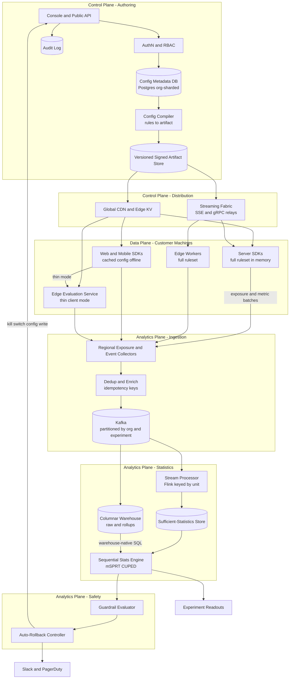

Three things to notice. First, the **auto-rollback controller closes the loop** back into the authoring API: a kill is just another config write that flows through compile and distribution like any human change, so it converges everywhere with the same machinery and is fully audited. Second, the **thin-client edge-evaluation service** is an optional hop for untrusted clients that must not receive the full ruleset; it produces identical assignments to the local evaluator. Third, **ingestion is regional** — collectors sit close to users for residency and latency, and only de-identified, aggregated data crosses regions.

## 2.2 API Contract

Three distinct API surfaces, because they have three distinct security and scale profiles: the **authoring API** (low QPS, strongly consistent, human-driven), the **distribution API** (massive read fan-out, cacheable), and the **ingestion API** (high write volume, idempotent).

### Authoring API (control plane)

All endpoints are `org`-scoped and require RBAC; mutations accept an `Idempotency-Key` and an `If-Match` ETag for optimistic concurrency.

```http
POST /v1/orgs/{org_id}/flags
Content-Type: application/json
Idempotency-Key: 5b1e...

{
  "key": "checkout_one_tap",
  "type": "boolean",
  "environments": ["production"],
  "default_value": false,
  "description": "One-tap checkout flow"
}
```

```http
PUT /v1/orgs/{org_id}/flags/{flag_key}/rules
If-Match: "cfgver-412"
Content-Type: application/json

{
  "rules": [
    { "id": "r1", "if": { "attribute": "email", "op": "ends_with", "value": "@switchboard.io" }, "serve": true },
    { "id": "r2", "if": { "attribute": "country", "op": "in", "value": ["CA"] }, "rollout": { "unit": "user_id", "percent": 1.0, "serve": true } }
  ],
  "default": { "serve": false }
}
```

Promote a flag to an experiment (attaches randomization, exposure logging, metrics, guardrails):

```http
POST /v1/orgs/{org_id}/experiments
Content-Type: application/json

{
  "flag_key": "checkout_one_tap",
  "layer": "checkout_layer",
  "randomization_unit": "user_id",
  "allocation_percent": 5.0,
  "variants": [
    { "name": "control", "weight": 50, "value": false },
    { "name": "one_tap", "weight": 50, "value": true }
  ],
  "primary_metric": "revenue_per_user",
  "guardrails": [
    { "metric": "crash_rate", "direction": "increase_is_bad", "threshold_pct": 1.0, "auto_rollback": true },
    { "metric": "checkout_latency_p95", "direction": "increase_is_bad", "threshold_ms": 200, "auto_rollback": true }
  ],
  "cuped_covariate": "prior_14d_revenue"
}
```

Ramp, rollback, and segment endpoints:

```http
POST   /v1/orgs/{org_id}/experiments/{id}/ramp          { "allocation_percent": 50.0 }
POST   /v1/orgs/{org_id}/experiments/{id}/rollback      { "to_config_version": 417, "reason": "guardrail breach" }
POST   /v1/orgs/{org_id}/segments                        { "key": "high_value", "rules": [ ... ] }
GET    /v1/orgs/{org_id}/config/{environment}/versions   -> list of immutable versions with diffs
POST   /v1/orgs/{org_id}/config/{environment}/publish    { "from_draft": "draft_88" } -> { "config_version": 418 }
```

Every mutation produces a new immutable `config_version` for that `(org, environment)` and an audit record. `rollback` is not a destructive edit; it republishes a prior version as a new version number, preserving a linear, auditable history.

### Distribution API (SDK reads)

Cacheable, served from the CDN edge. The SDK identifies itself by an environment SDK key, never a user.

```http
GET /v1/config/{environment}
Authorization: Bearer {server_sdk_key}
If-None-Match: "cfgver-417"

200 OK
ETag: "cfgver-418"
Cache-Control: public, max-age=5
Content-Encoding: zstd
{ "config_version": 418, "salt_table": {...}, "flags": [...], "experiments": [...], "segments": [...], "signature": "..." }
```

Streaming subscription for fast convergence (server and edge SDKs):

```http
GET /v1/config/{environment}/stream      (Server-Sent Events)
Authorization: Bearer {server_sdk_key}
Last-Event-ID: cfgver-417

event: config_delta
id: cfgver-418
data: { "base": 417, "ops": [ { "op": "set_experiment", "id": "exp_991", ... } ], "signature": "..." }
```

Thin-client (edge-evaluated) mode for untrusted clients that must not receive the ruleset:

```http
POST /v1/initialize
Authorization: Bearer {client_sdk_key}
Content-Type: application/json

{ "unit": { "user_id": "u_123", "device_id": "d_9" }, "attributes": { "country": "CA", "app_version": "8.2.0" }, "since_config_version": 0 }

200 OK
{
  "config_version": 418,
  "evaluations": {
    "checkout_one_tap": { "value": true, "variant": "one_tap", "rule_id": "exp_991", "exposure_token": "..." }
  }
}
```

In thin mode the edge evaluates with the same engine and returns only this user's resolved values plus an opaque `exposure_token`, so the full ruleset and unreleased flags never reach the device.

### Ingestion API (exposures and metrics)

High-volume, idempotent, batched. The SDK posts compressed batches to a regional collector.

```http
POST /v1/ingest/exposures
Authorization: Bearer {client_sdk_key}
Content-Encoding: zstd
Content-Type: application/json

{
  "batch_id": "b_7f3",
  "events": [
    {
      "idempotency_key": "u_123:exp_991:one_tap:418",
      "unit_id": "u_123",
      "experiment_id": "exp_991",
      "variant": "one_tap",
      "config_version": 418,
      "ts": "2026-06-13T15:04:05.123Z",
      "attributes_hash": "..."
    }
  ]
}

202 Accepted
{ "accepted": 1, "deduped": 0 }
```

```http
POST /v1/ingest/events
{
  "events": [
    { "unit_id": "u_123", "metric": "purchase", "value": 42.10, "ts": "2026-06-13T15:09:00Z", "idempotency_key": "evt_abc" }
  ]
}
```

The `idempotency_key` on an exposure is deterministic — `unit:experiment:variant:config_version` — so a client retry or a duplicate flush is collapsed at ingest, not counted twice. Metric events carry a client-generated key for the same reason. Both endpoints are `202 Accepted`: ingestion is asynchronous and at-least-once with idempotent dedup, never synchronous.

## 2.3 Data Model and Schema

The system uses **three storage tiers**, each matched to its workload: a strongly-consistent relational store for authoring, an immutable artifact store for distribution, and a wide-column/columnar tier for exposures and metrics.

### Tier 1 — Authoring metadata (relational, org-sharded Postgres)

Authoring needs transactions, relational integrity, and linearizable current-version semantics, so it is SQL. Every tenant-owned row carries `org_id` and is sharded by it.

```sql
CREATE TABLE flags (
  org_id        UUID NOT NULL,
  flag_key      TEXT NOT NULL,
  type          TEXT NOT NULL CHECK (type IN ('boolean','string','number','json')),
  description    TEXT,
  created_by     UUID NOT NULL,
  created_at     TIMESTAMPTZ NOT NULL DEFAULT now(),
  archived_at    TIMESTAMPTZ,
  PRIMARY KEY (org_id, flag_key)
);

-- A flag's behavior in one environment is a list of ordered rules plus a default.
-- Rules are stored as JSONB but validated by the compiler against a strict schema.
CREATE TABLE flag_rules (
  org_id        UUID NOT NULL,
  flag_key      TEXT NOT NULL,
  environment    TEXT NOT NULL,
  rules          JSONB NOT NULL,          -- ordered; first-match-wins
  default_serve  JSONB NOT NULL,
  updated_at     TIMESTAMPTZ NOT NULL DEFAULT now(),
  PRIMARY KEY (org_id, flag_key, environment),
  FOREIGN KEY (org_id, flag_key) REFERENCES flags (org_id, flag_key)
);

CREATE TABLE segments (
  org_id      UUID NOT NULL,
  segment_key  TEXT NOT NULL,
  rules        JSONB NOT NULL,
  -- Very large membership lists are stored out-of-line and referenced; see big_segments.
  kind         TEXT NOT NULL CHECK (kind IN ('rule_based','list_based')),
  PRIMARY KEY (org_id, segment_key)
);

CREATE TABLE experiments (
  org_id              UUID NOT NULL,
  experiment_id        UUID NOT NULL,
  flag_key             TEXT NOT NULL,
  layer_key            TEXT NOT NULL,
  randomization_unit   TEXT NOT NULL,        -- user_id | device_id | account_id | custom
  salt                 TEXT NOT NULL,         -- stable per experiment; mixed into hash
  allocation_percent   NUMERIC(5,2) NOT NULL, -- fraction of layer traffic admitted (slice width = allocation_percent * 100 buckets)
  layer_range_start    INT NOT NULL DEFAULT 0, -- offset of this experiment's DISJOINT slice within the layer; range_end = layer_range_start + allocation_percent*100. The layer allocator keeps same-layer slices non-overlapping (mutual exclusion).
  status               TEXT NOT NULL CHECK (status IN ('draft','running','ramped','decided','archived','rolled_back')),
  variants             JSONB NOT NULL,        -- name, weight, value
  primary_metric       TEXT,
  guardrails           JSONB NOT NULL DEFAULT '[]',
  cuped_covariate      TEXT,
  sticky_bucketing     BOOLEAN NOT NULL DEFAULT false,
  created_at           TIMESTAMPTZ NOT NULL DEFAULT now(),
  PRIMARY KEY (org_id, experiment_id),
  FOREIGN KEY (org_id, flag_key) REFERENCES flags (org_id, flag_key),
  UNIQUE (org_id, flag_key, layer_key)        -- one live experiment per flag per layer
);

-- A layer partitions bucket space; experiments in the same layer are mutually exclusive.
CREATE TABLE layers (
  org_id        UUID NOT NULL,
  layer_key      TEXT NOT NULL,
  layer_salt     TEXT NOT NULL,
  total_buckets  INT NOT NULL DEFAULT 10000,
  PRIMARY KEY (org_id, layer_key)
);

-- Every publish creates an immutable version row. current_version is advanced
-- under a row lock so two editors and a rollback can never produce ambiguity.
CREATE TABLE config_versions (
  org_id          UUID NOT NULL,
  environment      TEXT NOT NULL,
  config_version   BIGINT NOT NULL,
  artifact_uri     TEXT NOT NULL,           -- object-store key of the compiled, signed artifact
  artifact_sha256  BYTEA NOT NULL,
  published_by     UUID NOT NULL,
  reason           TEXT,
  created_at       TIMESTAMPTZ NOT NULL DEFAULT now(),
  PRIMARY KEY (org_id, environment, config_version)
);

CREATE TABLE config_current (
  org_id           UUID NOT NULL,
  environment       TEXT NOT NULL,
  config_version    BIGINT NOT NULL,
  PRIMARY KEY (org_id, environment),
  FOREIGN KEY (org_id, environment, config_version)
    REFERENCES config_versions (org_id, environment, config_version)
);

CREATE TABLE audit_log (
  org_id      UUID NOT NULL,
  audit_id     UUID NOT NULL,
  actor        UUID,
  action       TEXT NOT NULL,
  resource     TEXT NOT NULL,
  before       JSONB,
  after        JSONB,
  created_at   TIMESTAMPTZ NOT NULL DEFAULT now(),
  PRIMARY KEY (org_id, audit_id)
);
```

Huge list-based segments (millions of user IDs) do not belong inline in JSONB. They live out-of-line and are compiled into a **Bloom filter** plus an exact backing set, so the SDK can answer membership with a tiny in-memory structure:

```sql
CREATE TABLE big_segments (
  org_id          UUID NOT NULL,
  segment_key      TEXT NOT NULL,
  member_count     BIGINT NOT NULL,
  bloom_uri        TEXT NOT NULL,           -- serialized Bloom filter for SDK-side checks
  exact_set_uri    TEXT,                     -- exact membership for server-side confirmation
  updated_at       TIMESTAMPTZ NOT NULL DEFAULT now(),
  PRIMARY KEY (org_id, segment_key)
);
```

### Tier 2 — Distribution artifact (immutable object store + CDN)

The compiler flattens flags, rules, segments, layers, and experiments for one `(org, environment, config_version)` into a single signed artifact. It is immutable and content-addressed by SHA-256, cached at the CDN edge, and never mutated — a "change" is always a new version. The SDK verifies the signature, so a compromised CDN cannot inject a malicious ruleset. This is the only artifact on the evaluation hot path.

### Tier 3 — Exposures and metrics (wide-column + columnar)

Exposures and metric events are append-only, enormous, and queried by experiment and time. We use a wide-column store (Cassandra/Bigtable-class) for the durable serving log and a columnar warehouse (ClickHouse/Druid/BigQuery-class) for analytical rollups. The wide-column schema must avoid hot partitions, so the partition key is chosen deliberately.

```
TABLE exposures
  PARTITION KEY : (org_id, experiment_id, hour_bucket, shard_salt)
  CLUSTERING KEY: (event_ts, unit_id, idempotency_key)
  COLUMNS       : variant, config_version, attributes_hash, sdk_platform, region

TABLE metric_events
  PARTITION KEY : (org_id, metric_key, hour_bucket, shard_salt)
  CLUSTERING KEY: (event_ts, unit_id, idempotency_key)
  COLUMNS       : value, region, sdk_platform

TABLE sufficient_stats          -- the readout's source of truth, tiny and mergeable
  PARTITION KEY : (org_id, experiment_id, environment)
  CLUSTERING KEY: (metric_key, variant, time_bucket)
  COLUMNS       : n, sum_y, sum_y2, sum_x, sum_x2, sum_xy, last_updated
```

`shard_salt` is an integer `0..S-1` derived from `hash(unit_id) mod S`. It is the mechanism that prevents a single blockbuster experiment from melting one partition; [2.4](#24-partitioning-and-hot-partition-avoidance) explains why.

## 2.4 Partitioning and Hot-Partition Avoidance

### Authoring shard key

Shard the relational store by `org_id`. Almost every authoring query is org-scoped (list this org's flags, publish this org's config), so org sharding keeps each query on one shard and isolates a noisy tenant. A whale org with 20,000 flags can be promoted to a dedicated shard without code changes. Trade-off: cross-org analytics cannot run on the OLTP shards — which is fine, because analytics lives in the warehouse fed by the event spine.

### Exposure partition key — the hot-partition problem

The naive partition key for exposures is `experiment_id`. It is catastrophic. A single viral experiment can carry billions of exposures a day; keyed by `experiment_id` alone, every one of those writes lands on the **same partition**, so one node takes the entire write load while the rest of the cluster idles — a textbook hot partition.

The fix is a **composite, salted, time-bucketed key**: `(org_id, experiment_id, hour_bucket, shard_salt)`.

- `hour_bucket` bounds any single partition's lifetime to one hour of one experiment, so old partitions seal and compact instead of growing without limit.
- `shard_salt = hash(unit_id) mod S` (with, say, `S = 64`) **spreads** a single experiment-hour across 64 partitions, so a blockbuster experiment's write load fans out across 64 nodes instead of hammering one. Keying the salt on `unit_id` (not random) means all of a unit's exposures for that experiment-hour land in the *same* shard, which keeps per-unit dedup and per-unit joins cheap.
- Reads for a readout iterate the `S` shards for the relevant experiment and hours — a bounded, parallelizable scan — but in practice the readout reads `sufficient_stats`, not raw exposures, so the raw store is write-optimized and rarely scanned online.

Trade-off: a higher `S` spreads load better but makes full-scan reads fan out wider. We pick `S` per experiment based on expected volume (small experiments use `S = 1`), and we store it on the experiment so readers know how many shards to fan across.

### Sufficient-statistics partitioning

`sufficient_stats` is partitioned by `(org_id, experiment_id, environment)` — one experiment's running aggregates live together because a readout always reads exactly one experiment. These rows are small and updated incrementally by the stream processor, so there is no hot-partition risk; the write rate per partition is "one merge per micro-batch," not "one row per exposure."

### Kafka partitioning

The ingestion bus is partitioned by `hash(org_id, experiment_id)` so all events for an experiment are ordered within a partition and a single experiment's stream-processing state is co-located. To prevent a whale experiment from overwhelming one Kafka partition, the same `unit_id`-derived sub-salt is available as a secondary partitioning dimension; the stream processor re-keys by `unit_id` for the join stage regardless, so ordering within a unit is preserved where it matters. Kafka (a durable, replayable log) is chosen over a classic queue here for reasons developed in [3.4](#34-exposure-logging-at-scale).

---

# Part III: Deep Dives

This part designs the six subsystems the issue enumerates. The two hardest — **deterministic cross-platform bucketing** ([3.1](#31-deterministic-cross-platform-bucketing)) and the **real-time sequential-testing stats engine** ([3.2](#32-real-time-sequential-testing-stats-engine)) — get the deepest treatment, because they are where this class of system is genuinely novel and where the publicly available designs are thinnest. The remaining four — distribution, exposure logging, guardrails/auto-rollback, and targeting — follow.

## 3.1 Deterministic Cross-Platform Bucketing

### The invariant

> For a given experiment, the variant assigned to a unit must be a **pure function** of the unit's identity and the experiment's configuration — computable independently, with no shared state and no network call, producing the **bit-identical** result in every SDK language on every platform.

If iOS Swift and the Go backend disagree about which variant user `u_123` is in, three things break at once: the user sees an inconsistent experience, their behavior is split across both buckets (contaminating both arms), and a Sample Ratio Mismatch may or may not surface depending on volume. This is the single most unforgiving correctness requirement in the system.

### The hash

Assignment is:

```
bucket(unit_id, salt) = be_uint64( SHA256( salt || "." || normalize(unit_id) )[0:8] ) % TOTAL_BUCKETS
```

with `TOTAL_BUCKETS = 10000` for 0.01% granularity. Design choices, each with its trade-off:

- **Crypto hash (SHA-256), not a fast non-crypto hash.** A non-crypto hash (MurmurHash3, xxHash, CityHash) is ~4× faster (~25 ns vs ~100 ns for 64 bytes per the [latency sheet](../cheatsheet/LatencyNumbers.md)), but speed is irrelevant here: 100 ns inside a sub-millisecond local eval is noise. What matters is that **SHA-256 is specified bit-for-bit identically across every language and platform**, whereas non-crypto hashes have subtle cross-implementation divergences (seed handling, tail-byte mixing, signed-vs-unsigned shifts, endianness) that are exactly the kind of one-bit difference that causes cross-platform skew. We trade ~75 ns of CPU we do not need for determinism we cannot live without. (LaunchDarkly historically used SHA-1, Statsig uses SHA-256; the principle is the same — a fully specified crypto hash.)
- **Normalize the unit ID** to UTF-8 bytes, trimmed, with a documented policy on case and Unicode normalization. A unit ID that is UTF-16 on one platform and UTF-8 on another hashes differently. Normalization is part of the canonical spec, not an SDK detail.
- **Take the first 8 bytes as a big-endian unsigned 64-bit integer**, then modulo. Big-endian and unsigned are specified so a language with signed-only integers (older Java, JavaScript's number quirks) cannot silently produce a negative or truncated value. JavaScript SDKs must use `BigInt` or a 53-bit-safe path that is proven equivalent by the conformance suite.
- **Salt mixed into the input, not appended to the output.** `salt || "." || unit_id` means each experiment's salt produces an **independent, uncorrelated** assignment. A unit in treatment for experiment A is statistically independent of its assignment in experiment B (different salts), which is what makes orthogonal experiments truly orthogonal.

### From bucket to variant, and the monotonic-ramp (consistent hashing) property

The `[0, 10000)` bucket is mapped to variants by contiguous ranges derived from variant weights, but the **rollout/allocation** decision uses the *same* bucket so that ramping is monotonic:

```
admit(unit, experiment):
    # One hash per layer decides which (if any) experiment in that layer the unit joins.
    b = bucket(unit_id, layer_salt(experiment.layer))      # layer admission bucket in [0, TOTAL_BUCKETS)
    # Each experiment owns a DISJOINT, contiguous slice [range_start, range_end) of the layer's
    # bucket space (width = allocation_percent * 100). Same-layer mutual exclusion *is* "no two
    # slices overlap"; a flag with its own private layer simply has range_start = 0.
    if not (experiment.layer_range_start <= b < experiment.layer_range_end): return NOT_IN_EXPERIMENT
    vb = bucket(unit_id, experiment.salt)                   # independent variant-level bucket
    return variant_for_range(vb, experiment.variant_ranges)
```

The key property: when Dana ramps allocation from 5% to 50%, her experiment's slice grows by pushing `range_end` further into the layer's *unallocated* space while `range_start` stays put, so the admission test `range_start <= b < range_end` only ever becomes true for *more* buckets — **no unit that was already admitted is ever evicted, and no admitted unit changes variant**. This is the "consistent hashing for stable buckets across rollout changes" the issue asks for: increasing exposure strictly *adds* units to the experiment from the not-yet-admitted pool; it never reshuffles. Decreasing allocation (a partial rollback) symmetrically retracts `range_end`, removing only the highest buckets of the slice. Variant ranges within the admitted set are likewise fixed, so a 50/50 split stays stable as the population grows.

Two subtleties:

- **Re-randomization is a salt change, by design.** If an experimenter wants a genuinely fresh randomization (e.g., to break correlation with a prior aborted run on the same flag), they change the salt, which intentionally reshuffles everyone. The system surfaces this as an explicit, audited action because it moves users.
- **Growing one treatment without disturbing others.** For multi-arm experiments where you want to grow arm B from 10% to 20% without moving arms A or C, allocate variant ranges so that growth pulls only from the unallocated/control range, not from another treatment's range. The alternative — re-slicing all ranges — would reshuffle arms and is rejected.

### Layers: mutual exclusion and orthogonality

Cross-experiment interaction is controlled with **layers** (Google's overlapping-experiment infrastructure; Statsig's layers). A layer owns a slice of bucket space and a `layer_salt`.

- **Same layer = mutually exclusive.** Two experiments in `checkout_layer` partition the layer's admitted buckets between them, so a unit admitted to experiment A in that layer is, by construction, not admitted to experiment B in that layer. Their effects can never tangle because no unit is in both. The cost: experiments in a layer compete for the same traffic budget.
- **Different layers = orthogonal.** Experiments in different layers use different salts, so their assignments are statistically independent and they can both run across 100% of traffic simultaneously without correlating. The cost: a unit can be in many experiments at once, so a true interaction effect between layers (rare, but real) is not controlled — it is assumed negligible and can be checked with an interaction analysis.

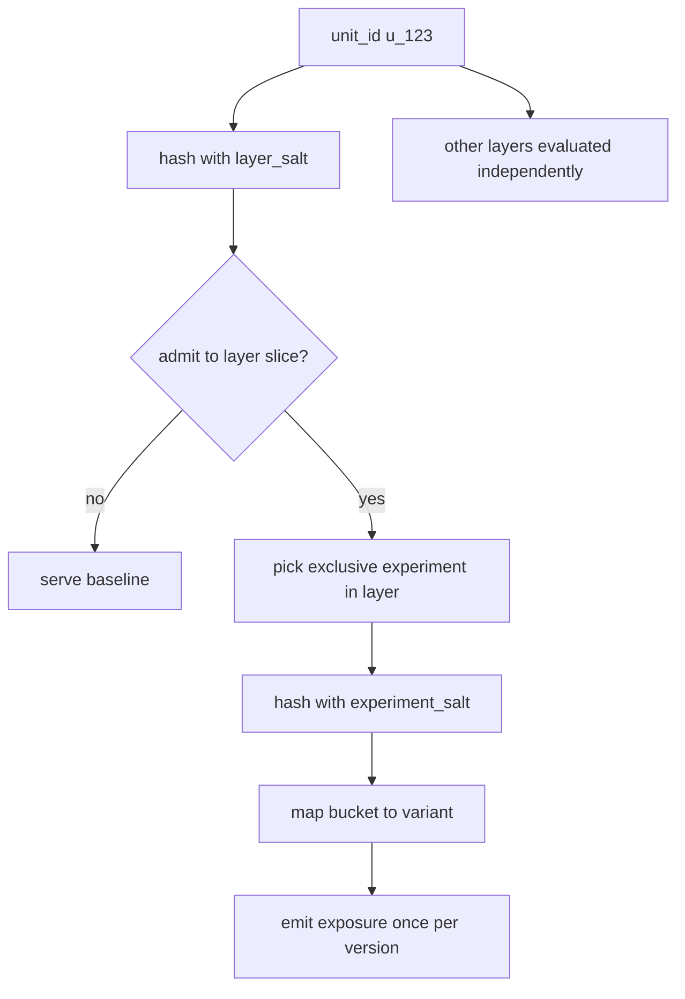

### Sticky bucketing and identity stitching

Pure hashing is stateless and is the default. But two cases need persistence:

- **Identity stitching.** An anonymous user bucketed by `device_id` logs in and becomes `user_id`. If the experiment randomizes on `user_id`, their bucket can change at login, flipping their variant mid-session. The fix is a configurable `randomization_unit` plus an optional **sticky-bucketing store**: the first time a unit is assigned, persist `(experiment_id, unit) -> variant, config_version`; subsequent evaluations read the stored assignment so neither a login nor a later salt change moves them.
- **Permanence across config changes.** Some experiments must guarantee a user never flips even if the experimenter edits ranges. Sticky bucketing provides that at the cost of a lookup (a fast KV read, look-aside cached) and the reintroduction of state — which is why it is opt-in. The trade-off is explicit: stateless hashing gives infinite scale and zero coordination but cannot honor "never move this user no matter what," while sticky bucketing honors permanence at the cost of a stateful read and a write on first exposure.

The sticky store is a look-aside cache over a wide-column table keyed by `(org_id, experiment_id, unit_id)`; a miss computes the hash and writes through, so the common path is a cache hit and the store only grows for sticky experiments.

### Failure mode: cross-platform bucketing skew, and how we prevent it

This is the failure the issue calls out first, and prevention is a process, not just code:

1. **One canonical specification.** The hash, normalization, byte order, integer width, modulo, and salt composition are written once as a language-agnostic spec. SDKs implement the spec, not their own idea of bucketing.
2. **Golden conformance vectors.** A suite of tens of thousands of `(salt, unit_id) -> bucket, variant` cases — including nasty inputs: Unicode unit IDs, emoji, very long IDs, IDs that differ only in case or trailing whitespace, integer-overflow-adjacent hashes — is checked into every SDK's CI. A build fails if any SDK disagrees by a single bucket. This is the same discipline as cross-language serialization conformance tests.
3. **Differential fuzzing.** A fuzzer generates random units and feeds them through all SDKs in parallel, asserting identical output. This catches the long-tail platform quirk the fixed vectors miss.
4. **Runtime detection.** Sample Ratio Mismatch monitoring ([3.2](#32-real-time-sequential-testing-stats-engine)) is the backstop: if a platform-specific skew slips through, the variant split for that platform deviates from intended and SRM fires, flagging the experiment as untrustworthy before anyone ships a wrong decision.

### Why not a central assignment service?

Because it would violate the entire premise. A central "assign(unit, experiment)" service would add a network round trip to evaluation (killing sub-ms and offline), become a global SPOF on the hottest path in the system, and serve hundreds of millions of QPS. Deterministic hashing makes assignment a *computation*, not a *lookup*, so it scales infinitely and runs anywhere. The price is the conformance burden above — a price worth paying.

## 3.2 Real-Time Sequential-Testing Stats Engine

### The problem: peeking inflates false positives

A classic two-sample t-test controls the false-positive rate at α = 5% **only under a fixed sample size inspected exactly once**. Raj inspects the readout ten times a day and stops when it looks good. Under that "optional stopping," the actual Type-I error is not 5% — repeated peeking at a fixed-horizon test drives it toward 20–40%. Auto-rollback makes this worse: it is an automated agent peeking continuously and acting on the first breach. If we used fixed-horizon math, we would ship noise and roll back healthy experiments routinely. The entire stats engine exists to make continuous monitoring **safe**.

### Always-valid inference: mSPRT and confidence sequences

We use **always-valid inference**, which guarantees the error rate at *every* stopping time, not just one pre-committed time.

- **Mixture Sequential Probability Ratio Test (mSPRT).** For each metric we maintain a mixture likelihood ratio `Λ_n` comparing H1 (a non-zero effect, mixed over a prior on the effect size) against H0 (no effect). Under H0 this `Λ_n` is a **non-negative martingale with expectation 1**, so by **Ville's inequality** `P(sup_n Λ_n ≥ 1/α) ≤ α`. We therefore reject H0 (declare a real effect) the first time `Λ_n ≥ 1/α`, and the **always-valid p-value** is the running minimum `p_n = min(p_{n-1}, 1/Λ_n) = 1 / max_{k≤n} Λ_k`, which is a valid p-value at every stopping time — Raj can inspect it as often as he likes and the Type-I error stays bounded by α.
- **Confidence sequences.** Equivalently, we publish a **confidence sequence** — an interval `CI_n` that is *simultaneously* valid across all `n`. Raj can watch it narrow in real time and stop the instant it excludes zero, and the coverage guarantee (e.g., 95%) still holds. This is what makes the live dashboard honest.

The trade-off versus fixed-horizon tests is **statistical efficiency**: always-valid methods are conservative, so for the *same* power they require somewhat more samples than a perfectly-run, look-once fixed test (roughly a `log` factor in the mixture). We accept that cost because the look-once test is a fiction in a product where everyone watches live. We pay maybe 10–30% more sample for the freedom to peek continuously and to auto-rollback — an obviously correct trade for a safety-critical system.

### CUPED: variance reduction to detect faster

Confidence-sequence width shrinks with the metric's variance, so reducing variance directly shortens experiments. **CUPED** (Controlled-experiment Using Pre-Existing Data) uses a pre-experiment covariate `X` (e.g., each user's spend in the prior 14 days) correlated with the outcome `Y`:

```
Y_adjusted = Y - theta * (X - mean(X)),   theta = Cov(X, Y) / Var(X)
```

Because `X` is measured *before* the experiment, it is independent of the treatment, so subtracting it removes predictable variance without biasing the effect estimate. Typical variance reductions of 30–50% translate directly into reaching significance 30–50% sooner — which also means **auto-rollback detects harm sooner**. The covariate is declared on the experiment (`cuped_covariate`) and its sufficient statistics (`sum_x`, `sum_x2`, `sum_xy`) are accumulated alongside the outcome's, so CUPED is computed from the same mergeable aggregates, not a re-scan.

### Real-time metric joins

A readout requires joining two streams on the randomization unit:

- the **exposure** stream (`unit u was in variant v of experiment e at time t, config version c`), and
- the **metric** stream (`unit u did purchase worth 42.10 at time t'`).

The non-obvious rules that keep this correct:

1. **Attribute only post-exposure metric events.** A metric event that happened *before* the unit's first exposure to the experiment cannot have been caused by the treatment and must be excluded, or the estimate is contaminated by pre-existing differences. The join keeps, per `(experiment, unit)`, the timestamp of first exposure and counts only metric events at or after it.
2. **Handle stream skew and late events.** The metric event can arrive before the exposure (different SDK flush cadences) or hours late (offline mobile reconnect). The join is a **stateful, keyed (by unit) streaming join with watermarks**: a unit's exposure timestamp and partial metric aggregates are held in state until a watermark closes the window; late events within a grace period are folded in, and events past it are routed to a correction path that re-aggregates the affected sufficient statistics.
3. **Idempotent, exactly-once-effect aggregation.** Because ingestion is at-least-once, the same exposure or metric can arrive twice. The join dedups on the deterministic `idempotency_key` before folding into sufficient statistics, so duplicates do not inflate counts.

We implement this on a stateful stream processor (Flink-class) keyed by `unit_id`, with the unit's exposure-and-metric state in a local RocksDB-backed state store and watermarks driving window closure. The output is not raw joined rows — it is **incremental updates to sufficient statistics**.

### Sufficient statistics as a commutative monoid

The readout never scans 6 TB of raw events. For each `(experiment, variant, metric, time_bucket)` we keep:

```
n, sum_y, sum_y2,        # outcome: count, sum, sum of squares  -> mean and variance
sum_x, sum_x2, sum_xy    # CUPED covariate: enables theta and adjusted variance
```

These are **associative and commutative** — combining two partial aggregates is element-wise addition — so they form a commutative monoid. That property is doing enormous work:

- **Shards merge trivially.** The 64 exposure shards and N stream-processor tasks each accumulate partial sums; the readout adds them. No coordination, no global sort.
- **Time windows compose.** "Last 24 hours" is the sum of 24 hourly buckets; "since start" is the sum of all of them. Re-windowing is addition, not recomputation.
- **Corrections are reversible.** A late or duplicate event applies a `+delta` or `-delta` to the relevant bucket; the readout reflects it on the next refresh without reprocessing history.
- **The whole working set fits in memory.** Kilobytes per experiment × 10,000 experiments is megabytes, so every live readout is computed from RAM in microseconds.

From these sufficient statistics the engine computes the mean difference, the CUPED-adjusted estimate, the variance, the confidence sequence, and the always-valid p-value — all closed-form arithmetic.

### Ratio metrics, clustering, and SRM

- **Ratio metrics** (revenue per session where both numerator and denominator are random, or any metric whose unit of analysis differs from the unit of randomization) need the **delta method** for variance, not the naive formula, because the denominator's randomness inflates uncertainty. The required cross-moments are added to the sufficient statistics.
- **Clustered/correlated observations.** If the randomization unit is the user but observations are sessions, sessions within a user are correlated; treating them as independent understates variance and inflates false positives. We compute **cluster-robust variance** at the randomization unit, i.e., aggregate to the unit first, then run the test across units. The randomization unit is therefore also the analysis unit — non-negotiable.
- **Sample Ratio Mismatch (SRM).** Before trusting any readout, run a chi-square goodness-of-fit test of observed variant counts against intended weights. A significant SRM (e.g., a 50/50 experiment running 50.8/49.2 at high `n`) means a bucketing or logging bug — exactly the cross-platform skew from [3.1](#31-deterministic-cross-platform-bucketing), or biased exposure sampling from [3.4](#34-exposure-logging-at-scale) — and the readout is flagged **invalid** rather than shown. SRM is the immune system that catches determinism and sampling bugs before they cause a wrong decision.

### Streaming path vs warehouse-native path

Two execution modes share this math:

- **Streaming path** (SDK-logged metrics): the Flink join feeds sufficient statistics continuously; readouts and guardrails update with p95 < 60 s latency. This is what powers live dashboards and auto-rollback.
- **Warehouse-native path** (metrics that live in the customer's Snowflake/BigQuery): we compile the same estimator into SQL that runs *in their warehouse*, reading their revenue tables directly and returning only the sufficient statistics. The customer's raw business data never leaves their warehouse — a privacy and trust win — at the cost of batch (not second-by-second) freshness, so warehouse-native metrics are not used as fast guardrails.

The trade-off is freshness vs reach: the streaming path is real-time but limited to events our SDK sees; the warehouse path reaches the customer's ground-truth tables but is batch. Auto-rollback uses only streaming guardrails; final ship decisions can use either.

### Why not just dashboards on a warehouse?

Because a warehouse dashboard recomputed on every refresh invites exactly the peeking that inflates false positives, and batch latency is too slow for a two-minute auto-rollback. The always-valid math plus incremental sufficient statistics is what separates this from "a chart on top of SQL," and it is the reason the customer is building a platform instead of buying a BI tool.

---

## 3.3 Config Distribution and Convergence

### The job

Turn an authored change into a compiled artifact and get it onto every SDK on earth within seconds, while guaranteeing that an SDK that cannot reach us keeps working. This is a fan-out-from-one-to-millions problem with a hard freshness target and a harder availability target.

### Compile once, distribute immutably

On publish, the **compiler** flattens an org's flags, rules, segments, layers, and experiments for one environment into a single artifact, assigns it a monotonic `config_version`, signs it, and writes it content-addressed to object storage. Compilation does the expensive work once — schema validation, segment Bloom-filter construction, range precomputation — so the SDK's evaluator is a simple, fast interpreter of a normalized structure. Because the artifact is immutable and signed, the CDN can cache it forever and the SDK can verify it was not tampered with in transit.

### Two distribution modes, by freshness need

| Mode | Mechanism | Convergence | Use |
|---|---|---|---|
| Pull | CDN `GET` with `ETag`/`If-None-Match`, polled every N seconds | N + edge propagation | Web/mobile bootstraps, poll-only clients |
| Push (stream) | Long-lived SSE/gRPC stream of deltas from regional relays | One to two RTTs, p99 < 10 s | Server and edge SDKs, fast kill switches |

Push is how a kill switch converges in seconds. When a new version is published, the artifact store notifies regional **streaming relays**, which push a compact **delta** (`base_version -> new_version`, list of changed flags/experiments) down every open subscriber stream. Deltas keep fan-out cheap: a one-flag change is a kilobyte, not a re-download of the whole artifact. An SDK that misses events (reconnects with a stale `Last-Event-ID`) is handed a delta from its last version, or told to re-bootstrap the full artifact if it has fallen too far behind.

We deliberately use a **hub-and-spoke** fan-out (origin -> regional relays -> SDKs), not a peer **gossip** protocol. Gossip shines when there is no central authority and membership churns unpredictably; here we *are* the authority and the artifact is signed, so a tree fan-out from regional relays gives lower and more predictable convergence latency than epidemic gossip, at the cost of the relays being infrastructure we must run and scale. (Gossip remains a fallback idea for SDK-to-SDK propagation inside a customer's private mesh, but it is not the primary path.)

### Caching strategy: write-through edge, look-aside derived reads

This is the explicit write-through-vs-look-aside decision the methodology asks for:

- **Config artifact at the CDN edge: write-through.** On publish, the distribution layer **proactively pushes** (warms) the new artifact and updates Edge KV with `current_version` *before* widely announcing it, so the first SDK to ask after a change gets a cache hit, not an origin miss. Write-through trades slightly slower publishes (we wait for edge warming) for the property that a viral bootstrap spike after a change never stampedes the origin. Given that bootstraps are the dominant bandwidth line, avoiding origin stampede is worth the publish latency.
- **Per-user thin-client evaluations and derived reads: look-aside with short TTL.** Thin-mode `/initialize` responses and console readouts are filled into a cache on miss and expire quickly. Look-aside is simpler and tolerates staleness here because a slightly stale readout is harmless, whereas a stale *config artifact* on the eval path is the thing we must bound.

### Offline cache and reconciliation

Mobile is the hard case. The SDK persists the **last-known-good compiled artifact** to disk. On a cold start with no network, it evaluates from that artifact — fully functional, just possibly stale. On reconnect it sends `If-None-Match: cfgver-X`; the edge returns `304` if unchanged or the new artifact/delta if not. Exposures generated while offline are **buffered on disk with their original timestamp and the `config_version` they were evaluated against**, then flushed on reconnect. Carrying the version is what lets the stats engine attribute each offline exposure to the exact ruleset that produced it, so a mid-experiment targeting change does not silently blend two populations. Buffer is bounded (size and age caps); on overflow we drop oldest with a counted, reported loss rather than growing without limit.

We do **not** use CRDTs for config. CRDTs solve multi-writer conflict-free convergence; config has a single authority (the control plane) and a totally ordered version sequence, so a last-writer-wins version pointer plus immutable artifacts is simpler and strictly correct. CRDTs would add merge complexity for a multi-writer problem we do not have. (CRDTs *are* the right tool if we ever let SDKs locally override config and reconcile peer-to-peer — explicitly out of scope.)

### Convergence bound and the freshness-vs-latency trade-off

Convergence has a floor set by physics (cross-region RTT) and a ceiling set by poll interval. Streaming SDKs converge in one to two RTTs (tens of milliseconds plus relay hops, p99 < 10 s including retries and reconnects); poll-only clients converge within their interval (we default to 60 s, configurable down). The deep trade-off, revisited in [4.2](#42-trade-off-register): **sub-millisecond local evaluation is only possible because the SDK holds a snapshot, and a snapshot is by definition slightly stale.** We cannot have both zero staleness and zero per-eval latency without a round trip. We choose local eval and bound staleness with streaming; the kill switch's fail-safe default ([3.5](#35-guardrails-and-auto-rollback)) covers the window where staleness would otherwise be dangerous.

## 3.4 Exposure Logging at Scale

### Exposure is not evaluation

The foundational move, established in the Discovery Conversation: we log **exposures**, not evaluations. An evaluation is any time the SDK answers a flag check (trillions/day). An exposure is the analytically meaningful event "this unit was assigned to variant `v` of live experiment `e` under config version `c`," and we record it **at most once per `(unit, experiment, variant, config_version)` per dedup window**, not once per render. A user who hits the checkout screen 50 times in a session generates 50 evaluations and **one** exposure. This is what collapses 10 trillion evaluations into ~30 billion exposures.

### Dedup: client Bloom filter plus server idempotency

Deduplication happens in two layers:

- **Client-side**, the SDK keeps an in-memory set (and a **Bloom filter** for memory efficiency over long sessions) of exposure idempotency keys already emitted this session; a repeat evaluation checks the filter and suppresses the duplicate before it ever leaves the device. A Bloom filter's false positives mean we occasionally *suppress* a genuine re-exposure, which is harmless (we wanted at-most-once anyway); it never produces a false exposure.
- **Server-side**, the deterministic `idempotency_key = unit:experiment:variant:config_version` is the dedup key at ingest. Because at-least-once delivery (retries, multi-device flushes, offline re-sends) can resend the same exposure, the dedup stage collapses them. For the bounded recent window we use a fast probabilistic structure (a rotating Bloom/Cuckoo filter) backed by an exact check in the stream-processor state for the cases that matter, trading a little memory for not having to consult a database per event.

### Sampling without bias

We cannot keep raw rows for *every* exposure of *every* flag, but we must not bias experiments. The policy is bimodal:

- **Experiment-bound exposures: keep them all (deduped).** These feed statistical decisions, so we do not sample them below the level that preserves power. Thirty billion deduped exposures/day is affordable; the power of a live experiment is not negotiable.
- **Non-experiment operational flags: sample aggressively and weight up.** A pure ops toggle evaluated a trillion times needs only rough telemetry ("roughly X% saw it"), so we keep a small consistent sample and multiply counts by `1/p`.

When we *do* sample, two rules prevent the bias the issue warns about:

1. **Consistent (hash-based) sampling, never per-event coin flips.** Keep a unit iff `hash(unit_id) mod 1_000_000 < p * 1_000_000`. The same unit is always in or always out of the sample, so we never capture a biased slice of a user's behavior — we capture all-or-nothing per unit, which keeps per-unit variance estimates unbiased. Independent per-event sampling, by contrast, fractures a user's sessions and biases clustered-variance estimates.
2. **Stratify by variant.** Sample within each variant at the same rate so the variant ratio is preserved; otherwise sampling could itself induce a Sample Ratio Mismatch. For diagnostics that need a bounded-size capture (e.g., example payloads), use **reservoir sampling** per variant so each variant contributes a fair, fixed-size sample regardless of volume.

The trade-off, examined in [4.2](#42-trade-off-register): sampling trades statistical power and storage. We resolve it by sampling only where power does not matter (ops flags, diagnostics) and never on the experiment-decision path.

### Aggregation and the pipeline

The path from device to readout:

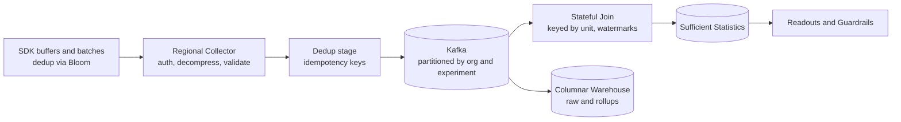

SDKs **batch** exposures (flush every ~10 s or every N events, whichever first) and compress, so we pay per-batch overhead, not per-event. Regional collectors authenticate, decompress, validate, and hand off to dedup, then onto the bus. The bus fans out to (a) the **stateful join** that builds sufficient statistics for live readouts and guardrails and (b) the **columnar warehouse** for raw retention and ad-hoc analysis.

### Kafka, not RabbitMQ

This is the explicit queue choice. We use a **distributed log (Kafka-class)**, not a broker like RabbitMQ, because:

- **Replay.** Sufficient statistics and even the join logic evolve; a durable, offset-addressable log lets us **reprocess history** to recompute a metric or fix a join bug. RabbitMQ deletes on ack — once consumed, the data is gone, which is fatal for an analytics pipeline that must be re-runnable.
- **Ordered partitions and high throughput.** Keying by `(org, experiment)` gives per-experiment ordering and lets a single experiment's state live on one consumer, while the log's sequential-write design sustains the ~1.5M events/sec peak far more cheaply than a broker tracking per-message acks.
- **Multiple independent consumers.** The same log feeds the real-time join, the warehouse loader, and the guardrail aggregator at different offsets without competing for messages.

RabbitMQ's strengths — complex routing, per-message acks, priority queues — match task-dispatch workloads, not a replayable analytics firehose. The trade-off is operational: Kafka requires managing partitions, retention, and consumer offsets, which we accept for replayability and throughput. (For the *control* path — e.g., dispatching a small number of auto-rollback actuation commands — a simpler queue or direct RPC is fine; that path is low-volume and does not need replay.)

## 3.5 Guardrails and Auto-Rollback

### Defining a guardrail

A guardrail is a metric an experiment promises not to harm, declared with a direction and a threshold: `crash_rate, increase_is_bad, +1%`; `checkout_latency_p95, increase_is_bad, +200ms`; `revenue_per_user, decrease_is_bad, -2%`. Guardrails come in two speeds, and we run **both detectors** because they answer different questions:

- **Fast operational signals** (crash rate, error rate, latency) need sub-minute detection. We run lightweight change detectors — **CUSUM** (cumulative sum) and **EWMA** (exponentially weighted moving average) z-scores — on short windows. These trip quickly on a sharp regression. They are not as statistically principled as a sequential test, but for "phones are crashing right now," speed dominates rigor.
- **Statistical guardrails** (revenue, conversion) use the **one-sided sequential test** from [3.2](#32-real-time-sequential-testing-stats-engine), tuned for fast detection: a tighter monitoring cadence and an α chosen so that the *cost of harm* outweighs the *cost of a false rollback*. Because a false rollback merely pauses an experiment (recoverable) while undetected harm bleeds users or money, we intentionally accept a slightly higher false-positive rate for guardrails than for ship decisions.

### The safe kill path

When a guardrail breaches, the **auto-rollback controller** must kill the *offending experiment only*, defensibly, reversibly, and fast:

1. **Decide.** The controller requires the breach to persist across a short confirmation window (hysteresis) so a single bad micro-batch does not trigger a rollback. Confirmation window + sequential confidence = "this is real, not noise."
2. **Actuate through the normal path.** The controller calls the **authoring API** to publish a new config version that sets the experiment's allocation to 0% (or pins everyone to control). It does **not** poke SDKs directly. Routing the kill through compile-and-distribute means it converges everywhere with the same bounded latency as any change, is fully audited (`actor = auto-rollback`, `reason = guardrail crash_rate +180%`), and is trivially reversible by republishing the prior version.
3. **Converge fast.** Because the kill is a config change, streaming SDKs pick it up in seconds; the end-to-end detection-to-global-convergence budget is < 2 minutes for fast guardrails.
4. **Fail safe for the unreachable.** Any SDK that cannot get the new config still serves the experiment's **declared default** (control) when its config is missing or expired, so a partitioned client degrades to baseline rather than continuing the harmful treatment.
5. **Notify, don't ask.** Sam is paged *after* the rollback with the evidence: "rolled back `exp_991`, crash_rate +180% on Android 9 BR, confidence ...". Auto-rollback is armed per experiment; a human can disarm it or set it to "alert-only" for sensitive launches.

### The control loop

Auto-rollback is a closed loop — observe, decide, actuate, verify — like a thermostat with hysteresis:

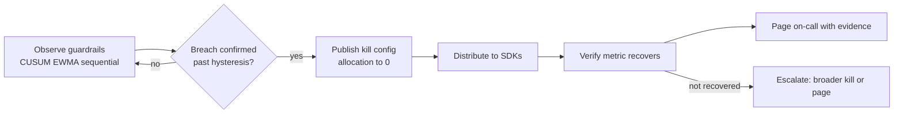

**Verify** matters: after actuation the controller confirms the guardrail recovers. If it does not — because the harm was misattributed, or a broader issue is in play — it escalates rather than declaring victory. **Hysteresis and rate-limiting** prevent flapping: an experiment that was auto-killed is not auto-resumed, and the controller will not thrash a flag on and off.

### The detection-latency vs false-positive trade-off

This is the core tension, analyzed in [4.2](#42-trade-off-register): tighter, faster detection (small windows, looser α, sensitive CUSUM) catches harm sooner but rolls back healthy experiments more often; conservative detection is trustworthy but slow. We resolve it asymmetrically by metric class — fast/loose for operational safety where harm is acute, slow/strict for business metrics where a false rollback is costly and the harm is gradual — and we make the operating point an explicit, audited per-experiment setting rather than a hidden constant.

## 3.6 Targeting Evaluation and the Rule Engine

### Semantics: ordered, first-match-wins

A flag's behavior in an environment is an **ordered list of rules** plus a default. Evaluation walks the list top to bottom and returns the **first** matching rule's outcome; if none match, it returns the default. Each rule is `condition -> outcome`, where an outcome is either a fixed value, a percentage rollout, or "admit to experiment `e`" (which then buckets per [3.1](#31-deterministic-cross-platform-bucketing)). Determinism requires the order to be canonical and identical across SDKs — the compiled artifact fixes it.

### Precedence

Higher-priority mechanisms short-circuit lower ones, in this fixed order:

1. **Individual overrides** ("user `u_7` always sees `true`") — for QA, demos, and incident mitigation.
2. **Holdouts / holdbacks** — units in a long-term holdout are excluded from new experiments to keep the baseline clean.
3. **Targeting rules**, in author order, first-match-wins.
4. **Default** value.

This precedence is part of the spec and the conformance suite, because a platform that evaluated precedence differently across SDKs would reintroduce cross-platform skew.

### Operators and segments

The condition language is intentionally small and total (no Turing-completeness on the eval path):

- Comparisons: `eq`, `neq`, `in`, `not_in`, `gt`/`gte`/`lt`/`lte`.
- Strings: `starts_with`, `ends_with`, `contains`, and **`semver`** comparisons for app-version targeting (`app_version gte 8.2.0`), which must be true semantic-version ordering, not string ordering.
- **Regex is supported but sandboxed** with a length cap and a non-backtracking engine (RE2-class) to prevent ReDoS — a catastrophic-backtracking regex on the eval hot path would be a self-inflicted denial of service on the customer's app.
- **Segment membership** via `in_segment`. Rule-based segments inline their conditions; **large list-based segments** compile to a **Bloom filter** the SDK checks locally (fast, tiny, with rare false positives confirmed server-side in thin mode), because shipping a 10-million-ID set to a phone is impossible.

### SDK-side vs server-side evaluation: the core trade-off

The same rule engine runs in two places, and choosing where is a real decision:

| Dimension | SDK-side (local, full ruleset) | Server-side (edge thin client) |
|---|---|---|
| Latency | Sub-ms, no round trip | One network hop per init |
| Offline | Works fully offline | Requires connectivity |
| Per-eval cost to us | Zero | We own the eval QPS |
| Attribute privacy | Attributes never leave device | Attributes sent to our edge |
| Ruleset secrecy | Full ruleset ships to client — **leaks unreleased flags and targeting logic** | Ruleset stays server-side; only this user's results returned |
| Large segments | Need Bloom filter; exact huge sets impractical | Resolved server-side against exact sets |

The resolution:

- **Trusted environments (backend, edge workers): always SDK-side.** They are not adversarial, ruleset secrecy is moot, and local eval is free and fast.
- **Untrusted clients (web, mobile): default SDK-side, with a thin server-side mode for sensitive cases.** Most mobile apps happily hold the ruleset; but when a flag guards an unannounced feature or uses a confidential segment, the org switches that environment (or that flag) to **thin mode**, where the edge evaluates and returns only resolved values, keeping the ruleset and unreleased plans off the device. The cost is a network hop at init and exposing attributes to our edge — acceptable for the cases that need secrecy.

Both modes run the **identical compiled rule engine** and the identical bucketing, so a unit gets the same assignment whether evaluated on-device or at the edge. That equivalence is itself covered by the conformance vectors, closing the loop with [3.1](#31-deterministic-cross-platform-bucketing): there is exactly one evaluator, compiled once, proven identical everywhere it runs.

---

# Part IV: Bottlenecks, Trade-offs, and Reliability

## 4.1 Where It Breaks at 10x and 100x

At today's targets (10T evals/day, 30B exposures/day, 10K concurrent experiments) the design holds. Push each component to 10x and 100x and the failure modes are specific:

| Component | 10x stress | 100x failure mode | Mitigation |
|---|---|---|---|
| Config distribution (CDN egress) | 1.2 PB/day egress; bootstraps dominate | Origin stampede after a mass change; cache-miss thundering herd | Write-through edge warming, delta-only updates, request coalescing, `304` revalidation, per-org config size budgets and segment Bloom compression |
| Streaming relays | Millions of open SSE/gRPC streams | File-descriptor and memory exhaustion; reconnect storms after a relay restart | Dedicated relay fleet, connection sharding, jittered reconnect, fall back to poll on relay loss, backpressure on delta fan-out |
| Exposure ingestion | 15M events/sec peak | Kafka partition hot-spotting on a whale experiment; collector CPU on decompress | `unit_id` sub-salting across partitions, autoscaled stateless collectors, shed non-experiment telemetry first under load |
| Stateful join (Flink) | State per active unit explodes | Unbounded state from never-closing windows; checkpoint stalls | Watermark-driven window closure, RocksDB state with TTL, key-group rescaling, spill cold units to disk |
| Sufficient-stats store | 100K concurrent experiments | Working set no longer fits memory; readout latency rises | Tiered hot/warm aggregates, per-experiment shard fan-in, cap live experiments per org with queueing |
| Auto-rollback controller | Many simultaneous breaches | Correlated mass rollback (a platform-wide regression trips every guardrail) | Global rate-limit on auto-kills, blast-radius caps, require human confirm above a threshold of simultaneous rollbacks |
| Authoring DB | Heavy publish rate on one org | Hot `config_current` row lock serializes publishes; version contention | Per-org single-writer publish queue, optimistic `If-Match`, promote whale orgs to dedicated shards |
| Sticky-bucketing store | Many sticky experiments | KV read on every eval for sticky flags; write storms on first exposure | Look-aside cache, restrict sticky to experiments that truly need it, batch first-exposure writes |
| Warehouse-native queries | Large customer warehouses | Expensive scans on every readout refresh | Incremental materialized aggregates, scheduled refresh cadence, push only sufficient statistics back |

The reassuring asymmetry: the **evaluation** path — the astronomically large one — does **not** appear in this table, because it scales on the customer's machines. We only have to scale distribution, ingestion, and compute, which are millions-to-billions per day, not trillions.

## 4.2 Trade-off Register

Every major decision and what it costs. The four trade-offs the brief calls out are the first four rows.

| Decision | Benefit | Cost / Risk |
|---|---|---|
| **Sub-ms local eval via distributed snapshot** | No round trip, offline, zero per-eval server cost | **Config freshness is bounded, not instant** — a change takes seconds to converge; mitigated by streaming + fail-safe defaults |
| **Exposure dedup + selective sampling** | Trillions of evals become billions of unbiased exposures; affordable storage | **Sampling can bias power if misapplied** — mitigated by never sampling experiment-bound exposures and using consistent, stratified sampling only on telemetry |
| **Always-valid sequential testing** | Continuous peeking and auto-rollback are statistically safe | **Peeking-safety costs detection latency / sample** — always-valid methods need ~10–30% more sample than a perfect look-once test for the same power |
| **Local snapshot eval (AP) over strong global read** | Eval survives our outages; lowest latency | **Latency-vs-consistency (PACELC):** SDKs may serve slightly stale config under partition; bounded and made safe by fail-static defaults |
| Deterministic hashing over central assignment | Infinite scale, offline, no SPOF on the hot path | Cross-platform conformance burden; re-randomization moves users |
| Layers for mutual exclusion | Controls cross-experiment interaction | Experiments in a layer share a traffic budget; cross-layer interactions assumed negligible |
| Kafka log over RabbitMQ | Replay, ordered partitions, multi-consumer at firehose scale | Operational overhead of partitions, retention, offsets |
| Write-through edge cache for config | No origin stampede on the dominant bandwidth path | Slightly slower publishes while the edge warms |
| Sufficient statistics over raw scans | Microsecond readouts, trivial shard merges | Each new metric/covariate must be expressible as mergeable moments |
| Auto-rollback through normal distribution path | Audited, reversible, converges like any change | Adds detection-to-convergence latency vs a hypothetical direct poke (which we reject as unsafe) |
| SDK-side eval default, thin server mode option | Speed and privacy by default | Ruleset secrecy requires opting into a network hop for sensitive flags |

## 4.3 CAP and PACELC Posture

The system is deliberately **not** uniform in its consistency choices; each plane sits where its workload demands.

- **Authoring plane: CP.** The `config_current` pointer for an `(org, environment)` is **linearizable** — two concurrent editors and an auto-rollback must agree on exactly one current version, resolved by optimistic concurrency (`If-Match`) under a per-org publish lock. Under a partition that severs a shard's writer, authoring for that org **rejects writes** (fails closed) rather than forking history. We choose consistency over availability for authoring because a forked config history is unrecoverable; a brief inability to publish is not. By **PACELC**, this is **PC/EC**: consistent under partition, and even in normal operation we favor consistency (a publish waits for durable commit and edge warm) over raw write latency.

- **Distribution + evaluation plane: AP, fail-static.** SDKs must keep evaluating during any partition, so the eval path chooses **availability**: serve the last-known-good (possibly stale) artifact, never error. By **PACELC** this is **PA/EL** — under partition prefer availability, and *else* prefer low latency over consistency, which is exactly why eval is a local snapshot read rather than a consistent remote read. The staleness this admits is bounded by convergence and rendered safe by the fail-safe default (serve control when config is missing/expired). This is the single most important reliability property in the system: **evaluation availability is decoupled from control-plane availability.**

- **Ingestion + analytics plane: AP, eventually consistent.** Exposure and metric ingestion accept at-least-once delivery and converge to correct counts via idempotent dedup and reversible sufficient-statistic corrections. A readout may lag by seconds and "catch up"; we trade immediate consistency for the ability to absorb a 1.5M/sec firehose without backpressuring the customer's app. Auto-rollback tolerates this because it confirms across a hysteresis window rather than reacting to a single possibly-incomplete batch.

The unifying principle: **be strict where ambiguity is unrecoverable (authoring), and available where downtime is unacceptable (evaluation).**

## 4.4 Single Points of Failure

| SPOF candidate | Mitigation |
|---|---|
| Authoring database (writer) | Multi-AZ synchronous replica with automated failover; WAL archiving for PITR; authoring degrades to read-only during failover while **eval is unaffected** (it reads the artifact/CDN, not the DB) |
| Config compiler | Stateless and horizontally replicated; a compile failure blocks *new* publishes but never affects already-distributed versions; last good artifact keeps serving |
| Artifact store | Geo-replicated, content-addressed object storage; CDN holds cached copies; SDKs hold local copies — three layers deep before eval is affected |
| CDN | Multi-CDN or CDN + origin shielding; SDKs fail-static to their on-disk artifact if all of it is unreachable |
| Streaming relays | Replicated, regionally redundant; SDKs fall back to polling the CDN if streams drop, degrading convergence latency but not correctness |
| Kafka ingestion bus | Replicated partitions (RF 3), multi-AZ; collectors buffer to local disk and replay if the bus is briefly unavailable; SDKs retain their on-device buffer |
| Stateful join | Checkpointed state with replicated snapshots; on task loss, restore from checkpoint and replay from the Kafka offset — replay is *why* we chose a log |
| Auto-rollback controller | Active-standby with leader election; if the controller is down, fast operational guardrails still trip via an independent circuit-breaker path, and humans are paged |
| Sufficient-stats store | Rebuildable from Kafka by replay; treated as a derived cache, not a system of record |
| Edge KV (current_version) | Multi-region replicated; on miss, SDK falls back to the versioned artifact it already holds |

The recurring theme: **no single component sits on the evaluation hot path**, and every analytics component is **rebuildable by replaying the Kafka log**, so failures degrade freshness, not correctness.

## 4.5 Failure Playbooks

### An availability zone fails

Authoring DB fails over to its in-region multi-AZ replica (RPO ~0 with synchronous replication, RTO minutes). Stateless services (collectors, relays, compiler, controller) lose one AZ's capacity and autoscale in the survivors. Kafka keeps quorum with RF 3 across AZs. **Evaluation is entirely unaffected** because it does not touch in-region services — SDKs read the CDN and their local snapshot. Customer-visible impact: possibly a brief authoring pause and slightly delayed readouts. No experiment is corrupted.

### An entire region fails

- **Evaluation:** unaffected globally. SDKs in other regions read their regional CDN/artifact; SDKs that homed on the dead region's CDN fail over via the CDN's anycast to another POP, and worst case fail-static to their on-disk artifact. **Users keep getting consistent variants.**
- **Authoring:** orgs homed in the dead region fail over to a warm standby region. The artifact store is geo-replicated, so the last good config is already present elsewhere. RTO target < 30 min for authoring; eval never went down so there is no eval RTO.
- **Ingestion/analytics:** other regions' collectors and Kafka continue. The dead region's in-flight buffers are recovered when it returns or are accepted as a bounded, reported gap; sufficient statistics are reversible, so a late backfill simply corrects the readouts. Residency: EU traffic fails over only to EU regions to preserve data residency.

### Control plane fully down (worst case)

Authoring, compiler, distribution origin all unavailable. **Evaluation continues** from cached artifacts — this is the scenario the entire fail-static design exists for. No new flags publish and no auto-rollback can actuate (a real risk: if a harmful experiment is live and the control plane is down, we cannot kill it via config). Mitigation: the SDK honors a **client-side kill signal** piggybacked on the CDN artifact's short-TTL metadata and, failing everything, the per-experiment fail-safe default; operationally, the control plane is the highest-priority restore target precisely because auto-rollback depends on it.

### Bucketing skew detected in production

SRM monitoring flags an experiment whose variant split deviates from intended. Playbook: auto-flag the readout **invalid** (do not let anyone ship on it), diff the suspect platform's SDK against the conformance vectors, identify the divergent input class, patch and re-release the SDK, and — because exposures carry the SDK platform and version — **recompute** results excluding the affected platform-versions from the Kafka log. Replayability turns a correctness incident into a recomputation, not a data loss.

### Exposure flood / ingestion overload

A misbehaving SDK or a viral moment pushes ingestion past capacity. Collectors **shed load in priority order**: drop non-experiment telemetry first (it was sampled anyway), then apply backpressure that the SDK absorbs in its bounded on-device buffer, never blocking the customer's app. Experiment-bound exposures are protected to the last because they carry statistical power. All shedding is counted and surfaced so analysis knows whether power was affected.

### Retry storm

Client retries, collector retries, and consumer retries can amplify. Defenses: exponential backoff with jitter everywhere, deterministic idempotency keys so retried exposures dedup instead of duplicating, Kafka consumer max-poll limits, and circuit breakers between tiers. Because every write on the analytics path is idempotent and every config read is cacheable, a retry storm degrades latency, not correctness.

---

## Architectural Diagrams

This section collects the system's diagrams in one place: the full component architecture, the convergence and evaluation sequences, the metrics pipeline as a CQRS read model, the auto-rollback loop, the bucketing flow, and the data-model ERD.

### A. Component Architecture

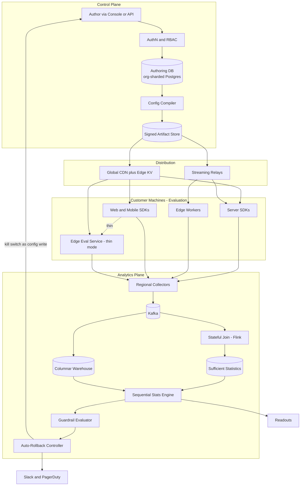

### B. Config Authoring and Distribution Convergence

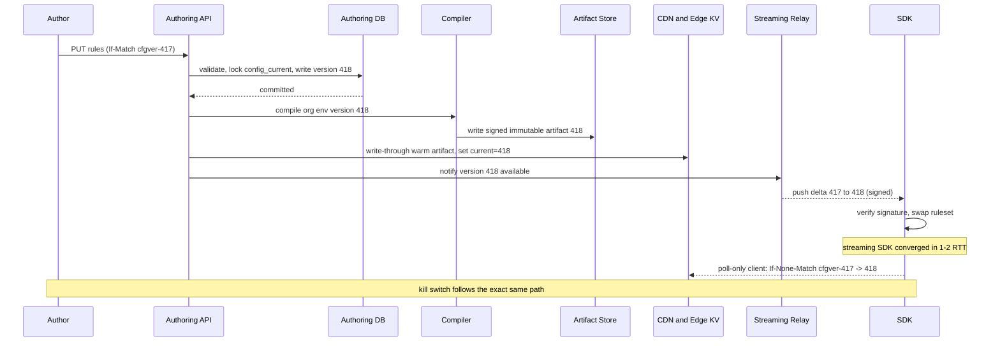

### C. SDK Evaluation and Exposure Emission

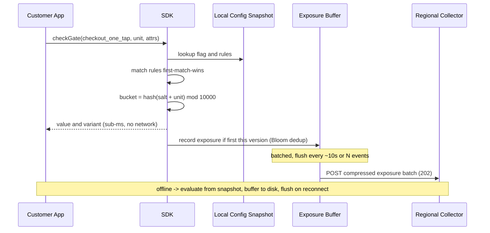

### D. Exposure Logging and Metrics Pipeline (CQRS)

The write model (exposures and metric events) is separated from the read model (sufficient statistics and readouts); the Kafka log is the spine, and the read model is a rebuildable projection.

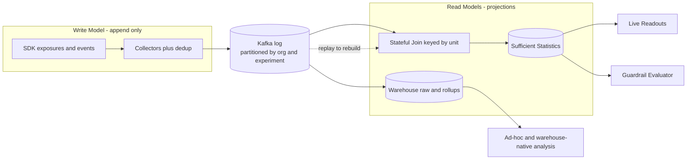

### E. Auto-Rollback Control Loop

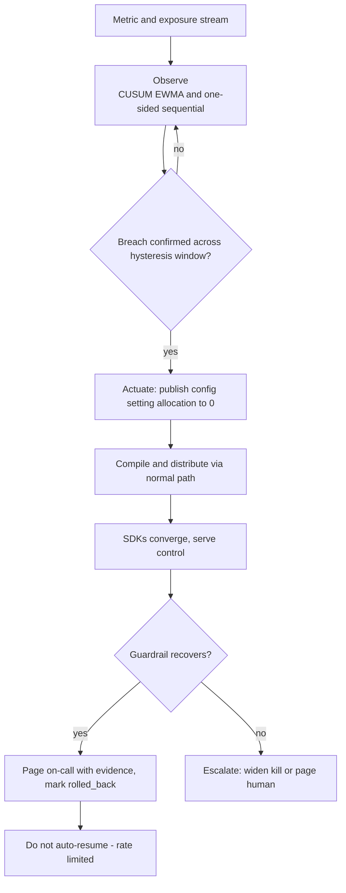

### F. Deterministic Bucketing and Layers

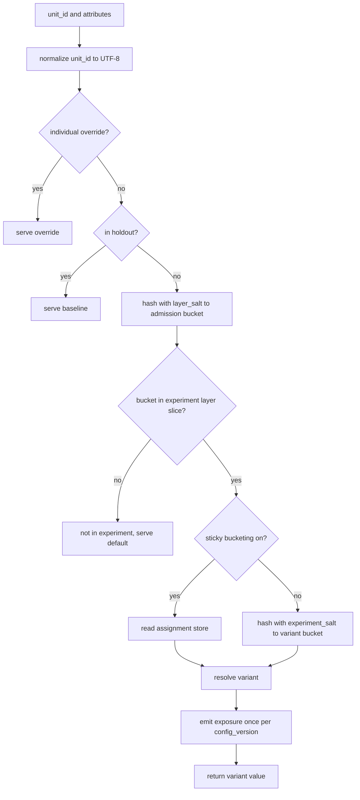

### G. Data Model ERD

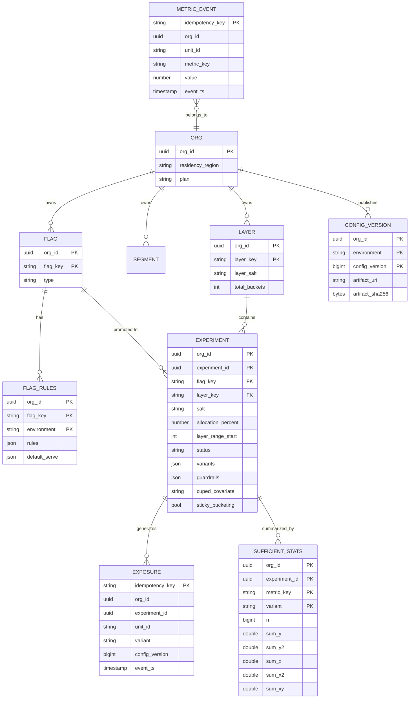

---

## Closing Assessment

The hard part of a feature-flag and experimentation control plane is not storing booleans or drawing a dashboard. It is three things that fight each other, and this design resolves each with an explicit trade-off rather than a wish:

1. **Determinism without coordination.** The same user must bucket identically on an edge worker, a backend, and an offline phone, with no shared state and no round trip. We buy that with a single canonical hash, salt-mixed independent assignment, monotonic consistent ramps, layer-based interaction control, and a golden conformance suite that makes cross-platform skew a build failure instead of a contaminated experiment.

2. **Truth from a firehose we refuse to fully record.** We cannot log 10 trillion evaluations, so we log ~30 billion deduplicated exposures, sample only where power does not matter, and reconstruct results from small, mergeable sufficient statistics. The statistics are *always-valid* — mSPRT and confidence sequences with CUPED — so the continuous peeking that every real product does is safe rather than self-deluding, and SRM monitoring is the immune system that catches determinism and sampling bugs before anyone ships on them.

3. **Safety that does not depend on us being up.** Evaluation is fail-static: SDKs serve last-known-good config and per-experiment defaults through any partition, so eval availability is decoupled from control-plane availability. Auto-rollback is a closed control loop that kills a harmful experiment through the same audited, reversible distribution path everything else uses, fast enough to bound blast radius and conservative enough not to flap.

The architecture is intentionally non-uniform in its consistency: **CP where ambiguity is unrecoverable** (authoring's linearizable current version) and **AP, fail-static where downtime is unacceptable** (evaluation and distribution). Everything on the analytics path is rebuildable by replaying the Kafka log, which turns most "data loss" incidents into recomputations. Push the system to 100x and the evaluation path — the trillions — never appears in the bottleneck table, because it runs on the customer's machines; only distribution, ingestion, and compute scale with us, and those are millions-to-billions per day, not trillions. That asymmetry, designed in from the first forking question, is what makes a global experimentation control plane tractable at all.
