# Multi-Tenant Vector Database with Tenant Isolation — System Design

A multi-tenant vector database in the class of Pinecone, Turbopuffer, and Weaviate-cloud: a managed service where thousands of independent customers (tenants) store billions of embedding vectors, run approximate-nearest-neighbor (ANN) search with metadata filters and hybrid (sparse + dense) ranking, and expect strong per-tenant isolation — both of their *data* and of their *performance*. The hard parts are well known to anyone who has run one of these in production: ANN indexes (HNSW, IVF, DiskANN) are not naturally multi-tenant, so fair scheduling and noisy-neighbor control are genuinely difficult; *filtered* vector search has a notorious performance cliff at low selectivity; and re-embedding a tenant to a new model or dimensionality is effectively a full index rebuild that we must do **live**, per tenant, with zero downtime and no lost writes. This document is the complete, consolidated design: it opens with a discovery conversation that establishes the scope, then works through requirements, architecture, deep dives on the hardest subsystems, and a frank treatment of where it breaks and how it fails.

---

## Discovery Conversation

> The following is a (lightly condensed) transcript of the scoping conversation that produced this design. It is included because most of the *consequential* decisions in a system like this are made here — in the negotiation over what we are and are not building — not in the diagrams. The client speaks as a product/engineering lead; the architect's job is to translate fuzzy product language into forks in the design and to say "no" precisely.

**Architect:** Before any diagrams, I want to understand who actually uses this and who pays for it. Paint me a picture of the people on the other end.

**Client:** We sell a managed vector database. Our customers are companies building AI products — RAG (retrieval-augmented generation) apps, semantic search, recommendation, agent memory. They don't want to run an ANN index cluster themselves. Three people matter most to us. First, **Priya**, a senior engineer at a mid-size SaaS company. She's building a support assistant: when an end user asks a question, she embeds it, queries us for the 10 most similar support documents *belonging to that end user's own organization*, filtered by language and recency, and feeds the results to an LLM. She cares about p99 latency, about her data never bleeding into someone else's results, and she occasionally re-embeds her whole corpus when a better embedding model ships.

**Architect:** So Priya is herself multi-tenant — she has her own customers inside her namespace.

**Client:** Exactly, and that's important. Her "tenant_id" filter is the single most common predicate in her queries. Second persona: **Sam**, our own platform SRE. Sam owns the fleet. Sam's nightmare is one customer's traffic spike or one pathological query degrading p99 for everyone else. Sam cares about capacity, cost per million vectors, fair scheduling, and being able to sleep through a noisy-neighbor event. Third: **Dana**, our largest customer — a "whale." Dana runs a consumer search product: a couple billion vectors, 50,000 queries per second at peak, and they periodically re-embed everything when their ML team ships a new model. Dana is fantastic revenue and a constant operational threat.

**Architect:** Dana is the persona that breaks naive designs, so let's keep Dana in the room the whole time. Walk me through Priya's day-in-the-life request by request — I want the actual sequence.

**Client:** An end user types a question into Priya's support widget. Priya's backend calls her embedding provider to turn the question into a 1024-dimensional vector. She then calls us: "in namespace `priya-support`, find the top 10 vectors where `org_id = 'acme'` and `lang = 'en'` and `updated_at > 30 days ago`, nearest to this query vector." She wants that back in tens of milliseconds. Separately, all day long, her ingestion pipeline is upserting new and edited documents — she expects an edit to be searchable within a few seconds, not minutes. Once a quarter, her ML team adopts a new embedding model, and she needs to re-embed and reindex her entire corpus without taking her search down and without dropping any of the writes still flowing in during the migration.

**Architect:** Good — that one walk-through already names three of our hardest subsystems: filtered search, write freshness, and live reindex. Before we leave the personas, give me the other two days too — Sam's and Dana's — because they stress different parts of the system.

**Client:** **Sam's day** is quiet until it isn't. Sam watches fleet dashboards: p99 per tier, per-tenant QPS, cache hit rates, build-pool backlog. A normal day is capacity planning and approving reindex windows. A bad day starts when a single tenant 10×'s their traffic in ninety seconds — a viral moment or a runaway backfill — and Sam's pager goes off because *other* tenants' p99 just doubled. Sam's recurring question to us is: "When that happens, can I prove the blast radius was contained to the offender, and can the system shed the offender automatically so I don't have to hand-tune anything at 3 a.m.?" Sam also runs the quarterly game-day: kill an AZ and watch whether latency degrades gracefully or falls off a cliff.

**Architect:** So Sam's requirements are *automatic* noisy-neighbor containment, per-tenant attributable telemetry, and graceful AZ failure — that maps straight to admission control, per-tenant metrics, and multi-AZ replication. **Dana's day?**

**Client:** **Dana's day** is high-volume and spiky. Dana's consumer search product runs a steady tens-of-thousands of QPS that triples during their users' peak hours, every query filtered by category and region, every result needed in well under 100 ms or their conversion drops. A few times a quarter Dana's ML team ships a new embedding model, and Dana kicks off a re-embed of two-to-three billion vectors — while still serving live traffic at full volume. Dana's worst memory from their previous vendor is a reindex that silently dropped a day of writes during the cutover, and a noisy-neighbor incident where *Dana* was the victim of someone else's spike. Dana will pay for a dedicated, contractual-SLO tier to never feel either pain again.

**Architect:** Dana is exactly why we'll make whale isolation physical (dedicated cells), make reindex provably lossless (dual-write-before-watermark with verification), and sell a contractual tier. Three personas, three different stress vectors — filtered freshness for Priya, fair scheduling for Sam, scale-and-migration safety for Dana. Now the question I ask on every engagement: **who is the actual paying customer, and what is the rough scale anchor?** I need an order of magnitude to design against, because the design forks hard at different scales.

**Client:** The paying customer is the *company* — Priya's and Dana's employers — on a usage-based plan (vectors stored, queries served, plus premium tiers for isolation and latency SLOs). Plan for roughly **5,000 paying organizations** spread across about **10,000 logical namespaces**, and a fleet total on the order of **50 billion vectors**. The distribution is brutally power-law: the median namespace is a quarter-million vectors, but the top ten "whale" namespaces are one to three billion vectors each. Aggregate query traffic is a few hundred thousand QPS, with whales contributing the spikes.

**Architect:** That power-law is the single most design-shaping fact you've said. A uniform design that's right for the median namespace is catastrophically wrong for the whales, and vice-versa. We'll explicitly classify namespaces by size and treat them differently. Now let me ask the three clarifying questions I consider mandatory before committing to an architecture. **Question one: is this workload read-heavy or write-heavy, and how fresh must writes be when read back?** Those are two questions, but they fork the storage engine together.

**Client:** Steady state is read-heavy — easily ten to fifty reads per write. But ingestion is bursty: a customer onboarding or a re-embed can push one to two million upserts per second for hours. And as I said, freshness matters: seconds, not minutes. Priya's users edit a doc and expect the next search to reflect it.

**Architect:** That answer forks us decisively toward a **log-structured (LSM-style) storage engine with compute and storage separated**, not an in-place-mutable index. Here's the reasoning in plain terms: ANN graph indexes are extremely expensive to update in place — inserting one vector into an HNSW graph touches many existing nodes, and doing that under a read-heavy load fights the readers for the same memory and locks. So instead we make writes cheap and append-only: every write goes to a durable write-ahead log, and is immediately visible through a small in-memory "fresh layer" that queries merge in. Meanwhile, a background process rolls the log up into large immutable index segments. Read-heavy means we can afford to spend effort building excellent immutable indexes that serve millions of reads; bursty writes mean the write path must be a cheap log append that never blocks on index construction; "fresh in seconds" means the fresh layer tails the log continuously. If you'd said writes could be stale for ten minutes, I'd have built something simpler. If you'd said write-heavy and *exact* freshness, I'd have warned you the cost triples. So this one answer sets the spine of the system.

**Client:** That tracks. What's question two?

**Architect:** **What recall do you actually need, and is it uniform across customers or tiered?** Recall is the fraction of the true nearest neighbors an approximate search returns. Chasing 0.99 recall everywhere is enormously more expensive than 0.90, and most customers can't tell the difference in their product.

**Client:** It's tiered. Interactive products like Priya's support bot and Dana's search need high recall — call it 0.95 on the top 10 — at tens of milliseconds. But we have a huge volume of "economy" workloads — batch enrichment, analytics, lower-stakes recommendation — that are fine at 0.90 recall and a couple hundred milliseconds, and those customers are very price-sensitive.

**Architect:** Tiered recall is a gift, because it lets us escape the **recall-versus-latency-versus-memory-cost triangle** per-customer instead of globally. The interactive tier we keep hot — vectors and graph resident in RAM or fast NVMe, full-precision reranking — to hit 0.95 at low latency. The economy tier we push down the storage hierarchy — heavily compressed vectors via product quantization, served largely from SSD, fewer reranks — to hit 0.90 cheaply. Concretely this forks us into **tiered storage with per-namespace index configuration**: the same engine, parameterized differently per tenant. If recall had to be uniform and high, I'd have quoted you a multiple of the hardware budget. **Question three: is performance isolation a contractual SLO, or best-effort?** This decides whether we can statistically multiplex everyone together or must build hard walls.

**Client:** For paid tiers it's contractual. A customer paying for the interactive tier has a p99 latency SLO, and "another customer got busy" is not an acceptable excuse. Free and economy tiers can be best-effort within reason.

**Architect:** Then we cannot rely on a single shared pool and hope. Contractual isolation under a power-law workload forks us to a **cellular architecture with explicit admission control and fair scheduling**: tenants are assigned to capacity "cells," whales get their own dedicated cells, and within a shared cell we enforce per-tenant quotas with token buckets, weighted-fair queuing, and per-tenant concurrency limits and cache reservations. Best-effort tiers can over-subscribe a cell for utilization; contractual tiers get reserved capacity. The trade-off I'm signing you up for, explicitly: **strict isolation lowers average utilization** — reserved capacity sits idle when its owner is quiet — so isolation literally costs money. We'll claw some back by letting best-effort work scavenge idle reserved capacity, but the headline trade-off stands.

**Client:** Understood, and accepted for paid tiers. There's a fourth thing I want to probe: the model churn. How disruptive is re-embedding really?

**Architect:** This is the crux subsystem, so let me probe it hard. When your ML team ships a new embedding model, two things can change: the *semantics* of the vector space (so old and new vectors aren't comparable — you can't mix them in one index) and sometimes the *dimensionality* (1024 to 1536, say — physically different-width data). Either way it's a full rebuild of that namespace's index. How often, and can it ever be offline?

**Client:** Once or twice a year per active customer, staggered. And no — never offline. Dana re-embedding two billion vectors cannot take search down for the hours that rebuild takes.

**Architect:** Then **live reindex is a first-class, designed subsystem**, not an operational script. The shape, in plain terms: we stand up a *shadow* index for the new model alongside the live one; we start **dual-writing** every new upsert to both old and new *before* we freeze a point to build from, so there's an overlap and never a gap where writes could be lost; we re-embed and build the shadow from the frozen snapshot on separate build capacity so it doesn't steal serving resources; we reconcile the writes that arrived during the build; we run shadow queries to verify recall before committing; then we **atomically flip** the namespace's manifest from old index to new in a single pointer swap, with the old index kept warm so we can flip back instantly if recall regresses. The single most important correctness rule — the one that, done wrong, silently loses customer data — is **open dual-write before pinning the build watermark**, so the windows overlap. We'll spend real design effort there.

**Client:** That's exactly the failure I'm afraid of. Before data boundaries — two of my teams have asked about hybrid search and about backups, so probe those quickly.

**Architect:** Both are real product forks. **Hybrid search** first: pure semantic (dense) search misses exact-token matches — a part number, an error code, a person's name — where old-fashioned keyword search shines, and vice versa. Some of your tenants will want both. The design answer is to run a dense ANN branch and a sparse lexical branch (BM25, or a learned-sparse model like SPLADE) in parallel and *fuse* the two ranked lists. I default fusion to **Reciprocal Rank Fusion**, which combines by rank position rather than raw score, so we avoid the fragile problem of normalizing cosine similarities against keyword scores. The cost is a second index — more storage and write work — so I'd make hybrid **opt-in per namespace** rather than charging everyone for it. Does that match demand?

**Client:** It does — maybe a third of tenants want hybrid, the rest are pure semantic. Opt-in is right. And backups?

**Architect:** **Snapshots** are cheap here because of how we store data. Since the searchable data is immutable segments in object storage, a snapshot is just a *pinned pointer*: a manifest version plus the set of segments it names plus a write-log watermark. No data copy, copy-on-write, near-instant — and restore rehydrates from those immutable segments and replays the log to the watermark. That gives you point-in-time restore and pre-migration safety snapshots almost for free. The one subtlety is a *whale* spanning many shards: a globally consistent snapshot needs a light coordination barrier to align all shards to one watermark, which is heavier than a single-shard snapshot but still copy-on-write. Disaster recovery rides on the same mechanism — async-replicate those segments and the log to a second region for tenants who opt in.

**Client:** Good — instant snapshots are a selling point. Now data boundaries — how hard is the wall between tenants?

**Architect:** Two walls, and we should be precise about both. The **data** wall: every vector, segment, and cache entry is scoped by `namespace_id`; there are no cross-namespace edges in any shared graph; each tenant's data at rest is encrypted with its own envelope key so a bug that crosses namespaces still can't read plaintext; and compliance-sensitive tenants get physically dedicated cells with separate storage prefixes. The **performance** wall is the QoS machinery we just discussed. Are there tenants who need the physical wall — regulated data, contractual single-tenancy?

**Client:** Yes, some enterprise customers require their data to be physically segregated and to stay in a specific region — EU data stays in the EU, full stop.

**Architect:** Then **data residency is a namespace-pinning constraint**, not an afterthought. Each namespace is pinned to a home region; its source-of-truth storage, logs, and serving replicas all live there; and — this is a trade-off I want explicit — a region-pinned namespace **cannot transparently fail over to another region**, because that would move regulated data across the boundary. So for those tenants, a full-region outage means a within-region recovery and a defined RPO/RTO, not a magic cross-region flip. Non-regulated tenants can opt into cross-region disaster recovery.

**Client:** Accepted. Last probe: integrations and the selectivity thing you keep hinting at.

**Architect:** Integrations first, since they're quick: durable source-of-truth in object storage (S3-class); a distributed log (Kafka-class) for the write-ahead log and change data; customers bring their own embedding provider — **we are emphatically not building embedding models**; and metadata/control-plane state in a replicated relational store. Now the selectivity cliff, because it's subtle and it bites everyone. Priya's `org_id = 'acme'` filter might match 0.01% of her namespace or 40% of it, and *the right algorithm is different for each*. If the filter is extremely selective, the naive "search the graph, then throw away everything that doesn't match" approach is catastrophic — you might traverse the whole graph and still not collect 10 matching results, and recall collapses. If the filter is weak, that same approach is fine. So we build a **selectivity-aware query planner**: it estimates how many vectors the filter matches and chooses pre-filter (filter first, then search the small surviving set, possibly exactly), in-index filtered traversal, or post-filter accordingly. And for a tenant's *declared* hot filter attributes, we can physically partition their index by that attribute so the filter becomes a cheap partition prune instead of a search-time predicate. The trade-off: those per-attribute structures multiply build time and storage, so we only build them for attributes the customer declares filterable.

**Client:** This is the level of specificity I wanted. Let's also nail down what we are *not* building, so nobody assumes it later.

**Architect:** Agreed — explicit non-goals prevent the worst arguments six months from now. We are **not** building: embedding models (customers bring vectors or we call their provider); general SQL or analytical joins across namespaces; graph-database traversal queries; sub-millisecond p99 (we target tens of milliseconds for the hot tier, and we'll be honest that the network and the embedding call dominate anyway); cross-namespace global/federated search in v1 (every query is scoped to one namespace); exact nearest-neighbor *guarantees* at scale (we're approximate by design, with an exact brute-force fallback only for tiny result sets and for the recall-guard); and cross-namespace transactions or referential integrity between tenants. Anything in that list you actually need?

**Client:** No — that list matches our product. One thing I'd add to out-of-scope: we don't need to host the LLM or do the generation. We're the retrieval layer.

**Architect:** Noted and agreed — generation is out of scope; we return ranked vectors and metadata, full stop. Let me read back the decisions we've locked so they're traceable into the document.

### Decisions locked in this conversation

| # | Decision | Rationale (short) | Where it manifests |
|---|----------|-------------------|--------------------|
| D1 | Log-structured storage with compute/storage separation; durable WAL + in-memory fresh layer + background-built immutable segments | Read-heavy with bursty writes and seconds-fresh reads | [2.1 Architecture](#21-architecture-overview), [3.6 Durability and Sharding](#36-durability-and-sharding) |
| D2 | Tiered recall via per-namespace index configuration over tiered storage (RAM/NVMe/object) | Recall is tiered, not uniform; escape the cost triangle per-tenant | [1.5 Scale Targets](#15-scale-targets), [3.1 Index Architecture](#31-index-architecture) |
| D3 | Cellular architecture + admission control + WFQ + per-tenant quotas; whales get dedicated cells | Contractual perf isolation under power-law load | [3.2 Tenant Isolation and QoS](#32-tenant-isolation-and-qos) |
| D4 | Live reindex as a first-class subsystem: dual-write-before-watermark, shadow build, verify, atomic cutover, warm rollback | Re-embedding is a full rebuild that must be online and lossless | [3.4 Live Reindex and Dimension Change](#34-live-reindex-and-dimension-change) |
| D5 | Per-namespace data isolation: `namespace_id` scoping, no cross-namespace graph edges, per-tenant envelope encryption, dedicated cells for compliance | Hard data wall independent of the perf wall | [3.2 Tenant Isolation and QoS](#32-tenant-isolation-and-qos), [2.3 Data Model](#23-data-model-and-storage-layout) |
| D6 | Namespace pinned to a home region; region-pinned namespaces do not transparently fail over cross-region | Data residency is a correctness constraint, not a nicety | [4.4 Failure Playbooks](#44-failure-playbooks) |
| D7 | Selectivity-aware filtered-search planner (pre / in-index / post) + optional per-attribute partitioned indexes for declared filterable attributes | Filtered search is a per-query selectivity decision | [3.3 Filtered Search](#33-filtered-search) |
| D8 | Hybrid search via dense ANN + sparse BM25/SPLADE fused with Reciprocal Rank Fusion | Lexical + semantic recall without score normalization fragility | [3.5 Hybrid Search](#35-hybrid-search) |
| D9 | Default consistency: bounded-staleness/eventual with opt-in strong read-your-writes; per-shard ordered WAL | Latency-favoring default, correctness where it's paid for | [4.5 Consistency Model](#45-consistency-model-cap-and-pacelc) |
| D10 | Out of scope: embedding models, generation, cross-namespace SQL/graph/federation, sub-ms p99, exact-NN guarantees, cross-namespace transactions | Prevent scope creep; keep the retrieval layer focused | [1.4 Out of Scope](#14-out-of-scope) |

---

## Table of Contents

- [Discovery Conversation](#discovery-conversation)
- [Plain-English Glossary](#plain-english-glossary)
- [Part I: Requirements and Scope](#part-i-requirements-and-scope)
  - [1.1 Product Definition](#11-product-definition)
  - [1.2 Functional Requirements](#12-functional-requirements)
  - [1.3 Non-Functional Requirements](#13-non-functional-requirements)
  - [1.4 Out of Scope](#14-out-of-scope)
  - [1.5 Scale Targets](#15-scale-targets)
  - [1.6 Back-of-the-Envelope Calculations](#16-back-of-the-envelope-calculations)
  - [1.7 Workload Shape](#17-workload-shape)
  - [1.8 Guiding Design Principles](#18-guiding-design-principles)
- [Part II: High-Level Architecture and Data Model](#part-ii-high-level-architecture-and-data-model)
  - [2.1 Architecture Overview](#21-architecture-overview)
  - [2.2 API Contract](#22-api-contract)
  - [2.3 Data Model and Storage Layout](#23-data-model-and-storage-layout)
  - [2.4 Sharding and Partitioning](#24-sharding-and-partitioning)
  - [2.5 End-to-End Request Lifecycle](#25-end-to-end-request-lifecycle)
- [Part III: Deep Dives on Hard Components](#part-iii-deep-dives-on-hard-components)
  - [3.1 Index Architecture](#31-index-architecture)
  - [3.2 Tenant Isolation and QoS](#32-tenant-isolation-and-qos)
  - [3.3 Filtered Search](#33-filtered-search)
  - [3.4 Live Reindex and Dimension Change](#34-live-reindex-and-dimension-change)
  - [3.5 Hybrid Search](#35-hybrid-search)
  - [3.6 Durability and Sharding](#36-durability-and-sharding)
- [Part IV: Bottlenecks, Trade-offs, and Reliability](#part-iv-bottlenecks-trade-offs-and-reliability)
  - [4.1 Where It Breaks at 10x and 100x](#41-where-it-breaks-at-10x-and-100x)
  - [4.2 Trade-off Register](#42-trade-off-register)
  - [4.3 Single Points of Failure](#43-single-points-of-failure)
  - [4.4 Failure Playbooks](#44-failure-playbooks)
  - [4.5 Consistency Model CAP and PACELC](#45-consistency-model-cap-and-pacelc)
  - [4.6 Observability and SLO Measurement](#46-observability-and-slo-measurement)
  - [4.7 Capacity and Cost Model](#47-capacity-and-cost-model)
  - [4.8 Prior Art and Where We Differ](#48-prior-art-and-where-we-differ)
- [Architectural Diagrams](#architectural-diagrams)
- [Future Work and Open Questions](#future-work-and-open-questions)
- [Closing Assessment](#closing-assessment)

---

## Plain-English Glossary

- **Vector / embedding:** A list of numbers (e.g., 1024 of them) that represents the *meaning* of a piece of text, image, or audio, produced by an ML model. Similar things have nearby vectors.
- **ANN (Approximate Nearest Neighbor):** Finding the vectors closest to a query vector *approximately* but fast. Exact nearest neighbor at billions of vectors is too slow, so we accept a small error in exchange for huge speedups.
- **Recall@k:** Of the true *k* nearest neighbors, what fraction did the approximate search actually return? 0.95 recall@10 means we found ~9.5 of the true top 10 on average.
- **HNSW (Hierarchical Navigable Small World):** A graph-based ANN index. Vectors are nodes connected to nearby neighbors in a layered graph; search greedily walks the graph toward the query. Very fast and high-recall in RAM, but memory-hungry and awkward to update.
- **IVF (Inverted File):** Cluster the vectors into many buckets (by a coarse centroid); at query time, search only the few buckets nearest the query. Memory-light, tunable, but recall depends on probing enough buckets.
- **DiskANN / SPANN:** ANN designed to keep most data on SSD. A small compressed representation lives in RAM for navigation; full vectors are read from NVMe on demand. Enables billions of vectors per node at the cost of SSD-read latency.
- **PQ / OPQ / SQ (Product / Optimized-Product / Scalar Quantization):** Compression for vectors. PQ splits a vector into sub-vectors and replaces each with a 1-byte codebook id, shrinking a 4 KB vector to ~128 bytes. Lossy, so we *rerank* top candidates with full-precision vectors to recover accuracy.
- **efSearch:** A knob on graph indexes controlling how many candidates to explore during a search. Higher = better recall, more latency and CPU.
- **Namespace:** A tenant's isolated logical dataset. All queries are scoped to one namespace. Our primary partition boundary.
- **Segment:** An immutable, columnar file holding a batch of vectors plus their metadata and a built ANN index, stored in object storage. The unit of build, cache, and compaction.
- **Manifest:** The versioned list of segments (and index version) that *currently constitute* a namespace's searchable index. Cutover = atomically swapping the manifest pointer.
- **WAL (Write-Ahead Log):** A durable, ordered append-only log of every write, persisted before acknowledging the client. The source of truth for recent writes and for crash recovery.
- **LSM (Log-Structured Merge):** A storage pattern: write cheaply to a log + in-memory buffer, periodically flush to immutable sorted files, and merge (compact) them in the background. We apply it to vector indexes.
- **Fresh layer:** A small in-memory index of the most recent writes that hasn't been folded into a segment yet. Queries merge it with the sealed segments so reads are fresh within seconds.
- **Tombstone:** A marker that a vector id was deleted. Deletes don't rewrite big immutable files immediately; we filter tombstoned ids at query time and reclaim space during compaction.
- **Token bucket:** A rate-limiter: a tenant accrues tokens at a fixed rate up to a cap; each request spends tokens; empty bucket = throttled. We meter both QPS and *query cost*.
- **WFQ / DRR (Weighted Fair Queuing / Deficit Round Robin):** Schedulers that share a contended resource proportionally to each tenant's weight, so a heavy tenant can't starve others.
- **Admission control:** Deciding at the door whether to accept, queue, or reject a request based on current load and the tenant's quota — protecting p99 for everyone already inside.
- **Selectivity:** The fraction of a namespace that a metadata filter matches. 0.01% is highly selective; 40% is weakly selective. The right filtered-search strategy depends on it.
- **Pre-filter / Post-filter / In-index filter:** Apply the metadata predicate *before* the ANN search (on a small candidate set), *after* it (discard non-matches), or *during* graph traversal (skip non-matching nodes), respectively.
- **RRF (Reciprocal Rank Fusion):** Combine two ranked lists (e.g., dense and sparse) by summing 1/(k+rank) per item. Robust because it uses ranks, not raw scores, so no score normalization is needed.
- **BM25 / SPLADE:** Lexical/sparse retrieval. BM25 is classic keyword relevance; SPLADE is a learned sparse representation. Both complement dense semantic search for exact-term matches.
- **Consistent hashing (bounded loads):** A way to assign data to nodes that minimizes reshuffling when nodes join/leave, with a cap so no node gets overloaded.
- **Snapshot isolation:** A consistent point-in-time view (here: a manifest version + segments + a WAL watermark) so backups and long reads see a coherent dataset.
- **Shadow index / dual-write / cutover:** During reindex, build the new index in the shadow while writing to both old and new (dual-write), then atomically switch reads to the new (cutover).
- **Cell:** A bounded unit of serving capacity (a set of nodes) to which namespaces are assigned. Whales get dedicated cells; small tenants are packed into shared cells. The blast-radius boundary.
- **Whale / noisy neighbor:** A disproportionately large or busy tenant whose traffic, if unmanaged, degrades others. The central operational adversary in a multi-tenant system.
- **PACELC:** An extension of CAP: *if Partitioned, choose Availability or Consistency; Else, choose Latency or Consistency.* Names our default trade-offs.
- **Zone map / min-max index:** Per-segment summary (e.g., min/max of a column) that lets a query skip segments that can't match a predicate, cheaply.
- **QCU (query cost unit):** Our internal unit of query work (≈ one default query), used to meter and bill heavy queries fairly — a high-`ef_search`, reranked query costs many QCU.
- **Cross-encoder:** A heavy reranking model that scores a query and a candidate document *together* (full attention), giving the best ordering quality at high cost — applied only to a small fused top-N in the top tier.
- **ACORN / filtered-DiskANN:** Techniques for filtered ANN that traverse the graph while skipping non-matching nodes, scaling exploration by ~1/selectivity to stay connected — our in-index filtering approach.
- **WAND / MaxScore:** Top-k traversal algorithms for inverted indexes that skip postings that cannot enter the top-k, making sparse (BM25/SPLADE) retrieval fast.
- **Hedged request:** Issuing a duplicate request to a second replica after a short timer and taking the first response, to cut tail latency.

---

# Part I: Requirements and Scope

## 1.1 Product Definition

We are building a **managed, multi-tenant vector database**: a service that stores embedding vectors and their associated metadata for thousands of independent tenants, and answers similarity-search queries (optionally with metadata filters and hybrid lexical+semantic ranking) at low latency and high recall, with strong isolation between tenants of both their data and their performance.

The product's value proposition is precisely the set of things that are hard to do yourself: ANN at billions of vectors that stays fast and accurate; multi-tenancy that keeps your data and your latency safe from other customers; the ability to re-embed to a new model without downtime; and elastic, usage-priced capacity so customers don't run an index cluster. Everything in this document is in service of those four promises.

The unit of tenancy is the **namespace**. A paying organization owns one or more namespaces. Every API call names a namespace, and the namespace is the boundary of data isolation, the unit of index configuration, the unit of reindex, and the primary partition key. This single decision — that the namespace is the spine of the system — recurs in every later section.

## 1.2 Functional Requirements

| # | Capability | Description |
|---|-----------|-------------|
| F1 | **Per-tenant namespaces** | Create/configure/delete isolated namespaces; per-namespace index config (metric, dimensionality, recall tier, filterable attributes). |
| F2 | **Upsert** | Insert or overwrite vectors by id, in batches, with associated metadata (typed scalar + keyword fields). Idempotent by client batch id. |
| F3 | **Delete** | Delete by explicit id list or by metadata filter predicate. Reflected in reads within the freshness SLO. |
| F4 | **ANN query** | Given a query vector, top-k, optional metadata filter, and per-query knobs (efSearch/recall target, consistency level), return the k nearest vectors with scores and selected metadata. |
| F5 | **Filtered search** | Combine similarity with arbitrary metadata predicates (equality, range, set membership, boolean composition) without recall collapse at low selectivity. |
| F6 | **Hybrid search** | Combine dense (semantic) and sparse (BM25/SPLADE lexical) retrieval with a fusion ranking; filters apply to both branches. |
| F7 | **Snapshot / restore** | Point-in-time consistent snapshot of a namespace; restore to a new or existing namespace. |
| F8 | **Live reindex** | Re-embed/rebuild a namespace to a new embedding model and/or dimensionality with zero downtime, no lost writes, and instant rollback. |
| F9 | **Consistency control** | Per-query choice between low-latency bounded-staleness reads and strong read-your-writes. |
| F10 | **Observability** | Per-namespace metrics: QPS, latency histograms, recall estimates, storage, throttling events, reindex progress. |

## 1.3 Non-Functional Requirements

| # | Property | Target / Statement |
|---|----------|--------------------|
| N1 | **Performance isolation** | A tenant's traffic or pathological queries must not breach another tenant's latency SLO. Contractual for paid tiers; best-effort for free/economy. |
| N2 | **Data isolation** | No tenant can read, infer, or corrupt another tenant's data. Enforced by scoping, schema, encryption (per-tenant envelope keys), and optionally physical segregation. |
| N3 | **Bounded p99 under noisy neighbors** | Interactive tier: p99 < 40 ms in-region (excluding the client's embedding call and WAN). Economy tier: p99 < 150 ms. Held *even while* a co-tenant misbehaves. |
| N4 | **Recall** | Interactive tier recall@10 ≥ 0.95; economy tier recall@10 ≥ 0.90. Measured continuously against periodic exact ground-truth samples. |
| N5 | **Freshness** | A successful write is visible to reads within ≤ 5 s by default (fresh layer), or immediately for strong read-your-writes queries. |
| N6 | **Durability** | No acknowledged write is lost short of catastrophic multi-AZ loss. WAL replicated ×3 across AZs; segments in object storage at ~11 nines. |
| N7 | **Availability** | 99.9% for the interactive tier per region; survive a single-node and a single-AZ failure with no data loss and bounded latency impact. |
| N8 | **Zero-downtime reindex** | Reindex/dimension change causes no read downtime and no dropped writes; verifiable before cutover; reversible after. |
| N9 | **Cost efficiency** | Sustainable unit economics at 50B vectors: most data served from SSD/object storage, RAM reserved for hot/interactive working sets and navigation structures. |
| N10 | **Residency** | A namespace's data stays within its pinned region; cross-region movement only with explicit opt-in (and never for region-locked tenants). |

## 1.4 Out of Scope

The following are explicitly **not** built, per the discovery conversation (decision D10). Stating them prevents scope creep and sets correct expectations:

- **Embedding model hosting / training.** Customers bring vectors, or we call *their* embedding provider. We are the retrieval and storage layer, not the model layer.
- **LLM generation / RAG orchestration.** We return ranked vectors and metadata; assembling prompts and calling an LLM is the customer's job.
- **General SQL / OLAP / cross-namespace joins.** No analytical query engine, no joins across tenants, no aggregations beyond what a query needs for filtering.
- **Graph-database traversal queries.** Despite using a graph *index* internally, we do not expose graph queries.
- **Sub-millisecond p99.** We target tens of milliseconds for the hot tier and are explicit that network + embedding dominate end-to-end latency anyway.
- **Cross-namespace global / federated search (v1).** Every query is scoped to exactly one namespace.
- **Exact nearest-neighbor guarantees at scale.** We are approximate by design; exact brute force exists only as a recall-guard fallback and for tiny candidate sets.
- **Cross-namespace transactions / referential integrity** between tenants.

## 1.5 Scale Targets

These are the explicit targets we design against. The issue left them open; we choose them to be representative of a Pinecone/Turbopuffer-class deployment and, critically, **power-law distributed** — the single most design-shaping property.

| Dimension | Target | Notes |
|-----------|--------|-------|
| **Paying organizations** | ~5,000 | Mixed startups and enterprises. |
| **Active namespaces** | ~10,000 | A tenant may own several (e.g., prod/staging, per-product). |
| **Namespace size distribution** | median 250K; p90 5M; p99 100M; top-10 whales 1–3B each | Power-law. Drives size-class treatment (small/medium/whale). |
| **Fleet total vectors** | ~50 billion | Sum across all namespaces. |
| **Dimensionality** | default **d = 1024** (also support 256–4096; 1536 common) | Design around d=1024 float32 = 4 KB/vector raw. |
| **Query QPS** | ~300K sustained / ~600K peak aggregate | Per-namespace from <1 to ~50K (Dana). |
| **Ingest throughput** | ~100K vectors/s steady; 1–2M/s peak | Bursts during onboarding and reindex backfills. |
| **Recall (interactive)** | recall@10 ≥ 0.95 at p99 < 40 ms | In-region, excludes embedding + WAN. |
| **Recall (economy)** | recall@10 ≥ 0.90 at p99 < 150 ms | Price-sensitive, SSD-served. |
| **Read:write ratio** | 10:1 to 50:1 steady; inverts during bulk ingest/reindex | Justifies LSM + read-optimized immutable segments. |

**Why these numbers fork the design:** 50B vectors at d=1024 float32 is 200 TB of *raw* vectors — far past any all-RAM design, so tiering and quantization are mandatory, not optional (see §1.6). The power-law means uniform treatment is wrong: a whale needs dedicated cells and parallel shards; the median namespace needs cheap bin-packing. Tiered recall lets us spend RAM only where it earns its keep.

## 1.6 Back-of-the-Envelope Calculations

These calculations justify the architecture's central choices: quantization, SSD tiering, node counts, and reindex cost. Latency constants are from the repo's `cheatsheet/LatencyNumbers.md` (NVMe 4 KB random read ~100 µs; DRAM ~80–100 ns; same-AZ RTT ~100 µs; S3 GET ~tens of ms; NVMe sequential 5–7 GB/s).

### Raw size

- One d=1024 **float32** vector = 1024 × 4 B = **4096 B ≈ 4 KB**.
- 1 billion vectors raw = **~4 TB**. 50 billion = **~200 TB** raw vectors (before metadata and index structures).
- Metadata (a handful of scalar/keyword fields, columnar + compressed) adds ~0.5–1 KB/vector pre-compression; assume ~0.2–0.3 KB/vector after columnar compression → ~10–15 TB across the fleet.

### HNSW all-in-RAM (the design we reject as the default)

- HNSW stores the full vector plus a neighbor list. At M=32, layer 0 carries up to M0 = 2M = 64 links (~256 B at 4 B/link) and the upper layers add more, for ≈ ~350 B of graph; plus the 4 KB vector ≈ **~4.35 KB/vector**.
- 1B vectors ≈ **4.35 TB RAM**; 50B ≈ **~217 TB RAM**. At a rough $5/GB-month for RAM-heavy instances, 217 TB ≈ **>$1M/month for a single replica** — and we need several replicas. **Untenable.** This is the quantitative reason we tier and compress.

### Product Quantization (the compression that makes it tractable)

- PQ with m=128 sub-quantizers × 1 byte = **128 B/vector** (a 32× reduction from 4 KB).
- 1B PQ codes ≈ **128 GB RAM**; 50B ≈ **~6.4 TB RAM** across the fleet — *tractable*. PQ alone yields ~0.80–0.90 recall, so we **rerank** the top candidates (e.g., top 100–200) with full-precision vectors fetched from NVMe to recover ≥0.95. This is the recall/memory trade-off made concrete.

### DiskANN / SPANN tiering (the serving design we adopt for large namespaces)

- Keep **~128 B/vector PQ codes in RAM** for navigation; keep **~4.35 KB/vector full vector + graph on NVMe**.
- 1B vectors ≈ **128 GB RAM + ~4.35 TB NVMe**; 50B ≈ **~6.4 TB RAM + ~217 TB NVMe**.
- At ~$0.08/GB-month for NVMe, 217 TB ≈ **~$17K/month per full replica** of SSD — versus >$1M/month for the RAM design. With 2–3 serving replicas that's tens of thousands/month, not millions. **This 60× cost delta is the entire argument for tiering.**

### Source of truth in object storage

- Store full vectors + metadata + built indexes as immutable segments. The full-precision vectors dominate (~200 TB) and barely compress, so the durable copy is **~230 TB** for the fleet (vectors + PQ codes + graph + columnar metadata) — necessarily larger than the single-replica NVMe footprint it is the source of truth for. At ~$0.022/GB-month (S3 standard) ≈ **~$5K/month** for the durable copy — still the cheapest tier by far, durable, and the thing replicas are caches *over*.

### Query latency budget (interactive tier, p99 < 40 ms)

- In-RAM HNSW graph hop: a search visits ~efSearch × (a few) nodes; each hop is DRAM-speed (~100 ns) → the graph walk itself is **sub-millisecond** when resident.
- DiskANN on NVMe: a search issues tens to ~200 random 4 KB reads (PQ-guided), each ~100 µs but **heavily parallelized** (io_uring, high queue depth) → **~3–10 ms p99** for the candidate gather, plus rerank reads. Comfortably inside 40 ms with headroom for the network and merge.
- The fresh-layer merge and full-precision rerank of ~100 candidates add a few hundred microseconds of compute. **Conclusion:** the hot tier hits its latency target from SSD *if* we keep PQ codes and the navigation graph in RAM and parallelize NVMe reads.

### Node count for 300K QPS

- A DiskANN serving node sized with ~256 GB RAM + ~8–16 TB NVMe sustains on the order of **~2K filtered QPS** at the interactive recall target (conservative; depends on efSearch and rerank depth).
- 300K QPS ÷ 2K ≈ **~150 nodes** of raw serving capacity *before* replication and headroom. With ×2–3 for replicas/AZ spread and burst headroom → **~400–600 serving nodes** fleet-wide. This sizes the cell fleet and the cost model.

### Reindex build cost (why it needs its own capacity)

- HNSW build throughput ≈ **100–200K vectors/s per 64-core node** (embedding excluded).
- A 1B-vector whale ≈ 1e9 ÷ 150K/s ≈ **~1.8 hours per node**, parallelizable across shards (e.g., 10 build shards → ~11 minutes wall-clock for the graph build), plus the re-embedding throughput ceiling from the customer's embedding provider, which is usually the real bottleneck.
- **Storage doubles** for the namespace during migration (old + shadow coexist). A 1B whale temporarily needs a second ~4.35 TB NVMe footprint. The reindex scheduler must cap concurrent whale rebuilds so the fleet doesn't run out of build capacity or transient storage.

### Fresh-layer memory sizing

- The fresh layer holds recent writes until they flush. Size = write rate × flush interval. At a per-shard write rate of, say, 20K vectors/s and a 30 s flush interval, that is 600K vectors × ~4.4 KB (vector + small graph + metadata) ≈ **~2.6 GB per shard** of fresh-layer RAM.
- This is why **flush interval is a tunable**: longer intervals improve segment quality (bigger, better-built segments, less compaction) but grow fresh-layer RAM and read fan-out; shorter intervals keep RAM low but produce many small segments. During a 2M/s bulk backfill, fresh-layer growth is the binding constraint, so we apply per-shard ingestion backpressure and spill the fresh layer to NVMe before it threatens node RAM (the §4.1 "fresh-layer bloat" mitigation, quantified).

### WAL throughput and retention

- At d=1024, a WAL record is ~4 KB vector + overhead ≈ ~4.5 KB. Peak ingest 2M vectors/s ≈ **~9 GB/s** of WAL writes fleet-wide, ×3 for replication ≈ **~27 GB/s** of log write bandwidth at peak — well within a partitioned Kafka-class cluster spread across many brokers, but it confirms the WAL must be partitioned per shard (a single partition cannot absorb a whale's backfill).
- Retention need only cover "until flushed + a safety margin + reindex backfill horizon" — hours, not days — because object-storage segments are the durable record. Archived WAL ranges move to cheap object storage. This keeps the hot log cluster small despite the high peak bandwidth.

## 1.7 Workload Shape

- **Read-heavy steady state, write-bursty.** 10:1–50:1 reads:writes normally; inverts to write-heavy during onboarding and reindex backfills. → Cheap append-only writes; expensive-to-build, cheap-to-read immutable segments.
- **Freshness in seconds.** Edits must be searchable quickly → fresh layer tails the WAL; not a "rebuild every hour" batch system.
- **Filter-dominated queries.** The overwhelming majority of interactive queries carry a metadata filter (tenant_id, language, recency, type). Filtered search is the *common* case, not an edge case — it deserves a planner.
- **Power-law tenants.** A handful of whales dominate QPS, storage, and reindex cost; the long tail is tiny and latency-tolerant but numerous (packing efficiency matters).
- **Bursty per-tenant spikes.** A single tenant can 10× its QPS in seconds (a viral moment, a backfill). Admission control must absorb bursts without harming neighbors.
- **Periodic model churn.** 1–2 reindexes/year/active-tenant, staggered, never offline.

## 1.8 Guiding Design Principles

Five load-bearing principles recur throughout the design; every later decision can be traced to one of them. Stating them up front makes the rest of the document a series of consequences rather than a series of surprises.

1. **The namespace is the spine.** It is simultaneously the isolation boundary, the index-config boundary, the reindex boundary, and the primary partition key. Making one concept carry all four roles is what keeps the system comprehensible at 10,000 tenants.
2. **Separate compute from storage; make replicas caches.** Durability lives in object storage and a replicated log; serving nodes are disposable caches. This single choice makes rebalancing free of bulk data movement, reindex buildable on the side, snapshots copy-on-write, and node loss a non-event.
3. **Make writes cheap and reads excellent (LSM).** Append to a log, serve fresh from memory, and defer all expensive index construction to the background. Reads, which outnumber writes 10–50×, get meticulously built immutable indexes; writes never block on building them.
4. **Resolve global tensions as per-tenant or per-query choices, not global constants.** The recall/latency/cost triangle, pre/in/post-filter, isolation-vs-utilization, and latency-vs-consistency are each exposed as a knob (recall tier, planner band, tier reservation, consistency level) rather than decided once for everyone. A power-law tenant base has no single right answer.
5. **Sell correctness and isolation as deliberate, priced upgrades.** Strong consistency, contractual p99, physical isolation, and cross-region DR all cost real money (utilization, storage, latency). The default is the cheap/fast/available choice; the demanding tenant pays explicitly for more. Honesty about these trade-offs — including residency tenants who cannot fail over — is a feature, not a liability.

---

# Part II: High-Level Architecture and Data Model

## 2.1 Architecture Overview

The system separates **compute from storage**. Durable truth lives in object storage as immutable segments plus a replicated write-ahead log; serving nodes are stateless-ish **caches** over that truth, holding hot PQ codes, graph, and the in-memory fresh layer. A thin control plane (metadata DB + controllers) governs placement, reindex, and compaction. This separation is what makes rebalancing cheap (move *ownership*, warm a cache — don't move terabytes) and what lets reindex build on separate capacity without touching serving.

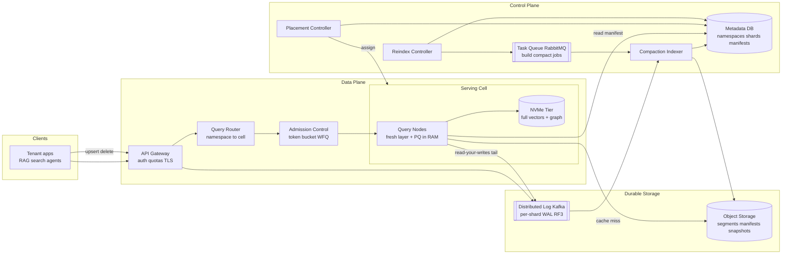

**Components.**
- **API Gateway:** authentication, per-tenant TLS, request validation, coarse quota enforcement, and routing of the *write* path to the WAL. Stateless; horizontally replicated behind a load balancer.
- **Query Router:** maps `namespace_id` → owning cell/shards using the placement map (cached from the metadata DB), then fans the query to the relevant query nodes. Stateless.
- **Admission Control:** the QoS gate (per-tenant token buckets on QPS and *cost*, weighted-fair queuing, concurrency bulkheads). Detailed in §3.2.
- **Serving Cell:** a bounded set of **query nodes** (RAM: PQ codes, hot graph, fresh layer) backed by a **NVMe tier** (full vectors + graph for cold segments). The blast-radius boundary and the unit of placement. Whales get dedicated cells.
- **Object Storage:** durable source of truth — immutable columnar segments, manifests, snapshots, and archived WAL. ~11 nines durability; replicas are caches over it.
- **Distributed Log (Kafka-class):** the per-shard WAL. One partition per shard gives a totally-ordered, single-writer stream; RF=3 across AZs; producers ack on quorum. Also carries change-data for the fresh layer and for dual-write during reindex.
- **Control Plane:** the **metadata DB** (replicated relational store) holds namespaces, index configs, shard/segment manifests, placement, reindex jobs, snapshots. **Placement**, **Reindex**, and **Compaction/Indexer** controllers are leader-elected and restartable purely from metadata. The **task queue (RabbitMQ-class)** dispatches build/compaction/reindex jobs (work distribution with acks and retries — not an event log).

**Why Kafka *and* RabbitMQ (stated trade-off).** The WAL needs an *ordered, replayable, partitioned log* with consumer-controlled offsets so the fresh layer and reindex backfill can replay from a watermark — that is exactly Kafka's model. Control-plane *jobs* (build this segment, compact that shard, run this reindex step) need at-least-once task dispatch with acknowledgements, retries, and routing, where ordering and replay don't matter — that is RabbitMQ's model. Using one tool for both would force a compromise: Kafka makes per-task ack/retry/visibility-timeout semantics awkward, and RabbitMQ makes offset-replay of a durable ordered history awkward. The trade-off is two systems to operate; we accept it because the two jobs are genuinely different.

## 2.2 API Contract

All endpoints are namespace-scoped and authenticated; the tenant is derived from the API key, and the `{ns}` path segment must belong to that tenant (enforced server-side; a mismatch is a 403, never a cross-tenant read). JSON over HTTPS; gRPC offered for high-QPS clients.

### Upsert

```
POST /v1/namespaces/{ns}/vectors:upsert
Idempotency-Key: <client batch uuid>
{
  "vectors": [
    { "id": "doc-123",
      "values": [0.012, -0.045, ...],          // length must match namespace dim
      "sparse": { "indices": [7,42,1001], "values": [0.8,0.5,0.3] }, // optional, hybrid
      "metadata": { "org_id": "acme", "lang": "en", "updated_at": 1736900000, "type": "ticket" }
    }
  ]
}
--> 200 { "upserted": 1, "wal_offset": 88123456, "durable": true }
    429 { "error": "rate_limited", "retry_after_ms": 120 }   // admission control
    409 { "error": "dimension_mismatch", "expected": 1024, "got": 768 }
```

Semantics: append to the shard WAL, ack `durable:true` on quorum replication; the returned `wal_offset` is the read-your-writes watermark a client can pass to a subsequent strong query. Idempotent by `Idempotency-Key` (a retried batch is deduplicated by id+offset).

### Delete

```
POST /v1/namespaces/{ns}/vectors:delete
{ "ids": ["doc-123","doc-124"] }                 // OR
{ "filter": { "type": "ticket", "updated_at": { "$lt": 1700000000 } } }
--> 200 { "tombstoned": 2, "wal_offset": 88123460 }
```

Semantics: writes tombstones to the WAL/fresh layer; reads filter tombstoned ids immediately; physical reclamation happens during compaction. Filter-deletes are executed as a metadata scan producing an id set, then tombstoned.

### ANN Query

```
POST /v1/namespaces/{ns}/query
{
  "vector": [0.01, ...],
  "top_k": 10,
  "filter": { "$and": [ {"org_id":"acme"}, {"lang":"en"},
                        {"updated_at": {"$gt": 1734300000}} ] },
  "ef_search": 128,                  // optional; else chosen by recall tier + planner
  "consistency": "eventual",          // or "strong" with optional "wait_for": <wal_offset>
  "include_metadata": ["title","url"]
}
--> 200 {
  "matches": [ { "id":"doc-1","score":0.83,"metadata":{...} }, ... ],
  "recall_estimate": 0.96,
  "served_from": { "fresh": true, "segments": 7 },
  "planner": { "selectivity": 0.004, "strategy": "in_index_filter" }
}
```

### Hybrid Query

```
POST /v1/namespaces/{ns}/query:hybrid
{
  "vector": [...],                    // dense branch
  "sparse": { "indices":[...], "values":[...] },   // or "text": "reset my password"
  "top_k": 10,
  "filter": { "org_id": "acme" },
  "fusion": { "method": "rrf", "k": 60 },          // default RRF; or "weighted" with weights
  "rerank": { "model": "cross-encoder-v2", "top_n": 50 }   // optional, top tier
}
--> 200 { "matches": [ { "id":"doc-9","score":0.0312,"dense_rank":2,"sparse_rank":1 }, ... ] }
```

### Snapshot / Restore

```
POST /v1/namespaces/{ns}/snapshots
{ "name": "pre-migration-2025-01" }
--> 202 { "snapshot_id":"snp_88f", "manifest_version":4412, "wal_watermark":88123999, "state":"creating" }

POST /v1/namespaces/{ns}/snapshots/{snapshot_id}:restore
{ "target_namespace": "priya-support-restored" }
--> 202 { "job_id":"rst_120", "state":"restoring" }
```

A snapshot is metadata only at creation time: it pins a manifest version, the set of immutable segments it references, and a WAL watermark. Because segments are immutable, this is copy-on-write and cheap; restore re-hydrates a namespace from those segments + WAL replay to the watermark.

### Reindex (the crux endpoints)

```
POST /v1/namespaces/{ns}/reindex
{
  "new_index": { "model": "embed-v3", "dim": 1536, "metric": "cosine",
                 "recall_tier": "interactive" },
  "dual_write": "client_supplies_new_vectors",   // or "server_calls_provider"
  "verify": { "sample_queries": 5000, "min_recall_at_10": 0.95 }
}
--> 202 { "job_id":"rix_77", "state":"dual_write_open", "watermark":"pending" }

GET  /v1/namespaces/{ns}/reindex/rix_77
--> 200 { "state":"backfilling", "progress":0.62, "shadow_recall":0.961,
          "watermark":88110000, "reconciled_through":88119500 }

POST /v1/namespaces/{ns}/reindex/rix_77:cutover    // atomic manifest flip; gated on verify
--> 200 { "state":"cutover_complete", "active_index":"embed-v3/1536", "old_kept_warm_until": 1737500000 }

POST /v1/namespaces/{ns}/reindex/rix_77:rollback   // flip back while old is warm
--> 200 { "state":"rolled_back", "active_index":"embed-v2/1024" }
```

The reindex state machine (`dual_write_open → building → backfilling → verifying → cutover → (rollback_window) → done`) is the externally visible face of §3.4.

### Error model, idempotency, and pagination

A consistent contract across all endpoints keeps clients robust:

- **Status codes:** `400` invalid request; `403` authenticated but the key does not own `{ns}` (also used for not-found to avoid tenant enumeration, §3.2 threat model); `404` only for resources the tenant owns but that don't exist; `409` dimension/type or version conflict; `429` admission-throttled with `Retry-After` and a `X-RateLimit-Remaining-QCU` header; `503` shedding under overload (retryable, with backoff). Bodies carry `{ "error": <code>, "message": <human>, "request_id": <uuid> }`.
- **Idempotency:** all mutating calls accept an `Idempotency-Key`; a retried key returns the original result rather than re-applying, making client retries safe across the durable WAL.
- **Pagination & limits:** query `top_k` is capped per tier (e.g., ≤ 1,000) to bound work; bulk reads use opaque cursor tokens, never offset paging (offsets are O(n) over segments). Batch upserts are size-capped (e.g., ≤ 1,000 vectors or ≤ 4 MB) so a single request can't monopolize a WAL append.
- **Versioning:** the API is versioned in the path (`/v1`); the *index* version (model/dim) is namespace state surfaced in responses (`active_index`) so clients can detect a cutover.

## 2.3 Data Model and Storage Layout

### Control-plane schema (replicated relational store)

Composite keys carry `tenant_id`/`namespace_id` *everywhere*, so isolation is enforced by the schema, not by application discipline — a query that forgets the tenant predicate fails to join rather than leaking.

```sql
CREATE TABLE tenants (
  tenant_id       UUID PRIMARY KEY,
  plan_tier       TEXT NOT NULL,             -- free | economy | interactive | dedicated
  home_region     TEXT NOT NULL,             -- residency pin
  kms_key_arn     TEXT NOT NULL              -- per-tenant envelope key
);

CREATE TABLE namespaces (
  tenant_id       UUID NOT NULL REFERENCES tenants(tenant_id),
  namespace_id    UUID NOT NULL,
  name            TEXT NOT NULL,
  size_class      TEXT NOT NULL,             -- small | medium | whale
  cell_id         TEXT NOT NULL,             -- placement
  active_index_id UUID NOT NULL,             -- points at index_configs row
  PRIMARY KEY (tenant_id, namespace_id)
);

CREATE TABLE index_configs (
  namespace_id    UUID NOT NULL,
  index_id        UUID NOT NULL,
  model           TEXT NOT NULL,             -- e.g. embed-v3
  dim             INT  NOT NULL,             -- 1024 | 1536 | ...
  metric          TEXT NOT NULL,             -- cosine | dotproduct | l2
  recall_tier     TEXT NOT NULL,             -- interactive | economy
  filterable      JSONB NOT NULL,            -- declared filterable attrs -> partitioned indexes
  state           TEXT NOT NULL,             -- active | shadow | retired
  PRIMARY KEY (namespace_id, index_id)
);

CREATE TABLE shards (
  namespace_id    UUID NOT NULL,
  shard_no        INT  NOT NULL,             -- whales > 1; small/medium = 0
  partition_key   TEXT NOT NULL,             -- namespace_id [+ shard_no]
  writer_epoch    BIGINT NOT NULL,           -- fencing token for single-writer
  PRIMARY KEY (namespace_id, shard_no)
);

CREATE TABLE segments (                       -- the manifest, one row per immutable segment
  namespace_id    UUID NOT NULL,
  index_id        UUID NOT NULL,
  shard_no        INT  NOT NULL,
  segment_id      UUID NOT NULL,
  object_uri      TEXT NOT NULL,             -- s3://.../segments/...
  min_offset      BIGINT NOT NULL,           -- WAL range covered
  max_offset      BIGINT NOT NULL,
  row_count       BIGINT NOT NULL,
  centroids       INT NOT NULL,              -- IVF coarse cells in this segment
  zone_maps       JSONB NOT NULL,            -- per-column min/max for pruning
  state           TEXT NOT NULL,             -- live | compacting | tombstoned
  PRIMARY KEY (namespace_id, index_id, shard_no, segment_id)
);

CREATE TABLE manifests (                      -- the atomically-swapped pointer
  namespace_id    UUID NOT NULL,
  shard_no        INT  NOT NULL,
  manifest_ver    BIGINT NOT NULL,
  active_index_id UUID NOT NULL,
  segment_set     JSONB NOT NULL,            -- list of segment_ids
  wal_watermark   BIGINT NOT NULL,
  PRIMARY KEY (namespace_id, shard_no, manifest_ver)
);

CREATE TABLE reindex_jobs (
  namespace_id    UUID NOT NULL,
  job_id          UUID NOT NULL,
  old_index_id    UUID NOT NULL,
  new_index_id    UUID NOT NULL,
  state           TEXT NOT NULL,             -- dual_write_open|building|backfilling|verifying|cutover|rollback_window|done
  pin_watermark   BIGINT,                    -- frozen build point
  reconciled_thru BIGINT,
  shadow_recall   REAL,
  PRIMARY KEY (namespace_id, job_id)
);

CREATE TABLE placement (
  cell_id         TEXT NOT NULL,
  region          TEXT NOT NULL,
  capacity_units  INT NOT NULL,
  reserved_units  INT NOT NULL,
  dedicated_to    UUID,                      -- non-null = whale/compliance dedicated cell
  PRIMARY KEY (cell_id)
);

CREATE TABLE snapshots (
  namespace_id    UUID NOT NULL,
  snapshot_id     UUID NOT NULL,
  manifest_ver    BIGINT NOT NULL,
  wal_watermark   BIGINT NOT NULL,
  created_at      TIMESTAMPTZ NOT NULL,
  PRIMARY KEY (namespace_id, snapshot_id)
);
```

### Object-storage layout

Per-namespace prefixes give physical separation, simple per-tenant lifecycle/retention, and clean residency (the whole prefix lives in the home-region bucket):

```
s3://vecdb-<region>/<tenant_id>/<namespace_id>/
    wal/<shard_no>/<segment-of-log>.log          # archived WAL ranges
    segments/<index_id>/<shard_no>/<segment_id>/  # immutable columnar segment:
        vectors.f32         # full-precision vectors (rerank + reindex source)
        pq.codes            # product-quantized codes
        graph.hnsw          # serialized graph / IVF lists
        meta.col            # columnar metadata (zone maps inline)
        sparse.inv          # inverted index (hybrid), optional
    manifests/<shard_no>/<manifest_ver>.json
    snapshots/<snapshot_id>.json
```

Every object is encrypted with the tenant's envelope key (`tenants.kms_key_arn`); a cross-namespace access bug still yields ciphertext.

## 2.4 Sharding and Partitioning

**Partition Key = `namespace_id`** (optionally `(namespace_id, shard_no)` for whales). **Sort / Clustering Key within a segment = `(coarse_centroid_id, vector_id)`.** The reasoning:

- **Why `namespace_id` is the partition key.** It is the isolation boundary, the index-config boundary, and the reindex boundary. Partitioning by it means a tenant's data is physically grouped, never interleaved with another's in a shared graph, and a tenant's reindex/compaction touches only that tenant's partitions. It also makes the *most common filter* (`namespace` itself, and within Priya's data, `org_id`) a partition operation rather than a search-time predicate.
- **Why a `shard_no` sub-key for whales.** A 2-billion-vector namespace cannot live on one node. We split whales into N shards by `shard_no = hash(vector_id) mod N`. Hashing the vector id spreads vectors uniformly, so no shard becomes hot from a skewed key, and each shard is an independently buildable/servable unit. Small/medium namespaces use `shard_no = 0` (a single shard).
- **Sort key `(coarse_centroid_id, vector_id)`.** Within a segment, clustering by the IVF coarse centroid co-locates vectors that are near each other, so a probe reads contiguous NVMe ranges (sequential-ish, ~GB/s) instead of scattered random reads. Secondary ordering by `vector_id` (and storing metadata columnar in the same order) enables predicate pushdown and zone-map pruning.

**How this avoids hot partitions and enables isolation:**

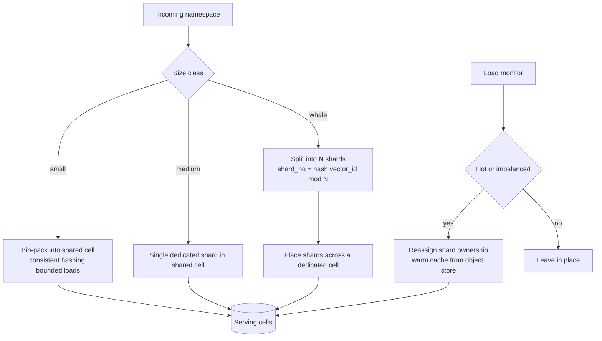

- **Small tenants** are bin-packed many-per-cell using consistent hashing with **bounded loads** (a cap per cell prevents any cell from overfilling), so the long tail is dense and cheap, yet no single cell is overloaded.
- **Whales** are split and placed on **dedicated cells**, so their traffic and reindex storms are physically contained — the canonical noisy-neighbor defense.
- **Rebalancing moves ownership, not bytes.** Because segments live in object storage and replicas are caches, "moving" a shard means reassigning which cell owns it and warming that cell's cache from object storage — no multi-terabyte data copy. The trade-off is a transient **cold-cache latency bump** on the moved shard until its working set is re-warmed; we mitigate with pre-warming before cutover and gradual traffic shifting.

## 2.5 End-to-End Request Lifecycle

To make the architecture concrete, here are the two hot paths traced step by step, with where the time goes — the kind of latency attribution that justifies the design choices in Part I.

### A filtered query (interactive tier, target p99 < 40 ms)

1. **Gateway (~0.2 ms):** TLS terminate, authenticate the API key, derive the tenant, validate that `{ns}` belongs to the tenant (else 403), and parse the request.
2. **Router (~0.2 ms):** look up `namespace_id` → owning cell/shards in the cached placement map; fan out to the relevant shard(s). For a small/medium namespace this is one shard; for a whale, scatter to N shards in parallel.
3. **Admission (~0.1 ms):** classify tenant + tier, estimate query cost in QCU, debit the local token bucket, take a WFQ slot and a concurrency slot. If throttled, return 429 here — cost ~0.
4. **Planning (~0.2 ms):** the selectivity planner estimates the filter's selectivity from per-segment sketches, prunes segments via zone maps, and picks pre/in/post-filter (§3.3).
5. **Candidate gather (~3–10 ms p99):** search the in-RAM fresh layer (sub-ms) and the sealed segments. For SSD-tiered segments, PQ codes in RAM guide tens-to-~200 parallel 4 KB NVMe reads (~100 µs each, high queue depth) to gather candidates. This is the dominant term and the reason PQ-in-RAM + parallel NVMe is non-negotiable.
6. **Merge + rerank (~0.5–1 ms):** merge fresh-layer and segment candidates, fetch full-precision vectors for the top ~100–200 from NVMe, compute exact distances (SIMD), apply any remaining filter, and select top-k.
7. **Respond (~0.2 ms):** assemble matches + requested metadata + recall estimate + `served_from`. **Budget check:** ~5–13 ms of work, leaving comfortable headroom under 40 ms for in-region network and jitter. Hedging to a second replica past a p95 timer protects the tail.

### An upsert (durable, fresh in seconds)

1. **Gateway (~0.2 ms):** auth, tenant derivation, dimension check against the namespace's active index (409 on mismatch), idempotency-key lookup.
2. **WAL append (~1–5 ms):** append to the per-shard partition in the distributed log; **quorum-replicate across 3 AZs** before ack. Cross-AZ quorum is the dominant term and the durability/latency trade-off (batching amortizes it).
3. **Ack (~0):** return `durable:true` + `wal_offset` (the read-your-writes watermark).
4. **Fresh layer (async, ~ms):** the query nodes' fresh layer tails the log and applies the write, making it queryable within seconds (immediately for `wait_for: wal_offset` strong reads).
5. **Flush + build (async, background):** the flusher rolls the WAL tail into an immutable segment, builds its ANN index on the build pool, and atomically adds it to the manifest; the WAL range is then archivable. None of this is on the client's critical path — the entire expensive-build cost is deferred off the write path, which is the whole point of the LSM spine (D1).

---

# Part III: Deep Dives on Hard Components

The issue enumerates six subsystems; all six are covered below. The three *hardest* — and the ones least documented publicly — are **3.2 Tenant Isolation and QoS**, **3.3 Filtered Search**, and **3.4 Live Reindex**, so those get the most depth. We treat the issue's Deep Dives and Failure Modes as a checklist; each is addressed explicitly.

## 3.1 Index Architecture

### HNSW vs IVF vs DiskANN/SPANN

The choice of ANN algorithm is really a choice of *where the data lives* (RAM vs SSD) and *what we trade* (memory vs recall vs build cost). No single index wins everywhere, so we use different ones per size class and recall tier.

| Index | How it works | Strengths | Weaknesses | We use it for |
|-------|--------------|-----------|------------|---------------|
| **HNSW** | Layered proximity graph; greedy best-first search | Excellent recall/latency *in RAM*; great for small-medium hot data | ~4.35 KB/vector RAM; expensive incremental insert; graph doesn't page to SSD gracefully | Interactive-tier **small/medium** namespaces fully resident in RAM |
| **IVF (+PQ)** | Coarse cluster into cells; probe nearest cells; PQ-compress residuals | Memory-light; tunable via nprobe; partitions align naturally with filters | Recall sensitive to nprobe and cluster balance; needs training | Economy tier; the *coarse* layer of our segments; filter-aligned partitions |
| **DiskANN / SPANN** | PQ codes + navigation graph in RAM; full vectors + graph on NVMe; SSD-resident | Billions/node from SSD; ~60× cheaper than all-RAM; good recall with rerank | Per-query NVMe random reads add latency; build is heavier | **Whale** and large namespaces; the default large-scale serving engine |

**Our composite engine.** Each segment is built as a **DiskANN-style** structure: an IVF coarse layer (centroids) for cluster-aligned access and filter pushdown, PQ codes (~128 B/vector) kept in RAM for navigation, full float32 vectors and the fine graph on NVMe, and a full-precision **rerank** of the top ~100–200 candidates to recover recall lost to quantization. Small/medium interactive namespaces that fit in RAM skip the SSD hop and run pure in-memory HNSW for the lowest latency. The recall tier selects the parameterization (efSearch/nprobe, rerank depth, RAM residency), realizing decision D2's "same engine, configured per tenant."

### Per-tenant index vs shared-index-with-partitioning

This is a load-bearing decision, so it gets an explicit argument.

- **Per-namespace index (our default).** Each namespace owns its own segments and graph. Pros: clean data isolation (no cross-tenant edges, so no information leakage through the graph structure); independent reindex (we can rebuild one tenant without touching others); independent index config (dim/model/recall per tenant); the namespace filter is "free" (it's the partition). Cons: the long tail of tiny namespaces each carrying index overhead — but we solve that by **packing** many small namespaces' segments into shared cells (sharing *hardware*, not the *graph*).
- **Shared index with a tenant partition key (rejected as default).** One big graph over all tenants, with `tenant_id` as a filter. Pros: maximal hardware density for tiny tenants. Cons that disqualify it as the default: (1) cross-tenant graph edges mean one tenant's vectors are *structurally entangled* with another's, a data-isolation and side-channel hazard; (2) you cannot reindex one tenant without rebuilding the shared graph; (3) the per-tenant filter becomes a *selectivity* problem — for a small tenant in a huge shared index, `tenant_id = X` is highly selective and you hit exactly the recall-collapse cliff of §3.3; (4) noisy-neighbor isolation is far harder when everyone shares one graph's memory and locks. We therefore use shared-index packing **only** for the smallest free-tier namespaces where the density win dominates and SLOs are best-effort, and even then we partition the shared index *by tenant* so traversal never crosses tenants.

**Tiering (memory vs SSD vs object).** Tier 0 RAM holds PQ codes, the hot navigation graph, and the fresh layer. Tier 1 NVMe holds full vectors and the fine graph for cold segments. Tier 2 object storage holds the durable segments. Movement between tiers is **look-aside cache** behavior: a query that needs a cold segment triggers a fetch from object storage into NVMe/RAM, governed by LRU/LFU with **per-tenant cache reservations and caps** (cache is a contended resource and therefore part of QoS — see §3.2). The trade-off is the classic one: more RAM/SSD residency buys lower latency and higher recall at higher cost; we resolve it *per tenant* via the recall tier rather than globally.

### Compaction, write amplification, and tombstone reclamation

The LSM design buys cheap writes but creates two debts that a vector index pays differently from a key-value store: **read fan-out** (a query must merge the fresh layer plus every sealed segment, so too many small segments slows reads) and **dead space** (tombstoned/overwritten vectors occupy segments until reclaimed). A background **compaction** process amortizes both by merging small segments into larger ones, dropping tombstoned ids, and rebuilding the merged segment's ANN index.

- **Merge policy.** A **tiered/leveled** policy keyed to segment size: many small recent segments (from frequent flushes) are merged into mid-size, then into large cold segments, keeping the count of segments a query must consult logarithmic in namespace size. We bound the per-query segment fan-out (e.g., ≤ ~10 sealed segments per shard) and trigger compaction when it's exceeded.
- **The vector-specific cost.** Unlike a KV store where compaction is a sorted merge, here compaction must **rebuild the ANN graph** for the merged segment — the expensive part. We therefore compact less aggressively than a KV LSM (graph rebuilds aren't free) and schedule it on the same separate build pool as reindex, under the same concurrency caps, so it never steals serving CPU.
- **Tombstone reclamation.** Deletes write a tombstone + a deleted-id bitmap; queries consult the bitmap to skip dead ids at near-zero cost. Physical space is reclaimed only when a segment is rewritten by compaction. A namespace with heavy churn accumulates dead space between compactions; we trigger compaction on a dead-ratio threshold (e.g., > 20% tombstoned) in addition to the segment-count trigger.
- **Write amplification trade-off.** More frequent compaction → lower read fan-out and less dead space, but higher CPU/IO write amplification (each vector may be rebuilt into a graph several times over its life). Less frequent → cheaper writes but slower, more bloated reads. We tune the threshold **per recall tier**: interactive namespaces compact eagerly (reads matter most); economy namespaces compact lazily (cost matters most). This is the LSM analog of the recall/latency/cost triangle.

## 3.2 Tenant Isolation and QoS

This is the heart of a multi-tenant vector DB and the subsystem that most distinguishes it from a single-tenant ANN library. We must guarantee two independent walls: **data isolation** and **performance isolation**.

### Data isolation

1. **Scoping.** Every stored object, segment, cache entry, and WAL partition is keyed by `namespace_id`. The API derives the tenant from the API key and rejects (`403`) any `{ns}` that doesn't belong to it — cross-tenant reads are impossible by construction, not by convention.
2. **No cross-namespace graph edges.** Per-namespace indexes mean a tenant's graph contains only that tenant's nodes, eliminating structural leakage and the shared-index hazards above.
3. **Schema-enforced keys.** Composite primary/foreign keys carry `tenant_id`/`namespace_id` (see §2.3), so a control-plane query that omits the tenant predicate fails to join rather than returning another tenant's rows.
4. **Per-tenant envelope encryption.** Each tenant has its own KMS key; segments are encrypted with a data key wrapped by it. A bug that crosses prefixes still cannot decrypt another tenant's data.
5. **Physical segregation for compliance.** Dedicated cells with separate storage prefixes (and, for the strictest, separate buckets/accounts) for tenants who contractually require single-tenancy or specific residency.

### Multi-tenant threat model

Isolation claims are only credible against a named threat model. The salient threats and their defenses:

| Threat | Vector | Defense |
|--------|--------|---------|
| **Cross-tenant read** | Forged or wrong `{ns}` in a request | Tenant derived from the API key server-side; `{ns}` must belong to it or 403; never trust client-supplied tenant identity |
| **Tenant enumeration** | Probing ids/namespaces to discover other tenants | Namespace ids are opaque UUIDs; not-found and not-authorized are indistinguishable responses; no cross-namespace listing API |
| **Structural leakage via shared graph** | Inferring another tenant's vectors from shared-index edges | Per-namespace indexes by default → no cross-tenant edges; shared-index packing is partitioned-by-tenant and reserved for best-effort free tier only |
| **Data-at-rest exposure** | Storage bug crossing prefixes, or stolen media | Per-tenant envelope encryption (own KMS key); a cross-prefix bug yields ciphertext, not plaintext |
| **Timing / cache side channels** | Measuring latency to infer a co-tenant's cache state or data | Per-tenant cache reservations isolate hot sets; whales on dedicated cells; query deadlines bound observable timing variance |
| **Resource exhaustion (DoS) of neighbors** | One tenant saturating CPU/IO/cache | The full QoS stack below: admission, WFQ, bulkheads, cgroups, cache caps, dedicated cells |
| **Poisoned/oversized input** | Wrong-dimension or malformed vectors to corrupt an index | Strict dimension/type validation at the gateway (409 on mismatch); per-segment builds are isolated, so a bad batch fails its own build, not the namespace |
| **Reindex/cutover data loss** | Writes lost in the migration window | Dual-write-before-watermark + idempotent sequenced backfill + verification gate (§3.4) |

The principle: **no isolation property may depend on application code remembering to scope a query** — it is enforced by identity derivation, schema keys, per-tenant keys, and physical placement, so a single forgotten predicate cannot breach a wall.

### Performance isolation

The adversary is the **noisy neighbor**: Dana firing 50,000 QPS with `ef_search=512` (very heavy recall queries) must not blow Priya's p99. We defend in layers, from the door inward:

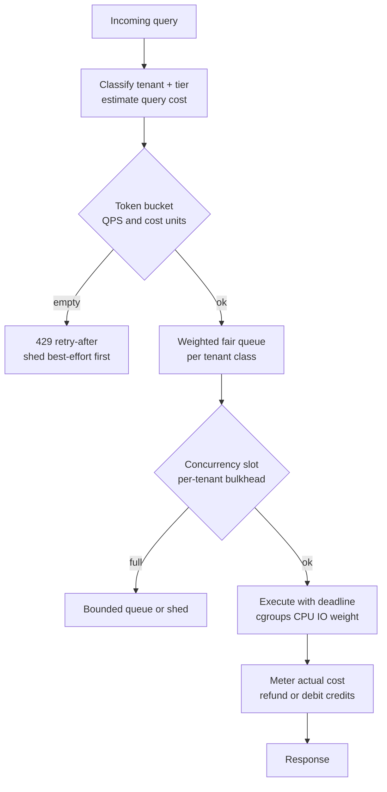

1. **Cost-aware classification and admission.** Each query is assigned a *cost estimate* up front — roughly `ef_search × top_k × rerank_depth × selectivity_factor` — because not all queries are equal; one `ef_search=512` query can cost 50× a default one. Admission meters this cost, not just request count.
2. **Per-tenant token buckets on QPS *and* cost units.** A tenant accrues both a request-rate budget and a *cost* budget (CPU·ms / NVMe-read equivalents). Dana's heavy queries drain the cost bucket fast; when empty, excess requests get `429` with `Retry-After`. This stops a tenant from buying cheap QPS and spending expensive cost. (Pattern mirrors the per-org token buckets and admission-control + Retry-After used in the repo's Claude Managed Agents design.)
3. **Weighted fair queuing / DRR across tenants.** Admitted work is scheduled by WFQ/Deficit Round Robin weighted by tier, so even within budget, a burst from one tenant is interleaved fairly and cannot monopolize a node's CPU. Heavy queries are time-sliced so a single 20 ms query can't head-of-line-block a queue of 2 ms queries.
4. **Per-tenant concurrency bulkheads.** A hard cap on a tenant's in-flight queries per node. Beyond it, requests queue (bounded) or shed. This bounds the resource any one tenant can hold at an instant — the key to protecting p99, since latency blows up with concurrent heavy work, not just with rate.
5. **OS-level resource weights.** Query executors run under **cgroups v2** with per-tenant-class CPU and IO weights so the kernel enforces fair CPU/NVMe-bandwidth sharing even if higher layers misestimate. (Same mechanism the repo's agent-sandbox design uses for CPU/IO caps.)
6. **Cache isolation.** The look-aside segment cache enforces **per-tenant reservations and caps**: a tenant gets a guaranteed slice and cannot evict beyond its cap, so Dana streaming a billion cold vectors can't flush Priya's hot working set out of RAM/NVMe. Cache is treated as a first-class QoS resource.
7. **Whale isolation via dedicated cells.** The biggest/busiest tenants are physically placed on their own cells (decision D3), so their worst case is contained to their own blast radius. Shared cells host many small tenants whose aggregate is statistically smooth.
8. **Query deadlines, hedging, and load shedding.** Every query carries a deadline; work past it is abandoned (returning best-effort partial results with a recall estimate) rather than dragging the node. Tail latency is cut with **hedged requests** to a second replica past a p95 timer. Under global overload, we **shed worst-offenders and best-effort tiers first**, protecting contractual interactive SLOs.

**Worked scenario (Dana the noisy neighbor).** Dana ramps to 50K QPS at `ef_search=512` during a backfill. (a) Cost classification flags each query as ~8× default cost; Dana's cost token bucket drains and excess is `429`'d with `Retry-After`, smoothing the spike. (b) The admitted portion is scheduled in Dana's WFQ class, interleaved with — never ahead of — other tenants. (c) Dana's per-node concurrency bulkhead caps simultaneous heavy queries so they can't saturate all cores. (d) cgroups weights guarantee other tenants' CPU/NVMe share regardless. (e) Because Dana is a whale, Dana is on a **dedicated cell** anyway, so the blast radius is Dana's own cell; co-tenants in *other* cells are wholly unaffected. (f) Dana's cache cap prevents the backfill from evicting anyone's hot set. Priya, in a different cell, sees no p99 movement.

**The explicit trade-off.** Strict isolation lowers utilization: reserved capacity and concurrency caps sit idle when their owner is quiet. We claw some back by letting **best-effort/free-tier work scavenge idle reserved capacity** (preemptible, shed first), but the headline trade-off — **isolation costs utilization, and therefore money** — is fundamental and was accepted in discovery (D3). The alternative, statistical multiplexing with no walls, is cheaper but cannot offer a contractual p99 under a power-law tenant mix.

### Distributed enforcement: where the quota state lives

A subtle, genuinely hard part: a tenant's traffic is spread across many query nodes and routers, but the quota is *global* ("Dana gets 30K QPS across the fleet"). Enforcing a global limit from distributed enforcers is a classic distributed-rate-limiting problem, and the naive answer (one central counter consulted per request) adds a synchronous hop to every query and is itself a SPOF and bottleneck. Our approach:

- **Local token buckets with periodic global reconciliation.** Each enforcer holds a *local* bucket pre-allocated a slice of the tenant's global budget (e.g., a router handling ~1/8 of Dana's traffic gets ~1/8 of Dana's tokens). A lightweight **quota service** periodically (sub-second) redistributes budget toward the enforcers actually seeing load, so the global cap is honored without a per-request central call. This mirrors the repo's Claude Managed Agents quota service that serves sub-10 ms cached decisions rather than a hot synchronous counter.
- **Bounded error, fail-open-locally.** Between reconciliation ticks, the worst case is a brief over- or under-admission bounded by one tick's budget — acceptable, and self-correcting. If the quota service is unreachable, enforcers fall back to their last-known local allocation (fail static), so a quota-service outage degrades fairness slightly rather than dropping all traffic.
- **Cost accounting after the fact.** Because a query's *true* cost is only known after execution (actual NVMe reads, actual efSearch expansion), the bucket is debited an estimate up front and **reconciled** with the measured cost on completion (refund or extra debit). This keeps the cheap-query path fast while still charging heavy queries their real cost.

### Worked example: sizing cost units and buckets

Concretely: define one **query cost unit (QCU)** ≈ the work of a default query (`ef_search=128`, `top_k=10`, one rerank of 100). A heavy query at `ef_search=512` with a cross-encoder rerank might be metered at ~8–12 QCU. If a node sustains ~2,000 default QPS, that is a budget of ~2,000 QCU/s per node to allocate across its tenants by weight. Dana's contractual 30K QCU/s, spread over a dedicated cell of ~20 nodes, is ~1,500 QCU/s/node — comfortably within a node's 2,000 QCU/s, with the remainder reserved or scavengeable. When Dana's backfill pushes 50K *requests*/s of 8-QCU queries (=400K QCU/s demanded vs 30K granted), the buckets throttle ~92% of the excess to `429` immediately — the spike is shed at the door, not absorbed into latency. This is how an abstract "fair scheduling" requirement becomes concrete, enforceable arithmetic.

## 3.3 Filtered Search

Filtered vector search — "nearest neighbors *that also satisfy* a metadata predicate" — is the common case (most interactive queries filter) and the notorious performance cliff. The cliff appears because ANN indexes are built over *all* vectors, but the filter wants a subset, and the right strategy depends entirely on **selectivity** (the fraction matching the filter).

### The three strategies and when each wins

| Strategy | Mechanism | Wins when | Fails when |
|----------|-----------|-----------|------------|
| **Pre-filter** | Resolve the predicate first (via metadata/inverted index → id set or partition), then search only survivors — exactly (brute force) if the set is small | **Highly selective** (< ~0.1%): few survivors, exact search is cheap and 100% recall | Weak filters: the survivor set is huge, "pre" gives no pruning and exact scan is too slow |
| **Post-filter** | Run normal ANN, then discard non-matching results; over-fetch to compensate | **Weak filters** (> ~30%): most candidates pass, modest over-fetch suffices | **Selective filters: catastrophic recall collapse** — the ANN top-N may contain *zero* matches; you'd traverse the whole graph and still miss the true matches |
| **In-index (filtered traversal)** | During graph walk, skip non-matching nodes but keep traversing through them; scale `ef_search` up by ~1/selectivity to stay connected (ACORN / filtered-DiskANN) | **Moderate** (~0.1–30%): integrates filter into the search without exact scan | Very low selectivity (graph becomes disconnected w.r.t. the filter; ef_search explodes) or very weak (wasted work vs simple post-filter) |

The infamous failure is **post-filter at low selectivity**: imagine `org_id='rare-tenant'` matching 0.01% of a namespace. The ANN search returns the global 100 nearest vectors; statistically none belong to `rare-tenant`; recall is ~0. Equally, **in-index filtering** degrades as selectivity drops because the graph's edges mostly lead to non-matching nodes, so you must raise `ef_search` toward the collection size to stay connected — at which point you're effectively scanning. The planner exists to never be in the wrong regime.

### Selectivity-aware query planner

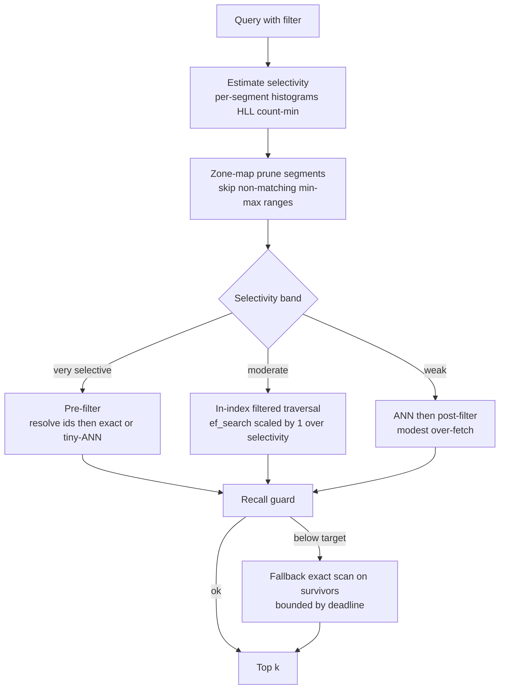

1. **Estimate selectivity cheaply.** Each segment carries per-column statistics — histograms for ranges, HyperLogLog for distinct counts, count-min sketches for heavy hitters, and exact small-cardinality maps for low-cardinality keywords like `lang`. Combine them across the boolean predicate to estimate the matching fraction *before* choosing a strategy.
2. **Prune segments with zone maps.** Per-segment min/max (zone maps) let the planner skip entire segments that cannot match a range predicate (e.g., `updated_at > T` skips old segments), shrinking the problem before any vector math.
3. **Choose the band.** Very selective (< 0.1%) → pre-filter + exact (cheap and exact). Moderate (0.1–30%) → in-index filtered traversal with `ef_search` adaptively scaled by ~1/selectivity. Weak (> 30%) → post-filter with modest over-fetch.
4. **Recall guard.** Estimate achieved recall (e.g., from how many candidates survived vs requested); if below the tier target, fall back to an exact scan over the (now bounded) survivor set, capped by the query deadline. This guarantees we never silently return collapsed-recall results — worst case we spend more time, bounded by the deadline, and annotate `recall_estimate`.

### Making selective filters fast by design: partitioned/cluster-aligned indexes

For a tenant's **declared filterable attributes** (e.g., Priya declares `org_id` and `lang` filterable), we physically **partition the index by that attribute** so the filter becomes a *partition prune* rather than a search-time predicate. `org_id='acme'` then routes directly to acme's partition and runs a *full-recall unfiltered* search there — the cliff disappears because within the partition the filter is satisfied by construction. Supporting structures: **roaring bitmaps / inverted indexes** mapping keyword values → vector-id sets for fast pre-filter id resolution; **zone maps** for range pruning; cluster-aligned IVF cells so a partition maps to contiguous NVMe ranges.

**The trade-off (stated).** Per-attribute partitioned indexes multiply build time and storage (each declared filterable attribute is, in effect, another physical organization of the data). So we build them **only for attributes the customer explicitly declares filterable**, capped in number, rather than for every metadata field. Undeclared fields still work via the planner's pre/in/post strategies — just without the partition-prune fast path. This makes the common, declared filters fast while keeping storage bounded; it is the filtered-search analog of choosing which database columns to index.

### Worked example: why post-filter collapses and the planner saves it

Take Priya's namespace: 5,000,000 vectors. An end user from a small customer issues a filtered query `org_id = 'startup-co'`, which matches 2,000 vectors — a selectivity of 2000 / 5e6 = **0.04%**.

- **Naive post-filter.** We run a normal ANN search for the top 100 *globally* nearest vectors, then keep only those with `org_id='startup-co'`. The probability any given global-top-100 vector belongs to a tenant occupying 0.04% of the space is ~0.04%, so the *expected* number of matches in the top 100 is 100 × 0.0004 = **0.04** — effectively **zero results**, recall ≈ 0. Over-fetching to top 10,000 still expects only ~4 matches: latency balloons and recall is still terrible. This is the cliff.
- **Planner: pre-filter + exact.** The planner estimates selectivity at 0.04% (< 0.1% band), resolves `org_id='startup-co'` via the inverted index to the 2,000 ids, fetches those 2,000 full vectors, and does an **exact** distance computation. 2,000 distance calcs at d=1024 is a few hundred microseconds of SIMD math — trivially fast — and returns the **exact** top 10, recall = 1.0. The "expensive" exact path is cheap *precisely because* the filter is selective.
- **If `org_id='acme'` instead matched 40% (2,000,000 vectors)**, the planner picks post-filter with modest over-fetch (top ~25 to reliably yield 10), because 40% selectivity means the global ANN results are mostly matches anyway. Same query shape, opposite strategy — which is the entire point of planning per query rather than fixing one global policy.

This example is the quantitative case for both the planner and, for `org_id` specifically (a *declared* filterable attribute), partitioning by it so even the moderate-selectivity case becomes a partition prune with full recall.

## 3.4 Live Reindex and Dimension Change

The crux subsystem. When a tenant adopts a new embedding model — or changes dimensionality (1024 → 1536) — every vector must be re-embedded and the index fully rebuilt, because vectors from different models are not comparable and different dimensions aren't even the same shape. This must happen **with zero read downtime, zero lost writes, verifiable correctness before commit, and instant rollback.** The danger that silently corrupts data is losing writes that arrive *during* the migration. Our design makes that structurally impossible.

### The state machine

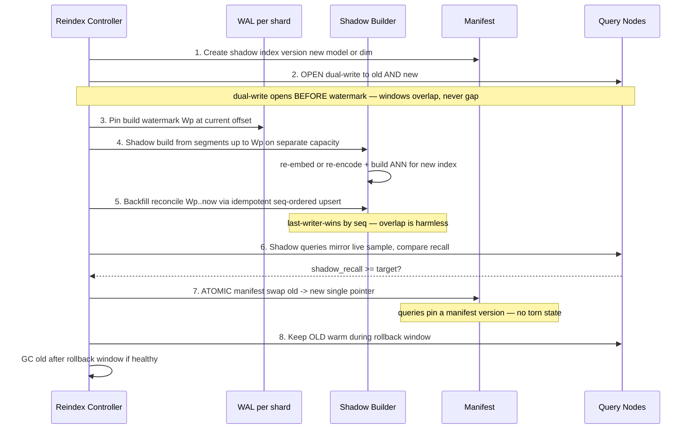

### Step-by-step, with the correctness argument

1. **Declare and allocate.** Create a new `index_configs` row in `state=shadow` (new model/dim/metric) and allocate a shadow segment set. The old index keeps serving, untouched.
2. **Open dual-write *first*.** Before pinning any build point, start writing every new upsert/delete to **both** the old and the new index. During migration the client supplies the new-dimension embedding alongside the old (or we call the configured provider). This is the linchpin: dual-write opens *before* the watermark, guaranteeing the dual-write window and the build window **overlap** rather than leaving a gap.
3. **Pin the build watermark `Wp`.** Record the current WAL offset per shard. The shadow will be built from the immutable state up to `Wp`; everything after `Wp` is captured by dual-write and by backfill.
4. **Shadow build on separate capacity.** Re-embed/re-encode the vectors in segments ≤ `Wp` and build the new ANN index on **dedicated build nodes** (not serving nodes), so serving latency is unaffected. This is the hours-long, embedding-throughput-bound step; the reindex scheduler caps concurrent whale builds to bound fleet build load and transient storage.
5. **Backfill / reconcile `Wp → now`.** Replay the WAL from `Wp` forward into the new index. Because writes are **idempotent and sequence-ordered** (last-writer-wins by WAL offset), the *overlap* between dual-write (which already wrote some of these) and backfill is harmless — re-applying a write at the same or lower sequence is a no-op. This is precisely why opening dual-write before pinning the watermark eliminates lost writes: there is no instant that is covered by neither mechanism, and the overlap is idempotent.
6. **Shadow verification (the gate).** Mirror a sample of live queries to the shadow and compare results to the live index against periodically computed exact ground truth. Cutover is **gated** on `shadow_recall ≥ target` (e.g., ≥ 0.95) and latency within SLO. If the new model is worse, we never cut over.
7. **Atomic cutover.** Flip the namespace's `manifests` pointer (and `active_index_id`) from old to new in a single atomic metadata transaction. Queries pin a manifest version for their duration, so there is **no torn state** — a query runs entirely on old or entirely on new, never a mix.
8. **Warm rollback window.** Keep the old index **warm** and **continue dual-writing to it** for a defined rollback window. If post-cutover monitoring shows a regression (recall, latency, or a customer complaint), flip the manifest back atomically — instant rollback with no rebuild, because old was kept current. Garbage-collect the old index only after the window passes cleanly.

### Dimension change specifics

A dimension change means the new vectors are physically a different width, so old and new vectors **cannot share a segment, a graph, or a distance computation.** We handle this by letting the new index be a **physically separate segment set** (different vector width, its own PQ codebooks, its own graph) coexisting under the same namespace during migration. Consequently **storage roughly doubles for the namespace during the migration window** (old d=1024 segments + new d=1536 segments), which is why §1.6 budgets transient double storage and the scheduler caps concurrent whale reindexes. After the rollback window, the old segment set is GC'd and storage returns to ~1×.

**Trade-offs (stated).** (a) Dual-write doubles write cost and storage during migration — accepted as the price of zero-downtime, lossless reindex. (b) Requiring the client to supply new-model embeddings during the window (or paying for server-side provider calls) adds migration complexity — accepted because we are explicitly not in the embedding-model business (D10). (c) Keeping old warm for rollback extends the double-storage window — accepted because instant, rebuild-free rollback is worth far more than the transient storage. (d) The verification gate can *delay* a cutover indefinitely if the new model underperforms — by design; correctness beats schedule.

### Edge cases and correctness

The headline "no lost writes" claim only holds if the awkward cases are handled. Each is addressed explicitly:

- **Deletes during the window.** A delete is a tombstone write; like any write it is dual-written to old and new and replayed in the backfill. Because tombstones are sequence-ordered, a delete that arrives during the build still applies to the shadow — there is no window where a deleted vector silently resurrects in the new index.
- **Idempotency / exactly-once effect.** Every write carries a WAL offset; applying to the shadow is **last-writer-wins by offset**. The overlap between dual-write and backfill therefore produces *at-least-once delivery with exactly-once effect* — re-applying the same or an older offset is a no-op. This is why opening dual-write before pinning the watermark is safe rather than double-counting.
- **Client stops supplying new-dimension embeddings mid-migration.** Dual-write to the *new* index needs the new-model vector. If the client's supply lapses, the job stalls in `dual_write_open`/`backfilling` (visible via the status endpoint) rather than cutting over with gaps; the old index keeps serving untouched. The job can be resumed or aborted; abort simply discards the shadow.
- **Build failure mid-way.** The shadow is built per shard; a failed shard build is retried from the immutable segments ≤ Wp (deterministic input), no serving impact. Cutover is gated on *all* shards' shadows passing verification, so a partially built namespace never cuts over.
- **Crash of the reindex controller.** The controller is stateless beyond the metadata DB (`reindex_jobs` row holds state, watermark, reconciliation progress). A new leader resumes from the persisted state; dual-write continues on the data plane independently, so a controller crash pauses *progress*, not *correctness*.
- **Writes after cutover but before old GC.** Dual-write to old continues through the rollback window, so if we roll back, old is current to the latest write — rollback is lossless too, not just cutover.

## 3.5 Hybrid Search

Dense (semantic) search misses exact-term matches — product codes, names, rare acronyms — where lexical search excels; lexical search misses paraphrase where dense excels. **Hybrid search** runs both and fuses them. We support a **sparse** branch (BM25 classic lexical, or **SPLADE** learned-sparse) over an inverted index, alongside the **dense** ANN branch, and fuse the two ranked lists.

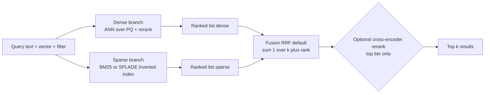

**Fusion: Reciprocal Rank Fusion (default).** RRF scores each document as Σ 1/(k + rank_in_list) across the dense and sparse lists (k≈60). We default to RRF because it uses **ranks, not raw scores**, so it needs no score normalization — dense cosine similarities and BM25 scores live on totally different scales, and normalizing them is fragile and dataset-dependent. RRF is robust, parameter-light, and consistently strong. We also offer **weighted score fusion** (normalize then weight) for customers who want to tune the dense/sparse balance explicitly, with the caveat that normalization must be calibrated.

**Execution.** The two branches run **in parallel**; the metadata filter applies to **both** (a filtered hybrid query filters the sparse postings and the dense candidates identically, so fused results all satisfy the predicate). For the top tier, an optional **cross-encoder rerank** re-scores the fused top-N (e.g., 50) with a heavier model for maximum precision — applied only to a small N and only where the latency budget allows, because cross-encoders are expensive.

**Trade-off (stated).** The sparse branch is a *second* index: it roughly doubles write amplification and storage for hybrid-enabled namespaces, and adds a parallel query path. We therefore make hybrid **opt-in per namespace** — customers who need lexical recall pay for the second index; pure-semantic customers don't. Cross-encoder reranking trades latency and CPU for precision and is gated to the top tier and small N.

### Sparse representation: BM25 vs SPLADE

| Aspect | BM25 (classic lexical) | SPLADE (learned sparse) |
|--------|------------------------|--------------------------|
| What it indexes | Literal tokens with TF-IDF-style weights | Model-expanded term weights (includes synonyms/related terms the model deems relevant) |
| Strength | Exact-term and rare-token matching; zero model cost; language-agnostic | Bridges vocabulary mismatch (query "car" matches doc "automobile") while staying sparse/invertible |
| Cost | Cheap to compute and store | Requires running the SPLADE model at index and query time; denser postings |
| Storage | Smallest inverted index | Larger postings (more non-zero terms per doc) |
| We offer it for | Default lexical option; code/ID/keyword-heavy corpora | Tenants who want semantic-ish recall from a sparse index without a second dense model |

Both produce a **sparse vector** (term id → weight) indexed in a per-segment **inverted index** (`sparse.inv` in the segment layout, §2.3), queried with the standard WAND/MaxScore top-k traversal. The choice is per-namespace; the fusion machinery downstream is identical.

### Worked fusion example (RRF)

Suppose for one query the dense and sparse branches each return a ranked list, and document `D` is ranked **#2 by dense** and **#1 by sparse**, while document `E` is **#1 by dense** and absent from the sparse top list. With RRF and k=60: `score(D) = 1/(60+2) + 1/(60+1) = 0.01613 + 0.01639 = 0.03252`; `score(E) = 1/(60+1) + 0 = 0.01639`. So `D` — strong in *both* modalities — outranks `E`, which was #1 in only one. That is exactly the desired behavior: cross-modal agreement is rewarded, and because only ranks enter the formula, a wildly different BM25 score scale never distorts the fusion. The constant k≈60 damps the influence of deep ranks (the difference between rank 1 and 2 matters far more than between rank 100 and 101), which empirically tracks how relevance actually decays.

### Multi-stage retrieval

For the top tier, hybrid search is the middle of a three-stage funnel: **(1) recall** — dense + sparse each over-fetch a few hundred candidates (cheap, high-recall, filtered); **(2) fuse** — RRF merges to a few dozen; **(3) precision** — an optional cross-encoder re-scores the fused top-N with full query-document attention for maximum ordering quality. Each stage narrows the candidate set by ~10×, spending the expensive model only on the survivors. The trade-off is latency per stage, so the cross-encoder stage is gated by tier and a small N, and skipped entirely for economy traffic.

## 3.6 Durability and Sharding

### Write path

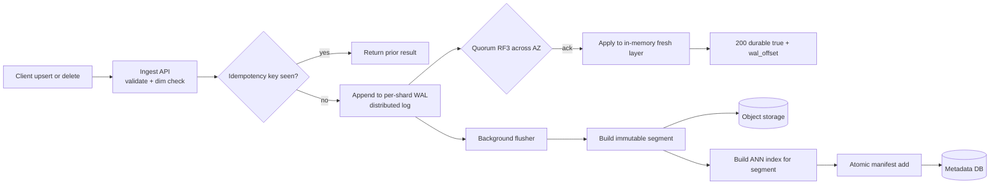

1. **Validate** (dimension matches namespace; auth/quota). 2. **Idempotency** dedup by `Idempotency-Key`. 3. **Append to the per-shard WAL** in the distributed log. 4. **Quorum-ack** across 3 AZs → respond `durable:true` with `wal_offset`. 5. **Fresh layer** applies the write so it's immediately queryable (read-your-writes via `wait_for: wal_offset`). 6. **Background flusher** rolls the WAL tail into an **immutable segment** in object storage, **builds its ANN index**, and **atomically adds it to the manifest**; the corresponding WAL range can then be archived/truncated.

### Replication and durability

- **WAL:** replication factor 3 across AZs; producers ack on quorum. One partition per shard = a totally-ordered, single-writer stream, which gives per-shard linearizable ordering (a fencing **writer_epoch** prevents a partitioned old writer from corrupting order).
- **Segments:** durable in object storage at ~11 nines; this is the source of truth. **Serving replicas are caches** over it — losing a replica loses no data, only warm cache.
- **Metadata DB:** replicated relational store (synchronous replica + multi-AZ), holding the manifests that define "what is searchable." Manifest swaps are transactional.

### Read path and consistency levels

A read is a **merge** of the in-memory fresh layer and the sealed segments named by the current manifest, followed by tombstone filtering and full-precision rerank. The consistency level chooses how the fresh layer is treated:

- **`eventual` (default):** query whatever the local fresh layer has tailed plus the current manifest's segments. Typically seconds-fresh, lowest latency, no waiting. Correct for the overwhelming majority of search traffic.
- **`strong` with `wait_for: wal_offset`:** the read blocks (briefly, with a deadline) until the local fresh layer has applied up to the supplied offset — the one returned by the client's own write — then proceeds. This yields **read-your-writes** without global coordination: a client that just upserted and immediately searches passes the offset and is guaranteed to see its write. The cost is a small wait bounded by fresh-layer tailing lag.
- **`strong` without an offset:** the node first confirms it has tailed to the current end of the shard's WAL (a bounded catch-up), then reads — the freshest consistent view of that shard.

Because each shard's WAL is a single totally-ordered stream, these guarantees are exact *per shard*. For a whale spanning shards, a strong read fans out and each shard honors the level independently; we make no cross-shard atomic-snapshot guarantee on the hot read path (that is what coordinated snapshots are for). Tombstones are applied at merge time via the deleted-id bitmap, so a delete is honored the instant it is in the fresh layer, independent of when compaction physically reclaims the space.

### Shard placement and rebalancing

- **Placement:** `shard_no = hash(vector_id) mod N` spreads a whale's vectors uniformly (no hot shard from key skew); small/medium = single shard; **consistent hashing with bounded loads** packs many small namespaces per cell without overload; whales pinned to dedicated cells.
- **Rebalancing:** because replicas are caches over object storage, rebalancing transfers **ownership** and **warms cache** — it does **not** move terabytes (the central advantage of storage/compute separation). Trade-off: a transient cold-cache latency bump on the moved shard, mitigated by pre-warming before traffic cutover.

### Snapshot consistency

A snapshot is a **manifest version + the set of immutable segments it references + a WAL watermark**. Because segments are immutable, snapshotting is **copy-on-write and cheap** — no data copy, just pinned references and a watermark. Per-shard snapshots are snapshot-isolated by default (each shard's manifest+watermark is internally consistent). A **coordinated namespace-wide snapshot** across a whale's many shards requires a light barrier — briefly align all shards to a consistent watermark set — which is heavier but still copy-on-write. Restore re-hydrates from the pinned segments and replays the WAL to the watermark.

**Caching and queue choices, stated explicitly.** The **segment cache** is **look-aside** (a query checks RAM/NVMe; on miss, fetches from object storage and populates) — appropriate because reads dominate and not every cold segment is worth pre-loading. The **manifest/metadata cache** on routers/query nodes is **write-through** from the control plane — manifests must never be stale in a way that serves a retired index, so the control plane pushes new versions and nodes pin-then-refresh. The **WAL** is effectively **write-through** to durable storage (replicated before ack). Queue division (restated): **Kafka-class log** for WAL/CDC/backfill (ordered, replayable, partitioned); **RabbitMQ-class queue** for control-plane jobs (build/compact/reindex tasks with acks, retries, visibility timeouts). Trade-off accepted: two messaging systems, each matched to its semantics.

---

# Part IV: Bottlenecks, Trade-offs, and Reliability

## 4.1 Where It Breaks at 10x and 100x

Designs should be honest about their failure scale. Here is where this one strains and what we do about it.

| Pressure point | Symptom at 10x–100x | Mitigation |
|----------------|---------------------|------------|
| **Fresh-layer bloat** | If write rate >> flush rate, the in-memory fresh layer grows unbounded, RAM pressure rises, and recent-write queries slow | Backpressure ingestion per shard; scale flushers; spill fresh layer to NVMe; split hot shards |
| **Whale reindex storms** | Many whales reindex at once → build capacity saturates and transient storage doubles fleet-wide | Reindex scheduler caps concurrent whale rebuilds; dedicated build pool; stagger; admission on build queue |
| **Low-selectivity filter cliff** | A popular weak/odd filter forces near-exhaustive scans, spiking CPU/NVMe | Planner + recall guard + deadlines; partitioned indexes for declared filters; shed/deprioritize offending queries |
| **Cache thrash** | Working set >> NVMe/RAM → object-store read amplification + egress cost explosion | Per-tenant cache caps; admission ties QPS to cache budget; autoscale NVMe tier; alert on hit-rate drop |
| **Metadata DB hot on manifest swaps** | High compaction/reindex churn hammers the manifest tables | Batch manifest commits; cache manifests at nodes (write-through); partition metadata by region/cell |
| **Hot shard skew** | Despite hashing, a shard gets disproportionate QPS (a viral key) | Re-shard hotter; add read replicas for that shard; hedge; admission smooths bursts |
| **Object storage limits** | Request-rate/egress throttling from too many small GETs | Larger segments; coalesce reads; cache aggressively; per-prefix request budgeting |
| **Cross-AZ WAL latency** | Quorum ack across AZs sets a write-latency floor | Co-locate writer with a quorum; batch WAL appends; relax to bounded-staleness where allowed |

## 4.2 Trade-off Register

Every major decision and its explicit trade-off, in one place:

| Decision | Chosen | Gave up | Why |
|----------|--------|---------|-----|
| Storage model | LSM + compute/storage separation | In-place-mutable index simplicity | Read-heavy + bursty writes + cheap rebalancing/reindex |
| Default serving index | DiskANN/SPANN (SSD-tiered) | All-RAM HNSW latency | ~60× cost reduction at billions of vectors (§1.6) |
| Quantization | PQ codes + full-precision rerank | Some recall before rerank | 32× memory reduction; rerank recovers recall |
| Multi-tenancy | Per-namespace index | Max hardware density of one shared graph | Data isolation + independent reindex + no filter-selectivity tax |
| Isolation | Cells + admission + WFQ + caps | Average utilization | Contractual p99 under power-law tenants |
| Filtered search | Selectivity-aware planner + declared partitioned indexes | Build/storage for declared attrs; planner complexity | Avoid recall collapse across selectivity regimes |
| Reindex | Dual-write-before-watermark + shadow + atomic cutover + warm rollback | Double write/storage during migration | Zero downtime, zero lost writes, instant rollback |
| Hybrid | Dense + sparse fused via RRF | Second index cost; opt-in only | Lexical + semantic recall without score-normalization fragility |
| Consistency | Bounded-staleness default, opt-in strong | Always-strong simplicity | Latency-favoring default; pay for strong only when needed |
| Messaging | Kafka (log) + RabbitMQ (jobs) | One-system simplicity | Ordered replayable log vs ack/retry task dispatch are different problems |

### The recall / latency / memory-cost triangle

You can optimize any two at the expense of the third. High recall + low latency demands lots of RAM (expensive). High recall + low cost demands SSD tiering (higher latency). Low latency + low cost demands lower recall (fewer probes/reranks). We refuse to pick one global point and instead expose it as the **per-namespace recall tier**: interactive tenants buy the RAM corner (recall + latency, higher cost); economy tenants buy the SSD corner (recall + cost, higher latency); and within a tier, per-query `ef_search`/rerank knobs let a single query slide along the edge. PQ + rerank is the lever that bends the triangle — it buys cost and latency while a cheap rerank claws recall back.

### Pre-filter vs post-filter; isolation vs utilization; latency vs consistency

These three tensions recur and are resolved by *making them per-query or per-tenant choices* rather than global constants: pre/in/post-filter is chosen per query by the selectivity planner (§3.3); isolation-vs-utilization is chosen per tier (reserved interactive vs scavengeable best-effort, §3.2); latency-vs-consistency is chosen per query (bounded-staleness default vs `consistency:strong`, §4.5).

## 4.3 Single Points of Failure

| Component | SPOF? | Mitigation |
|-----------|-------|------------|
| API Gateway / Router | No | Stateless; N replicas behind a load balancer; any instance serves any tenant |
| Admission control | No | State (token buckets) is per-node with periodic global reconciliation; loss = brief local over/under-admission, self-heals |
| Query node | No | Replicas are caches; a lost node's shards are re-owned and re-warmed from object storage |
| Distributed log (WAL) | No | RF=3 across AZs; quorum ack; single-writer per partition with fencing epoch |
| Object storage | Regional dependency | Regionally redundant (~11 nines); cross-region replication for opted-in DR |
| Metadata DB | Critical | Multi-AZ replicated relational store with synchronous replica + automated failover; manifests are the crown jewels |
| Placement / Reindex / Compaction controllers | No | Leader-elected, restartable purely from metadata; a crash pauses background work, not serving |
| Per-shard writer | Bounded | Single-writer per shard for ordering; a fencing **writer_epoch** prevents a zombie writer after failover |

## 4.4 Failure Playbooks

The issue's failure modes, each with a concrete response:

- **Noisy neighbor saturates CPU/IO.** Admission control cost-meters and `429`s the offender; WFQ interleaves fairly; concurrency bulkheads cap simultaneous heavy queries; cgroups enforce CPU/NVMe weights; cache caps protect others' working sets; whales are on dedicated cells so blast radius is contained. (§3.2)
- **Low-selectivity filtered query causes recall/latency collapse.** The selectivity planner picks pre/in/post per query; the recall guard falls back to a deadline-bounded exact scan rather than returning collapsed results; declared filterable attributes route to partitioned indexes; pathological queries are deprioritized/shed. (§3.3)
- **Reindex cutover loses writes during the dual-write window.** Structurally prevented: dual-write opens *before* the build watermark (overlap, never gap), backfill is idempotent and sequence-ordered (last-writer-wins), and cutover is an atomic manifest swap with manifest-version pinning so no query sees torn state. Verification gates the cutover; warm old enables instant rollback. (§3.4)
- **Recall vs latency vs memory triangle.** Resolved per-tenant via recall tiers over tiered storage, PQ + rerank, and per-query knobs (§4.2).
- **A single node fails.** Its shards are re-owned by peers and re-warmed from object storage; no data loss (segments durable, WAL replicated); brief cold-cache latency on the affected shards only.
- **An entire AZ fails.** WAL has RF=3 across AZs (quorum survives losing one); object storage is regionally redundant; serving replicas exist in other AZs; the router fails queries over to surviving AZ replicas. No data loss; bounded latency impact while caches re-warm.
- **An entire region fails.** Namespaces are region-pinned. Non-regulated tenants who opted into cross-region DR have async-replicated object storage + WAL in a secondary region and fail over to a warm-standby (active-passive) with a defined **RPO** (async lag, seconds-to-minutes) and **RTO** (re-hydrate + re-warm, minutes). **Regulated, region-locked tenants cannot fail over out of region by contract** (decision D6) — for them a region outage is an in-region recovery to the latest durable state, and this constraint is sold explicitly, not hidden. This is the sharpest residency-vs-availability trade-off in the system.

### Cross-region DR, in detail

For opted-in (non-residency-locked) tenants, DR is active-passive and rides the same primitives as everything else:

- **What replicates:** immutable segments and WAL ranges replicate asynchronously to the secondary region's object storage and log; the control-plane metadata (manifests, configs, placement) replicates via the relational store's cross-region replica. Because segments are immutable and content-addressed, replication is append-only and idempotent — no conflict resolution needed.
- **RPO (data loss bound):** the async replication lag — typically **seconds to a couple of minutes** of the most recent writes. Writes are durable in the primary at ack time; DR loss is only the tail not yet shipped. Tenants wanting RPO≈0 must accept synchronous cross-region write latency (offered as a premium, rarely chosen because of the latency cost).
- **RTO (time to serve):** promote the secondary's metadata to primary, point routers at the secondary cells, and **warm caches from the secondary's object storage**. Because serving nodes are caches, there is no bulk restore — RTO is dominated by cache warm-up of the hot working set, on the order of **minutes**, not the hours a data copy would take. This is a direct payoff of the compute/storage separation principle.
- **Failback:** when the primary region returns, reverse-replicate the deltas accumulated in the secondary, verify, and cut routing back during a low-traffic window — the same atomic-manifest discipline as reindex cutover.
- **Testing:** Sam's quarterly game-day exercises exactly this path on a canary tenant so the RTO is measured, not assumed.

## 4.5 Consistency Model CAP and PACELC

**Stance: PA/EL.** Under a network **P**artition, we favor **A**vailability: serving replicas keep answering from their cached segments and last-known manifest (bounded-staleness reads), and writes are accepted into the WAL where a quorum is reachable or rejected cleanly where it is not — reads stay up even when the freshest write can't be confirmed everywhere. **E**lse (no partition), we favor **L**atency over strong **C**onsistency: the default read is bounded-staleness/eventual (merge fresh layer + sealed segments, typically seconds-fresh), because for similarity search a few seconds of staleness is usually irrelevant and the latency win is large.

But consistency is **per-query and per-shard**, not one global setting:
- **Per-shard ordering is strong.** Each shard's WAL is a totally-ordered, single-writer log (CP-flavored within the shard): writes are linearizable and durable per shard, with a fencing epoch preventing split-brain writers.
- **Read-your-writes on demand.** A client can pass `consistency:strong` with the `wal_offset` returned by its write; the query waits until the fresh layer has applied up to that offset before answering — strong read-your-writes at a small latency cost, exactly where the customer needs it (e.g., edit-then-immediately-search).
- **Cross-shard / cross-namespace is eventually consistent.** We make no cross-shard transactional guarantee (out of scope, D10); a whale's shards converge independently. Coordinated snapshots use a light barrier when a globally consistent point is required.

This gives the right defaults — cheap, fast, available reads — while letting the rare query that truly needs linearizable read-your-writes pay for it explicitly. It mirrors the discovery decision (D9): latency-favoring by default, correctness where it's purchased.

## 4.6 Observability and SLO Measurement

You cannot run a contractual-SLO multi-tenant system you cannot *measure per tenant*. Three measurements are non-obvious and deserve design attention.

- **Measuring recall in production.** Recall is defined against the *true* nearest neighbors, which the ANN index by definition doesn't compute. We measure it by **sampling**: for a small fraction of real queries (say 0.1%, shadowed off the hot path), we run an **exact brute-force** k-NN over the (possibly down-sampled) namespace to establish ground truth, then compare the served approximate results. This yields a continuous per-namespace recall estimate with confidence intervals, which (a) verifies we meet N4's recall SLO, (b) gates reindex cutover (§3.4), and (c) alarms on silent recall regressions from data drift or a bad compaction. The trade-off: exact ground truth is expensive, so we sample sparsely and run it on the build pool, not serving nodes.
- **Per-tenant latency and saturation.** Latency histograms (not averages) are tagged by `namespace_id`, tier, and `served_from` (fresh/cache/cold), so we can attribute a p99 breach to a specific tenant, a cold-cache event, or a cell. We export per-tenant admission outcomes (admitted/throttled/shed), token-bucket levels, concurrency occupancy, and cache hit-rate. These are the signals the SRE (Sam) needs to detect a noisy neighbor *before* it breaches an SLO and to prove isolation held when it does.
- **Reindex and freshness telemetry.** Per-job reindex progress, shadow recall, reconciliation lag, and per-shard fresh-layer depth + flush lag (the leading indicator of freshness-SLO risk and fresh-layer bloat from §4.1). Freshness is measured as the offset distance between the latest acknowledged write and the latest write visible to reads.

A per-tenant **SLO dashboard** rolls these into the contractual numbers (p99, recall, freshness, availability) per namespace, with error budgets. Best-effort tiers are measured too, but only the paid tiers page.

## 4.7 Capacity and Cost Model

Bringing §1.6's envelope numbers together into an operating model justifies the unit economics and sizes the fleet.

| Resource | Driver | Fleet estimate (50B vectors, 300K QPS) | Lever |
|----------|--------|----------------------------------------|-------|
| Object storage | Durable segments (full-precision vectors dominate) | ~230 TB → ~$5K/mo | Compaction, lifecycle to colder class for idle namespaces |
| NVMe (serving) | Full vectors + graph × replicas | ~217 TB × ~2.5 replicas ≈ ~$43K/mo | Per-tier residency; economy tier fewer replicas |
| RAM (serving) | PQ codes + hot graph + fresh layer | ~6.4 TB PQ × replicas + working set ≈ tens of $K/mo | PQ compression ratio; cache caps |
| Compute (serving) | ~400–600 nodes for QPS + headroom | dominant line item | efSearch/rerank tuning; admission smoothing of peaks |
| Build pool | Reindex + compaction | bursty, capped concurrency | Schedule off-peak; cap concurrent whale rebuilds |
| WAL log | RF3 across AZs, retention to archive | modest | Short retention; archive to object storage |

**Unit economics.** The design's central cost move is serving the bulk of 50B vectors from **NVMe at ~$0.08/GB-mo** rather than **RAM at ~$5/GB-mo** — the ~60× delta from §1.6 is what makes per-million-vector pricing viable. RAM is spent only where it earns latency/recall: PQ codes (navigation), hot graphs, and the fresh layer. The **isolation tax** (reserved capacity for contractual tiers sitting partly idle) is a real line item; we recover part of it by letting best-effort work scavenge idle reserved capacity, and we price the interactive/dedicated tiers to cover the rest. **Scaling knobs**, in order of leverage: recall tier (RAM residency), replica count (availability vs cost), efSearch/rerank depth (latency vs CPU), and compaction aggressiveness (read cost vs write amplification). Each is exposed per namespace so cost tracks the value each tenant actually buys.

## 4.8 Prior Art and Where We Differ

This system sits in a well-populated space; being explicit about how it relates to existing systems sharpens the design rationale. (These are characterizations of public architectural directions, not claims about any vendor's current internals.)

| System | Characteristic approach | What we adopt | Where we differ / our stance |
|--------|------------------------|---------------|------------------------------|
| **Pinecone** | Managed, namespaces, pod/serverless tiers, filtered search | Namespace-as-spine, managed multi-tenant model, tiered serving | We make live dimension-change reindex and the selectivity-aware planner first-class, documented subsystems rather than opaque features |
| **Turbopuffer** | Object-storage-native, compute/storage separation, cheap cold namespaces | The LSM + object-storage-as-truth spine, replicas-as-caches, copy-on-write snapshots | We add explicit contractual QoS/cellular isolation and a designed live-reindex protocol on top of the storage model |
| **Weaviate / Milvus** | Open-source, HNSW/IVF, segment-based, hybrid search | Segment + manifest model, hybrid dense+sparse with fusion, per-collection config | We push harder on multi-tenant *performance* isolation (admission/WFQ/cells) and on zero-downtime model migration as a product guarantee |
| **pgvector / OLTP-embedded** | Vectors inside a relational DB | Strong metadata filtering and transactional metadata | We reject embedding the index in the OLTP store at billions of vectors — the memory/SSD economics (§1.6) demand a purpose-built tiered engine |
| **FAISS (library)** | State-of-the-art ANN algorithms, single-node | The algorithms themselves (HNSW/IVF/PQ/DiskANN) | A library is not a service: we add multitenancy, durability, freshness, isolation, and operations around the algorithms |

**The thesis in one line:** the *algorithms* (HNSW/IVF/DiskANN/PQ) are largely solved and shared across all these systems; the hard, differentiating, under-documented work is the **multi-tenant systems envelope** around them — isolation, QoS, filtered-search planning, live reindex, and the storage/compute separation that makes them affordable. That envelope is what this document designs in depth.

---

# Architectural Diagrams

This section consolidates the system's key diagrams. Several component-level flows appear inline in Parts II–IV (component architecture §2.1, QoS admission §3.2, query-path filtering §3.3, reindex sequence §3.4, hybrid fusion §3.5, write path §3.6, shard placement §2.4); the diagrams below add the data-model ERD, the cell/deployment topology, the reindex state machine, and the end-to-end tiered data flow.

### Data model (ERD)

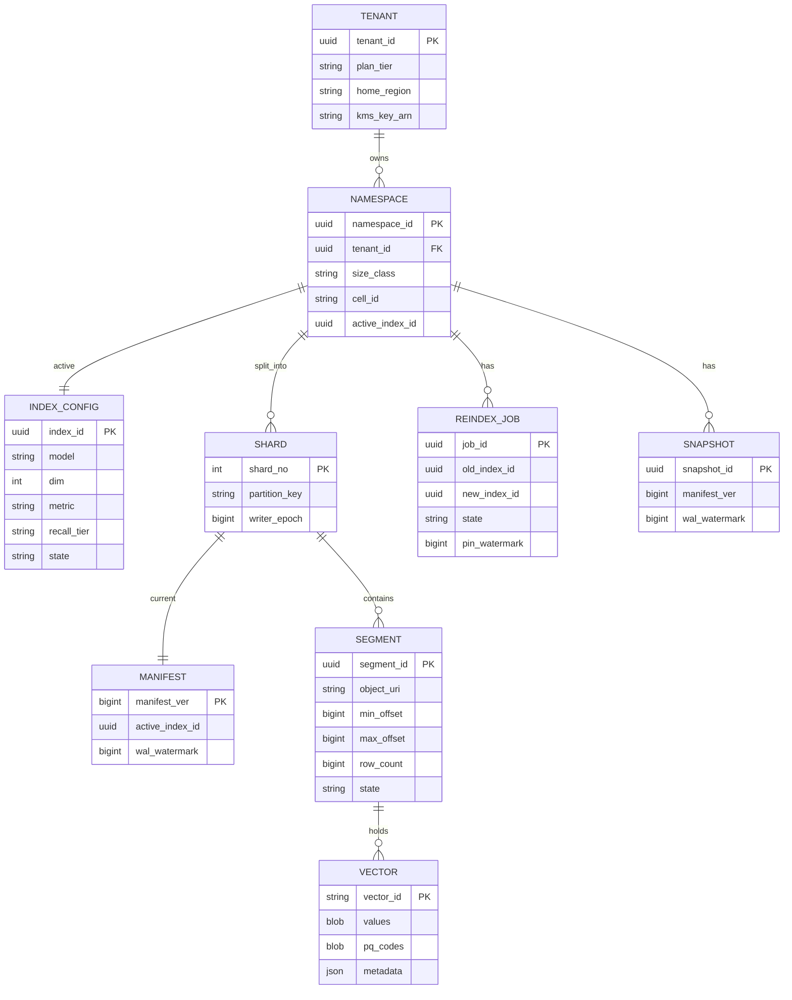

### Cell and deployment topology

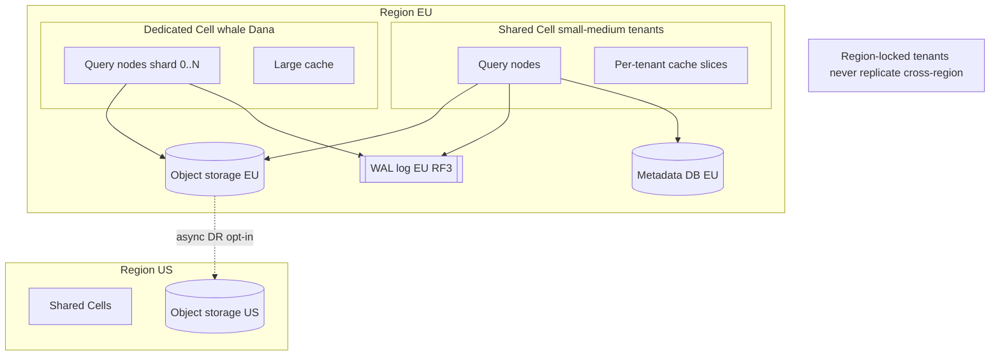

### Reindex state machine

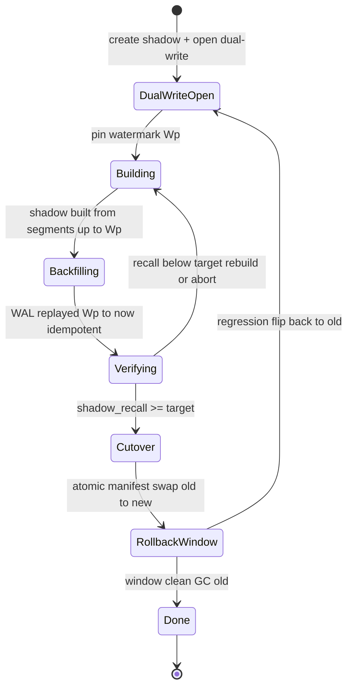

### End-to-end tiered data flow

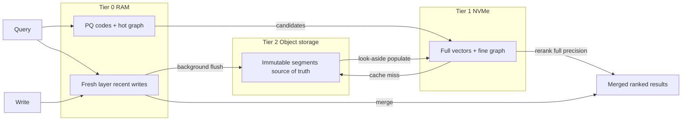

---

# Future Work and Open Questions

A design at this depth should be honest about what it defers and what remains genuinely uncertain. These are the deliberate "v2 and beyond" items and the questions worth prototyping before committing:

- **Adaptive `ef_search` from live recall feedback.** We tune `ef_search` per tier and per selectivity band, but a closed loop that nudges it from continuously measured per-namespace recall (§4.6) could hold the recall SLO at lower average latency. Open question: stability of the control loop under bursty load.
- **GPU-accelerated build and rerank.** Re-embedding and graph construction are the reindex bottleneck; GPU batch index build and GPU rerank could shrink whale reindex wall-clock substantially. Open question: whether the cost/throughput trade-off beats simply scaling the CPU build pool, given embedding-provider throughput is often the real ceiling.
- **Learned / adaptive quantization per namespace.** PQ at m=128 is a fleet default; per-namespace learned quantization (OPQ, or learned codebooks tuned to a tenant's distribution) could improve the recall/memory point for whales specifically. Trade-off: added build complexity and per-tenant training.
- **Cross-namespace federated search.** Explicitly out of scope for v1, but some customers will want to search across several of *their own* namespaces. The clean extension is a scatter-gather over namespaces with per-namespace planning and a final fusion — bounded to a single tenant's namespaces to preserve isolation.
- **Tiered/serverless cold namespaces.** The long tail of idle namespaces could drop to near-zero serving cost by evicting all cache and paying a cold-start (re-warm from object storage) on the next query — trading first-query latency for idle cost. Open question: how to price and SLO a cold-start tier.
- **Stronger cross-shard snapshot semantics.** Per-shard snapshot isolation is the default; a cheap globally consistent snapshot for whales (beyond the light barrier) may be worth a more sophisticated coordinated-watermark protocol if customers demand transactionally consistent backups.
- **RPO≈0 cross-region for non-locked tenants.** Synchronous cross-region replication is offered but latency-costly; a quorum-across-regions write mode with careful placement could narrow the RPO without full synchronous cost. Open question: whether any customer will actually pay the latency.

None of these block the v1 described above; each is a known edge of the envelope rather than a gap in it.

---

# Closing Assessment

This design treats a multi-tenant vector database as three intertwined problems and refuses to let any one of them dominate. The **storage spine** — log-structured, compute/storage-separated, with a durable WAL, a seconds-fresh in-memory tail, and immutable object-storage segments — makes writes cheap, reads fast, rebalancing free of bulk data movement, and reindex buildable on the side. On top of it, **tenant isolation** is enforced as two independent walls: a *data* wall (per-namespace indexes with no cross-tenant edges, schema-enforced keys, per-tenant envelope encryption, and dedicated cells for compliance) and a *performance* wall (cellular placement, cost-aware admission control, weighted-fair queuing, concurrency bulkheads, cgroups weights, and per-tenant cache reservations) — paying the honest price that strict isolation costs utilization. And the **hard ANN-specific problems** are met head-on: a selectivity-aware planner that picks pre-, in-, or post-filtering per query and never silently collapses recall; a live-reindex protocol whose dual-write-before-watermark ordering makes lost writes structurally impossible while delivering atomic cutover and instant warm rollback; and tiered storage with PQ-plus-rerank that bends the recall/latency/cost triangle per tenant rather than globally.

The design is deliberately explicit about where it breaks — fresh-layer bloat, whale reindex storms, cache thrash, the filtered-search cliff, region-locked tenants that cannot fail over — and pairs each with a concrete mitigation or an openly stated trade-off rather than a hand-wave. Its defaults (PA/EL consistency, bounded staleness with opt-in strong read-your-writes, RRF hybrid fusion, DiskANN-style SSD serving) favor the common case while leaving an explicit, paid escape hatch for the demanding one. That posture — make the cheap, fast, available choice the default, and sell correctness and isolation as deliberate, priced upgrades — is, in the end, what makes a system like this both operable for the SRE and trustworthy for the tenant.
