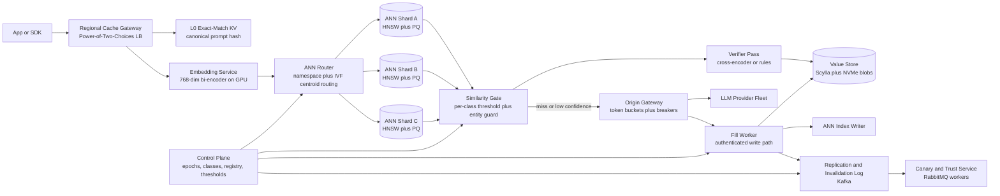
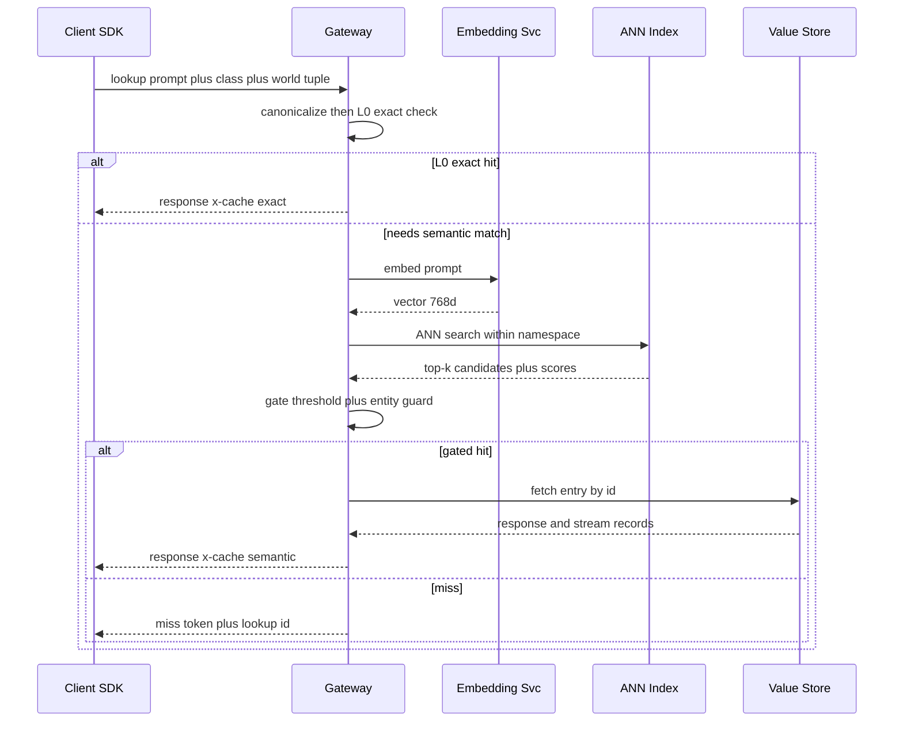
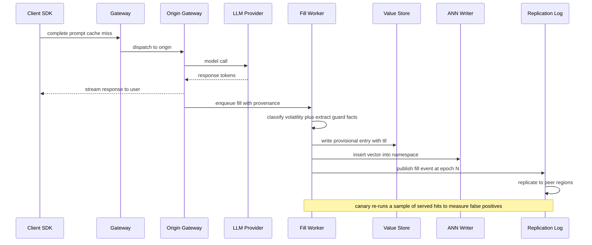
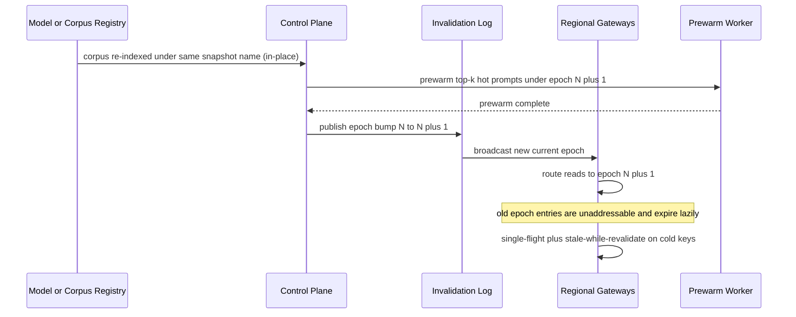
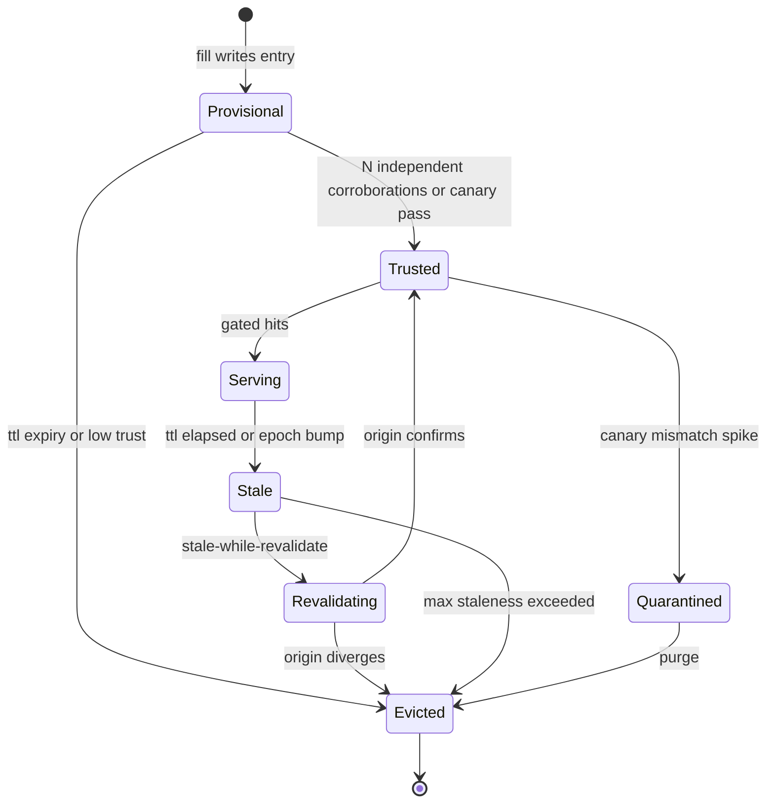
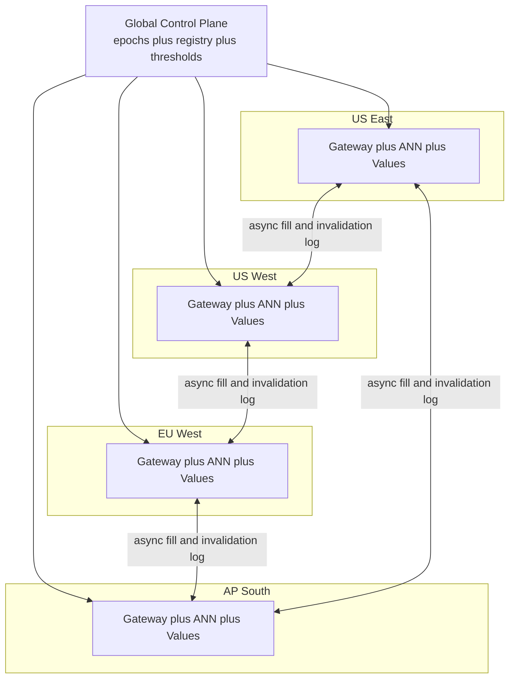
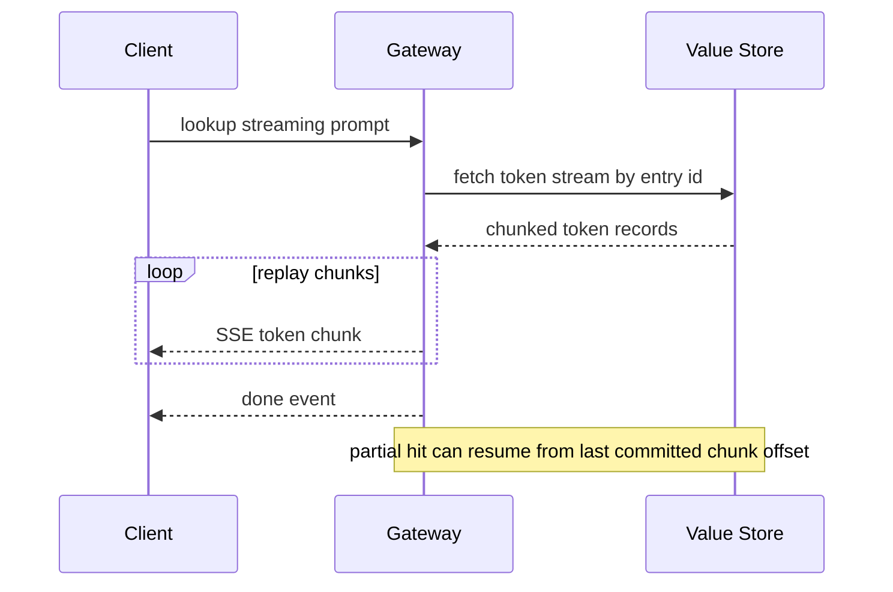
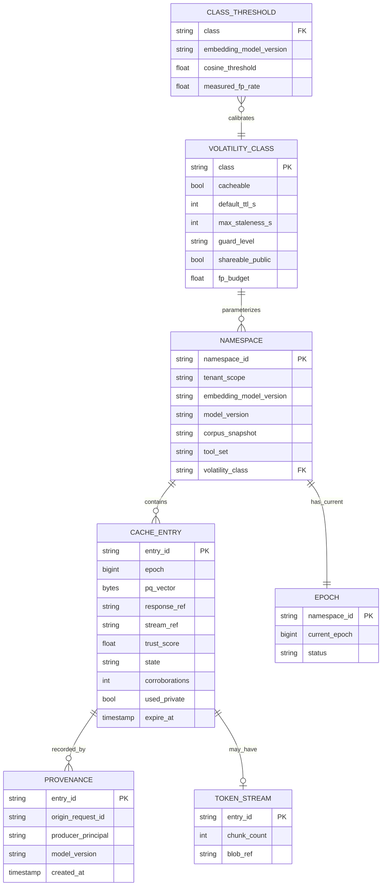
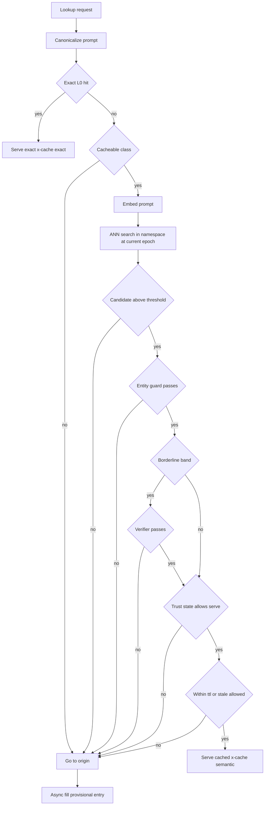

# Cross-Region LLM Inference Cache with Semantic Dedup — System Design

A production-grade design for a distributed, cross-region cache that sits between an LLM-calling fleet and the model providers behind it. Unlike an exact-string prompt cache, this system deduplicates **semantically equivalent** prompts using embedding-based nearest-neighbor lookup, so two differently-worded requests that mean the same thing can share one answer. The hard part is not the lookup; it is serving a cached answer that is *actually correct* for the new prompt while bounding staleness, surviving model and corpus version churn, and refusing to let an adversary seed a response that later serves to someone else. This document treats correctness, invalidation, and poisoning resistance as first-class subsystems rather than afterthoughts.

## Discovery Conversation

The transcript below is a working session between **Client** (VP of AI Platform Engineering at the customer, who owns the inference budget and the gateway SLOs) and **Architect** (the distinguished engineer driving the system design). It explains the product and correctness choices that shape the architecture, especially around the correctness-versus-hit-rate trade-off, invalidation on model and corpus rollover, the volatility of "live data" prompts, and cache poisoning.

---

**Architect:** Before we draw a single box, tell me who actually touches this system on a normal workday. Not "users" in the abstract — the real people.

**Client:** Three groups. First is Priya, my platform/infra lead. She owns the inference cost line and the fleet SLOs. Her day is dashboards: hit rate, dollars saved, p99 lookup latency, origin queue depth. When cost spikes or a "wrong answer" incident lands, she's the one paging people. Second is Marcus, a staff engineer on a product team — he builds a customer-support copilot and a code-explanation feature. He wraps his model calls with our SDK and wants the cache to be invisible until it isn't. Third is Dr. Lena Ortiz, our ML and safety lead. She owns the embedding model, the similarity thresholds, and the verifier and canary sampling that keep us honest about correctness.

**Architect:** Walk me through Priya's morning.

**Client:** She opens the cost dashboard and sees that overnight the support copilot's cache hit rate dropped from 55% to 31%. She drills in and finds someone rolled the RAG corpus at 2am, which invalidated a whole namespace. She checks that the invalidation didn't stampede the origin fleet — it didn't, because we bumped an epoch instead of deleting millions of keys — and that the hit rate is climbing back as the cache refills. Then she gets a Slack from Marcus: a user got a subtly wrong answer that looked cached. She pulls the entry's provenance, sees it was a semantic match at 0.94 cosine on a prompt where a dollar figure differed, and files it with Lena to tighten the entity guard.

**Architect:** That one story already tells me four things. First, hit rate is a business metric, not vanity — a 24-point drop is a budget event. Second, invalidation on corpus rollover has to be *cheap and stampede-free*, or every model and corpus bump becomes an outage. Third, "looked cached but was wrong" is the defining failure of a semantic cache and we need provenance on every entry to investigate it. Fourth, a high cosine score is *not* proof of equivalence when a number or a named entity differs. Hold that thought — it becomes the entity guard in the gating subsystem.

**Client:** Marcus's day is simpler. He calls our OpenAI-compatible endpoint or our SDK, sets a cache class per route — "this summarizer is cacheable for an hour, this live-pricing tool is never cacheable" — and mostly forgets about us. When he debugs, he wants a response header that says hit, miss, or provisional, and a trace ID.

**Architect:** Good, that confirms two surfaces: a transparent proxy mode for teams that want zero code, and a look-aside SDK for teams that want control. And an `x-cache` header with a decision and a trace ID is non-negotiable for debuggability.

**Architect:** Lena. What does her week look like?

**Client:** She reviews the canary report — we re-run a small sample of cache hits against the real model and diff the answers to estimate how often we served something wrong. If a class drifts, she retunes its threshold or shortens its TTL. Once a quarter she has to migrate the embedding model to a better one, which terrifies everyone because you cannot compare vectors across embedding versions.

**Architect:** That last sentence is load-bearing. The embedding model version is part of the cache key whether we like it or not — a vector from model A is meaningless against model B's index. Embedding migration is therefore a full namespace turnover, like a model or corpus bump, and we will design it the same way: dual-write a shadow index, re-embed in the background, cut traffic over to the new namespace, and let the old vectors age out.

### Who pays, and at what scale?

**Architect:** Who actually pays for this, and what scale do I plan around?

**Client:** We're the platform org. The "paying customer" is really the company's inference budget — we operate a shared fleet that roughly forty internal product teams plus a set of external API customers bill against. Today that fleet serves on the order of fifty thousand inference requests per second at peak, call it twelve to fifteen thousand on a quiet hour, across four regions. The origin is a few thousand GPUs. The blended origin spend is in the tens of millions of dollars a month. If you can cut a third of the origin calls without serving garbage, that pays for this system many times over.

**Architect:** So the scale anchor is roughly: 50k QPS peak, ~3,000 GPUs of origin behind us, four regions, tens of millions of dollars a month in spend, and a target of a 30%-plus reduction in origin calls. That framing matters because it tells me what *not* to optimize. The cache itself must be cheap relative to the inference it saves; if my verifier or my canary re-execution burns more compute than the cache saves, I've built a liability. Every correctness mechanism in this design has to carry its own cost budget.

**Client:** Exactly. Cheap insurance, not a second inference fleet.

**Architect:** Then let me ask the three questions that genuinely fork this design. Each one changes the architecture, not just a config value.

### Question 1 — When a match is "close but not identical," is a slightly-wrong answer ever acceptable?

**Architect:** In plain language: a semantic cache works by deciding that two differently-worded prompts mean the same thing. Sometimes it will be wrong — the prompts were *almost* the same but differed in a way that matters. For which of your traffic is a "close enough" answer acceptable, and for which must the served answer be correct for the new prompt, full stop?

**Client:** It's a spectrum. For a support copilot summarizing our help center, a near-miss is annoying but survivable. For anything with a number, a name, a date, a price, an account ID — or for code generation — a near-miss is a real incident. And we have a couple of regulated flows where a wrong answer is unacceptable.

**Architect:** That single answer forks the whole correctness story. It means there is no global similarity threshold; thresholds are **per volatility class**, calibrated to a target false-positive rate that the class can tolerate. It means high-stakes classes get an **entity and number guard**: even at 0.97 cosine, if the query and the cached prompt disagree on an extracted entity, number, unit, or date, we treat it as a miss. It means we need a **verifier pass** — a cheap second opinion, a cross-encoder or a rule check, that runs before we serve a borderline match. And it means we need **canary re-execution sampling**: we re-run a small random fraction of *served hits* against the real model and measure how often we were wrong, live, in production, so the false-positive rate is a number on a dashboard and not a hope. If a class's measured false-positive rate exceeds its budget, we automatically raise its threshold or stop caching it.

**Client:** So we can be aggressive where it's safe and paranoid where it isn't, and we can prove which is which.

**Architect:** Precisely. The default for any unclassified traffic is paranoid: high threshold, entity guard on, verifier on. We earn aggressiveness with evidence.

### Question 2 — How fresh must answers be, and who signals that the world changed?

**Architect:** Second question. A cached answer can rot two ways. The prompt's *meaning* might be time-sensitive — "what's the weather now" is stale in minutes. Or the *world behind the prompt* changed — you shipped a new model version, you re-indexed the RAG corpus, you changed the tool set the model can call. What is the maximum staleness you tolerate, and who owns the signals that the world changed?

**Client:** Staleness tolerance is per use case again. Knowledge-base answers can be hours or a day old. Anything touching live data — pricing, inventory, "latest," "today" — is minutes or not cacheable at all. As for the world changing: model version comes from our model registry, corpus snapshot comes from the retrieval team's indexer, and tool set comes from the agent config. All three emit events today.

**Architect:** Then the cache key is not the prompt. The key is the prompt's semantic cluster **plus** a versioning tuple: model version, corpus snapshot, tool set, and — from question one's follow-on — the embedding model version. An entry is only valid for the exact world it was produced in. When any of those versions rolls over, every entry under the old tuple must stop serving. The naive way to do that is to delete millions of rows, which would stampede the origin as everything misses at once and re-queries the model. We will not do that. Instead each versioning tuple maps to a **namespace**, and each namespace carries an **epoch counter** for in-place retirement; rolling a keyed version routes new traffic to a fresh namespace (and a forced in-place purge **bumps the epoch**), which makes the old entries unaddressable and lets them expire lazily, while a **prewarm** step refills the top-K hottest prompts *before* the cutover, and **single-flight plus stale-while-revalidate** absorb the cold misses. Staleness itself becomes a **volatility classifier**: it decides, per prompt, whether the answer is cacheable and for how long.

**Client:** And the live-data prompts?

**Architect:** They get their own class with either a no-cache verdict or a TTL measured in seconds with an explicit freshness check. The classifier looks for time deixis — "now," "today," "latest," "current" — for volatile entities, and for retrieval signals, and when it is unsure it fails toward *not* caching. The cost of a false "cacheable" on a live-data prompt is a wrong answer; the cost of a false "not cacheable" is one extra origin call. That asymmetry sets the default.

### Question 3 — Is the write path trusted, or can an adversary influence what gets cached?

**Architect:** Third question, and it's the one most teams skip until it bites them. Who can write into this cache? If any client, or any tenant, can cause a response to be stored, then an attacker can craft prompts that seed a malicious or wrong answer that *later serves to a different user*. Is your traffic a trusted internal fleet, or is it multi-tenant and partially untrusted?

**Client:** Multi-tenant and partially untrusted. External API customers share the fleet. And even internally, one team's prompts shouldn't be able to corrupt another team's answers, and one tenant's private data must never leak into another tenant's cache hit.

**Architect:** Then poisoning and confidentiality are co-equal requirements with cost savings. Three consequences. First, **the write path is authenticated and privileged** — clients never write responses directly; only the origin-fill workers, which observed a real model call, can write, and they stamp provenance. Second, **tenants get isolated namespaces by default**; cross-tenant sharing is opt-in and only for classes proven to carry no tenant-private or RAG-private context, because a shared entry produced from tenant A's private corpus serving to tenant B is a data breach, not a cache hit. Third, an entry doesn't get to be **trusted** the moment it's written — it starts **provisional**, and it earns trust through **independent corroboration** and **sampled re-verification** before it serves widely. A single adversarial fill cannot flip a popular cluster's answer, because flipping requires multiple independent, authenticated corroborations and survives canary diffing.

**Client:** So the cache is guilty until proven innocent.

**Architect:** For anything that could serve to a third party, yes. That's the only safe default when the write path isn't fully trusted.

### Use-case probes

**Architect:** Now let me poke at edges that surface non-obvious constraints. Degraded operation: if the cache cluster is down, what should happen?

**Client:** The product must keep working. A cache outage cannot take down inference.

**Architect:** Then the cache **fails open to origin** on the availability axis: a lookup error becomes a normal origin call, slower and pricier but correct. But there's a subtlety — we fail open for *availability*, never for *correctness*. If the verifier is down, we do not serve an un-verified borderline match; we treat it as a miss and go to origin. Availability degradation is acceptable; correctness degradation is not.

**Architect:** Inverse case: origin is down or rate-limiting hard. May we serve stale?

**Client:** For knowledge classes, yes — a slightly stale answer beats an error. For live-data classes, no.

**Architect:** That's **stale-if-error**, gated per class. An entry past its TTL but within a class-specific max-staleness window can serve when origin is unavailable, flagged as stale. Live-data classes set max-staleness to zero and simply error or degrade.

**Architect:** Multi-tenant boundary again, concretely. Two tenants ask the literally identical public question — "explain HTTP 429." Do they share an entry?

**Client:** If it's genuinely public knowledge with no private context, sharing is great — that's free hit rate. If either answer was produced using private corpus or tools, absolutely not.

**Architect:** So sharing is a property of the *class and the provenance*, not the prompt text. A class flagged `shareable_public` with provenance proving no private retrieval can live in a shared namespace; everything else lives in a per-tenant namespace. The classifier and the fill worker jointly decide, and the default is per-tenant.

**Architect:** Cross-entity invariant. What is the one rule that must always hold for an entry to be served?

**Client:** Say it plainly so I can repeat it to auditors.

**Architect:** An entry may be served only if its embedding-model version, model version, corpus snapshot, and tool set all match the requester's current world, its namespace epoch is current, its TTL or staleness budget allows it, the similarity gate and entity guard pass, and — for non-trusted-write classes — its trust state permits serving. If any clause fails, it is a miss. That conjunction is the correctness contract of the whole system.

**Architect:** Geography. The fleet is four regions. Do reads cross regions?

**Client:** Reads should be local — latency matters. But a fill in one region should benefit the others; we don't want every region to re-pay the origin cost for the same popular prompt.

**Architect:** Then it's **read-local, write-local-then-replicate**: each region serves from its own in-region index and value store for single-digit-millisecond lookups, and fills and invalidations propagate **asynchronously** over a replication log to the other regions. Consistency across regions is **eventual** with **read-your-writes within a region**. Conflicts are rare because entries are content-addressed and idempotent; when two regions produce different answers for the same cluster, we resolve by **trust score then timestamp**, and critically, **invalidations outrank fills** so a late-arriving fill can never resurrect content an epoch bump already retired. That's a PACELC stance: under partition we favor availability of lookups; absent partition we favor latency over cross-region consistency — except for invalidation, which we propagate urgently.

**Architect:** Streaming. Your copilots stream tokens. Can we cache and replay a stream, and what about a half-finished one?

**Client:** Yes to replay — re-streaming a cached answer should feel like the model is typing. And if a generation gets cut off, we shouldn't cache a truncated answer as if it were complete.

**Architect:** So we store the **ordered token stream**, not just the final string, and replay it over SSE. We **only commit a stream to cache on clean completion** — a truncated or errored stream is never cached as a hit, though a known-bad result may be negative-cached briefly. And we support **partial-hit continuation**: a stream interrupted mid-replay resumes from the last committed chunk offset rather than restarting.

**Architect:** Integrations. What do we have to speak to on day one?

**Client:** Our model registry for version events, the retrieval team's indexer for corpus-snapshot events, the agent platform for tool-set config, our origin gateway in front of the providers, and the SDK plus an OpenAI-compatible proxy for product teams. Observability into our existing metrics and tracing stack.

**Architect:** That set confirms a **control plane** that ingests version events and owns epochs, classes, and thresholds, separate from the **data plane** that serves lookups. The control plane is small, strongly consistent, and globally replicated; the data plane is large, eventually consistent, and regional. Keeping them separate is what lets a global model rollover be a control-plane event instead of a data-plane meltdown.

### Out of scope

**Architect:** Let me state what we are *not* building, so the design stays coherent.

**Client:** Please.

**Architect:** We are not building the LLM serving fleet itself — that origin is a separate system; we front it. We are not building a general-purpose vector database product; our ANN index is purpose-built for this cache. We are not training or fine-tuning the embedding model — we consume one and version it. We are not building a RAG retrieval cache for document chunks, though it's a cousin. We are not doing prompt-injection detection on user *content* as a safety product; our poisoning defense protects the *cache*, not the model's behavior. We are not a billing or metering product, though we emit the events one would need. And exact-string caching is in scope only as a trivial L0 fast path in front of the real, semantic system.

**Client:** Agreed. Keep it to the cache and its correctness.

### Decisions locked in this conversation

| Decision | Rationale | Manifests in |
|---|---|---|
| Per-class similarity thresholds, not one global threshold | The acceptable false-positive rate varies wildly from FAQ summarization to code and regulated flows | [1.2 Functional Requirements](#12-functional-requirements), [3.1 Similarity Gating](#31-similarity-gating) |
| Entity and number guard on high-stakes classes | A high cosine score is not proof of equivalence when a number, name, unit, or date differs | [3.1 Similarity Gating](#31-similarity-gating) |
| Verifier pass plus canary re-execution sampling | False-positive rate must be a measured, bounded, dashboarded number, not a hope | [1.3 Non-Functional Requirements](#13-non-functional-requirements), [3.1 Similarity Gating](#31-similarity-gating) |
| Cache key is the semantic cluster plus a versioning tuple | An answer is valid only for the exact model, corpus, tool set, and embedding version that produced it | [2.4 Data Model and Keying](#24-data-model-and-keying), [3.2 Invalidation Plane](#32-invalidation-plane) |
| Epoch bump for mass invalidation, never bulk delete | Rolling a model or corpus must not stampede the origin fleet | [3.2 Invalidation Plane](#32-invalidation-plane), [4.1 Where It Breaks at 10x and 100x](#41-where-it-breaks-at-10x-and-100x) |
| Volatility classifier decides cacheability and TTL, default to no-cache | The cost of caching a live-data prompt is a wrong answer; the cost of not caching it is one origin call | [3.3 Volatility Classifier](#33-volatility-classifier) |
| Authenticated, privileged write path; entries start provisional | An untrusted multi-tenant write path lets attackers seed answers served to others | [3.4 Poisoning and Confidentiality Defense](#34-poisoning-and-confidentiality-defense) |
| Per-tenant namespaces by default; sharing is opt-in by class and provenance | A shared entry built from one tenant's private context serving another tenant is a breach | [2.5 Sharding and Partitioning](#25-sharding-and-partitioning), [3.4 Poisoning and Confidentiality Defense](#34-poisoning-and-confidentiality-defense) |
| Read-local, write-local-then-replicate; eventual cross-region with invalidations outranking fills | Local lookups for latency; a late fill must never resurrect retired content | [3.5 Multi-Region Consistency](#35-multi-region-consistency) |
| Fail open to origin for availability, never for correctness | A cache outage may not break inference, but it also may not serve unverified matches | [4.3 Single Points of Failure](#43-single-points-of-failure), [4.4 Failure Playbooks](#44-failure-playbooks) |
| Cache token streams; commit only on clean completion; support partial-hit continuation | Replay must feel native and a truncated generation must never masquerade as a complete hit | [3.6 Streaming and Partial Hits](#36-streaming-and-partial-hits) |
| Out of scope: origin serving, general vector DB, embedding training, RAG doc cache, injection detection, billing | Keeps the system shippable and the correctness story coherent | [1.4 Out of Scope](#14-out-of-scope) |

---

## Table of Contents

- [Discovery Conversation](#discovery-conversation)
- [Plain-English Glossary](#plain-english-glossary)
- [Part I: Requirements and Scope](#part-i-requirements-and-scope)
  - [1.1 Product and Problem Definition](#11-product-and-problem-definition)
  - [1.2 Functional Requirements](#12-functional-requirements)
  - [1.3 Non-Functional Requirements](#13-non-functional-requirements)
  - [1.4 Out of Scope](#14-out-of-scope)
  - [1.5 Scale Targets and Back-of-the-Envelope](#15-scale-targets-and-back-of-the-envelope)
  - [1.6 Workload Shape](#16-workload-shape)
- [Part II: High-Level Architecture and Data Model](#part-ii-high-level-architecture-and-data-model)
  - [2.1 Architecture Diagram](#21-architecture-diagram)
  - [2.2 Request Lifecycle](#22-request-lifecycle)
  - [2.3 API Contract](#23-api-contract)
  - [2.4 Data Model and Keying](#24-data-model-and-keying)
  - [2.5 Sharding and Partitioning](#25-sharding-and-partitioning)
- [Part III: Deep Dive on Hard Components](#part-iii-deep-dive-on-hard-components)
  - [3.1 Similarity Gating](#31-similarity-gating)
  - [3.2 Invalidation Plane](#32-invalidation-plane)
  - [3.3 Volatility Classifier](#33-volatility-classifier)
  - [3.4 Poisoning and Confidentiality Defense](#34-poisoning-and-confidentiality-defense)
  - [3.5 Multi-Region Consistency](#35-multi-region-consistency)
  - [3.6 Streaming and Partial Hits](#36-streaming-and-partial-hits)
- [Part IV: Bottlenecks, Trade-offs, and Reliability](#part-iv-bottlenecks-trade-offs-and-reliability)
  - [4.1 Where It Breaks at 10x and 100x](#41-where-it-breaks-at-10x-and-100x)
  - [4.2 Trade-off Register](#42-trade-off-register)
  - [4.3 Single Points of Failure](#43-single-points-of-failure)
  - [4.4 Failure Playbooks](#44-failure-playbooks)
- [Architectural Diagrams](#architectural-diagrams)
- [Closing Assessment](#closing-assessment)

---

## Plain-English Glossary

**Semantic cache.** A cache that returns a stored answer when a new request *means the same thing* as a previous one, even if the wording differs. Contrast with an exact-string cache, which requires byte-identical prompts.

**Embedding.** A list of numbers (a vector) that represents the meaning of a piece of text, produced by an embedding model. Two texts with similar meaning have vectors that point in similar directions.

**Bi-encoder.** An embedding model that encodes each text independently into one vector. Fast, because you can embed and index ahead of time. Used here to produce the vectors we search.

**Cross-encoder.** A model that reads two texts *together* and scores their relationship. Far more accurate than comparing two independent vectors, but too slow to search a whole index — so we use it only as a verifier on a handful of candidates.

**ANN (Approximate Nearest Neighbor).** Finding the vectors closest to a query vector *approximately* but very fast, trading a little recall for a lot of speed. Exact nearest-neighbor over hundreds of millions of vectors is too slow.

**HNSW.** Hierarchical Navigable Small World graph — an ANN index that searches a layered graph of vectors. Excellent low-latency recall; memory-hungry; the default for our hot index.

**IVF.** Inverted File index — an ANN method that clusters vectors into cells and searches only the cells nearest the query. Cheaper memory and a natural way to route a query to a subset of shards; coarser recall.

**PQ / OPQ.** Product Quantization (and its Optimized variant) — compresses each vector into a short code (tens of bytes) so millions fit in RAM. Trades a little accuracy for a large memory saving.

**Recall.** The fraction of true nearest neighbors the ANN search actually finds. Higher recall means fewer missed cache hits but more work per query.

**Cosine similarity / inner product.** Standard ways to measure how aligned two vectors are. We threshold on this to decide a candidate "means the same thing."

**Similarity gate.** The decision step that turns a candidate score into a hit-or-miss verdict, using a per-class threshold plus guard checks.

**Entity guard.** A hard check that the query and the cached prompt agree on extracted numbers, names, units, and dates. Blocks high-cosine-but-materially-different matches.

**False-positive match.** A semantic match that the gate accepted but that was actually wrong for the new prompt — the core failure mode of a semantic cache.

**Verifier pass.** A cheap second opinion (cross-encoder or rule check) run on a borderline candidate before serving it.

**Canary re-execution.** Re-running a small random sample of *served hits* against the real model and diffing the answers, to measure the live false-positive rate.

**Volatility class.** A category that says how time-sensitive a prompt is and therefore whether it is cacheable and for how long — from static knowledge to live data.

**TTL (Time To Live).** How long an entry may serve before it is considered expired.

**Max staleness.** A per-class budget for how far past TTL an entry may still serve when the origin is unavailable (stale-if-error).

**Negative caching.** Caching the fact that a prompt produced no good answer or an error, briefly, to avoid hammering the origin with the same failing request.

**Versioning tuple.** The set of world-state identifiers an answer depends on: embedding-model version, model version, corpus snapshot, and tool set. Part of the cache key.

**Namespace.** A logical partition of the cache for one versioning tuple (and tenant scope and class). Entries only match within a namespace.

**Epoch.** A monotonic counter per namespace. Bumping it retires every entry under the old value from normal lookups without deleting rows — the basis of stampede-free *in-place* mass invalidation. A *soft* bump (version refresh) permits one stale-while-revalidate serve; a *hard* bump (safety recall) permits none. (A keyed-version rollover is a separate mechanism — a brand-new namespace, not an epoch bump.)

**Cache stampede / thundering herd.** When many requests miss at once and all rush the origin for the same key, overloading it. Prevented with single-flight and prewarming.

**Single-flight.** Collapsing concurrent misses for the same key into one origin call whose result fills the others.

**Stale-while-revalidate / stale-if-error.** Serving a slightly stale answer immediately while refreshing in the background, or serving stale only when the origin errors.

**Provisional vs trusted entry.** A newly written entry is provisional and serves narrowly until independent corroboration and sampling promote it to trusted.

**Trust score.** A per-entry confidence that the entry is correct and safe to serve widely, raised by corroboration and lowered by canary mismatches.

**Poisoning.** An attack where an adversary causes a malicious or wrong response to be cached so it later serves to other users.

**Provenance.** The recorded origin of an entry: which authenticated request and model produced it, when, and under which world tuple.

**Read-your-writes.** A consistency guarantee that a client immediately sees its own writes, provided here within a single region.

**Eventual consistency.** Replicas converge over time; different regions may briefly disagree.

**CRDT.** Conflict-free replicated data type — a structure that merges concurrent edits deterministically. We note where it does *not* apply: LLM responses are not mergeable, so we resolve by trust and a logical tiebreak instead.

**HLC (Hybrid Logical Clock).** A clock that combines physical time with a logical counter so events can be ordered deterministically *without* trusting wall-clock synchronization across regions. We prefer the replication log's per-namespace offset for tiebreaks, and reach for an HLC only where a physical time is genuinely needed.

**CAP / PACELC.** Frameworks for distributed trade-offs. CAP: under a partition, choose consistency or availability. PACELC extends it: else (no partition), choose latency or consistency. This design is PA/EL — available and low-latency — except invalidation, which is propagated urgently.

**Consistent hashing.** A way to spread keys across nodes so adding or removing a node moves few keys. Used to place namespaces and value shards.

**Bloom filter.** A tiny probabilistic set that answers "definitely not present" or "maybe present" cheaply. Used to skip pointless lookups and to gate negative caches.

**Write-through vs look-aside.** Two cache-fill patterns. Write-through: the proxy always writes the origin response into the cache as part of serving it. Look-aside (cache-aside): the caller checks the cache, and on a miss calls origin and writes back. We offer both.

**WAL (Write-Ahead Log).** An ordered, durable log of changes. Our cross-region replication and invalidation propagate over a Kafka-style log with this character.

**Prefix caching / partial hit.** Reusing the leading portion of a response (or a prompt's KV state) when a new request shares a prefix, or resuming an interrupted stream from a checkpoint.

**Matryoshka embedding.** An embedding trained so that a truncated prefix of the vector is itself a usable, lower-dimensional embedding. Lets us use a short 256-dim vector for coarse search and the full 768-dim for re-ranking.

---

# Part I: Requirements and Scope

## 1.1 Product and Problem Definition

The product is an inference-cost-and-latency reducer that sits transparently in front of an LLM fleet. A caller asks the same *kind* of question many times in slightly different words; the system recognizes the equivalence, returns a previously computed answer, and skips a costly, slow model call. The value is real money saved and lower tail latency. The risk, and therefore the bulk of the engineering, is that a semantic match can be subtly wrong, can go stale, or can be poisoned.

Three properties distinguish this from an ordinary cache:

- **Matching is approximate and meaning-based.** The key is not the prompt bytes but the prompt's position in an embedding space, gated by a calibrated threshold and guard checks. This introduces a *correctness-versus-hit-rate* dial that an exact cache never has.
- **Validity is world-dependent.** An answer is only correct for the model version, corpus snapshot, tool set, and embedding version that produced it. The world moves, so invalidation is continuous and occasionally massive.
- **The write path is contested.** In a multi-tenant, partially untrusted fleet, the act of caching is a potential attack surface. Who wrote an entry, and whether it has been corroborated, is part of whether it may serve.

The design therefore optimizes three planes independently: a **lookup plane** tuned for sub-5ms in-region latency, a **fill-and-verify plane** tuned for correctness and cost control, and a **control plane** tuned for strongly-consistent, globally-replicated version and policy state.

## 1.2 Functional Requirements

| Requirement | Why it exists |
|---|---|
| Semantic lookup by embedding nearest-neighbor | The core feature: match prompts that mean the same thing without byte equality. |
| Exact-match L0 fast path | True repeats are common and cheap; a hash check short-circuits the embedding and ANN cost. |
| Similarity-threshold gating, per volatility class | The acceptable false-positive rate differs by use case; one global threshold is wrong for everyone. |
| Entity and number guard | High cosine is not equivalence when a number, name, unit, or date differs; high-stakes classes must block those matches. |
| Verifier pass on borderline matches | A cheap second opinion bounds false positives before serving. |
| Canary re-execution sampling | Measures the live false-positive rate so correctness is observable and self-correcting. |
| Per-class TTL and max-staleness | Different prompts rot at different rates; freshness must be configurable. |
| Volatility classification of prompts | Decides cacheability and TTL; excludes or bounds live-data prompts. |
| Negative caching | Avoids hammering origin with prompts known to fail or refuse, with poisoning safeguards. |
| Streaming-response caching and replay | Copilots stream; cached answers must replay as token streams. |
| Partial-hit continuation | An interrupted replay resumes from a checkpoint instead of restarting. |
| Keying by versioning tuple | An entry is valid only for its model, corpus, tool set, and embedding version. |
| Epoch-based mass invalidation | Model and corpus rollovers must retire namespaces without a stampede. |
| Authenticated, privileged write path | Only origin-fill workers that observed a real model call may write; clients may not inject responses. |
| Per-tenant namespaces with opt-in sharing | Isolation by default; cross-tenant sharing only for proven-public classes. |
| Trust scoring and sampled re-verification | Provisional entries earn the right to serve widely through corroboration. |
| Multi-region replication of fills and invalidations | A popular prompt should be paid for once globally, not once per region. |
| Graceful degradation to origin | A cache miss, an uncertain match, or a cache outage falls back to a correct origin call. |
| Observability: hit rate, dollars saved, p99, false-positive rate, per class and tenant | These are the business and safety metrics the platform team runs on. |
| OpenAI-compatible proxy and look-aside SDK | Teams choose zero-code transparency or fine-grained control. |

## 1.3 Non-Functional Requirements

| Dimension | Target | Reasoning |
|---|---|---|
| In-region lookup latency (embed + ANN + gate) | p50 < 1.5 ms, p99 < 5 ms | The cache must be far cheaper than the inference it replaces or it is pointless. |
| Cache-hit serve latency, gate-only path | p99 < 10 ms including value fetch | The common hit path with no synchronous verifier; should feel instantaneous next to a multi-second model call. |
| Cache-hit serve latency, verifier path | p99 < 25 ms on the borderline fraction | Borderline matches run a synchronous cross-encoder *off* the sub-5 ms lookup budget, tracked as a separate SLO; the band is kept to a small fraction of hits, and 25 ms is still ~100x under an origin call. |
| Lookup availability | 99.95%, fail-open to origin | A cache outage degrades cost and latency, never correctness or uptime. |
| Served false-positive rate, guarded classes | < 0.5%, measured by canary | The correctness SLO for high-stakes traffic; breach auto-raises thresholds. |
| Served false-positive rate, relaxed classes | < 2%, measured by canary | Looser budget where a near-miss is survivable. |
| Origin-call reduction | >= 30% blended, higher on cacheable classes | The business case; tracked as dollars saved. |
| Max staleness | Per-class, 0 s for live data up to 24 h for static knowledge | Freshness is a product decision, enforced by the classifier and TTLs. |
| Invalidation propagation | Epoch bump visible in all regions < 5 s | A retired model or corpus must stop serving promptly everywhere. |
| Cross-region fill convergence | < 60 s typical | A fill in one region should benefit others quickly but need not be synchronous. |
| Consistency: control plane (epochs, classes, thresholds) | Strong, globally replicated | Version and policy state cannot be ambiguous; a stale epoch serves retired answers. |
| Consistency: data plane (entries) | Eventual across regions, read-your-writes in region | Lookups favor latency; correctness is enforced by the versioning tuple, not by global consensus. |
| Poisoning resistance | No single authenticated write can flip a widely-served answer | Promotion to trusted requires independent corroboration and survives canary diffing. |
| Tenant isolation | Namespace-scoped, default per-tenant | Cross-tenant content leakage is a severity-one incident. |
| Durability of entries | Entries are reconstructable; loss degrades hit rate, not correctness | A lost entry is a cache miss, so the value store favors availability over expensive durability. |

A deliberate inversion from a typical OLTP system: **we do not need strong durability of cache entries.** Losing an entry costs one origin call. We spend our consistency budget on the *control plane* — epochs, thresholds, classes — where a stale read actually serves a wrong answer.

## 1.4 Out of Scope

- The LLM serving fleet itself (the origin). We front it; we do not build it. See the repo's GPU-inference designs for that layer.
- A general-purpose vector database product. Our ANN index is purpose-built for this cache's keying and lifecycle.
- Training or fine-tuning the embedding model. We consume and version one.
- A RAG document-chunk retrieval cache. Related, but a different keying and freshness model.
- Prompt-injection detection on user *content* as a safety product. Our defenses protect the cache, not the model's behavior.
- Billing and metering as a product, though we emit the necessary events.
- Exact-string caching as the primary mechanism; it exists only as the trivial L0 fast path.

## 1.5 Scale Targets and Back-of-the-Envelope

The issue leaves scale open, so we commit to explicit targets and size the infrastructure to them. All numbers are planning anchors for mental math, not SLAs.

### Locked scale targets

| Parameter | Value | Note |
|---|---|---|
| Aggregate lookup QPS | 50,000 peak, ~15,000 average | Across 4 regions. |
| Regions | 4 | us-east, us-west, eu-west, ap-south. |
| Origin fleet fronted | ~3,000 GPUs | H100-class, the cost we are reducing. |
| Embedding model | bi-encoder, 768-dim, Matryoshka | 256-dim truncation for coarse ANN, 768-dim for re-rank. |
| Vector storage in hot index | PQ/OPQ codes ~96-128 B/vector | Full fp16 vectors (1.5 KB) kept on NVMe for re-rank. |
| Hot working set | ~300M live entries, design to 500M | Distinct semantic clusters across namespaces. |
| Hot ANN index footprint | <= ~1.5 TB RAM aggregate | Codes + HNSW graph, replicated x3, headroom for many namespaces. |
| Value/response tier | <= ~10 TB NVMe hot, spill to object storage | Compressed responses and token streams. |
| Read:write ratio | ~3:1 | Lookups vs fills at steady state. |
| Steady-state semantic hit rate (cacheable) | ~55% | Effective overall ~35-40% including non-cacheable traffic. |

### QPS and the read/write split

Every request is a lookup (a read against the ANN index and value store). A *miss* on a cacheable prompt becomes a fill (a write). With ~70% of traffic in cacheable classes and ~55% steady-state hit rate on those:

- Lookups at peak: `50,000/s`.
- Cacheable misses (fills) at peak: `50,000 * 0.70 * 0.45 ~= 15,750/s`.
- Read:write therefore `~50,000 : ~16,000`, about **3:1** — read-heavy, but with a substantial, latency-tolerant write path.

The 3:1 ratio justifies the split between a **latency-critical read tier** (HNSW in RAM, replicated for read fan-out) and an **asynchronous write/fill tier** (queue-buffered, never on the request's critical path).

### Embedding throughput and cost

Embeddings are computed only for prompts that reach the semantic path. We budget *conservatively*, as if every non-L0 prompt were embedded: if the L0 exact-match path absorbs ~12% of traffic, that ceiling is ~44,000/s at peak. In practice the classifier's explicit-class tags and rules layer divert obvious non-cacheable prompts straight to origin **before** embedding (see the [read-decision flow](#read-decision-flow), which gates on cacheability *before* the embed step), so the real embedding rate is lower — the surplus capacity is deliberate headroom, not waste.

- A compact bi-encoder (~100-300M params) over short prompts, with dynamic batching, sustains on the order of `1,000-3,000 embeddings/s per GPU`.
- At that 44,000/s ceiling (`44,000 / 1,000-3,000` per GPU) that is roughly **15-45 GPUs** dedicated to embedding across regions.
- Embedding p99 budget: `< 2 ms` with dynamic batching capped at a small max-delay (e.g., 1-2 ms) so batching never blows the lookup SLO. Trade-off: larger batches improve GPU efficiency but add queuing latency — we cap batch-wait to protect p99.

This is the single largest fixed cost of the cache itself, so it is explicitly budgeted: the embedding GPUs must cost far less than the origin GPUs they save. At 30%+ origin reduction on a ~3,000-GPU fleet (~900 GPU-equivalents saved), spending ~15-45 GPUs to embed is a roughly **20:1 or better** compute return — the design's core economic justification.

### Vector and value storage

Per entry:

| Component | Size | Tier |
|---|---:|---|
| PQ/OPQ vector code | ~96-128 B | RAM (hot ANN index) |
| HNSW graph overhead (M~32) | ~150-300 B | RAM |
| Full fp16 vector (re-rank) | ~1.5 KB | NVMe |
| Response (compressed) | ~1-2 KB avg, ~20 KB p95 | NVMe + object spill |
| Token-stream records | ~1-3 KB when present | NVMe + object spill |
| Metadata (keys, trust, TTL, provenance) | ~256 B | NVMe/KV |

At 300M entries:

- Hot ANN codes + graph: `300M * ~400 B ~= 120 GB` per replica; x3 replication and multiple namespaces lands comfortably under the **1.5 TB** budget.
- Full vectors on NVMe: `300M * 1.5 KB ~= 450 GB`.
- Responses: `300M * ~2 KB ~= 600 GB` compressed; with token streams and x3 replication, a few TB — under the **10 TB** NVMe budget, with colder entries spilled to object storage.

The takeaway sizing decision: **the hot ANN index fits in RAM only because of PQ compression.** Full fp16 vectors at 300M would be 450 GB per replica — survivable but wasteful of the most latency-critical tier. PQ buys an ~10x memory reduction at a small recall cost, recovered by re-ranking the top candidates against full vectors on NVMe.

### Cross-region replication bandwidth

Fills and invalidations replicate to the other three regions over a log:

- Fill event payload: PQ vector + compressed response + metadata, `~2-3 KB`.
- Peak fills `~16,000/s`, fan-out to 3 regions: `16,000 * 2.5 KB * 3 ~= 120 MB/s` sustained cross-region.
- Invalidations are tiny (an epoch bump is a few bytes) **by design** — this is exactly why we never replicate millions of per-entry deletes. A naive per-entry mass delete on a corpus roll would be `300M * ~50 B = 15 GB` of replication traffic in a burst; the epoch design replaces it with a single control-plane message.

That contrast — `120 MB/s` steady versus a `15 GB` avoided burst — is the quantitative argument for epoch-based invalidation over bulk deletion.

### Dollars saved

The business case in round numbers: a 30% reduction on a tens-of-millions-per-month origin bill is **single-digit millions of dollars saved per month**, against a cache fleet of tens of embedding GPUs plus storage and replication — comfortably one to two orders of magnitude cheaper than the savings. The canary and verifier costs (re-running a small sample, scoring borderline matches) are budgeted as a few percent of saved compute, never more.

## 1.6 Workload Shape

This is a mixed workload with four distinct personalities, and the central design move is to keep them on separate planes.

| Plane | Shape | Dominant constraint |
|---|---|---|
| Lookup (read) | Extremely read-heavy, latency-critical, bursty | Sub-5ms p99; ANN recall; embedding throughput. |
| Fill / verify (write) | Moderate write rate, latency-tolerant, cost-sensitive | Correctness gating, provenance, trust promotion, dedup. |
| Invalidation / control | Rare but globally impactful events | Strong consistency, stampede-free propagation. |
| Replication | Steady cross-region streaming with rare bursts | Bandwidth, ordering, invalidations outranking fills. |

The lookup plane lives in RAM and on NVMe in each region. The fill/verify plane is queue-buffered and asynchronous. The control plane is a small, strongly-consistent, globally-replicated service that owns epochs, classes, and thresholds. Replication rides a Kafka-style log. Keeping these apart is what lets a global model rollover be a one-message control-plane event instead of a data-plane meltdown, and what lets the read path stay fast while the write path does expensive correctness work off the critical path.

---

# Part II: High-Level Architecture and Data Model

## 2.1 Architecture Diagram



**Load balancing.** Gateways are fronted by **power-of-two-choices** rather than plain round robin. Round robin ignores in-flight skew — one slow embedding batch behind a gateway makes round robin keep piling on. Least-connections is accurate but costs cross-fleet coordination. Power-of-two-choices samples two backends and picks the less loaded, giving near-least-loaded behavior with almost no coordination. Trade-off: it is still an approximation and does not fix downstream saturation, so the embedding service and ANN shards carry their own admission control and backpressure.

**Why a separate router from the shards.** Vectors cannot be content-routed the way a hash key can — any query could in principle match any vector. We constrain fan-out two ways: (1) a query only searches its **namespace** (its versioning tuple plus tenant scope plus class), which already partitions the space; (2) within a namespace, a coarse **IVF centroid** layer routes the query to the few shards whose cells are nearest, instead of scatter-gathering all shards. This is the key latency-versus-recall lever and is detailed in 2.5 and 3.1.

**Caching strategy at the system level.** The proxy mode is **write-through**: the gateway serves the origin response *and* enqueues a fill in one motion. The SDK look-aside mode is **cache-aside**: the caller does a lookup, and on a miss calls origin itself and posts a fill. Both funnel through the same authenticated Fill Worker so the write path's correctness and provenance rules are identical regardless of entry point. Crucially, **fills are asynchronous** — the user's response never waits on the cache write.

**Event posture.** Two different messaging systems for two different jobs (justified in 3.2 and 3.5): a **Kafka-style log** for the replication-and-invalidation stream (needs ordering, replay, and epoch sequencing), and a **RabbitMQ/SQS-style work queue** for verifier and canary jobs (needs fair task distribution, not replay).

## 2.2 Request Lifecycle

The happy-path hit, end to end:



Key invariants visible here: canonicalization and the L0 exact check happen **before** any GPU work, so true repeats never pay the embedding cost; the ANN search is scoped to a single namespace, so a stale-world entry is structurally unreachable; and the gate plus entity guard sit between a raw ANN candidate and a served answer.

## 2.3 API Contract

All endpoints require authentication. The world tuple — `embedding_model_version`, `model_version`, `corpus_snapshot`, `tool_set` — is supplied by the caller (or injected by the proxy from route config) and is part of the cache key. Mutating endpoints accept an `Idempotency-Key`.

### Proxy mode (write-through, OpenAI-compatible)

```http
POST /v1/inference
Authorization: Bearer <token>
Content-Type: application/json
X-Tenant: tenant_42
Idempotency-Key: 7d1f...e9

{
  "model": "assistant-large",
  "messages": [{"role": "user", "content": "How do I rotate an API key?"}],
  "cache": {
    "class": "kb_support",
    "world": {
      "embedding_model_version": "emb-v3",
      "model_version": "assistant-large-2026-05",
      "corpus_snapshot": "kb-2026-06-12",
      "tool_set": "none"
    },
    "max_staleness_s": 3600,
    "stream": true
  }
}
```

Response headers carry the cache decision:

```http
HTTP/1.1 200 OK
x-cache: semantic            ; one of exact|semantic|provisional|miss|bypass
x-cache-entry: ent_9f2c
x-cache-score: 0.971
x-cache-trace: trc_5521
```

Body is a normal completion (or an SSE stream when `stream` is true). On a miss the proxy calls origin, streams the answer, and enqueues a fill — the caller does nothing special.

### Look-aside lookup (SDK)

```http
POST /v1/cache/lookup
Authorization: Bearer <token>
Content-Type: application/json
X-Tenant: tenant_42

{
  "prompt": "What's the procedure to rotate an API credential?",
  "class": "kb_support",
  "world": { "embedding_model_version": "emb-v3", "model_version": "assistant-large-2026-05",
             "corpus_snapshot": "kb-2026-06-12", "tool_set": "none" }
}
```

Hit:

```json
{
  "result": "hit",
  "decision": "semantic",
  "entry_id": "ent_9f2c",
  "score": 0.971,
  "trust": "trusted",
  "response_ref": "blob_771",
  "stream_url": "/v1/cache/stream/ent_9f2c",
  "expires_at": "2026-06-13T16:00:00Z"
}
```

Miss (carries a `lookup_id` and the computed `vector_ref` so the follow-up fill need not re-embed):

```json
{
  "result": "miss",
  "lookup_id": "lkp_3310",
  "vector_ref": "vec_tmp_8842",
  "namespace_id": "ns_b41c",
  "ttl_hint_s": 3600
}
```

### Authenticated fill (write path)

Only principals holding the `cache:fill` scope — the proxy and the SDK's signed fill helper — may call this. The body must reference a real origin execution (`origin_request_id`) so provenance is verifiable.

```http
POST /v1/cache/fill
Authorization: Bearer <fill-scoped token>
Content-Type: application/json
Idempotency-Key: c0ffee...01

{
  "lookup_id": "lkp_3310",
  "namespace_id": "ns_b41c",
  "vector_ref": "vec_tmp_8842",
  "response": { "inline": null, "blob_ref": "blob_991" },
  "stream_ref": "stream_991",
  "provenance": {
    "origin_request_id": "or_55231",
    "producer_principal": "svc_support_copilot",
    "model_version": "assistant-large-2026-05",
    "used_private_context": false
  },
  "completion": "clean"
}
```

Response:

```json
{ "entry_id": "ent_new_44", "state": "provisional", "expires_at": "2026-06-13T16:00:00Z" }
```

The server rejects the fill if `completion != "clean"` (truncated/errored generations are not cached as hits), if `used_private_context` is true for a `shareable_public` class, or if the namespace epoch has advanced since the lookup (the world moved mid-flight).

### Invalidation (control plane)

Bumps an epoch for every namespace matching a predicate — the **in-place** retirement tool. A keyed-version rollover (new model/embedding/tool-set, or a new corpus-snapshot name) needs no call at all: it creates a new namespace automatically (3.2). `mode` is `soft` (version refresh; stale-while-revalidate permitted) or `hard` (safety recall; no stale serve, entries quarantined). Returns immediately; propagation is asynchronous and stampede-free.

```http
POST /v1/admin/invalidate
Authorization: Bearer <admin token>
Content-Type: application/json

{
  "predicate": { "corpus_snapshot": "kb-2026-06-12" },
  "reason": "emergency re-index of kb-2026-06-12 under the same snapshot name",
  "mode": "soft",
  "prewarm_top_k": 5000
}
```

```json
{ "affected_namespaces": 1843, "epoch_bumped": true, "prewarm_enqueued": 5000 }
```

### Streaming replay

```http
GET /v1/cache/stream/ent_9f2c
Accept: text/event-stream
Range-Chunks: 12-     ; optional: resume from chunk offset 12
```

Returns SSE token chunks followed by a `done` event. The optional `Range-Chunks` header drives partial-hit continuation (3.6).

### Admin: classes and thresholds

```http
PUT /v1/admin/classes/kb_support
{
  "cacheable": true,
  "default_ttl_s": 3600,
  "max_staleness_s": 7200,
  "guard_level": "entity",
  "shareable_public": false,
  "fp_budget": 0.005
}
```

Thresholds are not set by hand globally; they are **calibrated per (class, embedding_model_version)** and written by the calibration job (3.1), but admins can pin a floor.

## 2.4 Data Model and Keying

The system spans three stores, each chosen for a different job:

1. **ANN index** (purpose-built, HNSW + PQ in RAM): maps a query vector to candidate `entry_id`s within a namespace.
2. **Value store** (wide-column, Scylla/Cassandra-class, NVMe-backed): maps `(namespace_id, entry_id)` to the response, token stream, trust state, and metadata.
3. **Control plane** (Postgres, globally replicated): namespaces, epochs, classes, thresholds, and the model/corpus registry.

### The cache key

An entry is addressable only by the full conjunction:

```
namespace_id = blake3(
    tenant_scope,              -- per-tenant, or the literal "shared" for public classes
    embedding_model_version,   -- vectors are meaningless across embedding versions
    model_version,             -- different model, different answer
    corpus_snapshot,           -- RAG corpus changed -> answer may change
    tool_set,                  -- available tools change behavior
    volatility_class           -- groups like-lived entries; carries TTL and guards
)
entry_id     = cluster identity within the namespace (see below)
addressable  = namespace_id is at its CURRENT epoch (else the entry is retired)
```

`entry_id` is the identity of a **semantic cluster**, not of a prompt. The first fill in a region for a new cluster mints an `entry_id` (a content hash of the canonical response plus a cluster nonce); subsequent equivalent prompts resolve to the same `entry_id` via the ANN index and reinforce it rather than creating duplicates.

### Value store schema (CQL-style)

```sql
CREATE TABLE cache_entries (
    namespace_id    text,        -- partition component
    salt_bucket     int,         -- partition component: splits hot namespaces
    entry_id        text,        -- clustering key
    epoch           bigint,      -- the epoch this entry was written under
    pq_vector       blob,        -- compressed vector, mirror of the ANN code
    full_vector_ref text,        -- NVMe pointer to fp16 vector for re-rank
    response_ref    text,        -- NVMe/object pointer to compressed response
    stream_ref      text,        -- pointer to ordered token-stream records, nullable
    state           text,        -- provisional | trusted | stale | quarantined
    trust_score     float,
    corroborations  int,
    guard_facts     map<text, text>,  -- extracted numbers/entities/dates for the guard
    used_private    boolean,
    producer        text,        -- provenance: which principal produced it
    origin_request  text,        -- provenance: which origin execution
    created_at      timestamp,
    last_hit_at     timestamp,
    hit_count       counter_table_ref,
    expire_at       timestamp,   -- TTL; TTL column also set for storage-engine GC
    PRIMARY KEY ((namespace_id, salt_bucket), entry_id)
) WITH default_time_to_live = 86400
  AND compaction = { 'class': 'TimeWindowCompactionStrategy', 'compaction_window_unit': 'HOURS', 'compaction_window_size': 1 };
```

- **Partition key: `(namespace_id, salt_bucket)`.** The namespace already spreads load across the keying tuple, tenant, and class. The `salt_bucket` (e.g., `entry_id` hashed into 0..B-1) **splits a hot namespace** — the default model+corpus that most traffic uses — into B sub-partitions so no single node owns the whole hot set. This is the explicit hot-partition defense.
- **Clustering key: `entry_id`.** Co-locates a namespace's entries for efficient by-id fetch and for bounded range scans during maintenance, while the salt keeps any one partition small.
- **Why this avoids hot partitions.** A single mega-popular namespace (say 40% of traffic) would otherwise pin one partition to one node. Hashing `entry_id` into `salt_bucket` turns it into B independent partitions placed by consistent hashing across the cluster, so read and write load on the hottest namespace fans out across B nodes. B is tuned per namespace from observed QPS; cold namespaces use B=1 to avoid scatter.
- **TTL is enforced two ways:** the storage engine's native TTL reclaims space lazily, and `expire_at` plus the namespace epoch decide *serveability* at read time. The engine TTL is a floor on cleanup; the epoch is the instant logical retirement.

### Control-plane schema (Postgres)

```sql
CREATE TABLE namespaces (
  namespace_id            TEXT PRIMARY KEY,
  tenant_scope            TEXT NOT NULL,
  embedding_model_version TEXT NOT NULL,
  model_version           TEXT NOT NULL,
  corpus_snapshot         TEXT NOT NULL,
  tool_set                TEXT NOT NULL,
  volatility_class        TEXT NOT NULL REFERENCES volatility_classes(class),
  current_epoch           BIGINT NOT NULL DEFAULT 0,
  status                  TEXT NOT NULL CHECK (status IN ('active','draining','retired')),
  created_at              TIMESTAMPTZ NOT NULL DEFAULT now()
);

CREATE TABLE volatility_classes (
  class            TEXT PRIMARY KEY,
  cacheable        BOOLEAN NOT NULL,
  default_ttl_s    INTEGER NOT NULL,
  max_staleness_s  INTEGER NOT NULL,
  guard_level      TEXT NOT NULL CHECK (guard_level IN ('none','entity','strict')),
  shareable_public BOOLEAN NOT NULL DEFAULT false,
  fp_budget        NUMERIC(5,4) NOT NULL DEFAULT 0.0050
);

CREATE TABLE class_thresholds (
  class                   TEXT NOT NULL REFERENCES volatility_classes(class),
  embedding_model_version TEXT NOT NULL,
  cosine_threshold        NUMERIC(5,4) NOT NULL,
  calibrated_at           TIMESTAMPTZ NOT NULL DEFAULT now(),
  measured_fp_rate        NUMERIC(5,4),
  PRIMARY KEY (class, embedding_model_version)
);

CREATE TABLE model_corpus_registry (
  kind          TEXT NOT NULL CHECK (kind IN ('model','corpus','tool_set','embedding')),
  version_id    TEXT NOT NULL,
  status        TEXT NOT NULL CHECK (status IN ('candidate','active','deprecated','retired')),
  activated_at  TIMESTAMPTZ,
  PRIMARY KEY (kind, version_id)
);
```

The control plane is small (thousands of namespaces, dozens of classes, a handful of versions) and globally replicated with strong consistency. It is the one place a stale read is dangerous — reading an old `current_epoch` would serve retired answers — so it is the one place we pay for consensus.

## 2.5 Sharding and Partitioning

### ANN index sharding and the fan-out problem

Vectors are not content-routable, so naive sharding forces a **scatter-gather** across all shards, and tail latency becomes `max` over shards rather than `avg`. We bound fan-out with a two-level scheme:

- **Namespace isolation (level 0).** A query only touches its own namespace's index. The versioning tuple already slices the space into thousands of independent indexes; a query for `(emb-v3, model-2026-05, kb-2026-06-12, none, kb_support)` never sees vectors from another tuple. This is both correctness (a stale-world entry is unreachable) and a fan-out reduction.
- **IVF centroid routing (level 1).** Within a namespace, vectors are clustered into IVF cells; each shard owns a set of cells. The router embeds the query, finds the `nprobe` nearest centroids, and scatters **only to the shards owning those cells** — typically 1-3 shards, not all of them.
- **HNSW within shard (level 2).** Each shard runs HNSW over its local vectors for low-latency in-shard search.

Trade-off, stated plainly: pure scatter-gather gives the best recall but the worst tail latency and the most wasted work; IVF routing slashes fan-out and cost but can **miss a true neighbor that sits in an unprobed cell** (a recall loss that *looks like a cache miss*, which is the safe direction — a miss costs one origin call, never a wrong answer). We tune `nprobe` per class to hit the recall the class needs.

**Replication.** Each shard is replicated x3 within a region for read fan-out and availability. Replicas are eventually consistent for fills (a new vector appears on replicas within sub-second) but serve reads independently. A vector missing on one replica is, again, a cache miss — safe.

**Placement.** Namespaces and their shards are placed across nodes by **consistent hashing**, so adding capacity or losing a node moves a minimal set of namespaces. Hot namespaces are split into more shards (higher `salt_bucket` count in the value store, more IVF shards in the index) and can be pinned to dedicated nodes.

### Value store partitioning

Covered by the `(namespace_id, salt_bucket)` partition key above: consistent-hash placement, hot-namespace salting, and TimeWindowCompactionStrategy so expired entries fall off as whole time windows rather than via expensive tombstone scans — a deliberate fit for TTL-dominated data.

### What is deliberately *not* partitioned by entry

The **control plane** is intentionally tiny and not sharded by entry; it is replicated whole. The **invalidation log** is partitioned by namespace so epoch bumps for one namespace stay ordered, but it carries no per-entry rows — the entire point of epoch invalidation (3.2) is that retiring 300M entries is one log record, not 300M.

---

# Part III: Deep Dive on Hard Components

The issue enumerates six subsystems. Each is treated below as a hard component with its own data flow, algorithm choices, and trade-offs. The connective tissue is the correctness contract from the discovery conversation: an entry serves only if its world tuple matches, its epoch is current, its freshness budget allows it, the gate and guard pass, and its trust state permits it.

## 3.1 Similarity Gating

This is where the system earns or loses trust. Gating turns a fuzzy "these vectors are close" into a hard "serve this answer," and a mistake here is a wrong answer in a user's face.

### Embedding model choice

We use a **bi-encoder**, 768-dim, **Matryoshka-trained**, served on GPU. The reasoning:

- A **bi-encoder** encodes each prompt independently into one vector, so we can embed once and index ahead of time. A **cross-encoder** (which reads two prompts together) is materially more accurate but must run per candidate pair — impossible to search 300M vectors with. So the cross-encoder is not the retriever; it is the **verifier** on a few candidates (below).
- **768 dimensions** is the sweet spot for short prompts: enough to separate meanings, small enough to keep the hot index in RAM after PQ. Higher dims (1024-1536) separate slightly better but cost memory and distance-compute on the critical path.
- **Matryoshka** lets us truncate the vector to **256 dims for coarse IVF routing and first-pass ANN**, then re-rank survivors with the **full 768 dims**. Coarse-to-fine cuts distance-compute on the hot path roughly 3x while preserving final recall. Trade-off: the embedding model must be trained Matryoshka-style; not every off-the-shelf model is, which constrains model choice.

The embedding model **version is part of the key** (2.4). Vectors from `emb-v3` are geometrically incomparable to `emb-v4`, so an embedding upgrade is a full namespace turnover, handled exactly like a model rollover (3.2) and discussed under drift (4.x).

### ANN index: HNSW vs IVF, and why both

| Property | HNSW | IVF-PQ |
|---|---|---|
| Latency | Excellent (graph walk) | Good, depends on nprobe |
| Recall at low latency | Best | Good |
| Memory | High (graph edges) | Low (PQ codes) |
| Update cost | Moderate (graph inserts) | Cheap (assign to cell) |
| Natural sharding | Poor (graph is global) | Excellent (cells map to shards) |

We use **IVF for the routing layer** (it shards naturally and bounds fan-out) and **HNSW within each shard** (lowest in-shard latency). PQ/OPQ compresses the stored codes so the hot index fits in RAM; the full fp16 vectors live on NVMe and are pulled only to **re-rank** the handful of candidates the gate will consider. This hybrid is deliberate: neither structure alone gives low latency, cheap memory, and clean sharding at once.

### Threshold calibration

There is no global threshold. For each `(class, embedding_model_version)` we calibrate a cosine threshold:

1. Build a labeled set of prompt pairs for the class: equivalent (should hit) and non-equivalent-but-similar (must not hit).
2. Sweep the threshold and plot the ROC; pick the point that holds the class's **false-positive budget** (`fp_budget`, e.g., 0.5% for guarded classes).
3. **Calibrate similarity to an equivalence probability** with isotonic regression, so a score of 0.95 maps to a real "P(equivalent)" rather than a vibe. The gate can then make a probabilistic, cost-aware decision rather than a raw cutoff.
4. Write the threshold to `class_thresholds`; the gate reads it per request.

Calibration is re-run when the embedding model version changes and whenever the canary loop reports drift (below). Trade-off: a higher threshold cuts false positives but also cuts hit rate — this is the central correctness-versus-hit-rate dial, and it is set per class with data, not guessed.

### The entity and number guard

The most dangerous semantic false positive is two prompts that are 0.97 cosine but differ on a *material slot*: "refund order 4471" vs "refund order 4472," "convert 100 USD" vs "convert 1000 USD," "deadline March 3" vs "March 13." Cosine barely moves; the correct answer changes completely.

So for `guard_level >= entity`, the gate runs a **slot check** before serving:

- At fill time we extract `guard_facts` from the prompt — numbers, named entities, currencies, units, dates, IDs — and store them on the entry.
- At lookup time we extract the same from the query and require the **material slots to match exactly**. Any mismatch downgrades a high-cosine candidate to a miss.
- `guard_level = strict` additionally requires the *set* of entities to be identical, not just the overlapping ones, catching "summarize Acme contract" vs "summarize Acme and Beta contracts."

This is a cheap, deterministic, high-leverage defense: it converts the failure mode the discovery conversation flagged (a differing dollar figure) into a structural miss. Trade-off: extraction has its own false negatives; we accept extra misses (safe direction) to avoid serving entity-mismatched answers.

### False-positive containment: verifier and canary

Two layers bound the false-positive rate, one synchronous and one sampled:

- **Verifier pass (synchronous, on borderline matches).** When a candidate is above threshold but inside a "borderline band," a **cross-encoder** (or a rules verifier for cheap classes) scores the query against the cached prompt directly. Above threshold and outside the band, we trust the gate and skip the verifier to protect latency. The band's width trades latency/cost against safety; high-stakes classes use a wide band (verify more), relaxed classes a narrow one. The cross-encoder is small/distilled and runs **off** the sub-5 ms lookup budget against its own target (verifier-path hit p99 < 25 ms, see 1.3), so it never slows the common gate-only hit; keeping the band narrow keeps the verifier-path fraction — and thus its drag on blended hit latency — small.
- **Canary re-execution (asynchronous, sampled).** We re-run a small random fraction (e.g., 0.5-2%) of *served hits* against the real model and diff the answers. This yields a **live, measured false-positive rate per class** on the dashboard. If a class breaches its budget, the control plane **automatically raises its threshold** (or flips it to non-cacheable) and triggers recalibration. Canaries also feed trust scoring (3.4): a confirmed hit raises the entry's trust; a mismatch quarantines it. **Sampling has an absolute floor, not just a rate:** to distinguish a 0.5% false-positive rate from its budget you need enough canary executions per class per window for a tight enough confidence interval — hundreds to low thousands by the usual rare-event (binomial) math — so low-traffic classes get a *higher* sampling rate, risky classes are over-sampled, and below the floor we widen the measurement window rather than act on a noisy estimate.



The cost discipline: the verifier runs on a small borderline fraction, and the canary on a small sampled fraction, so total correctness overhead stays at a few percent of saved compute — never a second inference fleet.

## 3.2 Invalidation Plane

Cache invalidation is the classic hard problem, and here it has two moving targets — the model version and the RAG corpus — plus tool set and embedding version. The plane must retire potentially hundreds of millions of entries the instant the world changes, **without a stampede**.

### Keying makes most invalidation free

Because the namespace key includes `(model_version, corpus_snapshot, tool_set, embedding_model_version)`, a new world value produces a **new namespace**. The old namespace's entries are not wrong-but-present; they are simply **not addressed** by new requests, which carry the new tuple. Much invalidation is therefore *automatic*: roll the model, and traffic flows to a fresh namespace while the old one goes cold and ages out by TTL. No deletes, no stampede.

Be precise about terminology, because the rest of this document and Part IV are easy to misread otherwise: a **keyed-version rollover** — a new model, embedding, or tool-set version, or a *new* corpus-snapshot name — is a **new-namespace cutover**, *not* an epoch bump. The new namespace simply starts at epoch 0 and traffic follows the new tuple into it; the old namespace is never mutated. Epoch bumps (next section) are the *other* tool, used only to retire entries that must die **within an unchanged tuple**.

### Epoch bumps for in-place mass invalidation

Sometimes you must retire entries *within* an existing tuple — a corpus re-index that keeps the same logical snapshot name, a safety recall of a poisoned cluster, a forced flush. For that, each namespace carries an **epoch**:

- The serveability check is `entry.epoch == namespace.current_epoch`. Bumping `current_epoch` makes every existing entry unaddressable to normal lookups (the one deliberate exception — a class-gated stale-while-revalidate serve — is covered under "Defeating the stampede" below and never applies to a hard bump).
- The bump is **one control-plane write plus one log record**, not 300M deletes. Old entries are reclaimed lazily by TTL and compaction.

**Soft vs hard bumps — they are not the same retirement.** A bump for a *version refresh* (corpus re-index under the same name, routine flush) is **soft**: classes that allow it may serve a just-retired entry once more as stale while a fresh value is fetched. A bump for a *safety recall* — a poisoned, leaked, or known-wrong cluster — is **hard**: stale-while-revalidate is disabled, the old entries must **never** serve again (not even once, not even stale), and the cluster is quarantined (3.4) pending fresh independent corroboration. The control-plane invalidation therefore carries a `mode: soft | hard` flag so every gateway knows which retirement it is applying; conflating the two would let a recalled poisoned answer leak out one last time as "stale," which is exactly the failure the recall exists to stop.



### Defeating the stampede

A naive flip turns a hot namespace's entire traffic into simultaneous misses that all rush the origin — exactly the thundering herd. Four mechanisms prevent it:

- **Prewarm before flip.** Before bumping the epoch, a worker re-executes the **top-K hottest prompts** (from `hit_count`/`last_hit_at`) under the new epoch, so the most valuable entries are already warm at the instant of the flip. The same worker serves the new-namespace cutover too — it just writes into the fresh namespace (epoch 0) instead of under the pending epoch (N+1) — so both cutover kinds share one prewarm path. K is sized to cover the bulk of traffic by Zipfian concentration — a few thousand prompts often cover a large fraction of hits.
- **Single-flight.** Concurrent misses for the same key collapse into one origin call whose result fills the rest. This caps origin amplification at one call per distinct cold key regardless of concurrency.
- **TTL jitter.** Entries get randomized TTLs so natural expiry never synchronizes into a herd.
- **Stale-while-revalidate (soft bumps only).** For classes that allow it, a just-retired entry from a **soft** bump can serve **once more as stale** while a background refresh runs, smoothing the transition. Live-data classes opt out, and **hard** (safety-recall) bumps disable it entirely — a recalled or poisoned entry never serves again, even stale.

Trade-off: prewarm spends origin compute *before* the flip to avoid a worse spike *at* the flip; it is insurance, sized to the namespace's heat. The alternative — flip cold and absorb the herd with single-flight alone — is acceptable for cold namespaces but risky for the hottest ones.

### Invalidation ordering and the message bus

Invalidations ride a **Kafka-style log** partitioned by namespace, not a work queue, for three reasons: **ordering** (epoch N+1 must not be overtaken by a late fill tagged epoch N — Lamport-style ordering on the partition guarantees a fill at a lower epoch is dropped on arrival), **replay** (a region recovering from a partition replays the log to catch up on missed bumps), and **durability** (the log is the source of truth for "what is the current epoch everywhere"). A RabbitMQ-style queue, which is built for task fan-out and lacks a replayable ordered offset, would be the wrong tool here — and is exactly why we use RabbitMQ for verifier/canary *tasks* but Kafka for the invalidation *log*.

### Negative caching under invalidation

Negative entries (origin error/refusal) are keyed and epoched identically, with **short TTLs** and a **per-tenant scope** so an adversary cannot cache a denial that serves to everyone (3.4). A Bloom filter per namespace lets the gate cheaply skip a value-store read for keys known-absent, but negative *serving* still respects epoch and tenant scope.

## 3.3 Volatility Classifier

The classifier decides the two questions that bound staleness: **is this prompt cacheable at all, and for how long?** Get it wrong toward "cacheable" and you serve a stale "what's the price now"; get it wrong toward "not cacheable" and you pay one extra origin call. That asymmetry sets the default to **no-cache when unsure**.

### Classes

| Class | Examples | Cacheable | TTL | Guard |
|---|---|---|---|---|
| `static_knowledge` | definitions, how-tos, stable docs | yes | up to 24 h | entity |
| `semi_static` | product FAQs tied to a corpus snapshot | yes | 1-6 h | entity |
| `kb_support` | help-center answers | yes | ~1 h | entity |
| `code_explain` | explain this stable API | yes, strict | 1-3 h | strict |
| `personalized` | uses user/session context | per-tenant only | minutes | strict |
| `tool_invoking` | needs a live tool call | usually no | n/a | strict |
| `live_data` | now, today, latest, price, inventory | no, or seconds | 0-60 s | strict |

### How a prompt is classified

Three signals, in priority order:

1. **Explicit developer class (most reliable).** Marcus tags a route `live_data` or `kb_support`. An explicit class always wins; the platform team trusts the engineer who owns the route over any heuristic.
2. **Rules.** Time deixis ("now," "today," "latest," "current," "this week"), volatile entities (prices, stock, weather, scores), and the presence of a live `tool_set` force low/no-cache regardless of embedding similarity.
3. **Lightweight ML classifier.** For unlabeled traffic, a small model over prompt features predicts a class and a confidence. Below a confidence floor, the prompt defaults to **no-cache**.

### Closing the loop with the canary

The classifier is not static. The canary (3.1) measures, per class, how often a *served* answer was actually stale or wrong. If `kb_support` starts drifting — say the corpus changes more often than its TTL assumes — the control plane **shortens that class's TTL automatically** and alerts. Volatility is thus *measured*, not just declared, which is the only honest way to bound staleness for "live-ish" prompts that sit between clearly-static and clearly-live.

Trade-off: the safe default (no-cache when unsure) leaves hit rate on the table for ambiguous prompts. We recover it deliberately by letting developers tag routes and by promoting classes once the canary proves they are safe — earning hit rate with evidence rather than optimism.

## 3.4 Poisoning and Confidentiality Defense

Two adversarial properties share this subsystem because they share a root cause — an untrusted, multi-tenant write path. **Poisoning**: an attacker seeds a malicious/wrong answer that later serves to others. **Confidentiality breach**: one tenant's private answer leaks into another tenant's hit.

### Write-path authentication

Clients **cannot write responses.** Only the proxy and the SDK's signed fill helper hold the `cache:fill` scope, and every fill must reference a real `origin_request_id` that the Fill Worker can verify against the origin gateway's execution log. A response that did not come from a genuine model call is rejected. This removes the simplest attack — POSTing a crafted answer directly into the cache.

### Entries are guilty until corroborated

A fill writes a **provisional** entry, not a trusted one. Provisional entries serve narrowly — to the producing tenant, or not at all for shared classes — until they earn trust:



- **Corroboration.** When independent, authenticated executions (ideally across tenants or producers) yield the same answer for a cluster, `corroborations` rises and the entry promotes to **trusted**. A single adversarial fill cannot reach the corroboration bar alone, so it cannot flip a popular cluster's served answer.
- **Trust score.** Raised by corroboration and canary confirmation, lowered by canary mismatch. Below a floor, an entry is quarantined and purged.
- **Sampled re-verification.** Beyond random canaries, **newly trusted** entries and **high-traffic** entries get extra re-verification, concentrating correctness spend where a poisoning payoff would be largest.

### Confidentiality: tenant isolation by default

- Namespaces are **per-tenant** unless the class is `shareable_public` **and** the fill's provenance shows `used_private_context == false`. That flag is **not taken on the producer's word**: the Fill Worker corroborates it against the origin execution record for `origin_request_id` — whether a retrieval or tool step actually ran for that call — the same execution log it already uses to prove the response came from a genuine model call. A fill produced with private RAG context or tenant-specific tools is structurally barred from a shared namespace — the Fill Worker rejects it, and the schema's `used_private` flag records the decision.
- Cross-tenant promotion into a shared namespace requires **multiple independent tenants** to corroborate the same public answer, so even shared content is not one tenant's word.

### Rate limiting and anomaly detection

- **Per-principal write rate limits** cap how fast any one producer can create provisional entries, blunting a flood of poisoning attempts.
- **Cluster anomaly detection** watches for a popular cluster's answer suddenly diverging (a sign someone is trying to overwrite it) and quarantines on a spike pending re-verification.
- **Provenance on every entry** (producer, origin request, time, world tuple) makes every incident investigable — exactly the trace Priya pulled in the discovery conversation.

Trade-off: provisional-until-corroborated **delays** the benefit of a fresh entry (it serves narrowly at first) and spends re-verification compute. That is the price of a safe write path in a contested environment, and it is bounded by sampling rather than verifying everything.

## 3.5 Multi-Region Consistency

Four regions, read-local for latency, but a popular prompt should be paid for **once globally**. That tension defines the consistency model.

### Topology: read-local, write-local-then-replicate

- Each region serves lookups entirely from its **in-region** ANN index and value store: single-digit-millisecond reads, no cross-region hop on the hot path.
- A fill is written **locally first** (so the producing region has **read-your-writes**), then published to the **replication log** and applied asynchronously in peer regions.
- The **control plane** (epochs, classes, thresholds) is **globally strongly consistent** — the one place we pay for consensus, because a stale epoch serves retired answers.



### CAP / PACELC stance

Under a network partition between regions (CAP), each region stays **available** and serves from its local state — possibly missing a fill another region made, which is a cache miss, not a wrong answer. Absent a partition (the EL of PACELC), we favor **latency** over cross-region consistency for fills: read-local, converge in the background. The system is therefore **PA/EL** — *except* invalidation, which we treat as urgent and propagate with priority, because a late invalidation serves a wrong answer while a late fill only costs a miss.

### Conflict handling

Entries are **content-addressed and largely idempotent**: two regions filling the same cluster usually produce the same `entry_id` and value, so there is nothing to reconcile. When nondeterministic generation makes two regions' answers differ for one cluster:

- We resolve by **trust score, then a logical tiebreak** — the more-corroborated answer wins; ties break by the replication log's **monotonic per-namespace offset**, *not* wall-clock time, so cross-region clock skew can never make resolution nondeterministic. Where a physical time is genuinely needed (e.g., cross-namespace reasoning) we use a **hybrid logical clock (HLC)**, not raw wall time. This is a deliberate **last-writer-wins-by-trust**, not a merge.
- We explicitly **do not use CRDTs** here: an LLM response is not a mergeable data structure — merging two different answers yields a third answer nobody validated. CRDTs are right for counters and sets (we do use CRDT-style counters for `hit_count` aggregation), wrong for response bodies.

### The ordering invariant: invalidations outrank fills

The one rule that must hold across regions: **an invalidation can never be undone by a late fill.** The replication log carries epoch numbers; a fill tagged epoch N that arrives after the namespace advanced to N+1 is **dropped on apply**. This prevents the nightmare where region A retires a poisoned cluster, region B's in-flight fill of that same cluster lands afterward, and the poison resurrects. Lamport-style epoch ordering on the per-namespace log partition enforces it deterministically.

Trade-off: eventual cross-region consistency means a fresh fill in us-east is briefly a miss in ap-south (typically under a minute). We judged that acceptable — the cost is one extra origin call in the lagging region, and the alternative (synchronous global fills) would put a cross-region RTT on the write path and a consensus round on every popular prompt, which at 16k fills/sec is untenable.

## 3.6 Streaming and Partial Hits

Copilots stream tokens, so the cache must store and replay streams, and must never pass off a truncated generation as a complete answer.

### Storing a stream

A fill for a streaming response stores the **ordered token-stream records** (`stream_ref`), not just the flattened string: token (or token-group) payloads with their sequence offsets, chunked so large responses page from the value store rather than loading whole. The flattened text is also stored for non-streaming consumers and for the entity guard's fact extraction.

**Commit only on clean completion.** The Fill Worker writes a stream entry **only if `completion == "clean"`.** A truncated or errored generation is never cached as a hit. A known-bad terminal error may be **negative-cached** briefly (per-tenant, short TTL) to avoid hammering origin with a request that just failed — but that is a negative entry, never a positive one.

### Replaying a stream



On a hit, the gateway replays chunks over **SSE** (one-way, proxy-friendly, the right tool for token streaming — WebSockets' bidirectionality is unneeded here). Replay can be **instant** (flush all chunks) or **paced** to mimic generation when product UX wants the "typing" feel; pacing is a presentation choice, not a storage one.

### Partial-hit continuation

Two distinct meanings, both supported:

- **Resume an interrupted replay.** If a client drops mid-stream and reconnects, the `Range-Chunks` header resumes from the last committed chunk offset instead of restarting — important for long answers on flaky mobile networks.
- **Prefix reuse.** When a new prompt shares a **canonical prefix** with a cached one (common with long system preambles or shared few-shot blocks), the system can reuse the cached prefix and only diverge where the prompts diverge. This dovetails with origin-side **prompt-prefix KV caching**: even on a semantic miss, signaling the shared prefix to the origin lets it skip recomputing the prefix's attention state, shaving origin latency and cost on the very misses the cache could not absorb. Trade-off: prefix matching adds canonicalization complexity and is only safe when the prefix is verbatim-identical, so it is a bounded optimization layered on top of, not a replacement for, semantic matching.

### Streaming and the correctness contract

Streaming does not get a pass on gating: a streamed hit passes the same threshold, entity guard, epoch, freshness, and trust checks as a non-streamed hit *before* the first chunk is replayed. The decision to serve is made up front; only the delivery is incremental.

---

# Part IV: Bottlenecks, Trade-offs, and Reliability

## 4.1 Where It Breaks at 10x and 100x

| Component | 10x stress | 100x failure mode | Mitigation |
|---|---|---|---|
| Embedding service | GPU saturation; batch-wait grows | Embedding latency dominates and blows the 5ms lookup SLO | Autoscale embedding GPUs; cap batch-wait; cheaper distilled model for short prompts; L0 exact path absorbs true repeats before embedding. |
| ANN fan-out | Tail latency rises with shard count | Scatter-gather p99 becomes max over thousands of shards | IVF centroid routing bounds fan-out to a few shards; namespace isolation slices the space; tune nprobe per class. |
| Hot ANN index RAM | Working set outgrows one replica | 50B vectors cannot fit in RAM at any sane cost | Deeper PQ/OPQ compression; tiered index with cold vectors on NVMe; evict cold namespaces; raise dedup so clusters do not fragment. |
| Value store hot partition | One mega-namespace pins a node | The default model+corpus namespace melts one shard | salt_bucket splits hot namespaces across B partitions; consistent-hash placement; dedicated nodes for the hottest namespaces. |
| Fill / verify pipeline | Verifier and canary compute grows with traffic | Correctness overhead rivals saved inference | Sample verification (borderline band, % canary); concentrate spend on high-traffic and newly-trusted entries; budget as a fixed fraction of savings. |
| Invalidation | Frequent rollovers churn namespaces | A model+corpus+embedding bump storm flips everything at once | Epoch bumps and new-namespace cutovers are both O(1) per namespace (3.2); prewarm top-K; single-flight; stale-while-revalidate; stagger rollovers. |
| Replication log | Cross-region bandwidth climbs with fills | A burst of fills saturates inter-region links | Fills carry compact PQ vectors; batch and compress log records; backpressure fills before lookups; never replicate per-entry deletes. |
| Control plane | More namespaces and version churn | Epoch reads become a global hotspot | Cache current epochs at the gateway with short TTL plus log-driven invalidation; the control plane is tiny and read-replicated. |
| Origin gateway | Miss bursts pressure providers | A cold region or mass invalidation stampedes origin | Per-provider token buckets and circuit breakers; single-flight; prewarm; load-shed low-priority traffic first. |
| Canary cost | Sample volume grows linearly | Canary re-execution becomes a second fleet | Cap canary as a fixed small % per class; bias sampling toward risky classes; reuse canary results for trust scoring. |

## 4.2 Trade-off Register

| Decision | Benefit | Cost / Risk |
|---|---|---|
| Semantic match over exact | Far higher hit rate; cuts cost and tail latency | Introduces false positives; needs gating, guards, verifier, canary. |
| Per-class thresholds | Aggressive where safe, paranoid where not | More calibration and operational surface than one knob. |
| Entity/number guard | Blocks the worst false positives cheaply | Extraction false-negatives cause extra (safe) misses. |
| HNSW + IVF + PQ hybrid | Low latency, cheap RAM, clean sharding | More moving parts than a single index; re-rank adds an NVMe fetch. |
| Matryoshka coarse-to-fine | ~3x less hot-path distance compute | Constrains embedding model choice to Matryoshka-trained models. |
| Epoch invalidation | Stampede-free O(1) mass retire | Stale entries linger until TTL; needs prewarm for hot namespaces. |
| Provisional-until-corroborated | Poisoning resistance | Delays benefit of fresh entries; re-verification compute. |
| Per-tenant namespaces default | Confidentiality by construction | Lower cross-tenant hit rate until a class is proven shareable. |
| Read-local, eventual cross-region | Sub-5ms local reads; pay popular prompts once | Brief cross-region miss window; LWW-by-trust on rare conflicts. |
| Fail open to origin (availability) | Cache outage never breaks inference | Cost and latency degrade during outages. |
| Fail closed on uncertainty (correctness) | Never serve an unverified borderline match | Lower hit rate when the verifier is degraded. |
| Cache token streams | Native-feeling replay; partial-hit resume | Larger entries; commit-only-on-clean adds fill logic. |
| Kafka for invalidation, RabbitMQ for tasks | Right tool per job: ordered replayable log vs fair task fan-out | Two messaging systems to operate. |

## 4.3 Single Points of Failure

| SPOF candidate | Mitigation |
|---|---|
| Embedding service | Horizontally scaled, multi-AZ, multi-region; on total loss, fall back to L0 exact cache plus origin (degraded hit rate, correct answers). |
| ANN index shard | x3 replication per region; a missing vector is a miss, not an error; lost shard rebuilds from the value store's vectors. |
| Value store | Multi-AZ replication; a lost entry is a cache miss; favors availability over expensive durability by design. |
| ANN Router | Stateless, replicated behind power-of-two-choices LB; routing tables from control plane with short-TTL cache. |
| Fill Worker | Stateless, queue-buffered; backlog drains after recovery; lost fills are misses, not corruption. |
| Replication log (Kafka) | Multi-AZ partitions, replicated; regions replay on recovery; invalidations are durable and ordered. |
| Control plane (epochs/registry) | Globally replicated, strongly consistent, read-replicated; gateways cache epochs with short TTL and log-driven invalidation so a brief control-plane blip does not stall reads. |
| Origin gateway | Replicated, stateless; per-provider breakers; if origin is fully down, stale-if-error serves within class budgets. |
| Verifier / canary | Best-effort; on loss, borderline matches fail closed to origin (correctness preserved), and false-positive measurement pauses with an alert. |
| KMS (blob encryption) | Multi-AZ; brief in-memory key cache; degraded read mode for encrypted responses. |

The unifying principle: **every data-plane SPOF degrades to "cache miss," which degrades to "origin call," which is correct but slower and pricier.** The only components where failure could threaten *correctness* — the control plane (epochs) and the verifier — are the ones we either make strongly consistent or fail closed.

## 4.4 Failure Playbooks

### False-positive spike (wrong answers served)

Symptoms: canary mismatch rate for a class breaches `fp_budget`; user reports of subtly wrong cached answers.

Response:

- Control plane **auto-raises the class threshold** and widens its verifier band immediately.
- **Quarantine** the implicated clusters (anomaly detector) pending re-verification.
- If breach persists, **flip the class to non-cacheable** and recalibrate offline against fresh labeled pairs.
- Pull provenance on the offending entries; if a producer is implicated, rate-limit or revoke its `cache:fill` scope.

### Invalidation stampede on model/corpus bump

Symptoms: origin queue depth spikes and first-token latency climbs right after a rollover.

Response:

- Confirm **prewarm** ran for the top-K hot prompts; if skipped, run it now and throttle the flip.
- Rely on **single-flight** to cap origin amplification to one call per cold key.
- Enable **stale-while-revalidate** for eligible classes to smooth the transition.
- **Stagger** large rollovers (model, then corpus, then embedding) rather than flipping them together.

### Staleness on live-data prompts

Symptoms: a "now/today/latest" prompt served a stale answer.

Response:

- Verify the prompt's **class**; if it was mis-tagged cacheable, fix the route's explicit class.
- Tighten the **rules layer** (time-deixis/volatile-entity detection) and lower the class TTL toward zero.
- Add the pattern to the classifier's labeled set; the canary loop will keep TTLs honest going forward.
- For ambiguous prompts, remember the default is **no-cache** — prefer one extra origin call over a stale answer.

### Embedding-model drift over time

Symptoms: match behavior shifts as the embedding model is upgraded, or as the input distribution drifts under a fixed model; recall or false-positive rate moves without a code change.

Response:

- Embedding version is part of the key, so an upgrade is a **full namespace turnover**: stand up a **shadow index** under the new `embedding_model_version`, **re-embed** the hot working set in the background, **recalibrate** every class threshold against the new model, then **cut traffic over** to the new embedding namespace and let the old one age out.
- For drift under a *fixed* model (input distribution shifting), the **canary loop** catches the rising false-positive rate and auto-raises thresholds; periodic recalibration on fresh traffic samples keeps the isotonic mapping current.
- Never compare vectors across embedding versions — the schema and namespace key make that structurally impossible, which is the point.

### Region outage

Symptoms: an entire region's gateways/index are unreachable.

Response:

- **Geo-DNS** routes that region's traffic to the nearest healthy region. Reads there start as **cold misses** for entries not yet replicated and warm up via normal fills; correctness holds because the world tuple still gates every hit.
- The control plane is global, so epochs and policy are intact.
- RPO for entries is effectively zero-cost (a lost entry is a miss); RTO is a DNS-failover window. Cross-region replication means the *hot* set is largely present elsewhere, so the cost spike is bounded.

### Cache-cluster outage (fail open)

Symptoms: lookups error or time out.

Response:

- Gateways **fail open to origin**: every lookup becomes a normal origin call. Inference keeps working; cost and latency degrade.
- **Never fail open on correctness**: if only the verifier is down, borderline matches are treated as misses rather than served unverified.
- Shed canary/verify load first to preserve origin capacity for real traffic.

### Poisoning attempt detected

Symptoms: a popular cluster's answer suddenly diverges; a producer floods provisional entries.

Response:

- **Quarantine** the cluster; require fresh independent corroboration before it serves again.
- **Rate-limit or revoke** the implicated `cache:fill` principal.
- Replay **provenance** to scope blast radius (which entries, which tenants, which window).
- If a poisoned entry served, treat it like a false-positive incident: purge, re-verify, and report.

### Retry / herd storm

Symptoms: client, worker, and origin retries amplify each other.

Response:

- **Exponential backoff with jitter** on clients and fill workers.
- **Idempotency keys** on fills and proxy calls so retries do not double-write or double-bill.
- **Single-flight** at the gateway collapses duplicate concurrent misses.
- **Load-shed** low-priority classes before origin connection pools saturate; bulkhead per provider and per tenant.

---

## Architectural Diagrams

The diagrams below consolidate the data model and recap the system's shape; the component architecture (2.1), the hit-path and miss-path sequences (2.2, 3.1), the invalidation flow (3.2), the entry lifecycle state machine (3.4), the multi-region topology (3.5), and the streaming replay (3.6) appear inline with their subsystems.

### Data model / ERD



### Read decision flow



---

## Closing Assessment

The easy part of a semantic inference cache is the demo: embed a prompt, find a near neighbor, return its answer, watch the hit rate climb. The hard part — and the reason a rigorous version of this system is genuinely under-documented — is that *a near neighbor is not a guarantee of a correct answer.* Everything load-bearing in this design exists to bound that gap.

Four commitments hold the system together. First, **correctness is measured, not assumed**: per-class thresholds, an entity guard, a verifier band, and live canary re-execution turn the false-positive rate into a number on a dashboard with an automatic control loop behind it. Second, **validity is keyed to the world**: model version, corpus snapshot, tool set, and embedding version are part of the cache key, so a stale-world answer is structurally unreachable, and mass invalidation is a one-message epoch bump (or a clean cutover to a new namespace) rather than a stampede. Third, **the write path is treated as contested**: authenticated fills, provisional-until-corroborated entries, per-tenant isolation, and provenance make poisoning and cross-tenant leakage hard by construction rather than by hope. Fourth, **every failure degrades toward a correct origin call**: the cache fails open for availability and closed for correctness, so the worst ordinary outcome is "slower and pricier," never "confidently wrong."

The economic case is the discipline that keeps it honest: at roughly 50k QPS in front of a ~3,000-GPU fleet, a 30%-plus reduction in origin calls saves single-digit millions of dollars a month, while the cache's own cost — tens of embedding GPUs, a bounded verifier and canary budget, and storage sized by PQ compression — stays one to two orders of magnitude smaller. A semantic cache that serves wrong answers is worse than no cache at all; this one spends a few percent of its savings proving, continuously, that it is not.
